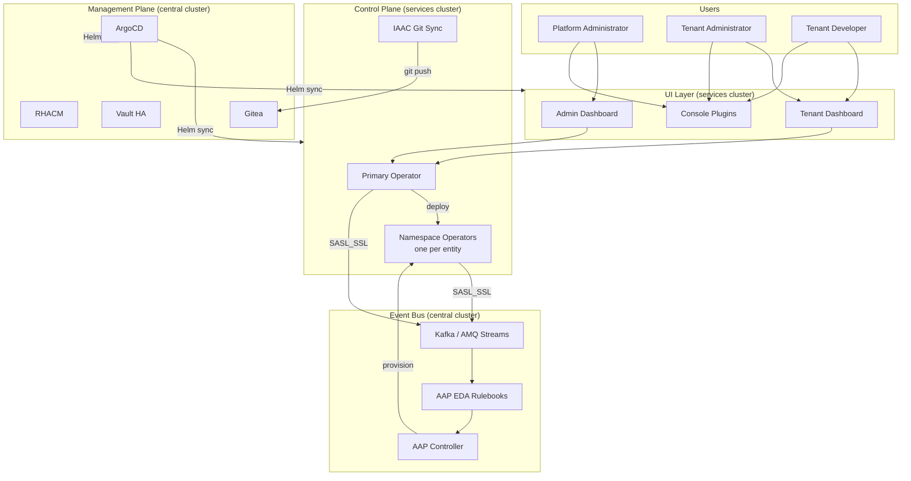
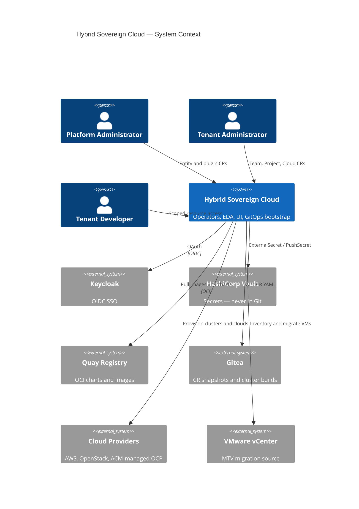
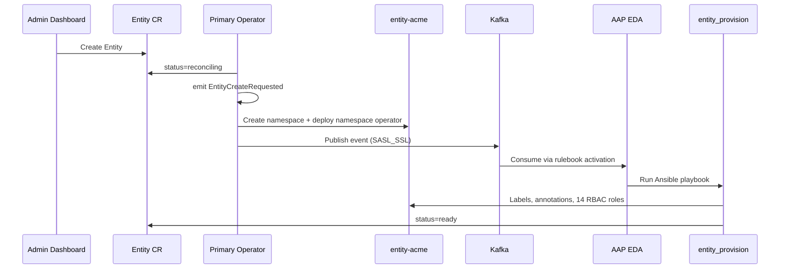
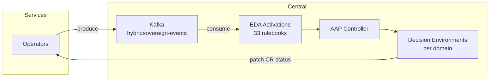
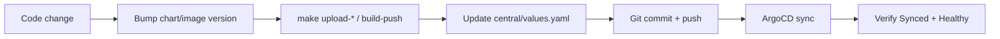

# Hybrid Sovereign Cloud

> **A production-grade, multi-tenant hybrid cloud control plane** built on OpenShift, Kubernetes operators, event-driven automation, and GitOps — designed for sovereign, air-gapped, and regulated environments.

[](specs/README.md)
[](architecture/docs/c4/components/operator.md)
[](operator/config/crd/bases/)
[](specs/034-bootstrap-deployment/spec.md)

---

## What This Is

**Hybrid Sovereign Cloud** is an end-to-end platform for operating hybrid and multi-cloud infrastructure at enterprise scale. Platform administrators onboard tenants (*entities*), provision OpenShift clusters and cloud environments (AWS, OpenStack), integrate automation and secrets platforms (AAP, Quay, Vault), and expose self-service capabilities to tenant teams — all through a unified Kubernetes API, dashboards, and OpenShift console plugins.

The platform consolidates what was once **20+ fragmented repositories** into a single monorepo with a coherent architecture: lightweight operators emit events, heavy provisioning runs in Ansible via AAP Event-Driven Automation (EDA), and a central ArgoCD instance manages **two OpenShift clusters** from one app-of-apps chart.



---

## Why This Project Stands Out

| Dimension | What was built |
|-----------|----------------|
| **Scale** | 24 custom resource kinds, 2-tier operator architecture (consolidated from 13 legacy operators), 33 EDA rulebook activations, 26 Helm charts, 32 feature specifications |
| **Multi-cluster GitOps** | Single ArgoCD on central deploys to **both** management and workload clusters via remote `destination.server` — no ArgoCD on the workload cluster |
| **Event-driven automation** | Operators publish to Kafka; EDA consumes events and dispatches domain-specific Ansible playbooks with isolated Decision Environment images |
| **Security by design** | Zero secrets in Git; Vault HA (Raft ×3) on both clusters; External Secrets Operator; Keycloak OIDC; namespace-scoped RBAC with 14 named tenant roles |
| **Sovereign / air-gap ready** | Private OCI registry, in-cluster Gitea for SCM, disconnected deploy checklist, no runtime dependency on public internet |
| **Full-stack delivery** | Ansible operators, Python IAAC sync, React/TypeScript dashboards, OpenShift dynamic console plugins, bootstrap automation, C4 architecture docs, agent-executable test specs |
| **Documentation discipline** | C4 model (L1–L4), ADRs, hardening checks, and feature specs maintained alongside code |

---

## Platform Capabilities

### Tenancy & Identity
- **Entity** onboarding with automatic namespace operator deployment
- **Team**, **Project**, **Assignment**, and **Persona** lifecycle management
- 14 named RBAC roles per entity namespace (Keycloak group sync)
- Dual Keycloak realms: `sovereign-central` (platform) and `sovereign-tenants` (workload)

### Cloud & Infrastructure
- **PlatformOpenShift** — provision managed OpenShift via RHACM/Hive (AWS, OpenStack)
- **CloudOSO** — OpenStack (CloudOSO) environment provisioning
- **CloudAWS** — AWS account/environment setup
- **OpenStackMigration** — VMware → CloudOSO VM migration via MTV and os-migrate
- **Hybrid VPC** — HybridFabric, CloudGateway, TransportLink, HybridNetwork, NetworkPlacement

### Plugin Integrations
- **AAP** — Automation controller orgs and platform config
- **Quay** — Container registry orgs and platform config
- **Vault** — Per-entity Vault engines and KV secrets
- **RBAC** — Cross-system role mapping

### Operations & Observability
- **UIHealthChecker** — URL registry with dashboard-driven health probes
- **IAAC Git Sync** — Continuous CR → Gitea mirror for infrastructure-as-code workflows
- **ACS** — Red Hat Advanced Cluster Security (central cluster, lab)

---

## Architecture

### Two-Cluster Topology

| Cluster | Role | Key Components |
|---------|------|----------------|
| **Central** (`api.central.*`) | Management plane | ArgoCD, RHACM, Vault HA, Gitea, AMQ Streams, AAP Controller **+ EDA**, CNV/MTV, ACS |
| **Services** (`api.services.*`) | Workload plane | Primary + namespace operators, dashboards, console plugins, AAP Controller, Vault HA, tenant CRs |

Central ArgoCD is the **sole** GitOps control plane. It deploys to both clusters. The services cluster never hosts `Application` or `ApplicationSet` resources.



### Multi-Tier Operator Model

The platform uses a **thin operator, thick automation** pattern:

1. **Primary operator** (`sovereign-cloud`) — watches `Entity`, `RbacConfig`, `AAPConfig`, `QuayConfig`; deploys per-entity namespace operators
2. **Namespace operator** (`entity-<name>`) — watches 13 tenant-scoped CR kinds within one entity boundary only

Both tiers validate specs, update status, emit Kubernetes Events, and optionally publish to Kafka. All heavy lifting (Keycloak, ACM, cloud APIs, Vault) runs in EDA roles.



### Event Pipeline



---

## Technology Stack

| Layer | Technologies |
|-------|-------------|
| **Platform** | OpenShift 4.x, Kubernetes, OpenShift GitOps (ArgoCD) |
| **Operators** | Ansible Operator SDK, Python, Kafka producer (kafka-python) |
| **Automation** | Ansible Automation Platform, AAP EDA, Decision Environments |
| **Messaging** | AMQ Streams (Strimzi Kafka), SASL_SSL |
| **Secrets** | HashiCorp Vault (HA Raft), External Secrets Operator |
| **Identity** | Red Hat Build of Keycloak (RHBK), OIDC |
| **Registry** | Red Hat Quay (OCI charts + container images) |
| **SCM** | Gitea (tenancy_repo, eda-lab, cluster_builds) |
| **Multi-cluster** | Red Hat Advanced Cluster Management (RHACM) |
| **Storage** | OpenShift Data Foundation (ODF), Crunchy Postgres Operator |
| **Virtualization** | CNV, Migration Toolkit for Virtualization (MTV) |
| **Security** | Red Hat Advanced Cluster Security (ACS) |
| **UI** | React 18, TypeScript, PatternFly 5, Vite, OpenShift dynamic plugins |
| **IAAC** | Python StatefulSet (CR watcher → Gitea git sync) |
| **Packaging** | Helm 3, OCI registries, Makefile-driven bootstrap |
| **Docs** | C4 model, Mermaid diagrams, ADRs, YAML test specs |

---

## Custom Resource API

**API Group:** `hybridsovereign.redhat/v1alpha1`

| Category | Kinds | Watched By |
|----------|-------|------------|
| **Tenancy** | Entity | Primary |
| **Identity** | Team, Persona | Namespace |
| **Workloads** | Project, Assignment | Namespace |
| **Cloud** | PlatformOpenShift, CloudOSO, CloudAWS, OpenStackMigration | Namespace |
| **Networking** | HybridFabric, CloudGateway, TransportLink, HybridNetwork, NetworkPlacement | Namespace |
| **Plugins** | Rbac, RbacConfig, AAPOrg, AAPConfig, QuayOrg, QuayConfig, Vault, VaultKV | Primary (config) / Namespace (org) |
| **Operations** | UIHealthChecker | Namespace |

Full schemas: [`operator/config/crd/bases/`](operator/config/crd/bases/)  
Feature specs: [`specs/README.md`](specs/README.md) (001–034)

---

## Repository Layout

```
hybridcloud/
├── bootstrap/          # ArgoCD app-of-apps, init chart, 26 OCI Helm charts, Ansible bootstrap
├── operator/
│   ├── primary/        # Entity + plugin config operator (ClusterRole)
│   └── namespace/      # Per-entity tenant operator (namespace-scoped Role)
├── eda/                # 19 domain directories — rulebooks, roles, Decision Environments
├── aap-config/         # AAP/EDA config-as-code (infra.aap_configuration)
├── iaac/               # Python StatefulSet — CR → Gitea sync
├── ui/                 # PatternFly 5 monorepo — 4 deployable packages + shared library
├── migration/          # VMware → CloudOSO migration playbooks
├── samples/            # Sanitized sample CRs
├── specs/              # 32 feature specifications (agentic rebuild)
├── architecture/       # C4 model, ADRs, hardening checks
├── tests/              # Agent-executable YAML test specs
└── docs/               # Disconnected deploy, lab config
```

### UI Packages

| Package | Audience | Deployment |
|---------|----------|------------|
| `@hybridsovereign/shared` | Internal | TypeScript CRD types, K8s hooks, theme |
| `@hybridsovereign/admin-dashboard` | Platform admins | `sovereign-cloud` Deployment |
| `@hybridsovereign/tenant-dashboard` | Tenant users | `sovereign-cloud` Deployment |
| `@hybridsovereign/admin-console-plugin` | Platform admins | OpenShift `ConsolePlugin` |
| `@hybridsovereign/tenant-console-plugin` | Tenant users | OpenShift `ConsolePlugin` |

---

## Design Principles

These constraints are enforced across the codebase and documented in [`.cursor/rules/`](.cursor/rules/):

| Principle | Implementation |
|-----------|----------------|
| **No secrets in Git** | Vault + ExternalSecret/PushSecret only |
| **GitOps after bootstrap** | `make init-central-argo` once; all changes via ArgoCD |
| **Never delete `sovereign-*` namespaces** | Tenant-managed; add resources only |
| **Thin operators, thick EDA** | Operators emit events; Ansible provisions |
| **Least privilege** | Primary = ClusterRole; namespace operator = Role per entity |
| **Single app-of-apps** | One Helm chart deploys to both clusters |
| **User OAuth for UI** | Dashboards proxy K8s API with user tokens, not pod SA |

---

## Quick Start

### Prerequisites

- Two OpenShift 4.x clusters (central + services) with OpenShift GitOps installed
- Private OCI registry (Quay) with push access
- Environment variables set (see `bootstrap/Makefile` — run `make check-env`)

### Bootstrap

```bash
# Verify environment and registry access
make check-env

# Build and push all OCI Helm charts
cd bootstrap && make upload-all-charts && make ansible-runner

# Seed ArgoCD — platform self-deploys from here
make init-central-argo
```

### Verify

```bash
# All ArgoCD applications should be Synced + Healthy
oc get applications -n openshift-gitops

# Primary operator running on services cluster
oc get deployment -n sovereign-cloud hybridsovereign-primary-operator
```

### UI Development

```bash
cd ui
make install
make dev-admin    # http://localhost:3000
make dev-tenant   # http://localhost:3001
make build-push   # Build and push images to Quay
```

---

## Deployment Workflow

After bootstrap, every change follows the **build → bump → sync** loop:



| Component | Bump location | Upload target |
|-----------|---------------|---------------|
| Operator charts | `operator/*/helm/Chart.yaml` | `make upload-primary-operator-chart` |
| UI images | `ui/Makefile` tags | `make build-push` |
| EDA Decision Environments | `eda/<domain>/` | Rebuild DE image, recreate activations |
| Platform charts | `bootstrap/helm/charts/*/Chart.yaml` | `make upload-<chart>-chart` |

Pins live in [`bootstrap/helm/central/values.yaml`](bootstrap/helm/central/values.yaml).

---

## Disconnected / Air-Gap

The platform is **designed for sovereignty**: runtime GitOps and SCM use in-cluster Gitea and a private OCI registry. Public GitHub, quay.io, and registry.redhat.io are build-time sources only.

See the full checklist: [`docs/disconnected-deploy.md`](docs/disconnected-deploy.md)

---

## Documentation Map

| Document | Purpose |
|----------|---------|
| [architecture/README.md](architecture/README.md) | C4 model entry point (L1–L4) |
| [architecture/docs/c4/context.md](architecture/docs/c4/context.md) | System context and actors |
| [architecture/docs/c4/containers.md](architecture/docs/c4/containers.md) | Per-cluster container diagrams |
| [architecture/docs/c4/components/operator.md](architecture/docs/c4/components/operator.md) | Multi-tier operator deep dive |
| [architecture/docs/c4/components/event-system.md](architecture/docs/c4/components/event-system.md) | Kafka → EDA pipeline |
| [architecture/docs/c4/components/ui.md](architecture/docs/c4/components/ui.md) | UI monorepo architecture |
| [architecture/docs/c4/code/entity-lifecycle.md](architecture/docs/c4/code/entity-lifecycle.md) | Entity state machine |
| [architecture/docs/decisions/](architecture/docs/decisions/) | Architecture Decision Records |
| [architecture/hardeningcheck/](architecture/hardeningcheck/) | Security posture verification |
| [specs/README.md](specs/README.md) | Feature specifications 001–034 |
| [tests/specs/README.md](tests/specs/README.md) | Agent-executable test specs |

---

## Engineering Highlights (Resume Context)

> Use these bullets when describing involvement with this platform.

- **Designed and implemented a two-tier Kubernetes operator architecture** consolidating 13 legacy Ansible operators into primary (cluster-scoped) and namespace (per-tenant) tiers with event-driven reconciliation
- **Built an event-driven provisioning pipeline** using AMQ Streams Kafka, AAP EDA (33 rulebook activations), and domain-isolated Decision Environment container images
- **Delivered multi-cluster GitOps** with a single ArgoCD app-of-apps managing 26+ Helm charts across central (management) and services (workload) OpenShift clusters
- **Implemented a full-stack UI platform** — React/TypeScript dashboards, OpenShift dynamic console plugins, shared CRD type library, OAuth-proxied Kubernetes API access with RBAC-aware UI
- **Established security-first patterns** — Vault HA on both clusters, External Secrets Operator, zero secrets in Git, Keycloak OIDC, 14-role namespace RBAC model
- **Authored comprehensive platform documentation** — C4 architecture model, ADRs, 32 feature specs, hardening checklists, agent-executable test specifications
- **Enabled sovereign/disconnected deployment** — private OCI registry, in-cluster Gitea SCM, air-gap checklist, no runtime public internet dependency
- **Automated hybrid cloud provisioning** — OpenShift via RHACM/Hive, AWS and OpenStack environments, VMware-to-CloudOSO VM migration via MTV

---

## Contributing

1. Read the relevant feature spec in [`specs/`](specs/) before implementing
2. Follow [`.cursor/rules/hybridcloud-core.mdc`](.cursor/rules/hybridcloud-core.mdc) constraints
3. Update C4 docs in [`architecture/`](architecture/) for topology or component changes
4. Bump chart/image versions and update [`bootstrap/helm/central/values.yaml`](bootstrap/helm/central/values.yaml)
5. Verify ArgoCD applications reach `Synced + Healthy` before considering work complete

---

## License

Internal / proprietary — see organization policy for distribution terms.
