# Hybrid Sovereign Cloud — Concepts

Stakeholder and onboarding concepts for the **single-hub** platform. C4: [`c4.md`](c4.md). Usage: [`../../docs/README.md`](../../docs/README.md).

## Table of contents

1. [Platform Overview](#platform-overview)
2. [Persona Operator — Business Overview](#persona-operator-business-overview)
3. [What is Sovereign Cloud?](#what-is-sovereign-cloud)
4. [How It Works](#how-it-works)
5. [Security Model](#security-model)
6. [Platform Components](#platform-components)
7. [Platform RBAC Model — Conceptual Overview](#platform-rbac-model-conceptual-overview)
8. [Component Interaction Map — Hybrid Sovereign Cloud](#component-interaction-map-hybrid-sovereign-cloud)
9. [OpenShift Virtualization and VMware Migration](#openshift-virtualization-and-vmware-migration)

---

## Platform Overview

Authoritative topology: **[C4 Architecture](../c4.md)**.  
Day-2 usage: **[docs/README.md](../../../docs/README.md)**.

### What is this?

A **single OpenShift hub** platform. ArgoCD syncs `gitops/`. After bootstrap, configuration changes flow through Git → ArgoCD. Operators launch AAP jobs to provision spokes on AWS, RHOSO, or Virt.

### Topology

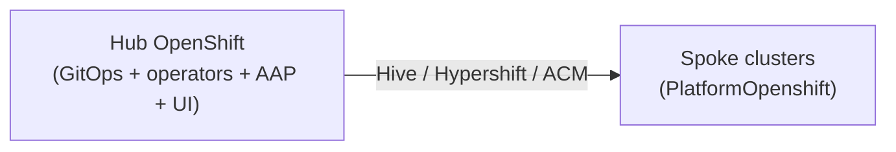

| Role | What |
|------|------|
| **Hub** | ArgoCD, RHACM/MCE, Vault, Keycloak, AAP, operators, dashboards, CNV, `entity-*` |
| **Spokes** | Tenant OpenShift clusters from PlatformOpenshift |

There is no separate central vs hub.

### Key components

| Component | What it does |
|-----------|--------------|
| ArgoCD | Syncs `gitops/` on the hub |
| RHACM / MCE / Hive | Spoke and hosted cluster lifecycle |
| Vault + External Secrets | Credentials (never in Git) |
| Keycloak | Identity and SSO |
| AAP | JobTemplates for provision / teardown |
| Primary / namespace operators | `hybridsovereign.redhat` CRs |
| Admin / tenant dashboards | PatternFly UIs |
| Console plugins | OCP dynamic plugins |

**Retired:** Kafka/AMQ, EDA activations, single-hub split.

### Non-negotiables

1. No secrets in Git  
2. Never delete `sovereign-*` namespaces  
3. After bootstrap, GitOps only for platform  

### Next

- [C4 Architecture](../c4.md)  
- [How it works](02-how-it-works.md)  
- [Workshop](../../../docs/workshop/README.md)

---

## Persona Operator — Business Overview

### What is a Persona?

A **Persona** defines a named RBAC role that can be assigned to users or groups within a tenant (Entity). Instead of configuring access directly on Entity CRs, Personas provide a clean, reusable abstraction for role-based access.

### Why Personas?

| Before | After |
|--------|-------|
| RBAC embedded in Entity CR (`spec.namespaceRbac`) | Separate Persona CRs per role |
| One monolithic RBAC configuration | Granular, per-role management |
| Hard to audit who has what access | Each Persona CR is auditable |
| Adding new roles requires Entity CR changes | Create new Persona CR independently |

### How It Works

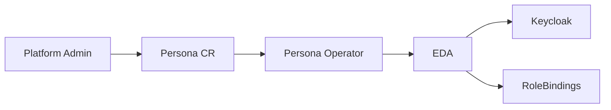

1. Admin creates a `Persona` CR specifying the type (e.g., `entityAdmin`) and an RBAC group
2. The Persona operator validates and emits an event
3. EDA picks up the event and configures Keycloak groups and Kubernetes RoleBindings
4. Users in the Keycloak group get the corresponding access level

### Persona Types

| Type | Access Level |
|------|-------------|
| entityAdmin | Full namespace admin |
| auditor | Read-only access to all CRs |
| assignmentAdmin | Manage assignments |
| platformOpenshiftAdmin | Manage OpenShift clusters |
| cloudOSOAdmin | Manage OpenStack cloud resources |
| cloudAWSAdmin | Manage AWS cloud resources |
| identityAdmin | Manage RBAC CRs |
| teamAdmin / teamView | Manage or view teams |
| projectAdmin / projectView | Manage or view projects |

### Key Benefits

- **Separation of Concerns**: RBAC management decoupled from Entity management
- **Scalability**: Add new persona types without modifying existing operators
- **Auditability**: Each persona is a distinct Kubernetes resource with full history
- **Self-Service**: Tenant admins can create Persona CRs for their users

---

## What is Sovereign Cloud?

### The Big Picture

Sovereign Cloud is a **self-managing platform** that runs on **one OpenShift hub** and provisions **spoke** clusters (AWS, RHOSO, Virt/hosted) for tenants.

You set it up once. After that, GitOps and operators manage day-2.

### Key Idea

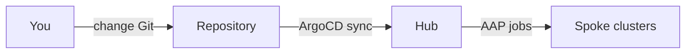

Prefer Git for platform changes. Tenant Cloud\* / Platform\* / Assignment CRs can be created via UI or `oc` in labs.

### Why one hub?

| Piece | Role |
|-------|------|
| **Hub** | Control plane + tenant operators + UIs + AAP |
| **Spokes** | Workload OpenShift clusters per PlatformOpenshift |

Older “single hub” splits are retired — everything that used to be split now lives on the hub (one GitOps repo path: `gitops/`).

### What Makes It "Sovereign"?

- **Self-contained** — no external deps after setup (once images/charts are mirrored)
- **Self-healing** — ArgoCD fixes drift
- **Disconnected-capable** — see `docs/disconnected-deploy.md`
- **Auditable** — changes tracked in Git

---

## How It Works

### Install (GitOps)

Point OpenShift GitOps at this repo’s `gitops/` path (see [docs/gitops-install.md](../../../docs/gitops-install.md)). After sync, ArgoCD owns the hub platform.

Legacy `make init-central-argo` / bootstrap Helm paths are historical; runtime is **`gitops/`**.

### After Sync — GitOps Flow

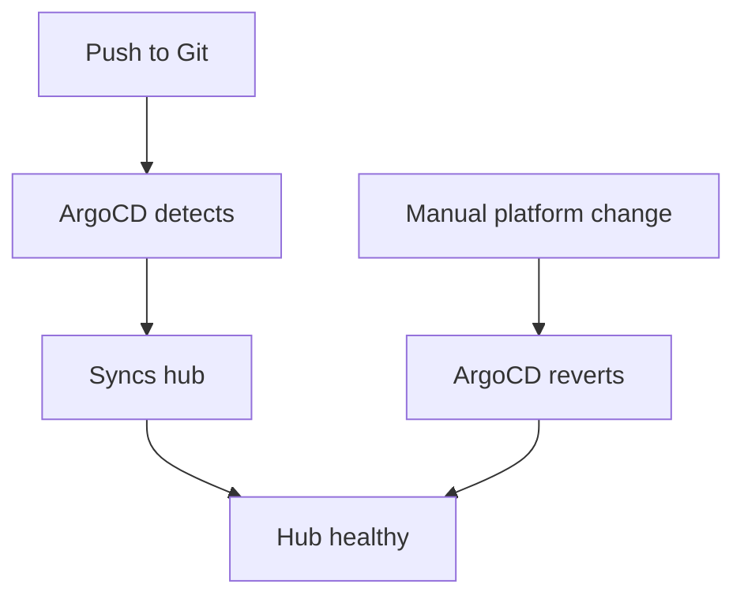

### Who Does What?

| Actor | Responsibility |
|-------|----------------|
| **Platform Team** | Git repo, Day-0 secrets, Argo Application |
| **ArgoCD** | Keeps hub matching `gitops/` |
| **RHACM / MCE / Hive** | Spoke and hosted cluster lifecycle |
| **Keycloak** | Authentication |
| **Vault** | Secrets |
| **Operators → AAP** | CR reconcile launches JobTemplates |

### Runtime path

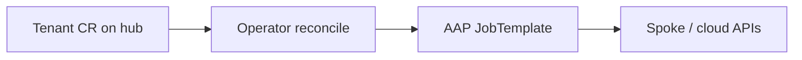

Detail: [docs/flow](../../../docs/flow.md).

---

## Security Model

### How Access Works

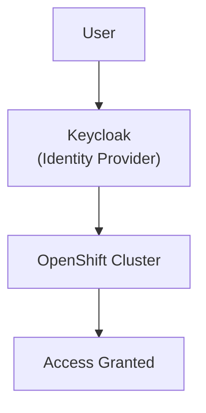

Users authenticate through Keycloak, not directly to the cluster.

### Access Levels

| Group | What they can do | Where |
|---|---|---|
| `sovereign-admin` | Full cluster admin | The hub |
| Tenant users | Namespace-scoped access | Hub only |

### Secrets Management

| Secret Type | How it's stored | Who can access |
|---|---|---|
| Cluster credentials | Environment variables (operator's machine) | Platform team only |
| Keycloak client secrets | Kubernetes Secrets | Automated jobs only |
| Git tokens | Encrypted ArgoCD secrets | ArgoCD only |
| OCI registry tokens | Kubernetes Secrets | ArgoCD only |

#### No-secrets-in-repo rule

Platform and component repositories enforce the same posture:

| Control | Requirement |
|---------|-------------|
| **AGENTS.md** | Every repo ships **`AGENTS.md`** documenting **Secret Management**: never commit credentials; use Vault and operators |
| **`.gitignore`** | Common secret filenames and env dumps are blocked by **shared `.gitignore` patterns** |
| **Runtime delivery** | All cluster secrets flow through **Vault** plus **ExternalSecret** / **PushSecret** — see [Platform secrets flow](../technical.md) |

**No secrets are ever stored in Git.**

### Supply Chain Security

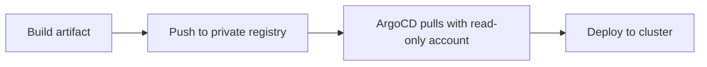

- All artifacts stored in **private** registries
- Push uses admin token (restricted access)
- Pull uses **read-only** robot account
- Base images from **certified** Red Hat sources

---

## Platform Components

### Component Map

Everything runs on the **hub** unless noted as a spoke.

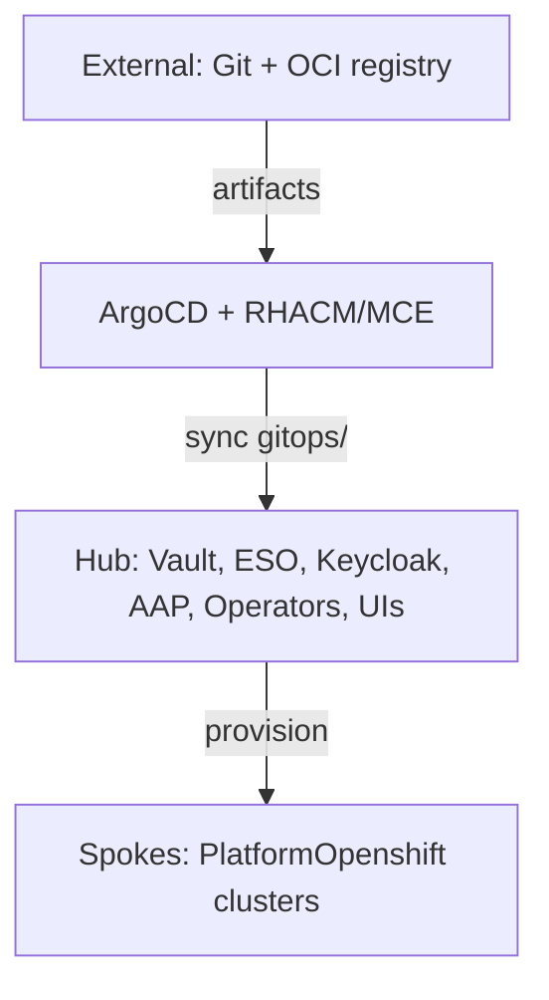

### Namespace Topology

| Namespace | Role |
|-----------|------|
| `openshift-gitops` | ArgoCD |
| Vault / ESO / Keycloak / AAP NS | Platform services |
| `sovereign-cloud` | Primary operator, dashboards, console plugins |
| `sovereign-cloud-plugins` | Plugin config CRs |
| `sovereign-secrets` | Seed secrets → Vault |
| `entity-<name>` | Namespace operator + tenant CRs |

### What Each Component Does

| Component | Description |
|-----------|-------------|
| **ArgoCD** | Syncs `gitops/` on the hub |
| **RHACM / MCE / Hive** | Spoke / HostedCluster lifecycle |
| **Keycloak (RHBK)** | SSO |
| **Vault + ESO** | Secrets (never in Git) |
| **AAP** | JobTemplates for Cloud\* / Platform\* / Assignment |
| **Primary operator** | Entity + plugin configs in `sovereign-cloud` |
| **Namespace operator** | Per-entity Team, Assignment, Cloud\*, Platform\* |
| **Admin / Tenant dashboards** | PatternFly UIs |
| **Console plugins** | OCP dynamic plugins |
| **CNV / Hypershift** | Virt + hosted platforms |
| **IAAC git-sync** | Optional CR → Gitea mirror |

**Retired:** Separate services cluster, Kafka/AMQ, AAP EDA, Event Forwarder.

### Cloud and platform kinds

| Kind | Role |
|------|------|
| CloudAWS / CloudOSO / CloudVirt | Register cloud / virt environments |
| PlatformOpenshift | Provision spoke (`openstack` \| `aws` \| `hosted`) |
| Entity / Team / Project / Assignment | Tenancy and access |

Usage: [docs/usage/crds](../../../docs/usage/crds/README.md).

---

## Platform RBAC Model — Conceptual Overview

**Audience:** Platform administrators, architects, onboarding engineers

### What problem does this solve?

In a multi-tenant platform with 40+ customers, you need fine-grained control over
**who can do what in each tenant's namespace**. The Sovereign Cloud RBAC model gives
every tenant exactly the permissions they need — no more, no less — without requiring
manual Kubernetes or Keycloak configuration.

### Two-layer RBAC

```
Layer 1 (Entity Operator) — Kubernetes namespace RBAC
  Entity CR → K8s Roles + RoleBindings in entity-<name> namespace

Layer 2 (Plugin RBAC Operator) — Keycloak group hierarchy
  Rbac CR → Keycloak group entity-name/rbac-name
            ↓ status.group
  Entity CR references Rbac CRs → RoleBinding subjects = Keycloak groups
```

### The 14 Named Roles

Every entity namespace can have up to 14 K8s Roles automatically managed by the
Entity operator. Each role maps to a specific responsibility:

| Role | What they can do |
|---|---|
| Entity Admin | Full control of all CRs in the namespace |
| Auditor | Read everything — cannot modify |
| CloudOSO Admin | Manage OpenStack cloud resources |
| CloudOSO Viewer | View OpenStack cloud resources |
| CloudAWS Admin | Manage AWS cloud resources |
| CloudAWS Viewer | View AWS cloud resources |
| PlatformOpenshift Admin | Manage OpenShift cluster deployments |
| PlatformOpenshift Viewer | View OpenShift cluster deployments |
| Team Admin | Manage team membership |
| Team Viewer | View team membership |
| Project Admin | Manage projects and assignments |
| Project Viewer | View projects and assignments |
| Assignment Admin | Manage assignments between entities |
| Identity Admin | Manage RBAC (Keycloak groups) only |

### How it works end-to-end

```
1. Create Entity CR → namespace entity-acme-corp created
2. Create Rbac CRs → Keycloak groups created (acme-corp/acme-platform-admins etc.)
3. Update Entity CR namespaceRbac → 14 K8s Roles created
                                  → RoleBindings bind Keycloak groups to Roles
4. User logs in via Keycloak → token includes Keycloak group membership
5. OpenShift maps Keycloak group → Kubernetes RBAC group → permissions enforced
```

### Security properties

- **No wildcard permissions** — each role grants access to exactly the resources it needs
- **Auditor is always read-only** — cannot create or modify any CR
- **RBAC CRs protected** — only EntityAdmin, IdentityAdmin, and role-specific admins can view Rbac CRs
- **Keycloak group lifecycle managed** — when an Entity or Rbac CR is deleted, the corresponding Keycloak group is removed automatically (finalizer)
- **Secrets never in Git** — Keycloak client credentials flow through Vault → ExternalSecret

### Scalability

Designed for production-scale tenants:
- 40+ entities
- 10,000+ RBAC group memberships per entity
- Role resolution is parallelized — no sequential blocking loops

---

## Component Interaction Map — Hybrid Sovereign Cloud

**Audience:** Technical leadership, architects, onboarding engineers  
**Last updated:** 2026-09-25

Five focused diagrams. Day-2 usage: [`../../../docs/README.md`](../../../docs/README.md).

---

### Diagram 1: Cluster Topology

One OpenShift **hub** runs GitOps, operators, AAP, UIs, and ACM/MCE. **Spokes** are PlatformOpenshift clusters.

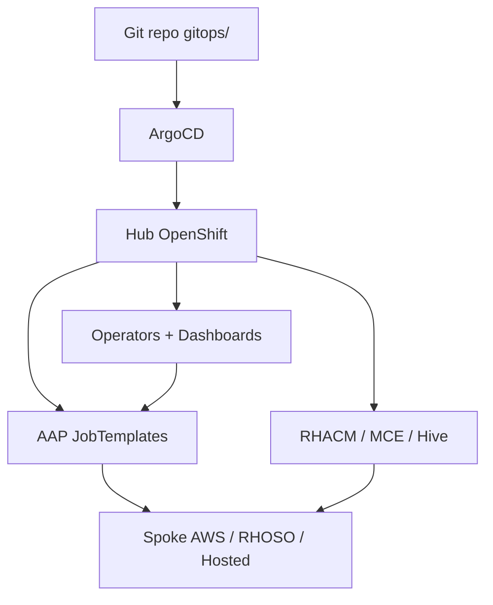

---

### Diagram 2: Operator Placement and CR Dependency Graph

All `hybridsovereign.redhat` operators deploy on the **hub**.

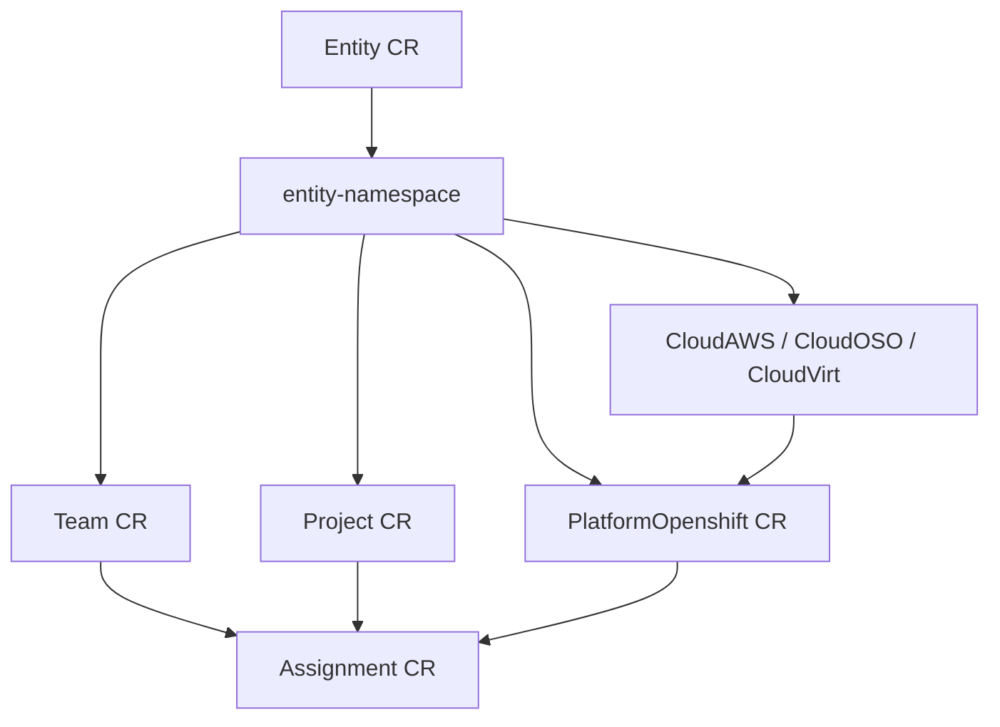

| Namespace | Components |
|-----------|------------|
| `sovereign-cloud` | Primary operator, dashboards, console plugins |
| `sovereign-cloud-plugins` | Plugin config CRs |
| `entity-<name>` | Namespace operator + tenant CRs |
| `aap` | AAP Controller |

---

### Diagram 3: Provisioning path

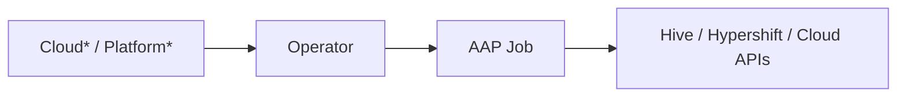

Kafka/EDA path is retired.

---

### Diagram 4: Secrets

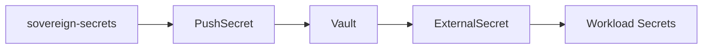

No secrets in Git.

---

### Diagram 5: UI

Admin and Tenant dashboards / console plugins call the K8s API with the user OAuth token; they create the same CRs as `oc apply`.

---

---

## OpenShift Virtualization and VMware Migration

### What It Is

OpenShift Virtualization (CNV) brings virtual machine workloads onto the OpenShift platform alongside containers. It uses the KubeVirt project to run VMs as native Kubernetes workloads. The Migration Toolkit for Virtualization (MTV) provides a path to migrate existing virtual machines from VMware vSphere into the platform.

### Why It Exists

Many organisations run critical workloads on VMware. Migrating these workloads to a cloud-native platform incrementally — VM by VM — reduces risk and avoids a "lift and shift" of the entire estate at once. CNV provides the landing zone; MTV provides the migration toolchain.

### How It Fits the Platform

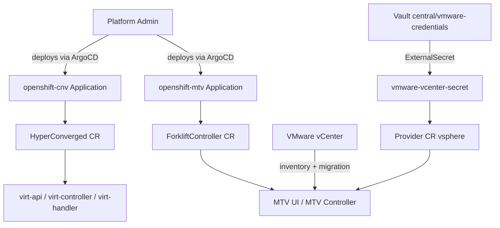

### Key Concepts

- **CNV**: The OpenShift Virtualization operator installs KubeVirt. Once active, the platform can schedule and run VMs on worker nodes.
- **HyperConverged**: The single CR that drives CNV installation and configuration.
- **MTV**: The Migration Toolkit for Virtualization. Connects to VMware, imports VM definitions, converts disk images, and creates running VMs on CNV.
- **Provider**: An MTV resource representing a migration source. One Provider per vCenter.
- **Vault-backed credentials**: VMware vCenter credentials are never stored in Git. They flow from operator environment variables through the bootstrap process into Vault, then into the cluster via External Secrets Operator.
