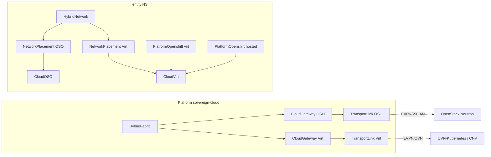

# Hybrid VPC EVPN — OpenStack (OSO) + OpenShift Virt

**Status:** design only — **no deploy** in this document.  
**Scope:** CloudOSO + CloudVirt (+ PlatformOpenshift `virt` / `hosted`). **AWS EVPN is out of scope.**  
**Source:** [architecture/mocks/DESIGN_UI.md](../../mocks/DESIGN_UI.md).

## Goal

Give tenants isolated logical networks (`HybridNetwork`) that can be placed on OSO and Virt backends (`NetworkPlacement`) while platform operators own day-0 fabric numbering (`HybridFabric`, `CloudGateway`, `TransportLink`). Overlapping tenant CIDRs stay safe because **VNIs / VRFs / RTs are platform-owned**, never tenant-picked.

## CR reuse (no new top-level kinds required for MVP)

| CR | Role |
|----|------|
| `HybridFabric` | Platform VNI pool, enabled fabric singleton |
| `CloudGateway` | Per-cloud gateway attachment (OSO Neutron / Virt OVN) |
| `TransportLink` | Underlay/overlay link binding a gateway into the fabric |
| `HybridNetwork` | Tenant L3 network intent (no VNI/VRF/RT in `spec`) |
| `NetworkPlacement` | Binds a `HybridNetwork` to `CloudOSO` \| `CloudVirt` \| `PlatformOpenshift` |

`CloudVirt` is CloudOSO-parity for CNV environments (`vaultPath`, `baseDomain`, `toolRbac`, optional `enableVRF` / `vrfId`).

## Topology (OSO + Virt only)

## Local tunnel recommendation

For lab / workshop clusters where OSO and Virt share a routable underlay (or are the same site):

- Prefer `tunnelType: none` on `TransportLink` (direct EVPN/VXLAN without extra encapsulation).
- Use an explicit tunnel type only when sites are not L2/L3 adjacent.

Do **not** invent AWS-specific tunnel modes in this design.

## Virt → PlatformOpenshift / OVN mapping

| PlatformOpenshift `type` | Backend environment | Network plane |
|--------------------------|---------------------|---------------|
| `virt` | `CloudVirt` (CNV VMs hosting OCP) | OVN secondary networks / NAD; optional VRF via `CloudVirt.spec.enableVRF` |
| `hosted` | `CloudVirt` + ACM Hypershift HCP | Same Virt underlay; HCP/nodepools attach via OVN EVPN CRs when available |
| `openstack` | `CloudOSO` | Neutron + ovn-bgp-agent (adopt/rewrite RT strategy) |

`NetworkPlacement.spec.backend.kind` should accept `CloudVirt` alongside `CloudOSO` / `PlatformOpenshift` (already extended in CRD).

## Numbering & status (platform-owned)

Tenants never set VNI/VRF/RT in `HybridNetwork.spec`. Observed fields land on status only, for example:

- `.status.vni`
- `.status.vrfName`
- `.status.routeTargets`

Allocation increments `HybridFabric.status.allocatedVniCount` and records placement readiness after gateway + transport prerequisites resolve.

## CRD deltas (design — not implemented here)

1. `CloudVirt` — shipped as CRD stub; CNV environmentprep playbook remains iterative.
2. `NetworkPlacement` backend enum includes `CloudVirt`.
3. `TransportLink.spec.tunnelType` documents `none` as the OSO↔Virt lab default.
4. `CloudGateway` gains optional `virtCloudVirtRef` (mirrors `openstackCloudOSORef`).
5. Optional: `HybridFabric.spec.backends.virt` capability flags for OVN EVPN CR detection.

## Operator / AAP flow (future implement)

1. Platform creates `HybridFabric` + OSO/Virt `CloudGateway` + `TransportLink`.
2. Tenant creates `HybridNetwork` then `NetworkPlacement` → CloudOSO or CloudVirt / PlatformOpenshift.
3. Kind operators launch AAP JobTemplates (allocate → fabric_vni → backend_oso|backend_virt → validate).
4. Fail or >3h job → cancel + relaunch once; status updates must not loop.

## Non-goals

- No AWS EVPN path in this document.
- No cluster deploy / `oc apply` from this design.
- No hardcoded cluster domains or credentials in Git manifests.

## References

- UI / CR sketches: [DESIGN_UI.md](../../mocks/DESIGN_UI.md)
- ZTP secret + GitOps contract: [gitops/ZTP.md](../../../gitops/ZTP.md)
- CNV baseline: [10-openshift-cnv.md](./10-openshift-cnv.md)
