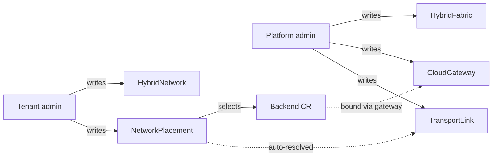
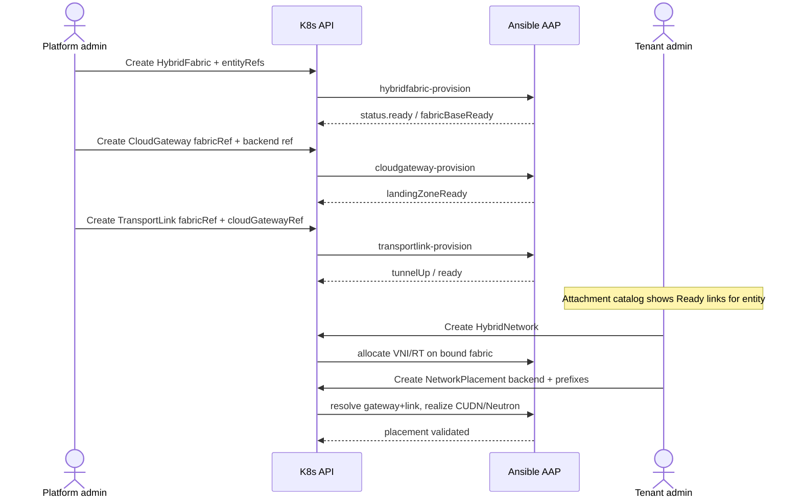

# Hybrid Fabric — Creation, Entity Tagging & Tenant Visibility

**Audience:** Platform admins, tenant network admins, UI / RBAC implementers  
**Companion (topology, Ansible L0–L5, CUDN):** [`fabric.md`](./fabric.md)  
**Images:** [`images/`](./images/)

This document answers three operational questions:

1. **How** does a platform admin create Hybrid Fabrics, Cloud Gateways, and Transport Links?  
2. **How** does an admin **tag a Hybrid Fabric to one or more Entities**?  
3. **How** does a tenant **see** what is available so they can create a `HybridNetwork` / `NetworkPlacement` that lands on the **correct** Transport Link — without managing fabric CRs themselves?

**Fabric attach backends:** CloudOSO + CloudVirt (and PlatformOpenshift `hosted` / `openstack` only). **`PlatformOpenshift` type `aws` has no fabric / EVPN / CUDN attachment** — see [`./fabric.md` §15.0](./fabric.md#150-fabric-attachment-scope-by-platformopenshift-type-locked).

---

## 1. Roles and namespaces (who owns what)

| Actor | Console | Can create | Can view |
|-------|---------|------------|----------|
| Platform fabric admin | Admin plugin (`sovereign-cloud`) | `HybridFabric`, `CloudGateway`, `TransportLink` | All fabrics / gateways / links |
| Tenant network admin | Tenant plugin (`entity-*`) | `HybridNetwork`, `NetworkPlacement` | **Projected** attachment catalog for *their* entity only; read-only fabric summary |
| Tenant viewer | Tenant plugin | — | HybridNetwork detail (if `networkViewerRbac`) |

**Critical UX rule:** tenants never create or edit `TransportLink`. They choose a **backend** (HCP / CloudOSO / CloudVirt). The platform **resolves** gateway + transport link from that backend + the entity’s fabric binding.



---

## 2. End-to-end creation sequence




### 2.1 Step A — Admin creates `HybridFabric`

**Where:** Admin console → Hybrid Fabrics → Create (or GitOps YAML in `sovereign-cloud`).

**What the admin supplies**

| Field | Purpose |
|-------|---------|
| `metadata.name` | Fabric identity (e.g. `acme-fabric`) |
| `spec.enabled` | Activate numbering / RR intent |
| `spec.domainAsn` | Fabric ASN (unique) |
| `spec.routeReflectors[]` | CENTRAL hub RR addresses |
| `spec.vniPool` | Platform-owned VNI range |
| `spec.transportDefaults` | MTU, default tunnel type |
| **`spec.entityRefs[]`** *(design)* | **Which Entities may consume this fabric** |

Ansible (`fabric_base` / `border_bgw`) brings the fabric to Ready. Until Ready, gateways/links should refuse attach (UI disables Next; Ansible preflight fails).

### 2.2 Step B — Admin creates `CloudGateway`(s)

One gateway per spoke attachment (e.g. HCP1, OSO1).

| Field | Purpose |
|-------|---------|
| `spec.fabricRef` | Must reference a Ready fabric |
| `spec.cloud` | `openshift` \| `openstack` \| … |
| `spec.domainAsn` | Spoke ASN |
| `spec.openstackCloudOSORef` / Virt / PlatformOpenshift refs | Which backend this gateway fronts |
| Labels `hybridsovereign.redhat/entity` | Optional denormalized entity hint |

**Admission:** gateway’s backend must belong to an Entity listed on the fabric’s `entityRefs` (see §3). Otherwise create is rejected.

### 2.3 Step C — Admin creates `TransportLink`(s)

Binds a gateway into the fabric’s control/data plane.

| Field | Purpose |
|-------|---------|
| `spec.fabricRef` | Same fabric as gateway |
| `spec.cloudGatewayRef` | Target gateway |
| `spec.tunnelType` | `none` (lab adjacency) or `wireguard` / `ipsec` / `macsec` |
| `spec.vaultConfigRef` | Required when tunnel ≠ `none` |

When `status.ready` / `tunnelUp` is true, the attachment point becomes **eligible for tenant placements**.

### 2.4 Step D — Tenant creates `HybridNetwork` then `NetworkPlacement`

Tenant does **not** pick a TransportLink name in the happy path.

1. Create `HybridNetwork` (name + description).  
2. Platform allocates VNI/RT from a fabric bound to that entity (`status.fabric`, `status.vni`, …).  
3. Create `NetworkPlacement` with `backend.kind/name` + `prefixes`.  
4. Ansible resolves: backend → CloudGateway → Ready TransportLink → realize EVPN/Neutron.

---

## 3. Tagging a Hybrid Fabric to one or more Entities

Today’s shipped `HybridFabric` CRD has **no** `entityRefs` field yet. This section is the **design contract** to implement (CRD + UI + Ansible admission).


### 3.1 Why multi-entity tagging exists

| Pattern | Example | When to use |
|---------|---------|-------------|
| **1 fabric : 1 entity** | `acme-fabric` → `[acme-corp]` | Default strong isolation (Acme vs Chad) |
| **1 fabric : N entities** | `shared-dmz-fabric` → `[acme-corp, partner-a]` | Controlled shared VPN domain (same ASN/VNI pool) — rare; security review required |
| **N fabrics : 1 entity** | `acme-prod-fabric`, `acme-dr-fabric` → both tag `acme-corp` | Prod vs DR / dual region |

Chad must **not** appear on `acme-fabric.entityRefs`, and Acme must **not** appear on `chad-fabric.entityRefs`, for the lab isolation story.

### 3.2 Spec shape (design)

```yaml
apiVersion: hybridsovereign.redhat/v1alpha1
kind: HybridFabric
metadata:
  name: acme-fabric
  namespace: sovereign-cloud
spec:
  enabled: true
  domainAsn: 65010
  vniPool:
    start: 51000
    end: 51127
  routeReflectors:
    - name: central-rr-a
      address: 10.255.10.1
  # --- entity tagging (design delta) ---
  entityRefs:
    - name: acme-corp          # Entity.metadata.name in sovereign-cloud
    # - name: partner-a        # optional second consumer
  # Optional default when entity has multiple fabrics:
  # primaryForEntities: [acme-corp]
```

**Also set labels** (for list/watch filters and GitOps):

```yaml
metadata:
  labels:
    hybridsovereign.redhat/entity: acme-corp           # primary / first ref
    # multi-value via additional labels or only entityRefs in spec
```

For multi-entity fabrics, prefer **`spec.entityRefs[]` as source of truth**; labels may only carry the primary entity for column display.

### 3.3 Admin UI — bind Entities

**Create / Edit Hybrid Fabric → step “Entity access”**

```text
+------------------------------------------------------------------+
|  Hybrid Fabric: acme-fabric                                      |
|  Step 2 of 4 — Entity access                                     |
+------------------------------------------------------------------+
|  Entities that may use this fabric                               |
|                                                                  |
|  [x] acme-corp          Entity Ready · NS entity-acme-corp       |
|  [ ] chad               Entity Ready · NS entity-chad            |
|  [ ] partner-a          Entity Ready                             |
|                                                                  |
|  Selected: acme-corp                                             |
|                                                                  |
|  ! Security: every selected entity shares this ASN and VNI pool. |
|    Prefer one entity per fabric unless a shared VRF is intended. |
|                                                                  |
|  [Back]                                    [Next: Route reflectors]|
+------------------------------------------------------------------+
```

**Operations**

- Add entity → append to `entityRefs` → reconcile; tenant catalog for that entity gains this fabric’s Ready links.  
- Remove entity → blocked if that entity still has HybridNetworks with `status.fabric == this fabric` and active placements.  
- Ansible validates each `entityRefs[].name` resolves to an existing `Entity` CR.

### 3.4 Admission rules (platform)

| Action | Rule |
|--------|------|
| Create CloudGateway | Backend’s entity ∈ fabric.`entityRefs` |
| Create TransportLink | Gateway’s fabricRef fabric contains entity of gateway’s backend |
| Create HybridNetwork | Entity NS maps to Entity name ∈ at least one Ready fabric’s `entityRefs` |
| Create NetworkPlacement | Backend entity ∈ fabric used by parent HybridNetwork; Ready TransportLink exists for that backend |

---

## 4. How the tenant sees fabrics / links (without managing them)

Tenants need enough visibility to **choose the right placement**, but not enough to mutate hub RR or tunnels.

### 4.1 Attachment catalog (projected read model)

The tenant console exposes a **read-only catalog** computed for `entity-<name>`:

| Column | Source |
|--------|--------|
| Fabric | `HybridFabric` where `entityRefs` contains this entity **and** `status.ready` |
| Gateway | `CloudGateway` with `fabricRef` + backend in this entity NS |
| Transport link | `TransportLink` for that gateway with `status.ready` / `tunnelUp` |
| Backend | Resolved `PlatformOpenshift` / `CloudOSO` / `CloudVirt` name + Ready |
| Tunnel type | From TransportLink (informational) |
| Place | CTA → Placement wizard pre-filled with that backend |

```text
Tenant console · entity-acme-corp · Hybrid networking
+--------------------------------------------------------------------------------+
| Attachment points (platform-managed — read only)              [Refresh]        |
+----------------+------------------+------------------+----------+--------------+
| Fabric         | Backend          | Gateway          | Link     | Tunnel       |
| acme-fabric ●  | PlatformOpenshift| acme-hcp1-gw     | ● Up     | none         |
|                | /hcp1            |                  | hcp1-link |              |
| acme-fabric ●  | CloudOSO/oso1    | acme-oso1-gw     | ● Up     | none         |
|                |                  |                  | oso1-link |              |
+----------------+------------------+------------------+----------+--------------+
| Chad rows never appear here — chad-fabric.entityRefs excludes acme-corp.       |
+--------------------------------------------------------------------------------+
| Your Hybrid Networks                                          [+ Create]       |
| acme-core · VNI 51001 · RT 65010:51001 · fabric acme-fabric · 2 placements     |
+--------------------------------------------------------------------------------+
```

**RBAC implementation options** (pick one in implementation):

1. **Aggregated API / proxy** — tenant UI calls a platform service that lists `sovereign-cloud` CRs filtered by entity; tenants have no direct list on `HybridFabric`.  
2. **Role binding** — ClusterRole allowing `get/list/watch` on HybridFabric/CloudGateway/TransportLink **only** via label selector `hybridsovereign.redhat/entity in (acme-corp)` (weaker for multi-entityRefs; prefer option 1).  
3. **Copied ConfigMap** — Ansible writes `entity-acme-corp/fabric-attachments` ConfigMap on gateway/link Ready; tenant reads ConfigMap in own NS (GitOps-friendly, eventual consistency).

Recommended: **(1) or (3)** so tenants never need cluster-scoped fabric RBAC.

### 4.2 Placement wizard — selecting the “right” transport link

Tenant flow:

1. Open Hybrid Network → **Add placement** (or from catalog **Place**).  
2. Wizard shows only backends that appear in the attachment catalog with **Link ● Up**.  
3. Tenant picks **backend** + **prefixes** (not link name).  
4. On create, `NetworkPlacement` stores backend only.  
5. Ansible / operator fills status:

```yaml
status:
  cloudGatewayRef: acme-hcp1-gw
  transportLinkRef: acme-hcp1-link
  prerequisiteReady: true
  fabricApplied: true
  backendApplied: true
  validated: true
```

Detail page shows the resolved link so the tenant can **verify** which transport was used:

```text
Placement acme-core-hcp1
  Backend:     PlatformOpenshift/hcp1
  Fabric:      acme-fabric          (from HybridNetwork.status.fabric)
  Gateway:     acme-hcp1-gw         (resolved)
  Transport:   acme-hcp1-link ● Up  (resolved)
  Prefixes:    10.110.0.0/24
```

If two links somehow match (misconfiguration), Ansible fails closed: `prerequisiteReady=false`, message `ambiguous transport for backend hcp1`.

### 4.3 Multiple fabrics for one entity

If `acme-corp` is tagged on **two** Ready fabrics:

| UI behavior | Detail |
|-------------|--------|
| Create HybridNetwork | Wizard asks **which fabric** (required) when `len(fabrics)>1` |
| Spec design | `HybridNetwork.spec.fabricRef` *(delta)* or annotation `hybridsovereign.redhat/fabric` |
| Catalog | Group attachment rows by fabric |
| Default | If fabric has `primaryForEntities` containing this entity, preselect it |

Single-fabric entities skip the fabric picker (auto-bind).

### 4.4 What tenants must never see / edit

| Hidden or read-only | Why |
|---------------------|-----|
| RR addresses, BGW Vault refs | Hub trust boundary |
| VNI pool start/end editors | Numbering authority |
| Editable VNI / RT on HybridNetwork | Isolation integrity |
| Create/Delete TransportLink | Platform day-0 only |
| Other entities’ catalogs | Multi-tenant confidentiality |

---

## 5. Worked example — Acme vs Chad

### 5.1 Admin day-0

1. Tag `acme-fabric.entityRefs = [acme-corp]`.  
2. Create gateways + links for HCP1 and OSO1.  
3. Tag `chad-fabric.entityRefs = [chad]`.  
4. Create gateways + links for HCP2 and HCP3 only.

### 5.2 Tenant acme-corp

- Catalog shows **two** rows: hcp1 + oso1 (both `acme-fabric`).  
- Creates `HybridNetwork/acme-core` → allocated on `acme-fabric`.  
- Places onto `hcp1` then `oso1` → status shows each resolved TransportLink.  
- Never sees Chad links.

### 5.3 Tenant chad

- Catalog shows **only** hcp2 + hcp3.  
- Cannot select `CloudOSO/oso1` (not in catalog; admission would reject).  

### 5.4 Shared fabric (optional advanced)

```yaml
spec:
  entityRefs:
    - name: acme-corp
    - name: partner-a
```

Both tenants see the **same** fabric’s attachment points that map to backends in **their** NS only. Partner cannot place onto Acme’s `hcp1` because that backend CR lives in `entity-acme-corp`.

---

## 6. CR / API deltas checklist (implementation)

| Item | Change |
|------|--------|
| `HybridFabric.spec.entityRefs[]` | `{ name: string }[]` — required for tenant consume |
| `HybridFabric.spec.primaryForEntities[]` | optional defaults |
| `HybridNetwork.spec.fabricRef` | required when entity has >1 fabric |
| `NetworkPlacement.status.cloudGatewayRef` / `transportLinkRef` | already in CRD — Ansible must populate |
| Admin UI | Entity multi-select on fabric create/edit |
| Tenant UI | Attachment catalog + placement wizard filter |
| RBAC / projection | Service or ConfigMap mirror (§4.1) |
| Ansible | Enforce entityRefs on gateway, link, network, placement |

---

## 7. Failure & empty states (copy)

| State | Message |
|-------|---------|
| Fabric has empty `entityRefs` | “Bind at least one Entity before tenants can place networks.” |
| Gateway backend entity ∉ fabric | “Backend entity is not tagged on fabric {name}.” |
| No Ready TransportLink | “No attachment point for this backend yet — ask platform admin to create a Transport Link.” |
| Tenant catalog empty | “Your entity is not tagged on any Ready Hybrid Fabric.” |
| Ambiguous link | “Multiple Ready Transport Links match this backend; platform must leave exactly one.” |

---

## 8. Summary

| Question | Answer |
|----------|--------|
| Who creates fabrics / gateways / links? | **Platform admin** in `sovereign-cloud`, in order Fabric → Gateway → TransportLink; Ansible marks Ready. |
| How is a fabric tagged to entities? | **`spec.entityRefs[]`** (design) — one or many Entity names; admin multi-select; labels optional. |
| How does a tenant pick the right transport? | Tenant picks a **Ready backend** from an **attachment catalog** filtered by entityRefs; system **auto-resolves** `cloudGatewayRef` + `transportLinkRef` onto placement status. |

For EVPN/CUDN realization and Ansible task tables per layer, see [`fabric.md`](./fabric.md).
