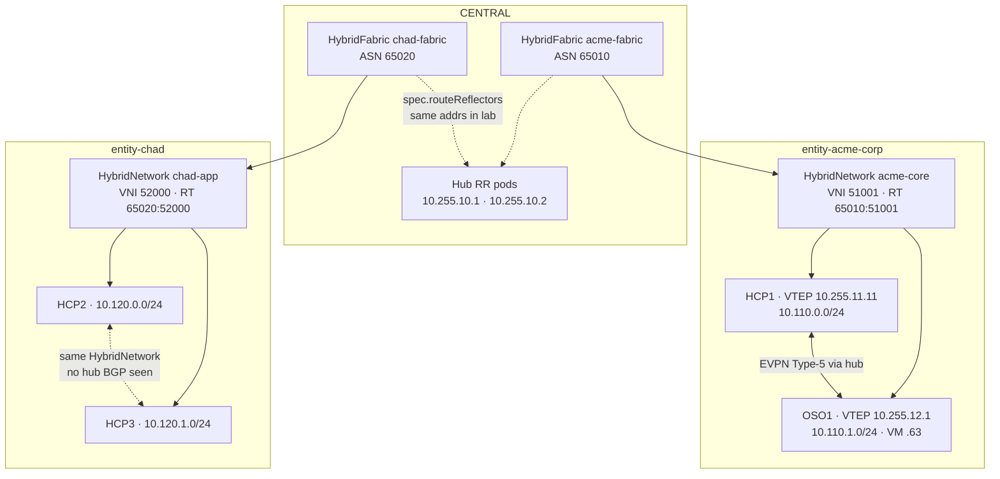
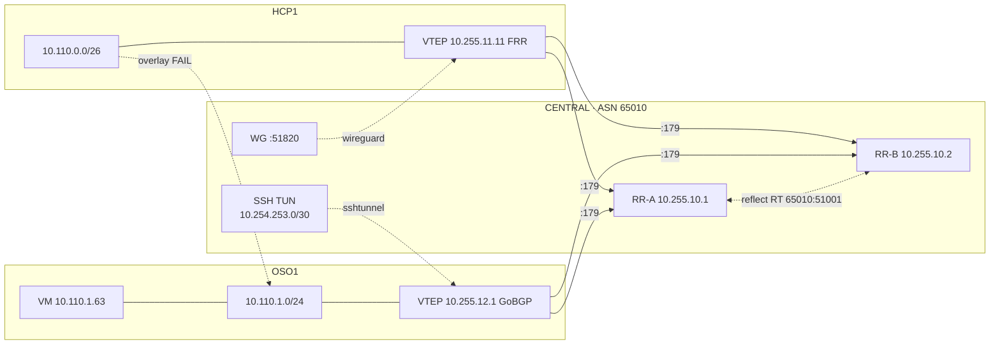
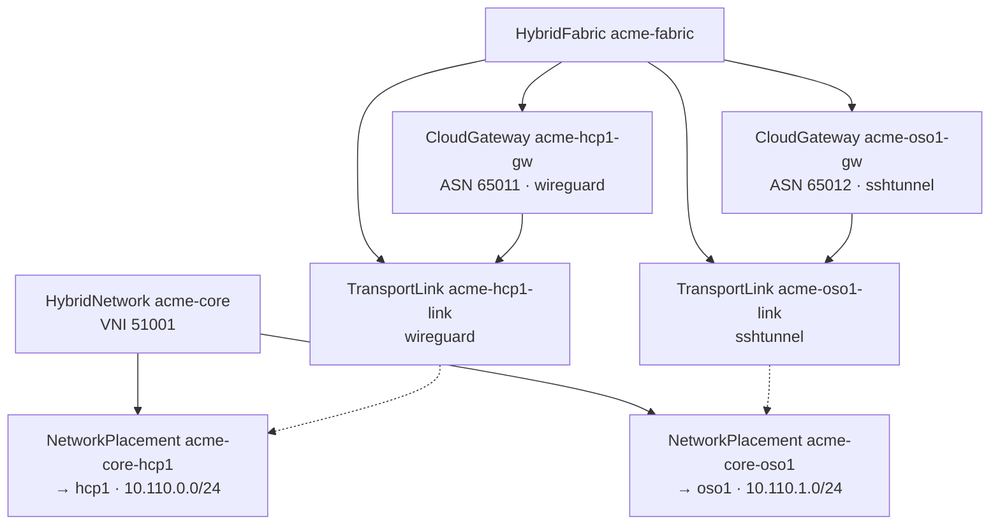
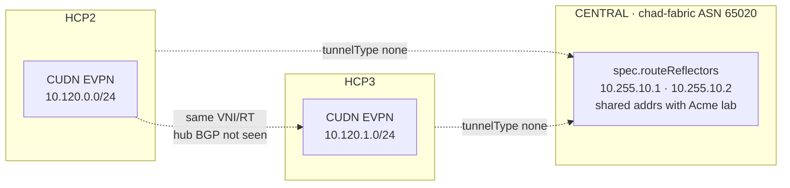
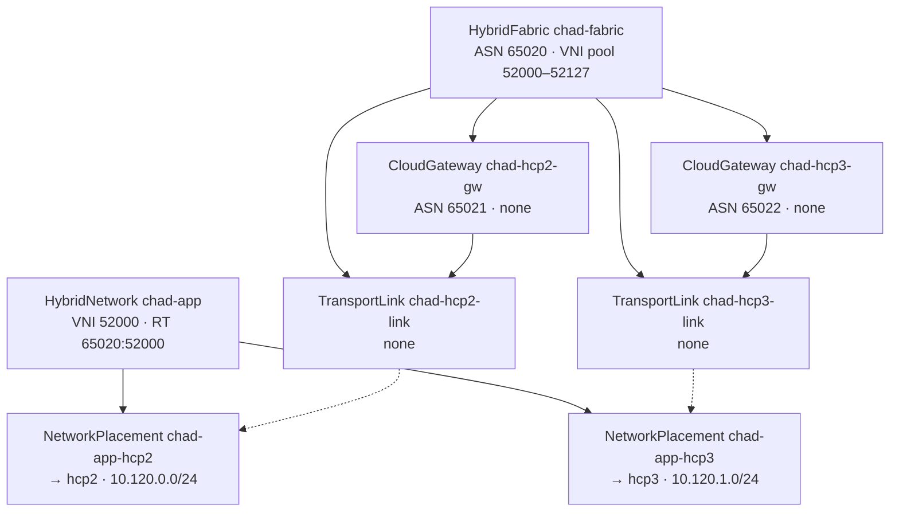

# Hybrid Fabric EVPN — Live Verification

**Captured:** 2026-10-06T17:45Z  
**CENTRAL:** `api.cluster-ngjtm.dyn.redhatworkshops.io`  
**Fabrics:** `acme-fabric` (ASN **65010**) · `chad-fabric` (ASN **65020**)

| Scope | Acme | Chad |
|-------|------|------|
| HybridFabric / HybridNetwork / Placement Ready | **PASS** | **PASS** |
| Spoke EVPN apply (CUDN / Neutron) | **PASS** HCP1 + OSO1 | **PASS** HCP2 + HCP3 |
| Underlay to hub | **PASS** WG + SSH TUN | **N/A** (`tunnelType: none`) |
| Hub RR BGP sessions | **PASS** HCP1 + OSO Established | **none** on hub RRs (ASN 65010 peers only) |
| Type-5 reflection cross-spoke | **PASS** HCP1 ↔ OSO | **not observed** on hub RR |
| Overlay cross-spoke ping | **FAIL** (no OVN dataplane) | **not retested** |

---

## Platform overview

---

## Acme (`acme-fabric`)

### Connectivity

### CR graph

### Live control plane

| Peer | Role | Hub PfxRcd |
|------|------|------------|
| `10.255.11.11` | HCP1 FRR | 1 |
| `10.255.12.1` | OSO GoBGP | 1 |

Type-5: `10.110.0.0/26` NH `10.255.11.11` · `10.110.1.0/24` NH `10.255.12.1` · RT `65010:51001`

| Object | Ready | Notes |
|--------|-------|-------|
| `hybridfabric/acme-fabric` | true | RR `10.255.10.1`, `10.255.10.2` |
| `hybridnetwork/acme-core` | true | VNI 51001 |
| `hybridnetwork/payments-vpc` | true | VNI 51000 (not in this EVPN path) |
| `cloudgateway/acme-hcp1-gw` | true | spoke ASN 65011 |
| `cloudgateway/acme-oso1-gw` | true | spoke ASN 65012 |
| `transportlink/acme-hcp1-link` | true | `wireguard` · Vault `fabric/wireguard/hub` |
| `transportlink/acme-oso1-link` | true | `sshtunnel` · Vault `fabric/sshtunnel/oso1` |
| `networkplacement/acme-core-hcp1` | true | validated · PlatformOpenshift/hcp1 |
| `networkplacement/acme-core-oso1` | true | validated · CloudOSO/oso1 |

**Underlay:** HCP1 WG route loop (`wg-start.sh` 15s) · OSO `fabric-ssh-tun` + `fabric-gobgp` systemd on `172.22.0.100`

---

## Chad (`chad-fabric`)

### Connectivity

### CR graph

| Object | Ready | Notes |
|--------|-------|-------|
| `hybridfabric/chad-fabric` | true | ASN 65020 · RR addrs `10.255.10.1/2` (lab share) |
| `hybridnetwork/chad-app` | true | VNI 52000 · RT `65020:52000` |
| `cloudgateway/chad-hcp2-gw` | true | spoke ASN 65021 · `transport: none` |
| `cloudgateway/chad-hcp3-gw` | true | spoke ASN 65022 · `transport: none` |
| `transportlink/chad-hcp2-link` | true | `tunnelType: none` |
| `transportlink/chad-hcp3-link` | true | `tunnelType: none` |
| `networkplacement/chad-app-hcp2` | true | validated · PlatformOpenshift/hcp2 · `10.120.0.0/24` |
| `networkplacement/chad-app-hcp3` | true | validated · PlatformOpenshift/hcp3 · `10.120.1.0/24` |

**Underlay:** none (GitOps adjacent). Hub RR pods currently only show **Acme** ASN 65010 neighbors — no Chad VTEP sessions on those RRs at capture time.

---

## Artifacts

| Item | Note |
|------|------|
| Vault WG (Acme HCP1) | `hybridsovereign/fabric/wireguard/hub` |
| Vault SSH TUN (Acme OSO) | `hybridsovereign/fabric/sshtunnel/oso1` |
| OSO API | `api.cluster-j7ljz…` |
| Entities | `entity-acme-corp` · `entity-chad` |
