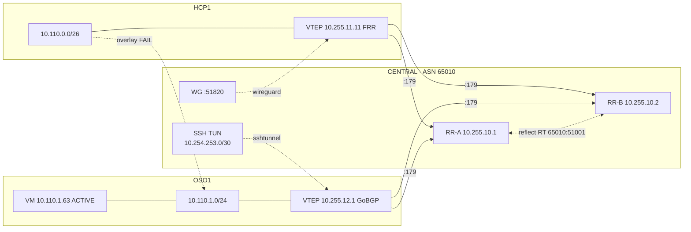
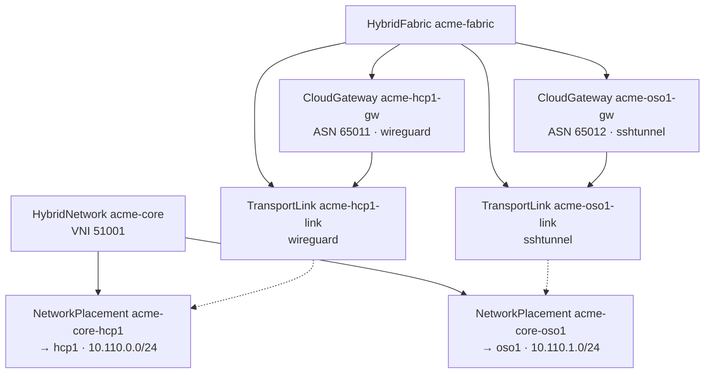
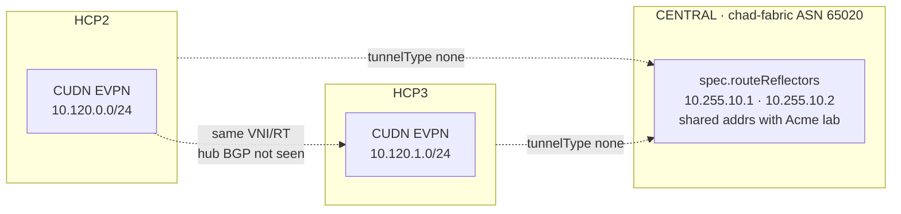
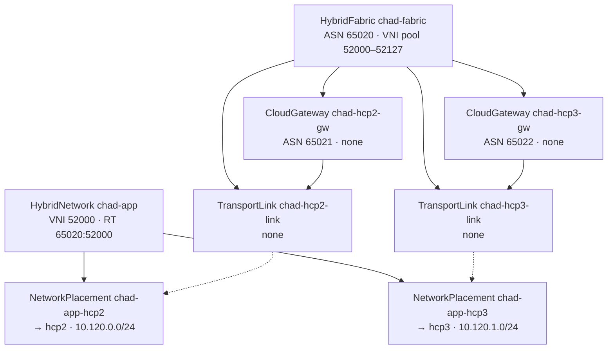

# Hybrid Fabric EVPN — Live Verification

**Captured:** 2026-10-07T13:52Z (re-verify + remediation)  
**Prior capture:** 2026-10-06T17:45Z  
**CENTRAL:** `api.cluster-ngjtm.dyn.redhatworkshops.io`  
**OSO (RHOSO):** `api.cluster-j7ljz.dyn.redhatworkshops.io` · compute `172.22.0.100`  
**Fabrics:** `acme-fabric` (ASN **65010**) · `chad-fabric` (ASN **65020**)

| Scope | Acme | Chad |
|-------|------|------|
| HybridFabric / HybridNetwork / Placement Ready | **PASS** | **PASS** |
| Spoke EVPN apply (CUDN / Neutron) | **PASS** HCP1 + OSO1 | **PASS** HCP2 + HCP3 |
| Underlay to hub | **PASS** WG (HCP1) + SSH TUN (OSO) *restored* | **N/A** (`tunnelType: none`) |
| Hub RR BGP sessions | **PASS** HCP1 + OSO on RR1 **and** RR2 | HCP peers only (ASN 65010) |
| Type-5 reflection cross-spoke | **PASS** HCP1 ↔ OSO on RR1 | **not observed** on hub RR |
| Overlay cross-spoke ping | **FAIL** (no OVN dataplane) | **not retested** |

---

## Remediation on 2026-10-07

Outage symptoms before fix: OSO GoBGP missing from hub RRs; RR2 empty; `acme-core-oso1-evpn-vm` **SHUTOFF**; SSH TUN down (`HUB_ENDPOINT=10.10.10.10` not reachable cross-cluster).

| Action | Result |
|--------|--------|
| `openstack server start acme-core-oso1-evpn-vm` | VM **ACTIVE** (`10.110.1.63`) |
| Restore SSH TUN underlay (spoke `fabric-ssh-tun` → hub `:2222`) | `tun0` `10.254.253.0/30` up; VTEP `10.255.12.1` on spoke lo |
| GoBGP listen port **1179** (avoid FRR `bgpd` owning `:179`) | `fabric-gobgp` active |
| Hub `tun0` addrs + `ip_forward` + route `10.255.10.2 via 10.10.10.31` | RR1↔OSO underlay OK |
| RR2 host routes to `10.255.12.1` / `10.254.253.0/30` via CP1 | RR2 also peers OSO |

**Lab note:** Direct `HUB_ENDPOINT=10.10.10.10` from OSO compute fails (overlapping `10.10.10.0/24` on both clusters). Temporary path used: `oc port-forward` hub `fabric-ssh-tunnel:2222` + SSH `-R` via jump pod in `openstack/fabric-fix` on j7ljz so spoke uses `HUB_ENDPOINT=127.0.0.1`. Durable fix: publish hub SSH TUN / WG on a non-overlapping address (LB / unique underlay IP) and bake that into Vault `fabric/sshtunnel/oso1`.

---

## Platform overview

---

## Acme (`acme-fabric`)

### Connectivity

### CR graph

### Live control plane (post-fix)

| Peer | Role | RR1 PfxRcd | RR2 PfxRcd |
|------|------|------------|------------|
| `10.255.11.11` | HCP1 FRR | 1 | 1 |
| `10.255.12.1` | OSO GoBGP 3.29.0 | 1 | 0 (session up) |

Type-5 on RR1:

| Prefix | Next Hop | RT |
|--------|----------|-----|
| `10.110.0.0/26` | `10.255.11.11` | `65010:51001` |
| `10.110.1.0/24` | `10.255.12.1` | `65010:51001` |

| Object | Ready | Notes |
|--------|-------|-------|
| `hybridfabric/acme-fabric` | true | RR `10.255.10.1`, `10.255.10.2` |
| `hybridnetwork/acme-core` | true | VNI 51001 |
| `hybridnetwork/payments-vpc` | true | VNI 51000 (not in this EVPN path) |
| `cloudgateway/acme-hcp1-gw` | true | spoke ASN 65011 |
| `cloudgateway/acme-oso1-gw` | true | spoke ASN 65012 · Ready (EVPN deferred in CR message when openstack CLI missing in EE) |
| `transportlink/acme-hcp1-link` | true | `wireguard` · Vault `fabric/wireguard/hub` |
| `transportlink/acme-oso1-link` | true | `sshtunnel` · Vault `fabric/sshtunnel/oso1` |
| `networkplacement/acme-core-hcp1` | true | validated · PlatformOpenshift/hcp1 |
| `networkplacement/acme-core-oso1` | true | validated · CloudOSO/oso1 |

**Underlay:** HCP1 WG (handshake OK) · OSO `fabric-ssh-tun` + `fabric-gobgp` on `compute01` (`172.22.0.100`) · EVPN VM **ACTIVE**

---

## Chad (`chad-fabric`)

### Connectivity

### CR graph

| Object | Ready | Notes |
|--------|-------|-------|
| `hybridfabric/chad-fabric` | true | ASN 65020 · RR addrs `10.255.10.1/2` (lab share) |
| `hybridnetwork/chad-app` | true | VNI 52000 · RT `65020:52000` |
| `cloudgateway/chad-hcp2-gw` | true | spoke ASN 65021 · `transport: none` |
| `cloudgateway/chad-hcp3-gw` | true | spoke ASN 65022 · `transport: none` |
| `transportlink/chad-hcp2-link` | true | `tunnelType: none` |
| `transportlink/chad-hcp3-link` | true | `tunnelType: none` |
| `networkplacement/chad-app-hcp2` | true | validated · PlatformOpenshift/hcp2 · `10.120.0.0/24` |
| `networkplacement/chad-app-hcp3` | true | validated · PlatformOpenshift/hcp3 · `10.120.1.0/24` |

**Underlay:** none (GitOps adjacent). Hub RR pods show **Acme** ASN 65010 neighbors only — no Chad VTEP sessions (expected for `tunnelType: none` lab share).

---

## Remaining gaps

| Item | Status |
|------|--------|
| Overlay HCP1 ↔ OSO data plane ping | Still **FAIL** (control-plane Type-5 only) |
| OSO→RR2 Type-5 accept (`PfxRcd`) | Session up; prefix accept still 0 on RR2 |
| Durable SSH TUN endpoint | Needs non-overlapping hub IP in Vault (see remediation) |
| `hybridsovereign-rbac-operator` | CrashLoopBackOff (not fabric data-plane) |
| GitOps Applications in `openshift-gitops` | Empty on this hub (platform already running) |

---

## Artifacts

| Item | Note |
|------|------|
| Vault WG (Acme HCP1) | `hybridsovereign/fabric/wireguard/hub` |
| Vault SSH TUN (Acme OSO) | `hybridsovereign/fabric/sshtunnel/oso1` |
| OSO API | `api.cluster-j7ljz.dyn.redhatworkshops.io` |
| OSO compute (EDPM) | `172.22.0.100` · user `cloud-user` · secret `dataplane-ansible-ssh-private-key-secret` |
| EVPN lab VM | `acme-core-oso1-evpn-vm` · `10.110.1.63` · **ACTIVE** |
| Entities | `entity-acme-corp` · `entity-chad` |
| Hub SSH TUN pod | `sovereign-cloud/fabric-ssh-tunnel` · hostNetwork CP1 · `:2222` · `PermitTunnel yes` |
