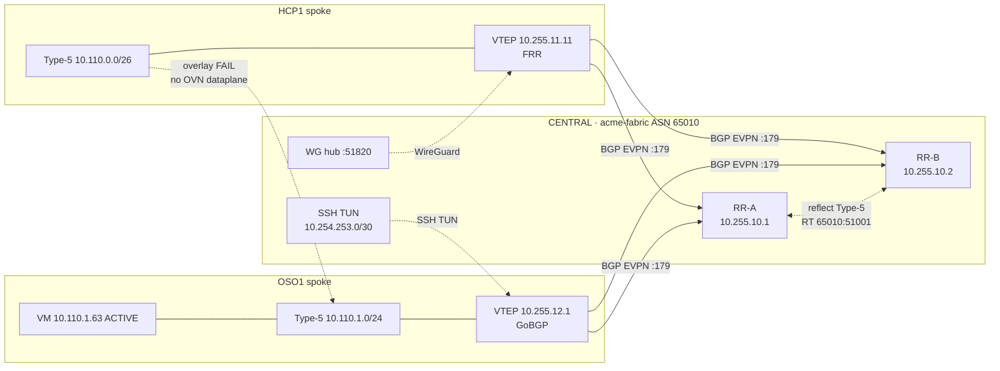
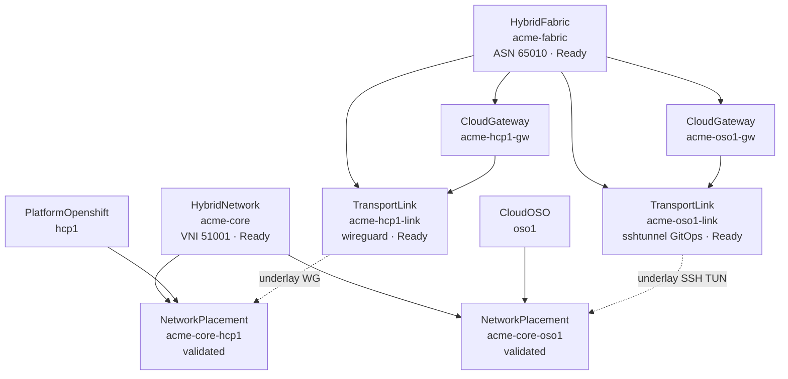

# Hybrid Fabric EVPN — Live Verification

**Captured:** 2026-10-06T16:42Z  
**Fabric:** `acme-fabric` ASN **65010** · spokes HCP1 + OSO1  
**CENTRAL:** `api.cluster-ngjtm.dyn.redhatworkshops.io`

| Scope | Result |
|-------|--------|
| HybridFabric / HybridNetwork / Placement CRs Ready | **PASS** |
| HCP1 local EVPN (CUDN / VTEP / Type-5) | **PASS** |
| HCP1 ↔ hub WireGuard underlay | **PASS** (route loop on `wg0`) |
| HCP1 ↔ hub RR-A/B BGP | **PASS** (Established) |
| Hub Type-5 reflection HCP1 ↔ OSO | **PASS** |
| OSO ↔ hub SSH TUN underlay | **PASS** (`tun0` + systemd) |
| OSO ↔ hub BGP + Type-5 | **PASS** (GoBGP Established) |
| VTEP HCP1 ↔ OSO | **PASS** |
| Overlay UDN ↔ OSO VM | **FAIL** (no OVN EVPN dataplane) |

---

## Connectivity

---

## CR graph

---

## Control plane

| Peer | Role | Hub PfxRcd |
|------|------|------------|
| `10.255.11.11` | HCP1 FRR | 1 |
| `10.255.12.1` | OSO GoBGP | 1 |

Both RRs reflect both Type-5 prefixes.

---

## CRs (CENTRAL)

| Object | Ready | Notes |
|--------|-------|-------|
| `hybridfabric/acme-fabric` | true | RR `10.255.10.1`, `10.255.10.2` |
| `hybridnetwork/acme-core` | true | VNI 51001 |
| `transportlink/acme-hcp1-link` | true | `tunnelType: wireguard` · Vault `fabric/wireguard/hub` |
| `transportlink/acme-oso1-link` | true | Live still `none`; GitOps → `sshtunnel` + Vault `fabric/sshtunnel/oso1` |
| `networkplacement/acme-core-hcp1` | true | `validated=true` |
| `networkplacement/acme-core-oso1` | true | Neutron `10.110.1.0/24`; `validated=true` |

---

## Underlay / durability

| Path | Mechanism |
|------|-----------|
| HCP1 | WireGuard `fabric-wg-hcp1`; `wg-start.sh` re-applies `WG_ROUTES` every 15s with `WG_ROUTE_SRC=10.255.11.11` |
| OSO | SSH TUN + `fabric-ssh-tun` / `fabric-gobgp` systemd on compute `172.22.0.100` (reboot-safe lab CP) |

Overlay cross-ping remains FAIL until RHOSO FR6 OVN gateway programs Type-5 dataplane (GoBGP is control-plane only).

---

## Artifacts

| Item | Note |
|------|------|
| Vault WG | `hybridsovereign/fabric/wireguard/hub` |
| Vault SSH TUN | `hybridsovereign/fabric/sshtunnel/oso1` |
| OSO API | `api.cluster-j7ljz…` |
