# Hybrid Fabric Design — Principal Network & Security Engineering Blueprint

**Status:** Design target (Hybrid VPC operators + AAP/Ansible realization)  
**Audience:** Principal network engineers, principal security engineers, platform architects  
**Scope:** Entity-isolated EVPN fabrics; central hub; HCP + RHOSO spokes; OpenShift 4.22 `ClusterUserDefinedNetwork`  
**Single source:** this file (`design/fabric.md`). Images: `design/images/`.

---

## Table of contents

1. [Executive intent](#1-executive-intent)
2. [Threat model & isolation guarantees](#2-threat-model--isolation-guarantees)
3. [Scenario inventory](#3-scenario-inventory)
4. [Hub-spoke topology](#4-hub-spoke-topology)
5. [Acme dedicated EVPN VRF (HCP1 ↔ OSO1)](#5-acme-dedicated-evpn-vrf-hcp1--oso1)
6. [Chad fabric (HCP2 ↔ HCP3 only)](#6-chad-fabric-hcp2--hcp3-only)
7. [Object model & CRD contracts](#7-object-model--crd-contracts)
8. [Ansible realization layers (what must be done)](#8-ansible-realization-layers-what-must-be-done)
9. [Day-0 / Day-1 procedures](#9-day-0--day-1-procedures)
10. [OpenShift 4.22 & RHOSO realization](#10-openshift-422--rhoso-realization)
11. [Sample manifests (Acme + Chad)](#11-sample-manifests-acme--chad)
12. [UI — admin & tenant create forms](#12-ui--admin--tenant-create-forms)
13. [Bill of materials & success criteria](#13-bill-of-materials--success-criteria)
14. [CRD deltas & non-goals](#14-crd-deltas--non-goals)
15. [PlatformOpenshift fabric awareness](#15-platformopenshift-fabric-awareness) (incl. [§15.0 AWS has no fabric attach](#150-fabric-attachment-scope-by-platformopenshift-type-locked))
16. [Address ownership](#16-address-ownership)
17. [PlatformOpenshift install with or without fabric / EVPN / CUDN](#17-platformopenshift-install-with-or-without-fabric--evpn--cudn)
18. [UI dropdowns — entity tagging & OCP fabric attach (console + standalone)](#18-ui-dropdowns--entity-tagging--ocp-fabric-attach-console--standalone)
19. [Creation, entity tagging & tenant visibility](#19-creation-entity-tagging--tenant-visibility)
20. [Talk-show: EVPN fabric live demo & test procedure](#20-talk-show-evpn-fabric-live-demo--test-procedure)


---

## 1. Executive intent

Deliver **entity-isolated EVPN VRFs on one platform fabric** on Sovereign Hybrid Cloud such that:

1. The **central OpenShift cluster** is the **hub** — route reflection, border gateway, VNI/RT numbering authority, and Ansible control plane.
2. **Hosted Control Planes (HCP)** and an **external RHOSO** attach as **spokes**.
3. Tenants express only *network intent* (`HybridNetwork` + `NetworkPlacement`); the platform owns **VNI / VRF / route-target (RT)** numbering.
4. **Acme** never joins **Chad** VRFs (and the reverse), even on a shared `CloudVirt/local-virt` underlay.

As a principal network and security engineer, treat this as a **VPN isolation product**: overlapping tenant CIDRs are allowed; safety is **control-plane separation** (one VNI + RT per tenant VRF, RT import on every spoke, RT allow-list on the hub reflector), not “hope the CIDRs differ.”

### 1.1 Tenancy model (decided 2026-10-07)

| Layer | Object | Count | Owner | Holds |
|-------|--------|-------|-------|-------|
| Fabric | `HybridFabric` | **one per hub** (`platform-fabric`) | Platform | ASN (65010, iBGP everywhere), hub underlay segment (`spec.underlay`), border gateway VM (route reflector, underlay router, tunnel endpoint), VNI pool, `entityRefs` (which tenants may use it) |
| Site | `CloudGateway` + `TransportLink` | one per site (HCP cluster, RHOSO cloud) | Platform | how the site reaches the BGW (`none` = hub underlay, `wireguard` = site gateway VM over wstunnel) |
| Tenant | `HybridNetwork` + `NetworkPlacement` | one VRF per network | Tenant (intent) / platform (numbering) | VRF = VNI + RT `65010:<vni>` allocated from the fabric ledger; placements per backend |

**Fabric-wide unique, and only these:** VNI / RT (ledger), underlay segments (`spec.underlay`, site underlays), gateway addresses. Overlay prefixes are unique per `HybridNetwork` only, so any tenant may use any RFC1918 prefix in its own VRF; hub and cluster pod/service ranges come from CG-NAT 100.64.0.0/10 (greenfield assumption, §16) so that is always safe.

Tenants **share** the BGW and the site tunnels; isolation is by **RT**: spokes import only their VRF's RT, and the BGW reflects only RTs allocated in the fabric's numbering ledger (§8.5.4). The earlier model (one `HybridFabric` per Entity with its own ASN / RR / BGW) is retired; see §11 history note and §22 for the cutover.

---

## 2. Threat model & isolation guarantees

| Threat | Attack / failure mode | Control |
|--------|----------------------|---------|
| Cross-entity route leak | Chad imports Acme RT | One VNI + RT per tenant VRF (platform-allocated); spokes import only their VRF RT; BGW RT allow-list from the ledger; placement admission on Entity ∈ `entityRefs` |
| Tenant numbering abuse | Tenant picks VNI/RT | Forbidden in `HybridNetwork.spec`; UI never exposes editors |
| Shared underlay confusion | Same CNV hosts multiple HCPs | Per-fabric CUDN labels + IP-VRF; no shared CUDN selectors across entities |
| Secret sprawl | BGP/tunnel keys in Git | Vault only; `vaultConfigRef` / `vaultCredentialRef` |
| Privilege escalation via placement | Tenant places onto foreign CloudOSO | Backend must match entity NS; fabric membership check in Ansible preflight |
| Hub RR compromise | Single BGW VM | KubeVirt runStrategy Always + live-migratable underlay; GR-aware FIB hold (follow-up); least-privilege spoke kubeconfigs |
| Double encapsulation MTU blackhole | WG+VXLAN without clamp | Prefer `tunnelType: none` on adjacent underlay; MSS clamp in fabric defaults |

**Security invariants (non-negotiable)**

- One platform `HybridFabric` per hub; the isolation domain is the tenant **VRF** (VNI + RT).
- Spokes peer **only** the fabric border gateway loopback; the BGW reflects only ledger RTs.
- `NetworkPlacement` cannot apply until a Ready `TransportLink` exists for that gateway.
- Negative probes (Acme→Chad / Chad→Acme) are first-class acceptance tests.

---

## 3. Scenario inventory

| Alias | Kind | Entity | Environment | Fabric role |
|-------|------|--------|-------------|-------------|
| **CENTRAL** | OpenShift hub (ACM, Hypershift, Sovereign operators, AAP) | platform | hub | RR + BGW + numbering + Ansible |
| **HCP1** | `PlatformOpenshift` `type: hosted` | **acme** | `CloudVirt/local-virt` | Acme spoke (CUDN EVPN) |
| **OSO1** | `CloudOSO` external RHOSO **18.0 FR6+** | **acme** | Native OVN BGP-EVPN (Type-5 / OVN Gateway) | Acme spoke |
| **HCP2** | `PlatformOpenshift` `type: hosted` | **chad** | `CloudVirt/local-virt` | Chad spoke |
| **HCP3** | `PlatformOpenshift` `type: hosted` | **chad** | `CloudVirt/local-virt` | Chad spoke |

| Fabric CR | Entities (`entityRefs`) | Sites |
|-----------|-------------------------|-------|
| `HybridFabric/platform-fabric` | acme-corp, chad | HCP1, HCP2, HCP3 (`none`), OSO1 (`wireguard`) |

**Numbering plan (one ledger, one ASN)**

| Tenant VRF (`HybridNetwork`) | Entity | VNI | Canonical RT | Placements |
|------------------------------|--------|-----|--------------|------------|
| acme-core | acme-corp | 51001 | `65010:51001` | HCP1, OSO1 |
| payments-vpc | acme-corp | 51000 | `65010:51000` | — |
| chad-app | chad | 52000 | `65010:52000` | HCP2, HCP3 |

VNI pool 51000–52127 (covers the two legacy per-entity pools so existing VNIs are kept). chad-app's RT changes from the legacy `65020:52000` to `65010:52000` when it moves to the platform fabric (both HCPs are re-rendered together).

---

## 4. Hub-spoke topology

One platform fabric per hub. The hub runs the **border gateway (BGW)** VM: route reflector, underlay router and tunnel endpoint. Hosted clusters on the hub join the underlay L2 directly; remote OpenStack sites join through a **site gateway** VM that tunnels to the BGW. Every spoke keeps its own VTEP as BGP next hop, so VXLAN runs spoke-to-spoke and the BGW only routes the outer packets.

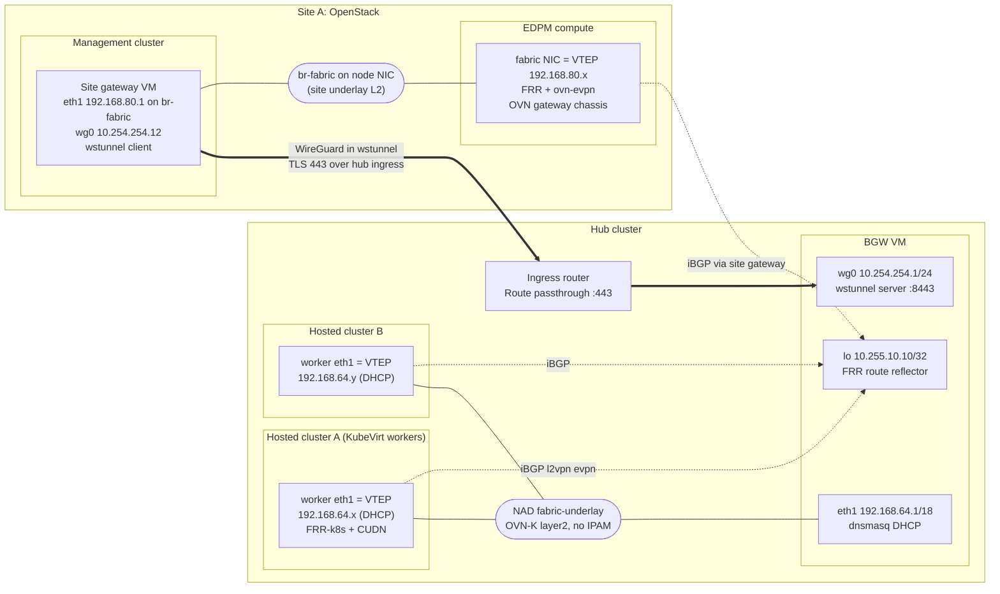

```text
 Hub cluster                                                 Site A (OpenStack)
 +--------------------------------------------------+        +-------------------------------------------+
 |  Hosted cluster A worker      BGW VM              |        |  Management cluster      EDPM compute     |
 |  eth1 VTEP 192.168.64.x  ---  eth1 192.168.64.1   |        |  Site gateway VM         fabric NIC VTEP  |
 |  (DHCP from BGW)          |   lo   10.255.10.10   |  TLS   |  eth1 192.168.80.1 ----  192.168.80.x     |
 |  Hosted cluster B worker  |   wg0  10.254.254.1 <=|=443===>|  wg0  10.254.254.12      FRR + ovn-evpn   |
 |  eth1 VTEP 192.168.64.y --+   (route reflector)   | wss    |  (br-fabric on node NIC) OVN gw chassis   |
 |  underlay NAD: OVN-K layer2, no IPAM              |        |  site underlay L2 192.168.80.0/24         |
 +--------------------------------------------------+        +-------------------------------------------+
   control plane: every VTEP peers iBGP (l2vpn evpn) with 10.255.10.10; next hop unchanged
   data plane:    VXLAN VTEP <-> VTEP; the BGW routes eth1 <-> wg0, the site gateway routes wg0 <-> eth1
```

**Why hub-spoke (not full mesh)**

- Control-plane scale: O(N) BGP sessions to the BGW, not O(N²).
- Policy enforcement point: the BGW is the only reflector; it reflects only route targets allocated on the fabric.
- Operational blast radius: the BGW is one VM per hub; spoke VTEPs keep forwarding for established routes while it restarts.

---

## 5. Tenant VRFs sharing the fabric

Each `HybridNetwork` is an IP-VRF with its own VNI *n* and RT `ASN:n`. OpenShift spokes realize it as a primary ClusterUserDefinedNetwork with `transport: EVPN`; OpenStack spokes as a Neutron router created with `--evpn-vni n`. Several VRFs share the same BGW, underlay and tunnels.

**Type-5 route flow (control plane)**

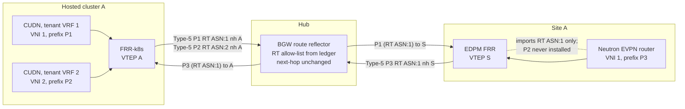

**Packet path for VRF 1 (data plane)**

```text
 pod in VRF 1 (P1)                                                          VM in VRF 1 (P3)
   | CUDN, VRF 1                                                              ^ Neutron EVPN router
 [VTEP A: VXLAN VNI 1, outer 192.168.64.x -> 192.168.80.x]                   | OVN gateway chassis
   |  hub underlay L2                                                       [VTEP S: decap VNI 1]
 BGW eth1 --route--> wg0 ==WireGuard==> wstunnel ==TLS 443 hub ingress==> site gateway wg0 --route--> eth1
                                                                              site underlay L2
 Inner MTU budget: 1300 (overlay) inside 1330 VXLAN payload over wg0 1380 (section 21.5)
```

Shared underlay, BGW and tunnels do not imply a shared VRF: a spoke installs only routes whose RT it imports, and the BGW drops routes whose RT is not allocated on the fabric.

---

## 6. Tenant VRF across two hosted clusters

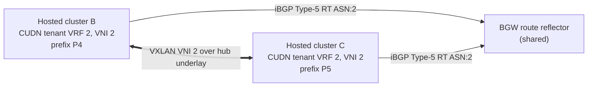

| Constraint | Enforcement |
|------------|-------------|
| VRF not placed at an OpenStack site | No CloudOSO placement for that network; the site gateway is shared infrastructure but its computes only import RTs of VRFs placed there |
| Same VNI on both clusters | `allocate` once on `HybridNetwork`; both placements reuse status VNI/RT |
| L2 mobility optional | Layer2 + MAC-VRF only if live migration across clusters is a requirement |

---

## 7. Object model & CRD contracts

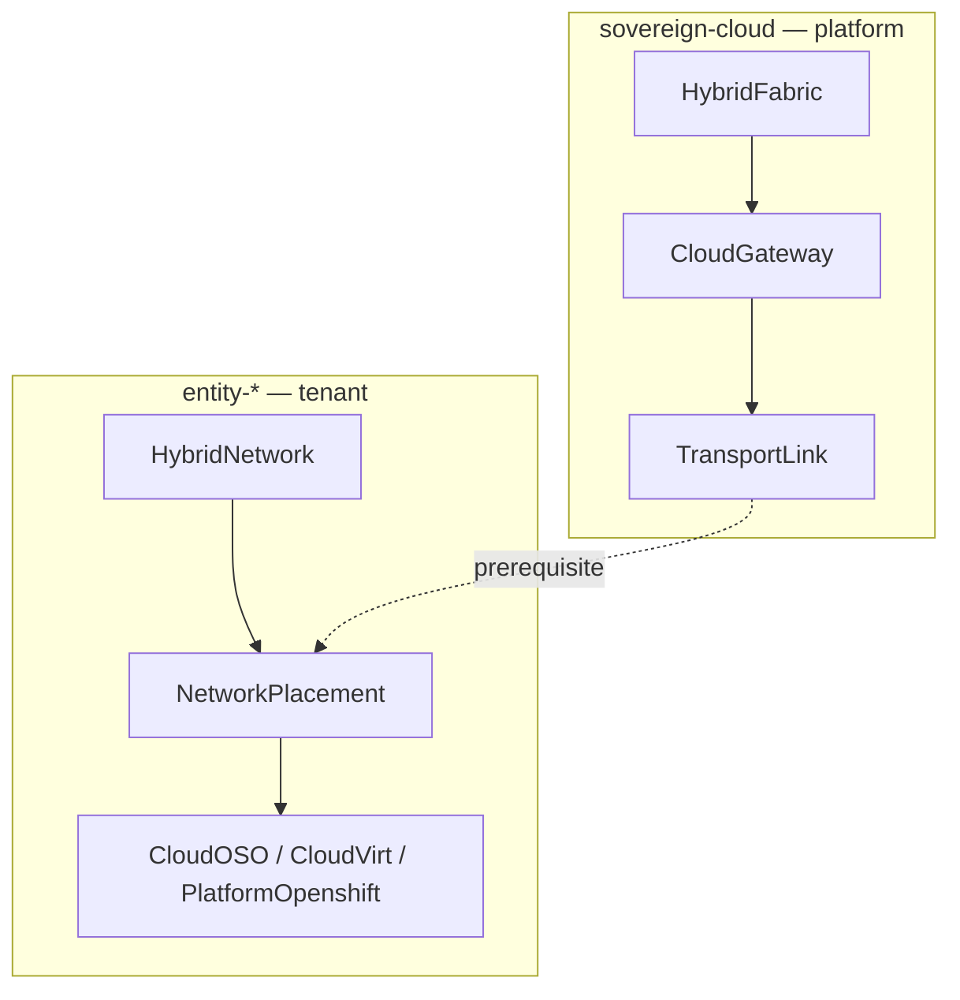

| Kind | NS | Owner | Spec (intent) | Status (observed) |
|------|----|-------|---------------|-------------------|
| `HybridFabric` | `sovereign-cloud` | Platform — **one per hub** | ASN, `entityRefs`, VNI pool, underlay segment (`spec.underlay`), border gateway VM (route reflector, underlay router, tunnel endpoint), transport defaults | `fabricBaseReady`, `borderBgwReady`, `bgwEndpoint`, `allocatedVniCount` |
| `CloudGateway` | `sovereign-cloud` | Platform — one per site | cloud, `fabricRef`, transport, `siteUnderlay` (RHOSO), OSO/Virt refs; `domainAsn` = fabric ASN (per-spoke ASNs retired) | `landingZoneReady`, `gatewayAddress` |
| `TransportLink` | `sovereign-cloud` | Platform — one per site | `fabricRef`, `cloudGatewayRef`, `tunnelType` | `tunnelUp`, endpoints |
| `HybridNetwork` | `entity-*` | Tenant — one per VRF | description, optional `fabricRef` (**no** VNI/RT) | `vni`, `vrfName`, `canonicalRt`, `fabric` |
| `NetworkPlacement` | `entity-*` | Tenant | `network`, `backend`, `prefixes`, `state` | `backendReady`, `validated`, gateway/link refs |

`NetworkPlacement.spec.backend.kind` ∈ `CloudAWS` | `CloudOSO` | `CloudVirt` | `PlatformOpenshift`.

Shipped CRDs: `gitops/custom-operators/crds/crd-{hybridfabric,cloudgateway,transportlink,hybridnetwork,networkplacement}.yaml`.

**Design deltas still needed**

| Delta | Why |
|-------|-----|
| `CloudGateway.spec.virtCloudVirtRef` / `platformOpenshiftRef` | Mirror `openstackCloudOSORef` for HCP/Virt |
| `HybridFabric.spec.entityRefs[]` (1..N Entities) | Tag fabric to consumers; see §19 |
| `HybridNetwork.spec.fabricRef` when entity has multiple fabrics | Disambiguate numbering pool |
| Tenant attachment catalog (projection) | Tenants select backend; system resolves TransportLink |
| Placement admission | Backend entity ∈ entityRefs + Ready TransportLink |
| AAP role `backend_openshift_evpn` | Render 4.22 CUDN/FRR/VTEP/RA |

---

## 8. Ansible realization layers (what must be done)

Operators stay thin: on reconcile they launch AAP JobTemplates. **Ansible owns mutation** of underlay, OVN, Neutron, and numbering. Introduce layers **in order**; never skip prerequisites.


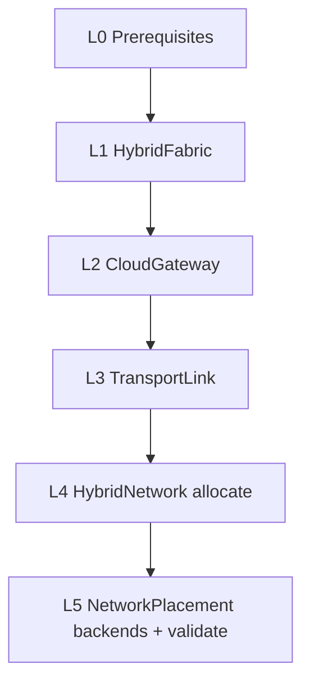

### 8.0 Layer L0 — Prerequisites (manual / platform bootstrap; Ansible verifies)

**JobTemplate:** optional `fabric-preflight` (or first tasks of every provision playbook)

| Ansible must | Detail |
|--------------|--------|
| Assert underlay | Ping/TCP to RR loopbacks and spoke VTEP CIDRs; fail with clear message |
| Assert MTU | Path MTU ≥ VXLAN overhead (recommend 9000 fabric MTU) |
| Assert Vault | Paths exist for BGW creds, tunnel keys, OSO clouds.yaml, spoke kubeconfigs — **read only**, never log secrets |
| Assert CNO EVPN flags on each HCP | `gatewayConfig.routingViaHost=true`, `ipForwarding=Global`; route advertisements enabled |
| Assert FRR-k8s | `openshift-frr-k8s` namespace / CRDs present on EVPN clusters |
| Assert backends Ready | `PlatformOpenshift` HCP1–3, `CloudOSO/oso1`, `CloudVirt/local-virt` `.status.ready` |
| Record support caveat | If HCP is virt-hosted, set condition `EvpnLabOnly=True` (RH docs: primary CUDN EVPN bare-metal) |

**Security:** preflight uses least-privilege SA tokens from Vault; no cluster-admin in tenant namespaces.

---

### 8.1 Layer L1 — `HybridFabric` introduced

**Trigger:** `HybridFabric` create/update · **JT:** `hybridfabric-provision` · **Roles:** `fabric_base`, `border_bgw`, numbering

| Ansible must | Detail |
|--------------|--------|
| Validate pool | `vniPool.end >= start`; no overlap with other Ready fabrics’ pools (query API) |
| Validate ASN uniqueness | `domainAsn` not reused by another fabric |
| Create numbering store | ConfigMap (or CR status ledger) `fabric-numbering-<name>` with bitmap/next-VNI |
| Border gateway (BGW) VM | `deploy_border_gateway.yml` (§21.2). In the fabric namespace: OVN-K layer2 NAD `spec.underlay.nadName` (no IPAM → MAC-only port security, MTU 1400); KubeVirt VM `fabric-bgw-<fabric>` (CentOS Stream 9 containerdisk, `default` masquerade + `underlay` bridge); Secret `<bgw>-cloudinit` (first boot) and Secret `<bgw>-config` (wg0.conf / frr.conf / dnsmasq / nftables, attached as a disk and re-read at every boot; EDA restarts the VMI when it changes); Service `<bgw>-wss` + passthrough Route for wstunnel. Guest: loopback = `borderGateway.loopback` (BGP router-id / cluster-id), eth1 = underlay gateway + dnsmasq (option 121 routes to the loopback and every remote site underlay), wg0 with one peer per `cloud: openstack` / `transport: wireguard` CloudGateway, FRR iBGP route reflector (`bgp listen range` hub underlay + site underlays + WireGuard net; `l2vpn evpn` + `ipv4 unicast`, `attribute-unchanged next-hop`). WireGuard keys come from Vault `borderGateway.vaultCredentialRef` (generated when absent), never Git. `borderBgwReady` = VMI Ready + guest agent connected (set up last by the first-boot script). |
| Tenant RT allow-list | The BGW FRR config carries `bgp extcommunity-list standard FABRIC-RT permit rt <asn>:<vni>` for every VNI in `fabric-numbering-<fabric>` and `route-map SPOKES-EVPN-IN` (permit on match, deny otherwise) applied `in` on the `SPOKES` peer-group in `address-family l2vpn evpn`. A new VNI re-renders the config (hybridnetwork_provision) and restarts the BGW VMI. `bgw_rt_filter: off` disables it. |
| Legacy ledger migration | `ledger_migrate_legacy.yml`: moves `<ns>/<network>` keys from other `fabric-numbering-*` ConfigMaps into this ledger (same VNI) when that HybridNetwork's `spec.fabricRef` is this fabric; the allocator also prefers a network's previous `status.vni`. |
| Lab-only shims | kubemacpool ignore label on VM namespaces; see Appendix A. |
| Legacy hub RR (deprecated) | `deploy_hub_rr.yml` (hostNetwork FRR pods per `spec.routeReflectors[]`) runs only when that list is non-empty. New fabrics leave it empty. |
| Status | `fabricBaseReady`, `borderBgwReady`, `bgwEndpoint`, `bgwPeerCount`, `hubRrReady` (legacy), `availableVniCount`, `ready` |
| Teardown | Only if `allocatedVniCount==0` and no TransportLinks reference fabric; else block. Remove the BGW VM, Route, Service, Secrets and fabric-namespace NAD (`remove_border_gateway.yml`). Legacy hub RR pods only when **no other** HybridFabric still references that RR address. |

**Idempotency:** re-run must not reallocate VNIs or reset the ledger.

**Vault layout** (KV mount `hybridsovereign/`; EDA generates WireGuard pairs when absent, never writes Git)

| Path | Keys | Read by |
|------|------|---------|
| `fabric/<fabric>/bgw` (lab: `fabric/platform-fabric/bgw`) | `wgPrivateKey`, `wgPublicKey`, optional `sshPublicKey` | hybridfabric_provision (BGW), cloudgateway_provision (public key for the site gateway) |
| `fabric/wireguard/<cloudgateway>` (lab: `fabric/wireguard/acme-oso1-gw`) | `wgPrivateKey`, `wgPublicKey`, optional `sshPublicKey` | cloudgateway_provision (site gateway VM), hybridfabric/transportlink (BGW peer) |
| `oso/<cloudoso>/mgmt-kubeconfig` (lab: `oso/oso1/mgmt-kubeconfig`) | `kubeconfig` | cloudgateway_provision, transportlink_provision, networkplacement (HA chassis check) |
| `oso/projects/<cloudoso>/clouds-config` | `clouds.yaml` | networkplacement (Neutron) |

Explicit `borderGateway.vaultCredentialRef`, `CloudGateway.spec.transport.vaultPeerConfigRef` and `managementClusterKubeconfigRef` override the derived paths.

---

### 8.2 Layer L2 — `CloudGateway` introduced

**Trigger:** `CloudGateway` · **JT:** `cloudgateway-provision` · **Role:** `cloud_landing_zone`

| Ansible must | Detail |
|--------------|--------|
| Resolve fabric | Load `fabricRef`; fail if fabric not Ready |
| Entity match | Gateway labels/entity must match fabric entity |
| Branch on `spec.cloud` | `openshift` → HCP/Virt (**hosted** PlatformOpenshift on CloudVirt) landing; `openstack` → CloudOSO / PlatformOpenshift type=openstack; **`aws` — no EVPN fabric landing** (do not create fabric CloudGateway for AWS PlatformOpenshift) |
| OSO path | Using `openstackCloudOSORef`, obtain admin/appcred from Vault; assert RHOSO ≥ 18.0.21; enable **native OVN BGP-EVPN** (FRR + EVPN Service Plugin / OVN Gateway) — **not** deprecated `ovn-bgp-agent` |
| OCP path | Using spoke kubeconfig: ensure FRR-k8s + VTEP prerequisites; peer with the BGW loopback in the fabric ASN (iBGP; per-spoke ASNs retired) |
| Landing zone | Create/ensure provider resources (security groups, external nets hooks) **without** tenant VNIs yet |
| Status | `landingZoneReady`, `gatewayAddress` (VTEP or BGP peer IP), `peerCount` |

**Security:** spoke kubeconfig scoped to networking APIs where possible; audit log job id on CR `edaJobs`/`aapJob`.

---

### 8.3 Layer L3 — `TransportLink` introduced

**Trigger:** `TransportLink` · **JT:** `transportlink-provision` · **Role:** `transport`

| Ansible must | Detail |
|--------------|--------|
| Bind fabric + gateway | Both Ready; same fabricRef |
| Reject cross-fabric bind | e.g. Chad gateway → acme-fabric → **fail** |
| `tunnelType: none` | HCP spokes. Workers are on the hub underlay L2 (NodePool `additionalNetworks`, eth1 by DHCP from the BGW) and peer natively with the BGW loopback; nothing to tunnel. |
| `wireguard` | RHOSO site gateways. WireGuard between the BGW VM and the site gateway VM `fabric-gw-<oso>` (built by the CloudGateway on the RHOSO management cluster), carried inside **wstunnel over the hub ingress** (passthrough Route, TLS 443) because neither lab exposes UDP. The link renders the gateway as a peer on the BGW (`bgw_config.yml`, restarts the BGW VMI on change) and reports `wg0` presence on both guests; the authoritative check is the EDPM FRR session to the BGW loopback. Keys: BGW `borderGateway.vaultCredentialRef`, gateway `transport.vaultPeerConfigRef`. No `vaultConfigRef`. |
| `ipsec` / `macsec` | Pull `vaultConfigRef`; record endpoints (not implemented beyond Vault load). `sshtunnel` was removed. |
| Exchange endpoints | Write `borderEndpoint`, `cloudEndpoint`, `lastHandshakeAt` |
| Status | `tunnelUp`, `ready` |

**`wireguard` transport (site gateway to BGW)**

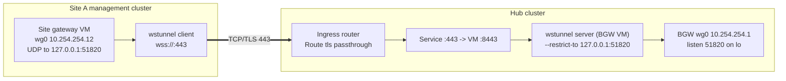

Encapsulation on the wire between the sites: tenant packet in VXLAN (VNI n) in WireGuard (UDP) in a WebSocket stream over TLS/TCP 443. Only TCP 443 to the hub ingress is needed; no UDP or NodePorts. Physical deployments with routed underlays use `tunnelType: none` instead.

**Teardown:** drain BGP (graceful), bring down tunnel, clear Vault-dependent runtime state — **do not** delete Vault secrets.

---

### 8.4 Layer L4 — `HybridNetwork` introduced (allocate)

**Trigger:** `HybridNetwork` · **JT:** `hybridnetwork-provision` · **Role:** `allocate`

| Ansible must | Detail |
|--------------|--------|
| Resolve entity | From namespace `entity-*` → Entity name |
| Select fabric | Entity’s fabric (label/`entityRef`); fail if missing/not Ready |
| Allocate VNI | Atomically from fabric pool; persist mapping `network → vni` |
| Derive VRF + RT | e.g. `vrfName=vrf-<network>`, `canonicalRt=<fabricAsn>:<vni>` |
| **Never** take VNI from tenant spec | Ignore/reject if somehow present |
| Status | `allocated`, `vni`, `vrfName`, `canonicalRt`, `fabric`, `fabricVniReady` |
| Teardown | Release VNI only when zero placements remain |

---

### 8.5 Layer L5 — `NetworkPlacement` introduced (realize + validate)

**Trigger:** `NetworkPlacement` · **JT:** `networkplacement-provision` · **Roles:** `fabric_vni`, `backend_openshift_evpn` **or** `backend_openstack`, `validate`

#### 8.5.1 Common preflight (every placement)

| Ansible must | Detail |
|--------------|--------|
| Load HybridNetwork | Must be allocated |
| Resolve backend CR | Kind/name in same entity NS; Ready |
| Resolve CloudGateway + TransportLink | For that backend on the entity fabric; both Ready → `prerequisiteReady=true` |
| Prefix validation | CIDR parse; conflict checks within same HybridNetwork as policy dictates |
| `state: absent` | Withdraw backend objects; keep VNI until last placement gone |

#### 8.5.2 Backend: PlatformOpenshift / HCP (`backend_openshift_evpn`)

On the **spoke HCP API** (kubeconfig from Vault), Ansible must create/update:

1. `FRRConfiguration` — BGP neighbors = fabric RR addresses; labels for RA selector  
2. `VTEP` — VXLAN VTEP definition (Unmanaged/managed per cluster standard)  
3. `RouteAdvertisements` — select FRR + CUDNs labeled for this HybridNetwork  
4. `ClusterUserDefinedNetwork` — `transport: EVPN`, `evpn.ipVRF.vni` + `routeTarget` from network status; subnets from placement prefixes  
5. Ensure workload namespaces carry selector labels for the CUDN  

Idempotent apply (SSA); record resource versions in placement status.

#### 8.5.3 Backend: CloudOSO — RHOSO 18.0 FR6 native OVN EVPN (`backend_openstack` / `backend_rhoso_ovn_evpn`)

| Ansible must | Detail |
|--------------|--------|
| Assert FR6 EVPN | RHOSO ≥ 18.0.21; Neutron supports `router.create` with `evpn_vni`; reject labs still requiring `ovn-bgp-agent` for new placements |
| Neutron network/subnet | Prefixes from placement |
| EVPN router | `openstack router create --evpn-vni <HybridNetwork.status.vni>` (centralized OVN Gateway, Type-5) |
| Advertise prefixes | `router add subnet --advertise-host` (or REST `advertise_host: true`) |
| BGP toward hub | FRR on OVN Gateway chassis peers `HybridFabric` RRs (`l2vpn evpn`); align RT/RD to canonical RT |
| Status | Neutron network/subnet/router UUIDs, `vni`, `backendApplied` |

Full procedure: **§10.3**.

#### 8.5.4 `fabric_vni` (hub side)

**Implemented (2026-10-07):** the BGW reflects only EVPN routes whose RT is `<fabric ASN>:<VNI>` for a VNI in this fabric's ledger (extcommunity-list `FABRIC-RT` + route-map `SPOKES-EVPN-IN` applied inbound on the `SPOKES` peer-group, l2vpn evpn only). Spokes still import only their VRF's RT, so tenant separation does not depend on the hub filter alone. Not yet verified live on FRR 8.5.

#### 8.5.5 `validate`

| Ansible must | Detail |
|--------------|--------|
| Positive probe | From HCP test pod (CUDN NS) to OSO DHCP/port IP (Acme) or HCP2↔HCP3 (Chad) |
| Negative probe | Confirm no route to other fabric’s prefixes |
| Status | `validated`, `lastValidatedAt`, `realizedPrefixes` |

#### 8.5.6 Placement state machine

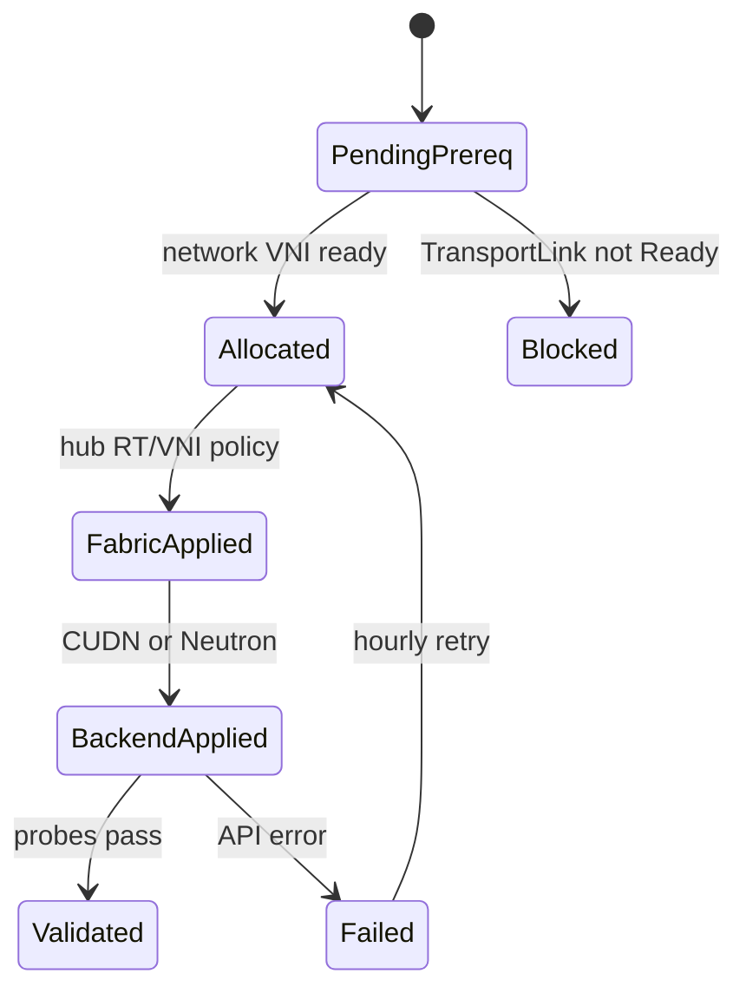

---

### 8.6 Layer interaction matrix

| Layer introduced | Ansible creates / mutates | Must already exist |
|------------------|---------------------------|--------------------|
| L1 HybridFabric | Numbering CM, RR/BGW intent | L0 underlay + Vault |
| L2 CloudGateway | Landing zone (site gateway VM + EDPM for RHOSO) | L1 Ready |
| L3 TransportLink | BGP neighbors ± tunnel | L2 Ready |
| L4 HybridNetwork | VNI/RT allocation | L1 Ready |
| L5 NetworkPlacement | CUDN/FRR/VTEP/RA **or** Neutron EVPN router (`--evpn-vni`) + Type-5 probes | L3 Ready + L4 allocated |
| Teardown L5 | Withdraw site | — |
| Teardown L4 | Free VNI | no placements |
| Teardown L3→L1 | Reverse order | no dependents |

### 8.7 JobTemplate catalog

| Kind | Provision | Teardown |
|------|-----------|----------|
| HybridFabric | `hybridfabric-provision` | `hybridfabric-teardown` |
| CloudGateway | `cloudgateway-provision` | `cloudgateway-teardown` |
| TransportLink | `transportlink-provision` | `transportlink-teardown` |
| HybridNetwork | `hybridnetwork-provision` | `hybridnetwork-teardown` |
| NetworkPlacement | `networkplacement-provision` | `networkplacement-teardown` |

Playbooks live under `eda/hybridvpc/` / `eda/rulebooks/`; SCM update-on-launch from Git.

---

## 9. Day-0 / Day-1 procedures

### 9.1 Day-0 — platform fabric engineer

1. Complete L0 checks (underlay, MTU, Vault, CNO, backends Ready).  
2. Create `HybridFabric/acme-fabric` and `chad-fabric` (disjoint pools). Wait Ready.  
3. Create Acme gateways `acme-hcp1-gw`, `acme-oso1-gw` → landing Ready (OSO1: assert RHOSO **18.0.21 FR6+** native OVN BGP-EVPN, FRR `l2vpn evpn` toward hub RR).  
4. Create Acme TransportLinks (`tunnelType: none` in lab) → tunnel Up.  
5. Create Chad gateways/links for HCP2 and HCP3 **only**.  
6. **Negative test:** TransportLink Chad-gw → acme-fabric must fail.  
7. Hand off to tenant network admins.

### 9.2 Day-1 — tenant network admin

1. Create `HybridNetwork` (name + description).  
2. Add `NetworkPlacement`s with prefixes.  
3. Watch: allocated → fabricVniReady → backendReady → validated.  
4. Label namespaces / attach VMs.  
5. Decommission a site with `spec.state: absent` on that placement only.

---

## 10. OpenShift 4.22 & RHOSO realization

### 10.1 CNO prerequisites (each EVPN cluster)

```yaml
# Network.operator.openshift.io — excerpt
spec:
  defaultNetwork:
    ovnKubernetesConfig:
      gatewayConfig:
        routingViaHost: true
        ipForwarding: Global
```

Also enable route advertisements. **Support note:** RH documents BGP EVPN primary CUDN as **bare-metal only** — virt/HCP lab is best-effort until supported.

### 10.2 Objects Ansible renders on HCP (Acme example)

```yaml
apiVersion: frrk8s.metallb.io/v1beta1
kind: FRRConfiguration
metadata:
  name: acme-fabric-evpn
  namespace: openshift-frr-k8s
  labels:
    evpn: "true"
    hybridsovereign.redhat/fabric: acme-fabric
spec:
  nodeSelector: {}
  bgp:
    routers:
      - asn: 65011
        neighbors:
          - address: 10.255.10.1
            asn: 65010
          - address: 10.255.10.2
            asn: 65010
---
apiVersion: k8s.ovn.org/v1
kind: RouteAdvertisements
metadata:
  name: advertise-acme-evpn
spec:
  advertisements: ["PodNetwork"]
  targetVRF: auto
  frrConfigurationSelector:
    matchLabels:
      evpn: "true"
  networkSelectors:
    - networkSelectionType: ClusterUserDefinedNetworks
      clusterUserDefinedNetworkSelector:
        networkSelector:
          matchLabels:
            hybridsovereign.redhat/network: acme-core
---
apiVersion: k8s.ovn.org/v1
kind: ClusterUserDefinedNetwork
metadata:
  name: acme-core
  labels:
    hybridsovereign.redhat/network: acme-core
    hybridsovereign.redhat/fabric: acme-fabric
    advertise: "true"
spec:
  namespaceSelector:
    matchLabels:
      hybridsovereign.redhat/hybridnetwork: acme-core
  network:
    topology: Layer3
    layer3:
      role: Primary
      subnets:
        - cidr: 10.110.0.0/24
          hostSubnet: 24
    transport: EVPN
    evpn:
      vtep: acme-evpn-vtep
      ipVRF:
        vni: 51001
        routeTarget: "65010:51001"
```

### 10.3 RHOSO 18.0 FR6 — native OVN BGP-EVPN (OSO1)

**Target platform:** Red Hat OpenStack Services on OpenShift **18.0.21 (Feature Release 6)** and later.  
**Feature status:** Technology Preview — *Native BGP-EVPN for advanced multi-tenant routing* (RHOSSTRAT-583).  
**Design choice:** Prefer **OVN-native BGP-EVPN** over the legacy / deprecated `ovn-bgp-agent` path (deprecated since RHOSO 18.0.10 FR3; do not build new Sovereign automation on it).

#### 10.3.1 What FR6 native EVPN provides

| Capability | FR6 native OVN BGP-EVPN | Legacy `ovn-bgp-agent` (do not use for new work) |
|------------|-------------------------|--------------------------------------------------|
| Control plane | BGP EVPN via **FRR**, driven by **OVN dynamic-routing** options | Python agent watches NB DB → FRR / kernel VRF |
| Route types (TP) | **Type-5** (IP prefixes) only | Kernel/VRF exposure; Type-5 with manual gaps |
| Routing model (TP) | **Centralized** via **OVN Gateway** chassis | Per-node VRF + VXLAN devices |
| Tenant isolation | OVN logical isolation preserved; VNI per EVPN domain | Provider-network + VNI external_ids |
| Future (post-FR6) | Type-2 + distributed routing planned upstream | Deprecated / removed |

Native OVN installs Type-5-advertised prefixes into a Linux VRF/table; FRR advertises them as EVPN. Remote Type-5 learning is consumed via Netlink into OVN (no SB DB copy of remote EVPN state). Datapath stays in OVS/OVN (hardware-offload friendly vs pure kernel VRF hairpinning).

```mermaid
flowchart LR
  subgraph site["Site A: OpenStack"]
    direction TB
    VM["Tenant VM\nprefix P3"]
    NS["Neutron network + subnet\nMTU 1300"]
    RTR["Neutron router\n--evpn-vni n\nsubnet --advertise-host"]
    GWC["OVN gateway chassis\n(edpm_enable_chassis_gw)\nHA_Chassis_Group evpn-hcg-<router>"]
    EV["ovn-evpn agent extension\nbr-evpn, vxlan-evpn, VRF n"]
    FRR["EDPM FRR\nl2vpn evpn, source = fabric NIC"]
    SG["Site gateway VM\n(router to the tunnel)"]
    VM --> NS --> RTR --> GWC --> EV --> FRR
    FRR -. "iBGP to 10.255.10.10" .-> SG
  end
  subgraph hub["Hub"]
    RR["BGW route reflector"]
  end
  subgraph hc["Hosted cluster A"]
    CUDN["CUDN IP-VRF\nVNI n, RT ASN:n"]
  end
  SG == "WireGuard in wstunnel" ==> RR
  RR <-. "EVPN Type-5 RT ASN:n" .-> CUDN
```

#### 10.3.2 Platform prerequisites (CloudGateway / day-0 on OSO1)

Ansible `cloud_landing_zone` / `transport` for `cloud: openstack` must assert RHOSO ≥ **18.0.21** and enable native dynamic routing / EVPN (not `ovn-bgp-agent`):

| Area | Requirement |
|------|-------------|
| Control plane | ML2/OVN; Neutron **EVPN Service Plugin** (or FR6 equivalent packaging) enabled |
| Data plane / EDPM | FRR on gateway/network nodes; OVN **EVPN agent extension** (replaces BGP-agent EVPN expose) |
| VTEP | Global reachable VTEP IP per EVPN chassis (`ovn-evpn-local-ip` / Open_vSwitch external_ids) |
| BGP underlay | FRR peers toward `HybridFabric.spec.routeReflectors[]` (CENTRAL) with **address-family l2vpn evpn** activated |
| AS / VNI | Fabric ASN (iBGP to the BGW); VNIs allocated only from the fabric pool (never tenant-picked) |
| Verify | `openstack router create --help` shows `--evpn-vni`; OVN NB supports `dynamic-routing*` options |

**Explicit non-goals on OSO for FR6 TP**

- Type-2 MAC/IP EVPN (L2 stretch OCP↔RHOSO) — wait for later RHOSO; Acme design stays **L3 / Type-5 / IP-VRF**.  
- Distributed EVPN on every compute — TP is **centralized OVN Gateway** only.  
- Reintroducing `edpm_ovn_bgp_agent_*` EVPN knobs for new CloudOSO attachments.

#### 10.3.3 Placement realization (`backend_openstack` → rename conceptually `backend_rhoso_ovn_evpn`)

When `NetworkPlacement` targets `CloudOSO/oso1` for HybridNetwork `acme-core` with allocated `vni=51001`, `canonicalRt=65010:51001`, prefix `10.110.1.0/24`:

| Step | Ansible action |
|------|----------------|
| 1 | Resolve admin clouds.yaml from Vault (`CloudOSO`); assert FR6 EVPN APIs |
| 2 | Ensure project network + subnet for placement prefixes (or adopt existing) |
| 3 | Create (or adopt) Neutron **EVPN router**: `openstack router create --evpn-vni 51001 …` so VNI **equals** HybridNetwork status VNI |
| 4 | Attach subnet with host-route advertisement into the EVPN: `openstack router add subnet --advertise-host <router> <subnet>` (or REST `advertise_host: true`) |
| 5 | Confirm OVN logical router has dynamic-routing / VRF-id / VNI wiring (EVPN Service Plugin); gateway chassis scheduled |
| 6 | Confirm FRR on gateway nodes advertises Type-5 for the prefix toward CENTRAL RRs; RT/RD strategy aligns with fabric canonical RT (`65010:51001`) — rewrite/import policy on hub if Neutron RD format differs |
| 7 | Patch `NetworkPlacement.status` with network/subnet/router UUIDs, `vni`, `backendApplied`, `cloudGatewayRef`, `transportLinkRef` |
| 8 | Validate: probe from HCP1 CUDN pod to RHOSO VM (and negative cross-fabric) |

**CLI sketch (automation-owned; tenants never set VNI)**

```bash
# VNI MUST be HybridNetwork.status.vni from fabric IPAM / allocate role
openstack network create acme-core-oso1
openstack subnet create --network acme-core-oso1 --subnet-range 10.110.1.0/24 acme-core-oso1-subnet
openstack router create --evpn-vni 51001 acme-core-evpn-rtr
openstack router add subnet --advertise-host acme-core-evpn-rtr acme-core-oso1-subnet
openstack router show acme-core-evpn-rtr -c evpn-vni
```

#### 10.3.4 Alignment with OpenShift CUDN (same fabric VPN)

| Side | Object | VNI | RT | Prefix example |
|------|--------|-----|----|----------------|
| HCP1 | CUDN `evpn.ipVRF` | 51001 | `65010:51001` | 10.110.0.0/24 |
| OSO1 | Neutron router `--evpn-vni` + advertised subnet | 51001 | import/export policy → same canonical RT | 10.110.1.0/24 |
| CENTRAL | Fabric RR | reflects Type-5 | fabric ASN 65010 | — |

Same VNI on both spokes is mandatory for one HybridNetwork VPN. Overlapping tenant CIDRs across **different** HybridNetworks remain OK (different VNIs).

#### 10.3.5 TransportLink semantics for RHOSO FR6

| `tunnelType` | Use |
|--------------|-----|
| `none` | Site underlay already routed to the hub (physical deployments): EDPM FRR peers the BGW loopback directly. |
| `wireguard` | Remote site without a routed underlay to the hub. The CloudGateway lands a site gateway VM on the OpenStack management cluster (`br-fabric` on `siteUnderlay.interface` on every node, bridge NAD `openstack/fabric`, eth1 = `siteUnderlay.gatewayAddress`, WireGuard to the BGW carried over TLS 443 through the hub ingress), then the EDPM landing: NetConfig network `fabric` once, then each NodeSet in `CloudOSO.spec.dataplaneNodeSetRefs` **one at a time in CR order** (patch, one deployment scoped to that NodeSet, wait for Ready before the next; details §21.4). The optional MAC-translation shim (`siteUnderlay.macNatShim`) is for test environments only (Appendix A). |

Placement order matters: the Neutron `--evpn-vni` router only gets gateway chassis in `evpn-hcg-<router id>` if it is created after the EDPM landing; `backend_rhoso_ovn_evpn.yml` checks the group on the management cluster and recreates the router once when empty. Neutron networks are created with MTU 1300 (fabric.md §21.5).

CloudGateway for OSO remains the Sovereign object that owns the site underlay, `openstackCloudOSORef`, and peer endpoints; FR6 native EVPN does **not** remove the need for HybridFabric / CloudGateway / TransportLink CRs.

#### 10.3.6 Migration note (existing labs)

If a lab still runs `ovn-bgp-agent` EVPN expose (FR3-era):

1. Treat as **transitional only**.  
2. New `NetworkPlacement` automation targets FR6 native `--evpn-vni` routers.  
3. Document drain: withdraw agent-managed VRFs → recreate with EVPN routers → verify Type-5 on hub RR before deleting agent config.

### 10.4 Chad dual-HCP

| Cluster | VNI | RT | Prefix |
|---------|-----|----|--------|
| HCP2 | 52001 | 65020:52001 | 10.120.0.0/24 |
| HCP3 | 52001 | 65020:52001 | 10.120.1.0/24 |

Peers only chad-fabric RRs (`10.255.20.x`). No neighbor to ASN 65010.

---

## 11. Sample manifests (platform fabric + Acme / Chad tenants)

> **History note.** Until 2026-10-07 this section showed one `HybridFabric` per Entity (`acme-fabric` AS 65010 with RRs 10.255.10.1/.2, `chad-fabric` AS 65020) and a per-spoke ASN scheme (CloudGateway `domainAsn` 65011, 65012, 65021, 65022, eBGP to the hub). Both are retired: there is one platform fabric, everything is iBGP in its ASN to the border gateway, and tenants are VRFs. Re-originating Type-5 routes per spoke ASN would need the BGW to be a VXLAN re-originator, which FRR does not do for imported EVPN routes (§21.1). The authoritative manifests are `gitops/apps/platform-fabric/templates/*.yaml`.

### 11.1 Platform fabric and sites

```yaml
apiVersion: hybridsovereign.redhat/v1alpha1
kind: HybridFabric
metadata:
  name: platform-fabric
  namespace: sovereign-cloud
spec:
  enabled: true
  domainAsn: 65010
  entityRefs: [{ name: acme-corp }, { name: chad }]
  underlay: { nadName: fabric-underlay, cidr: 192.168.64.0/18, gatewayAddress: 192.168.64.1, mtu: 1400 }
  borderGateway:
    name: fabric-bgw
    loopback: 10.255.10.10
    vaultCredentialRef: fabric/platform-fabric/bgw
    wireguard: { address: 10.254.254.1/24, listenPort: 51820 }
  vniPool: { start: 51000, end: 52127 }
  transportDefaults: { mtu: 1442, defaultTunnelType: none }
---
apiVersion: hybridsovereign.redhat/v1alpha1
kind: CloudGateway
metadata:
  name: acme-hcp1-gw          # one per site; hcp2 / hcp3 identical in shape
  namespace: sovereign-cloud
spec:
  enabled: true
  cloud: openshift
  domainAsn: 65010
  fabricRef: platform-fabric
  transport: { type: none }
  platformOpenshiftRef: hcp1
---
apiVersion: hybridsovereign.redhat/v1alpha1
kind: CloudGateway
metadata:
  name: acme-oso1-gw
  namespace: sovereign-cloud
spec:
  enabled: true
  cloud: openstack
  domainAsn: 65010
  fabricRef: platform-fabric
  transport: { type: wireguard, vaultPeerConfigRef: fabric/wireguard/acme-oso1-gw }
  openstackCloudOSORef: oso1
  wireguard: { address: 10.254.254.12/32 }
  siteUnderlay:
    interface: enp7s0
    computeInterface: eth5
    cidr: 192.168.80.0/24
    gatewayAddress: 192.168.80.1
    mtu: 1442
    macNatShim: { enabled: true }   # lab only
---
apiVersion: hybridsovereign.redhat/v1alpha1
kind: TransportLink
metadata:
  name: acme-oso1-link
  namespace: sovereign-cloud
spec:
  enabled: true
  fabricRef: platform-fabric
  cloudGatewayRef: acme-oso1-gw
  tunnelType: wireguard
```

### 11.2 (retired) Chad platform

Chad no longer has its own fabric: `chad-hcp2-gw` / `chad-hcp3-gw` and their links use `fabricRef: platform-fabric`, `transport: none`. Chad is a tenant VRF (11.4).

### 11.3 Acme tenant

```yaml
apiVersion: hybridsovereign.redhat/v1alpha1
kind: HybridNetwork
metadata:
  name: acme-core
  namespace: entity-acme-corp
spec:
  description: Acme core VRF — HCP1 + OSO1 via EVPN IP-VRF
  fabricRef: platform-fabric
---
apiVersion: hybridsovereign.redhat/v1alpha1
kind: NetworkPlacement
metadata:
  name: acme-core-hcp1
  namespace: entity-acme-corp
spec:
  network: acme-core
  backend: { kind: PlatformOpenshift, name: hcp1 }
  prefixes: ["10.110.0.0/24"]
  state: present
---
apiVersion: hybridsovereign.redhat/v1alpha1
kind: NetworkPlacement
metadata:
  name: acme-core-oso1
  namespace: entity-acme-corp
spec:
  network: acme-core
  backend: { kind: CloudOSO, name: oso1 }
  prefixes: ["10.110.1.0/24"]
  state: present
```

### 11.4 Chad tenant

```yaml
apiVersion: hybridsovereign.redhat/v1alpha1
kind: HybridNetwork
metadata:
  name: chad-app
  namespace: entity-chad
spec:
  description: Chad app VRF — HCP2 + HCP3 only
  fabricRef: platform-fabric
---
apiVersion: hybridsovereign.redhat/v1alpha1
kind: NetworkPlacement
metadata:
  name: chad-app-hcp2
  namespace: entity-chad
spec:
  network: chad-app
  backend: { kind: PlatformOpenshift, name: hcp2 }
  prefixes: ["10.120.0.0/24"]
  state: present
---
apiVersion: hybridsovereign.redhat/v1alpha1
kind: NetworkPlacement
metadata:
  name: chad-app-hcp3
  namespace: entity-chad
spec:
  network: chad-app
  backend: { kind: PlatformOpenshift, name: hcp3 }
  prefixes: ["10.120.1.0/24"]
  state: present
```

---

## 12. UI — admin & tenant create forms

Persona map: platform fabric admin → admin plugin; tenant network admin → tenant plugin. **Tenants never edit VNI/RT.**

### 12.1 Create Hybrid Fabric


Wizard: (1) Identity — name, **Entity multi-select dropdown** (`entityRefs`), ASN, enabled (2) Numbering — VNI pool, RR addresses (3) Transport defaults — MTU, default tunnel type. Full dropdown contracts: **§18**.

### 12.2 Register Cloud Gateway


Fabric filter → cloud type → **backend dropdown** (Ready PlatformOpenshift / CloudOSO / CloudVirt) → transport. Validate entity match before submit. See **§18**.

### 12.3 Create Transport Link


Prefer `none` when underlay-adjacent; Vault ref required for wireguard/ipsec/macsec.

### 12.4 Place Hybrid Network


Backend + prefixes; read-only VNI/RT card from parent network status. Disable backends lacking Ready TransportLink.

### 12.5 Reference dashboards (existing mocks)


### 12.6 UI → CR → Ansible

| UI action | CR | Ansible layer |
|-----------|----|----|
| Create fabric | HybridFabric | L1 |
| Register gateway | CloudGateway | L2 |
| Create link | TransportLink | L3 |
| Create network | HybridNetwork | L4 |
| Add placement | NetworkPlacement | L5 |
| Remove site | Placement `state: absent` | L5 teardown |

| Plugin touchpoints: `AdminHybridFabricsPage`, `AdminCloudGatewaysPage`, `AdminTransportLinksPage`, `TenantHybridNetworksPage`, `TenantNetworkPlacementsPage`, detail pages under `ui/packages/*-console-plugin`.

**Standalone dashboards:** same forms/selectors in `ui/packages/admin-dashboard` and `ui/packages/tenant-dashboard` (see **§18**).

---

## 13. Bill of materials & success criteria

### 13.1 Must have before first packet

| Area | Requirement |
|------|-------------|
| CENTRAL | Hub OCP; ACM/Hypershift; Sovereign fabric operators; AAP JTs; Vault |
| HCP | OCP **4.22+**, CNO EVPN flags, FRR-k8s |
| RHOSO | External CloudOSO Ready on **18.0.21 FR6+** with **native OVN BGP-EVPN** (Type-5 / OVN Gateway); do not require `ovn-bgp-agent` for new fabric attachments |
| CloudVirt | `local-virt` Ready for HCP hosting |
| Underlay | Hub ↔ spoke VTEP reachability (or tunnels); MTU plan |
| Numbering | Disjoint fabric ASN + VNI pools |

### 13.2 Success criteria

- [x] Acme: HCP1 CUDN primary IP-VRF `10.110.0.0/24` VNI `51000` TransportAccepted; intra-site pod↔pod PASS (lab 2026-09-30; see **§20**)  
- [ ] Acme: HCP1 CUDN pod ↔ OSO1 VM traceroute via EVPN VRF (**lab underlay**: hub RR pods Running on CENTRAL but `10.255.10.1/2` not reachable from HCP VTEPs; OSO FR6 `--evpn-vni` router ACTIVE independently)  
- [x] Chad: HCP2 / HCP3 each have `chad-app` CUDN VNI `52000` TransportAccepted; intra-site pod↔pod PASS  
- [ ] Chad: HCP2 ↔ HCP3 cross-site on `chad-app` (hub RR pods Ready; BGP sessions / Type-5 reflection still blocked by underlay)  
- [x] Negative: Chad HCP2 UDN (`10.120.0.0/24`) cannot ping Acme UDN (`10.110.0.0/24`) — 100% loss  
- [ ] CENTRAL RR shows Type-2/Type-5 per fabric without cross-import (**pods Ready**, peers not Established until underlay routes `10.255.10/24`; hub RT export filters still TODO)  
- [x] Tenant UI has no VNI/RT editors; admin HybridFabric create/edit exposes full fabric options with defaults; **§18 dropdowns** for entity tagging / fabric attach / BackendSelect (AWS PO excluded)  
- [x] Introducing each CR layer only succeeds when Ansible preflight for that layer passes (CloudGateway / TransportLink / NetworkPlacement Ready on Acme+Chad)  
- [ ] Workshop [lab-06](../docs/workshop/lab-06-hybrid-fabric.md) exercises Acme + Chad + UI selectors  

### 13.3 Observability

| Signal | Source |
|--------|--------|
| BGP / EVPN | FRR on HCP nodes and RHOSO OVN Gateway; `show bgp l2vpn evpn` |
| CUDN Ready | Spoke `ClusterUserDefinedNetwork` |
| RHOSO EVPN router | `openstack router show … -c evpn-vni`; advertised subnets |
| Sovereign Ready | CR printer columns + Network Health UI |
| Ansible | AAP job URL on CR status |

---

## 14. CRD deltas & non-goals

**Deltas:** Virt/HCP refs on CloudGateway; fabric↔entity binding (`entityRefs`); placement admission; `backend_openshift_evpn` role; **PlatformOpenshift fabric join** (`spec.fabric` / status fabricMembership — §15).

**Non-goals for this blueprint**

- AWS EVPN path / **PlatformOpenshift type=aws fabric attach** (explicitly unsupported — §15.0)  
- Tenants choosing VNIs  
- Full-mesh spoke BGP  
- Secrets or real cluster domains in Git samples  
- RHOSO Type-2 / distributed EVPN (wait for post-FR6; Acme stays Type-5 IP-VRF)  
- New fabric automation on deprecated `ovn-bgp-agent`  

**References**

- OpenShift 4.22 Advanced Networking — BGP EVPN for user-defined networks  
- OVN-Kubernetes — MAC-VRF vs IP-VRF  
- RHOSO **18.0.21 FR6** — Native BGP-EVPN (TP): OVN Gateway centralized Type-5; Neutron `--evpn-vni` / advertise-host; OVN dynamic-routing + FRR (`l2vpn evpn`)  
- In-repo CRDs `gitops/custom-operators/crds/`; samples `samples/hybridvpc/`  
- Prior UI notes `architecture/mocks/DESIGN_UI.md`  
- Admin / entity tagging / tenant catalog: §19

---

## 15. PlatformOpenshift fabric awareness

An OCP cluster represented by `PlatformOpenshift` lives in an **Entity namespace**. **Fabric / EVPN / CUDN attachment is not universal across `spec.type` values** — see **§15.0**. Where supported, the cluster **may** join Hybrid Fabric(s) the Entity is tagged on (`HybridFabric.spec.entityRefs`) so tenants can place `HybridNetwork`s onto it — but fabric attach remains **optional** (see **§17**).

### 15.0 Fabric attachment scope by PlatformOpenshift type (locked)

| `PlatformOpenshift.spec.type` | Environment backend | Fabric / EVPN / CUDN attach? | Notes |
|-------------------------------|---------------------|------------------------------|--------|
| `hosted` | **CloudVirt** (`spec.hosted.environment`) | **Yes** (optional) | HCP on CNV; primary fabric path for lab/prod Virt |
| `openstack` | **CloudOSO** (`spec.openstack.environment`) | **Yes** (optional) | IPI/UPI on RHOSO; fabric via **native OVN BGP-EVPN (18.0 FR6 Type-5)** + CloudOSO gateway |
| `aws` | **CloudAWS** (`spec.aws.environment`) | **No** | **No fabric attachment capability.** No `spec.fabric` join, no CloudGateway/TransportLink for this cluster, no HybridNetwork placement onto this PlatformOpenshift for EVPN CUDN |

**Also in scope for fabric (not PlatformOpenshift):**

| Backend CR | Fabric attach? |
|------------|----------------|
| `CloudOSO` (external RHOSO cloud, e.g. OSO1) | **Yes** — FR6 native OVN EVPN via `CloudGateway` `openstackCloudOSORef` + TransportLink + NetworkPlacement (`--evpn-vni`) |
| `CloudVirt` (CNV environment) | **Yes** — as underlay for `type: hosted`, and as placement backend when applicable |
| `CloudAWS` | **No** EVPN fabric path in this design (out of scope; CRD may still allow non-fabric NetworkPlacement historically — fabric UI must not offer AWS) |

**Implications**

1. **Ansible:** `platform_fabric_join` runs only when `spec.type in [hosted, openstack]`. For `type: aws`, force `status.fabricMembership=[{phase: Skipped, message: "AWS PlatformOpenshift has no fabric attachment"}]` and skip gateway/link creation.  
2. **Admission:** Reject `spec.fabric.joinPolicy` other than `None` / omit fabric fields on AWS CRs; reject CloudGateway with `platformOpenshiftRef` pointing at an AWS PlatformOpenshift.  
3. **UI (§18):** Hide Fabric / JoinPolicy / FabricSelect controls on PlatformOpenshift create/edit when type=AWS; BackendSelect for HybridNetwork placement omits AWS PlatformOpenshift clusters.  
4. **Standalone vs fabric:** AWS clusters still install normally (§17 standalone path only — fabric toggle not offered).

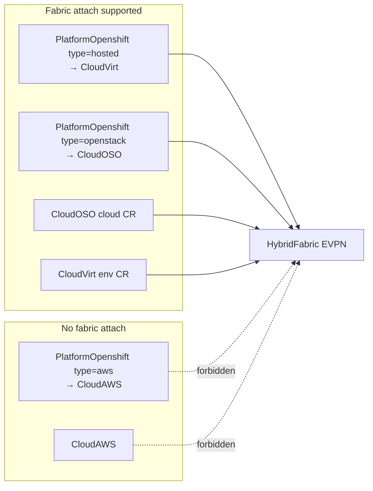

`PlatformOpenshift` CRD fabric fields apply to **hosted** and **openstack** only. This section is the design for making those clusters **aware of fabric configuration** in three complementary ways **when the operator opts in**:

| Mode | When it runs | Who triggers it |
|------|--------------|-----------------|
| **A. Install-time join** | During `platformopenshift-provision` | Cluster create / first Ready |
| **B. Post-install reconcile** | Later reconcile / hourly retry / `reconcileNow` | Fabric or gateway appears after the cluster already exists |
| **C. External tagging** | Explicit admin/tenant intent on the PlatformOpenshift CR | Label / annotation / `spec.fabric` — no automatic join |

All three must end in the same desired state: a **CloudGateway + TransportLink** (or equivalent spoke EVPN prep) binding this cluster into a fabric the Entity can see — and `PlatformOpenshift.status` reflecting membership.

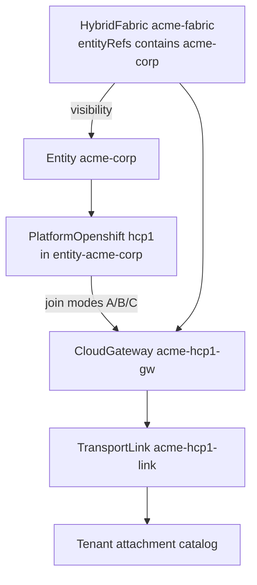

### 15.1 What “aware” means for PlatformOpenshift

The provisioned OCP must not invent VNIs. Awareness means the **control plane on CENTRAL** (operator + Ansible) has associated this cluster with fabric(s) and prepared spoke-side prerequisites:

| Concern | Observed on PlatformOpenshift (design status) | Platform objects created |
|---------|-----------------------------------------------|---------------------------|
| Which fabrics may attach | `status.fabricMembership[].fabric` | — |
| Join phase | `Pending` \| `Joined` \| `Degraded` \| `Skipped` | — |
| Gateway / link | `status.fabricMembership[].cloudGatewayRef` / `transportLinkRef` | `CloudGateway`, `TransportLink` in `sovereign-cloud` |
| Spoke EVPN prep | `status.fabricMembership[].evpnPrepReady` | CNO flags check, FRR-k8s present (full CUDN still on NetworkPlacement) |
| Entity visibility | Catalog lists this backend when membership Joined + link Ready | Projection / ConfigMap |

**Security:** a PlatformOpenshift may only join fabrics where `entityRefs` contains its Entity. Cross-entity fabric join is rejected.

### 15.2 Spec / status contract (design delta)

```yaml
apiVersion: hybridsovereign.redhat/v1alpha1
kind: PlatformOpenshift
metadata:
  name: hcp1
  namespace: entity-acme-corp
  labels:
    # Mode C — external tagging (optional; see §15.5)
    hybridsovereign.redhat/fabric: acme-fabric
  annotations:
    # Force re-evaluate fabric join without recreating the cluster
    ansible.sdk.operatorframework.io/reconcileNow: "true"
spec:
  type: hosted
  hosted:
    environment: local-virt
  # --- fabric awareness (design) ---
  fabric:
    # joinPolicy: how this cluster attaches to entity-visible fabrics
    joinPolicy: AutoWhenFabricReady   # None | AutoWhenFabricReady | ExplicitOnly
    # ExplicitOnly: only fabrics listed here (must ⊆ entity-visible fabrics)
    fabricRefs: []                   # e.g. [acme-fabric]
    # When entity has multiple fabrics and Auto*: which to prefer
    preferredFabricRef: ""           # optional
    # Create CloudGateway+TransportLink automatically (platform NS)
    manageGatewayAndLink: true
    tunnelType: none                 # override; default from HybridFabric.transportDefaults
status:
  entity: acme-corp
  ready: true
  fabricMembership:
    - fabric: acme-fabric
      phase: Joined                  # Pending | Joined | Degraded | Skipped
      cloudGatewayRef: acme-hcp1-gw
      transportLinkRef: acme-hcp1-link
      evpnPrepReady: true
      lastJoinedAt: "2026-09-28T12:00:00Z"
      message: ""
```

| `joinPolicy` | Behavior |
|--------------|----------|
| `None` | Never auto-join; cluster usable without fabric (placements stay blocked until Mode C / manual gateway) |
| `AutoWhenFabricReady` | **Default.** Discover fabrics tagged to this Entity; join when fabric (+ optional preferred) is Ready |
| `ExplicitOnly` | Join only `spec.fabric.fabricRefs[]` (each must be in entity’s `entityRefs`) |

### 15.3 Mode A — Awareness during PlatformOpenshift installation

Runs inside **`platformopenshift-provision`** after the spoke is API-reachable (HCP Ready / kubeconfig in Vault).

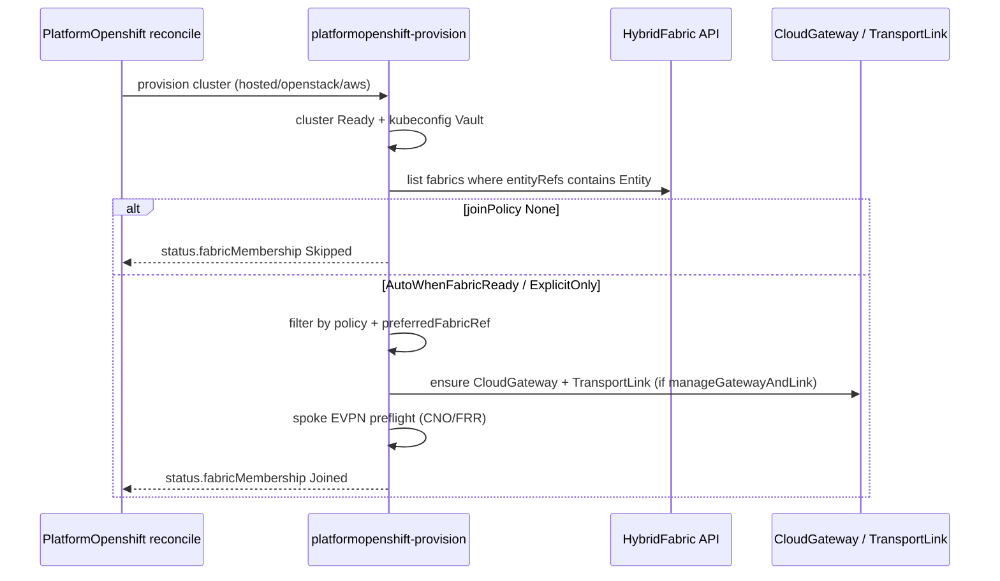

**Ansible tasks (install-time fabric join role: `platform_fabric_join`)**

| Step | Action |
|------|--------|
| 1 | Resolve Entity from PlatformOpenshift namespace / `status.entity` |
| 2 | List Ready `HybridFabric` in `sovereign-cloud` with `entityRefs` containing Entity |
| 3 | Apply `joinPolicy` / `fabricRefs` / `preferredFabricRef` → selected fabric set (often one) |
| 4 | If empty and Auto*: set membership `Pending` (“waiting for fabric tag”), **do not fail** cluster provision |
| 5 | If `manageGatewayAndLink`: idempotently create/update `CloudGateway` (`cloud: openshift`, `platformOpenshiftRef: <name>`, `fabricRef`) and `TransportLink` |
| 6 | Spoke preflight: route advertisements / gatewayConfig / FRR-k8s (record `evpnPrepReady`) |
| 7 | Patch PlatformOpenshift status `fabricMembership[]` |
| 8 | Emit event so tenant attachment catalog refreshes |

**Install-time principle:** cluster success is **not** blocked on fabric absence, EVPN readiness, or CUDN. HCP can become Ready with `fabricMembership.phase=Skipped` (`joinPolicy: None`) or `Pending` (waiting for fabric). When a fabric is later tagged / becomes Ready, Mode B completes the join. Full rule set: **§17**.

### 15.4 Mode B — Reconcile if fabric is added after installation

Typical case: Entity and HCP1 already exist; platform admin later creates `acme-fabric` and adds `acme-corp` to `entityRefs`, or creates the fabric first and tags the Entity afterward.

**Triggers**

| Trigger | Mechanism |
|---------|-----------|
| HybridFabric Ready / `entityRefs` change | Fabric operator annotates related PlatformOpenshift CRs in tagged entity namespaces with `reconcileNow`, **or** watches → enqueue via shared index |
| CloudGateway / TransportLink Ready for this backend | Placement path works; PlatformOpenshift status still refreshed on next reconcile |
| Periodic | Existing `reconcilePeriod` (e.g. 1h) on PlatformOpenshift watch |
| Manual | Annotate PlatformOpenshift `reconcileNow` |

**Reconcile algorithm (`platform_fabric_join` on every successful Ready cluster)**

1. If cluster not Ready → skip fabric join.  
2. Recompute desired fabric set (same as Mode A steps 2–3).  
3. **Diff** desired vs `status.fabricMembership`:  
   - Missing → create gateway/link + prep (join).  
   - Extra (fabric removed from entityRefs or from `fabricRefs`) → **detach** policy: mark membership removed; optionally teardown gateway/link if `manageGatewayAndLink` and no NetworkPlacements reference this backend on that fabric.  
4. If desired fabric exists but gateway/link not Ready → `phase=Pending` / `Degraded` with message.  
5. Never tear down the HostedControlPlane when leaving a fabric — only fabric attachment objects.

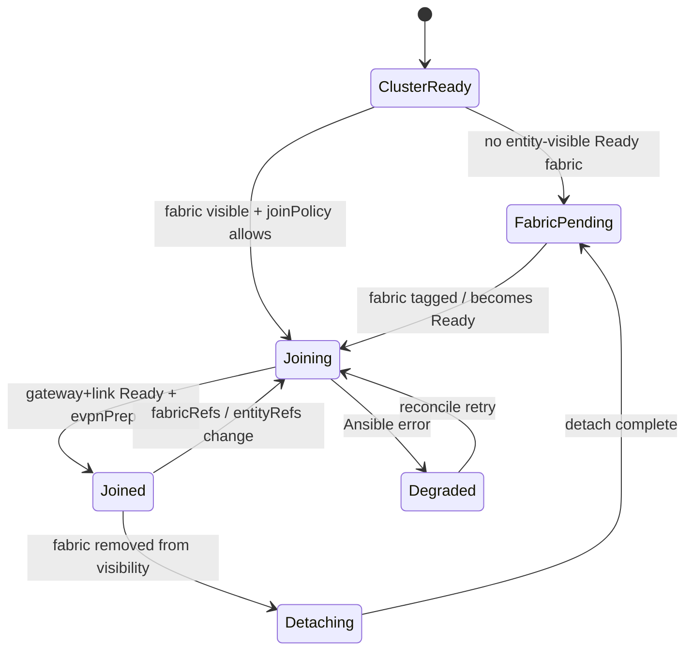

### 15.5 Mode C — External tagging mechanism

Use when auto-join is undesirable (regulated environments, shared multi-entity fabrics, or staged rollout).

**Option C1 — Spec explicit list** (`joinPolicy: ExplicitOnly`)

```yaml
spec:
  fabric:
    joinPolicy: ExplicitOnly
    fabricRefs: [acme-fabric]
    manageGatewayAndLink: true
```

Admin/tenant (with RBAC) sets `fabricRefs` only to fabrics in the Entity’s visibility set. Reconcile (Mode B loop) performs join.

**Option C2 — Label / annotation tagging**

```yaml
metadata:
  labels:
    hybridsovereign.redhat/fabric: acme-fabric
  # multi-fabric (design):
  # hybridsovereign.redhat/fabrics: "acme-fabric,acme-dr-fabric"
```

Ansible treats labels as desired `fabricRefs` when `joinPolicy` is `AutoWhenFabricReady` **or** a dedicated `joinPolicy: LabelDriven`. Labels must still pass the entityRefs membership check (label alone cannot join Chad’s HCP to Acme’s fabric).

**Option C3 — Platform-owned CloudGateway only (no PO spec)**

Admin manually creates `CloudGateway` + `TransportLink` pointing at this PlatformOpenshift (`platformOpenshiftRef`). PlatformOpenshift reconcile **discovers** reverse references and only updates `status.fabricMembership` (read-only awareness). `manageGatewayAndLink: false`.

| Option | Who tags | Cluster mutates gateway/link? |
|--------|----------|-------------------------------|
| C1 spec.fabricRefs | Tenant/platform via CR | Yes if manageGatewayAndLink |
| C2 labels | GitOps / UI tag editor | Yes if policy allows |
| C3 manual gateway | Platform admin only | No — PO status mirrors |

### 15.6 Interaction with HybridNetwork / NetworkPlacement

```text
Entity visibility (HybridFabric.entityRefs)
        │
        ▼
PlatformOpenshift fabricMembership Joined  ←── Modes A/B/C
        │
        ▼
Attachment catalog shows backend hcp1
        │
        ▼
Tenant NetworkPlacement → backend PlatformOpenshift/hcp1
        │
        ▼
Ansible resolves TransportLink from membership / gateway
        │
        ▼
CUDN EVPN / validate on spoke
```

Placement must **fail soft** if `fabricMembership` is missing or not `Joined` (`prerequisiteReady=false`, message: “PlatformOpenshift hcp1 is not joined to a Ready fabric”).

### 15.7 Worked examples

**Acme HCP1 created before fabric**

1. `PlatformOpenshift/hcp1` provisions → Ready, `fabricMembership=[{phase:Pending}]`.  
2. Admin creates `acme-fabric` with `entityRefs: [acme-corp]`.  
3. Fabric operator (or hourly reconcile) requeues hcp1 → Mode B creates gateway/link → `Joined`.  
4. Tenant catalog shows hcp1; placements succeed.

**Acme HCP1 created after fabric Ready**

1. Fabric already tagged to acme-corp.  
2. Mode A during install creates gateway/link before playbook ends → `Joined` on first Ready.  

**Chad HCP2 must not join acme-fabric**

1. Even if someone labels `hybridsovereign.redhat/fabric=acme-fabric` on Chad’s HCP, Ansible rejects: Entity `chad` ∉ `acme-fabric.entityRefs`.  
2. Status `Degraded` / event with clear deny message.

**Entity tagged on two fabrics**

1. `preferredFabricRef: acme-fabric` or ExplicitOnly list picks one for auto gateway.  
2. Second fabric requires Explicit `fabricRefs` or second label entry if multi-join is enabled (`manageGatewayAndLink` creates one gateway per fabric).

### 15.8 Ansible / operator implementation notes

| Component | Responsibility |
|-----------|----------------|
| `platformopenshift-provision` | Call `platform_fabric_join` at end of successful install (Mode A) |
| `platformopenshift` reconcile / kind_reconcile | Always invoke join diff when cluster Ready (Mode B) |
| `hybridfabric-provision` | On Ready / entityRefs change, annotate PlatformOpenshift in tagged entity NS with `reconcileNow` |
| `cloudgateway` / `transportlink` | When `platformOpenshiftRef` set, optional back-ref status on PO |
| Shared role `platform_fabric_join` | Single implementation for A/B/C |

**Idempotency:** gateway name convention `{{ entity }}-{{ platformopenshift.name }}-gw` (e.g. `acme-corp-hcp1-gw`) so re-entry does not duplicate.

### 15.9 UI implications

Dropdown-first create/edit for entity tagging and OCP fabric attach: **§18** (Console plugins + standalone dashboards).

| Surface | Behavior |
|---------|----------|
| PlatformOpenshift create wizard | **JoinPolicySelect** + **FabricSelect** / **FabricMultiSelect** (entity-filtered) |
| PlatformOpenshift detail | Panel **Fabric membership** + action **Attach to fabric…** (same dropdowns) |
| Admin HybridFabric detail | **EntityMultiSelect** for `entityRefs`; “Member clusters” table |
| Tenant catalog / placement | **BackendSelect** dropdown only (Joined + link Up) |

### 15.10 Summary

| Question | Answer |
|----------|--------|
| How does PlatformOpenshift know about fabrics? | Via Entity → `HybridFabric.entityRefs` discovery, plus optional `spec.fabric` / labels. |
| At install? | Mode A: `platform_fabric_join` after cluster Ready; Pending if no fabric yet. |
| After install? | Mode B: reconcile on fabric tag/Ready, `reconcileNow`, or hourly period. |
| External tagging? | Mode C: `ExplicitOnly` + `fabricRefs`, labels, or admin-created CloudGateway with status mirror. |
| Goal | OCP (hosted/openstack) inside an Entity can join fabrics that Entity can see; NetworkPlacement resolves TransportLink. **AWS PlatformOpenshift cannot attach.** |
| Required at install? | **No** for fabric. See §17. AWS is always fabric-free (§15.0). |

---

## 17. PlatformOpenshift install with or without fabric / EVPN / CUDN

### 17.1 Non-negotiable product rule

`kind: PlatformOpenshift` MUST support install **with or without** fabric where fabric is allowed — and **AWS is never fabric-attached**:

| `spec.type` | Standalone install (no fabric) | Fabric / EVPN / CUDN attach |
|-------------|-------------------------------|------------------------------|
| `hosted` (CloudVirt) | **Yes** | **Optional** (§15–§17) |
| `openstack` (CloudOSO) | **Yes** | **Optional** |
| `aws` (CloudAWS) | **Yes** (only path) | **No — not supported** (§15.0) |

For **hosted** and **openstack**:

| Path | Meaning | Cluster becomes Ready? |
|------|---------|------------------------|
| **Standalone** | No HybridFabric, no EVPN, no CUDN | **Yes** — full OCP/HCP install |
| **Fabric-attached** | Joins HybridFabric; EVPN/CUDN available for HybridNetwork placements | **Yes** — same install, plus optional join |

Fabric, EVPN, and CUDN are **additive** for CloudVirt/CloudOSO-backed clusters only — not prerequisites for cluster birth, and **not available** for AWS PlatformOpenshift.

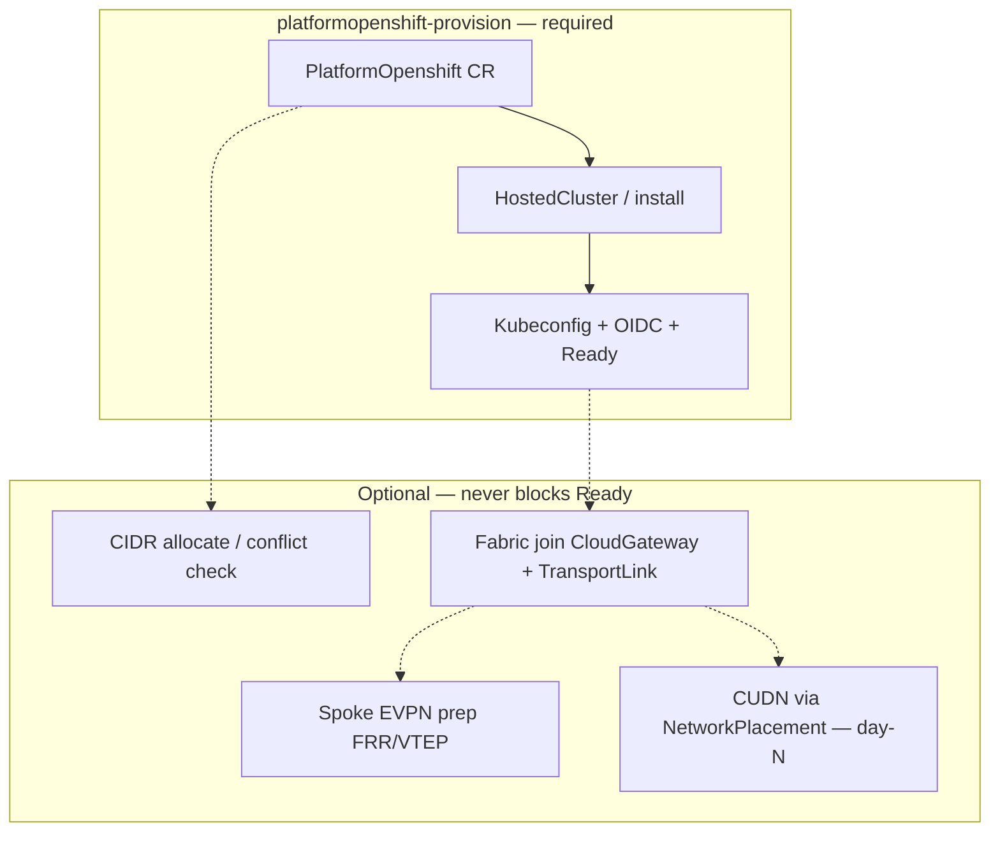

### 17.2 Separation of concerns

| Layer | When | Blocks PlatformOpenshift Ready? | Owner CR |
|-------|------|----------------------------------|----------|
| Cluster install (control plane, workers, kubeconfig, OIDC) | Always | Yes (this *is* Ready) | `PlatformOpenshift` |
| Unique cluster/service CIDRs | Recommended always | Only if `allowConflict: false` **and** hard conflict with an *explicit* peer claim — **not** because fabric is missing | `spec.networking` |
| HybridFabric join | Optional | **Never** | `spec.fabric.joinPolicy` |
| EVPN underlay prep (FRR, VTEP, CNO flags) | Optional, after join | **Never** | join + fabric roles |
| Primary CUDN + HybridNetwork overlay | Optional, tenant day-N | **Never** on PlatformOpenshift | `HybridNetwork` + `NetworkPlacement` |

**CUDN is not created at PlatformOpenshift install.** CUDN appears only when a tenant places a `HybridNetwork` onto that backend (or an explicit platform day-N job). A cluster with no placements has default OVN pod networking only.

### 17.3 Spec knobs (how to choose the path)

```yaml
apiVersion: hybridsovereign.redhat/v1alpha1
kind: PlatformOpenshift
metadata:
  name: hcp-standalone
  namespace: entity-acme-corp
spec:
  type: hosted
  hosted:
    environment: local-virt
  # --- standalone: no fabric ---
  fabric:
    joinPolicy: None              # skip fabric / EVPN / gateway entirely
    manageGatewayAndLink: false
  networking:
    allocateFromFabric: false     # use platform default IPAM pools or explicit CIDRs
    # clusterNetwork: ["10.140.0.0/14"]
    # serviceNetwork: ["172.32.0.0/16"]
```

```yaml
# --- fabric-capable (may join now or later) ---
spec:
  fabric:
    joinPolicy: AutoWhenFabricReady   # or ExplicitOnly
    manageGatewayAndLink: true
  networking:
    allocateFromFabric: true
    fabricRef: acme-fabric            # optional; discover if empty
```

| `fabric.joinPolicy` | Install outcome | Later HybridNetwork placement |
|---------------------|-----------------|-------------------------------|
| `None` | Ready; `fabricMembership=[{phase: Skipped}]` | Blocked until policy changed or Mode C gateway exists |
| `AutoWhenFabricReady` | Ready even if no fabric yet (`Pending`); joins when fabric appears | Allowed after `Joined` + TransportLink Up |
| `ExplicitOnly` | Ready; joins only listed `fabricRefs` that are Ready; otherwise Pending/Skipped per ref | Same |

### 17.4 Ansible contract (must / must-not)

| Phase | Must | Must not |
|-------|------|----------|
| Cluster provision | Create HostedCluster / ACM install; wait Ready; store kubeconfig | Fail because `HybridFabric` missing |
| Cluster provision | Fail only on real install errors (pull secret, capacity, API) | Fail because EVPN CNO flags unset |
| IPAM | Allocate unique CIDRs from fabric pools **or** built-in platform pools when no fabric | Require a Ready HybridFabric to allocate |
| Fabric join | Run `platform_fabric_join` after Ready when policy ≠ None | Roll back or delete the cluster if join fails |
| Fabric join failure | Set `fabricMembership.phase=Degraded` + message; keep `status.ready=true` for the cluster | Flip PlatformOpenshift to failed |
| CUDN | No-op at install | Create `ClusterUserDefinedNetwork` during provision |
| NetworkPlacement (later) | Create CUDN/EVPN objects; require Joined + link | Re-run full PlatformOpenshift install |

### 17.5 Status model for both paths

**Standalone Ready**

```yaml
status:
  ready: true
  message: PlatformOpenshift provisioned
  networking:
    clusterNetwork: ["10.140.0.0/14"]
    serviceNetwork: ["172.32.0.0/16"]
    allocationSource: legacy-default   # or explicit
    conflictCheck: passed
  fabricMembership:
    - fabric: ""
      phase: Skipped
      message: joinPolicy=None
```

**Fabric-attached Ready (joined)**

```yaml
status:
  ready: true
  networking:
    allocationSource: fabric-ipam
    fabricRef: acme-fabric
    conflictCheck: passed
  fabricMembership:
    - fabric: acme-fabric
      phase: Joined
      cloudGatewayRef: acme-corp-hcp1-gw
      transportLinkRef: acme-corp-hcp1-link
      evpnPrepReady: true
```

**Ready but waiting for fabric (valid)**

```yaml
status:
  ready: true
  fabricMembership:
    - fabric: ""
      phase: Pending
      message: No Ready HybridFabric visible to entity; cluster usable standalone
```

### 17.6 Tenant / UI implications

| UI | Standalone cluster | Fabric-joined cluster |
|----|--------------------|------------------------|
| PlatformOpenshift create | Default or toggle “Attach to Hybrid Fabric” off | Toggle on + fabric picker |
| PlatformOpenshift detail | Badge: **Standalone** | Badge: **Fabric: acme-fabric · Joined** |
| Tenant attachment catalog | Backend **absent** (or greyed “not on fabric”) | Backend listed when Joined + link Up |
| HybridNetwork placement | Cannot select this backend until joined | Normal placement → CUDN created |

### 17.7 Lifecycle sequences

**A. Install without fabric**

1. Create `PlatformOpenshift` with `joinPolicy: None` (or no fabric exists).  
2. Provision completes → Ready.  
3. Workloads use default cluster network.  
4. No CloudGateway, TransportLink, CUDN, or EVPN objects.

**B. Install without fabric, attach later**

1. Same as A (or `AutoWhenFabricReady` + Pending).  
2. Admin creates HybridFabric + tags Entity; or sets `fabricRefs` / flips joinPolicy.  
3. Reconcile Mode B joins → gateway/link → catalog shows backend.  
4. Tenant NetworkPlacement creates CUDN/EVPN overlays.

**C. Install with fabric already Ready**

1. `AutoWhenFabricReady` or `ExplicitOnly` with Ready fabric.  
2. After cluster Ready, join runs in same job or follow-up reconcile.  
3. Cluster Ready **and** Joined; placements can proceed.  
4. Still no CUDN until a HybridNetwork is placed.

### 17.8 What “without EVPN / CUDN” means technically

| Component | Without fabric path | With fabric path (after placement) |
|-----------|---------------------|--------------------------------------|
| OVN default pod network | Yes | Yes (unchanged) |
| `ClusterUserDefinedNetwork` primary + `transport: EVPN` | No | Yes — per HybridNetwork placement |
| FRR / VTEP / RouteAdvertisements | Not required | Required on spoke before CUDN EVPN |
| HybridNetwork / NetworkPlacement | N/A | Tenant day-N |
| Inter-site VRF to OSO1 / other HCP | No | Yes via fabric RT/VNI |

### 17.9 Acceptance tests

- [ ] PlatformOpenshift hosted install with `joinPolicy: None` reaches Ready with zero HybridFabric CRs in the cluster.  
- [ ] Same install does not create CloudGateway, TransportLink, CUDN, FRRConfiguration, or VTEP.  
- [ ] PlatformOpenshift with `AutoWhenFabricReady` and no fabric reaches Ready with `fabricMembership.Pending`.  
- [ ] After fabric is tagged and Ready, reconcile moves membership to Joined without recreating the HostedCluster.  
- [ ] NetworkPlacement onto a Skipped/Pending backend fails soft (`prerequisiteReady=false`), not by deleting the OCP.  
- [ ] First successful placement creates CUDN EVPN; deleting the placement removes CUDN without uninstalling PlatformOpenshift.

### 17.10 Summary

| Question | Answer |
|----------|--------|
| Can PlatformOpenshift install without a fabric? | **Yes — required** for hosted/openstack; **AWS is always without fabric**. |
| Can it install without EVPN? | **Yes.** EVPN prep is part of optional join / placement (hosted/openstack only). |
| Can it install without CUDN? | **Yes.** CUDN is created only by HybridNetwork placement (day-N) on fabric-capable backends. |
| Does missing fabric fail the cluster? | **No.** Ready is independent; membership is Skipped or Pending. |
| Does AWS support fabric attach? | **No** — see §15.0. UI hides fabric controls; Ansible skips join. |
| How do you opt in later? | hosted/openstack: change `joinPolicy` / `fabricRefs`, or Mode B when Entity gains a fabric; then place HybridNetworks. |


---

## 16. Address ownership

**Fabric-wide unique, and only these:** VNI / RT (numbering ledger), underlay segments (`HybridFabric.spec.underlay`, each `CloudGateway.spec.siteUnderlay`), and gateway addresses (BGW loopback and underlay address, tunnel addresses, site gateway addresses).

**Per cluster:** pod and service CIDRs are never advertised into the fabric, so choosing them is not a fabric concern. Two constraints apply: (1) HyperShift on KubeVirt — a hosted cluster's pod/service CIDRs must not overlap the hub's; (2) OVN-K — a CUDN subnet must not overlap the cluster's own pod/service CIDRs. **Assumption (CG-NAT):** greenfield deployments select hub and hosted-cluster pod networks and service ranges from the CG-NAT space 100.64.0.0/10 so tenants have the full RFC1918 IPv4 space for overlay (HybridNetwork) prefixes; with that, constraint (2) never fires for an RFC1918 overlay. Clusters that predate the assumption are handled as legacy (Appendix A).

**Per HybridNetwork:** overlay prefixes are unique within one HybridNetwork (VRF) only; different networks, of the same or different tenants, may use identical prefixes.

### 16.1 Cluster CIDRs (`eda/common/tasks/platformopenshift_fabric_ipam.yml`, `eda/common/files/fabric_cluster_ipam.py`)

Candidates, in order: recorded `status.networking` (kept as-is), explicit `spec.networking`, a new block from the default ranges (`CloudVirt.spec.hostedClusterCidrDefaults`, else role vars `po_default_cluster_network_pool` 100.64.0.0/11 /14 and `po_default_service_network_pool` 100.96.0.0/11 /16), or HyperShift defaults when `allocateFromFabric: false`.

| Check | Applies |
|-------|---------|
| No overlap with the hub's cluster/service CIDRs (`network.config.openshift.io/cluster`) | always |
| No overlap with other PlatformOpenshift pod/service CIDRs | role var `po_deny_peer_cidr_overlap` (default true) |
| No overlap between the cluster's own pod and service CIDRs | always |
| **No** check against overlay prefixes | — |

No node blocks are allocated: nodes attach to the fabric underlay, reported in `status.networking.underlay {nadName, cidr}`. CIDRs outside the default ranges are kept and flagged `ipamCondition: LegacyClusterCidrs`. A conflict sets `conflictCheck: failed` and fails the job (unless `allowConflict`); `platform_fabric_join` refuses `Joined` until it passes.

### 16.2 Overlay prefixes (`networkplacement_provision/tasks/main.yml`)

| Rule | Backend |
|------|---------|
| (a) No overlap with other `NetworkPlacement`s of the **same** `HybridNetwork` (`PrefixNetworkOverlap`) | all (CUDN and Neutron) |
| (b) No overlap with the target cluster's pod/service CIDRs or its node underlay (`PrefixClusterOverlap`) | PlatformOpenshift |
| (c) **No** check against other HybridNetworks | — |

### 16.3 Sample PlatformOpenshift

```yaml
apiVersion: hybridsovereign.redhat/v1alpha1
kind: PlatformOpenshift
metadata:
  name: hcp1
  namespace: entity-acme-corp
spec:
  type: hosted
  hosted:
    environment: local-virt
  networking:
    allocateFromFabric: true
    fabricRef: platform-fabric
    # omit clusterNetwork/serviceNetwork to allocate from the default ranges
  fabric:
    joinPolicy: AutoWhenFabricReady
```

---

## 18. UI dropdowns — entity tagging & OCP fabric attach (console + standalone)

### 18.1 Goal

All **entity tagging** and **OpenShift (`PlatformOpenshift`) fabric attach** actions MUST be available as **PatternFly dropdown / multi-select selectors** — not free-text name fields — in both:

| Surface | Package | Audience |
|---------|---------|----------|
| OpenShift Console dynamic plugin (admin) | `ui/packages/admin-console-plugin` | Platform fabric admin |
| OpenShift Console dynamic plugin (tenant) | `ui/packages/tenant-console-plugin` | Tenant network / platform admin |
| Standalone admin SPA | `ui/packages/admin-dashboard` | Same admin flows outside Console |
| Standalone tenant SPA | `ui/packages/tenant-dashboard` | Same tenant flows outside Console |

Shared controls live in `ui/packages/shared` (extend `RbacMultiSelect` patterns into reusable `EntityMultiSelect`, `FabricSelect`, `PlatformOpenshiftSelect`, etc.) so Console plugins and standalone apps render **identical selector UX**.

**Hard rules**

- Options are loaded from live Ready CRs (list API), never hard-coded entity/fabric names.
- Dropdowns show **display name + Ready badge**; values written to CR are resource **names**.
- Cross-entity options are filtered out for tenant surfaces.
- YAML escape hatch remains available; forms are the default path.
- **AWS exclusion (§15.0):** when PlatformOpenshift `type: aws`, do not render fabric-attach dropdowns; gateway/placement selectors never list AWS PlatformOpenshift for EVPN fabric.

### 18.2 Selector inventory (required)

| Selector ID | Type | Writes | Used on |
|-------------|------|--------|---------|
| `EntityMultiSelect` | Multi-select dropdown + chips | `HybridFabric.spec.entityRefs[].name` | Admin create/edit HybridFabric |
| `FabricSelect` | Single-select | `PlatformOpenshift.spec.networking.fabricRef`, `spec.fabric.preferredFabricRef`, gateway `fabricRef`, link `fabricRef`, optional `HybridNetwork.spec.fabricRef` | Admin + tenant (filtered). **Hidden for PlatformOpenshift type=aws** |
| `FabricMultiSelect` | Multi-select | `PlatformOpenshift.spec.fabric.fabricRefs` when `joinPolicy=ExplicitOnly` | PlatformOpenshift create/edit — **hosted / openstack only** |
| `JoinPolicySelect` | Single-select enum | `PlatformOpenshift.spec.fabric.joinPolicy` | PlatformOpenshift create/edit — **hidden when type=aws** (AWS has no fabric attach — §15.0) |
| `PlatformOpenshiftSelect` | Single-select | CloudGateway `platformOpenshiftRef` / backend name | Admin Register CloudGateway; options **type hosted or openstack only** (exclude aws) |
| `BackendSelect` | Single-select (kind + name) | `NetworkPlacement.spec.backend` | Tenant placement; Joined+link-Up; **CloudOSO, CloudVirt, PlatformOpenshift hosted/openstack** — never AWS PlatformOpenshift for fabric EVPN |
| `CloudOSOSelect` / `CloudVirtSelect` | Single-select | Gateway / placement backends | Admin gateway; tenant placement (**fabric-capable backends**) |
| `TransportLinkSelect` | Read-only or single-select (advanced) | Normally **auto-resolved**; optional override in admin advanced panel | Admin Transport Link create uses GatewaySelect instead |
| `CloudGatewaySelect` | Single-select | `TransportLink.spec.cloudGatewayRef` | Admin Create Transport Link |

### 18.3 Admin — HybridFabric entity tagging (dropdown)

**Surfaces:** Console `AdminHybridFabricsPage` / create wizard · Standalone `admin-dashboard` → Fabrics → Create / Edit.

```text
+------------------------------------------------------------------+
|  Entities that may use this fabric *                             |
|  [ EntityMultiSelect ▼ ]                                         |
|    ☑ acme-corp     Ready · NS entity-acme-corp                   |
|    ☐ chad          Ready · NS entity-chad                        |
|    ☐ partner-a     Ready                                         |
|  Selected chips: [ acme-corp × ]                                 |
|  Helper: One entity per fabric recommended for strong isolation. |
+------------------------------------------------------------------+
```

| Behavior | Detail |
|----------|--------|
| Data source | `GET entities.hybridsovereign.redhat` (cluster/namespaced per platform) — only `status.ready=true` (or phase ready) |
| Empty state | “No Ready Entities — create an Entity first” |
| Persist | `spec.entityRefs: [{name: "acme-corp"}, ...]` |
| Edit | Same multi-select; removing an entity blocked in UI if HybridNetworks still bound (call admission / show error from API) |
| Standalone parity | Same component import from `@hybridsovereign/shared` |

### 18.4 Admin / tenant — PlatformOpenshift fabric attach (dropdowns)

**Surfaces:** Console `AdminPlatformDetailPage` / `TenantPlatformDetailPage` / create PlatformOpenshift · Standalone admin + tenant dashboards → Platforms → Create / Edit → **Fabric** step.

**Show this step only when `spec.type` is `hosted` or `openstack`.** If the user selects **AWS**, omit the entire Fabric attachment panel and show a static note: “AWS PlatformOpenshift clusters do not attach to Hybrid Fabric / EVPN / CUDN. Use CloudOSO or CloudVirt-backed OpenShift for fabric networking.”

```text
+------------------------------------------------------------------+
|  Fabric attachment                                               |
|  Join policy   [ JoinPolicySelect ▼  Auto when fabric ready    ] |
|                                                                  |
|  when ExplicitOnly:                                              |
|  Fabrics       [ FabricMultiSelect ▼ ]                           |
|                  ☑ acme-fabric   ASN 65010 · Ready · tagged you  |
|                  ☐ chad-fabric   (disabled — entity not tagged)  |
|                                                                  |
|  when Auto / Explicit:                                           |
|  Preferred     [ FabricSelect ▼  acme-fabric                   ] |
|  IPAM fabric   [ FabricSelect ▼  (same or inherit preferred)   ] |
|                                                                  |
|  ☐ Manage CloudGateway + TransportLink automatically             |
|  Tunnel type   [ none ▼ ]                                        |
+------------------------------------------------------------------+
```

| Behavior | Detail |
|----------|--------|
| Fabric options | Only fabrics where `entityRefs` contains this PlatformOpenshift’s Entity |
| Disabled options | Fabrics that do not tag this entity — visible greyed with tooltip “Entity not tagged on this fabric” |
| `joinPolicy: None` | Hide fabric multi-select; show info “Standalone install — no EVPN/CUDN until attached later” |
| Attach later | Detail page action **Attach to fabric…** opens same dropdowns; patches `spec.fabric` + annotate `reconcileNow` |
| OCP tagging label Mode C | Optional advanced: map `FabricSelect` → label `hybridsovereign.redhat/fabric` |

### 18.5 Admin — CloudGateway / TransportLink dropdowns

```text
Register Cloud Gateway
  Fabric     [ FabricSelect ▼ ]          # Ready fabrics
  Cloud type [ openshift ▼ ]
  Backend    [ PlatformOpenshiftSelect ▼ ]  # Ready POs in entities tagged on selected fabric
             or [ CloudOSOSelect ▼ ] / [ CloudVirtSelect ▼ ]

Create Transport Link
  Fabric     [ FabricSelect ▼ ]
  Gateway    [ CloudGatewaySelect ▼ ]    # gateways for that fabric, Ready landing zone
  Tunnel     [ none | wireguard | … ▼ ]
```

Backend dropdown **re-filters** when Fabric changes. Selecting a PlatformOpenshift that is not yet Joined is allowed (gateway create can drive join); show warning chip “Cluster fabricMembership Pending”.

### 18.6 Tenant — placement & catalog (dropdowns only)

```text
Place Hybrid Network
  Fabric (if entity has >1)  [ FabricSelect ▼ ]
  Backend kind               [ PlatformOpenshift | CloudOSO | CloudVirt ▼ ]
  Backend                    [ BackendSelect ▼ ]   # only catalog rows: Joined + TransportLink Up
  Prefixes                   CIDR fields
  Transport (read-only)      acme-hcp1-link · Up     # resolved, not a free-text field
```

Standalone `tenant-dashboard` uses the same `BackendSelect` against the attachment catalog API/ConfigMap projection.

### 18.7 Shared component API (implementation sketch)

```tsx
// ui/packages/shared — reuse across console plugins + standalone
<EntityMultiSelect
  value={entityRefs}                 // string[]
  onChange={setEntityRefs}
  readyOnly
/>
<FabricSelect
  entityName={entity}                // filter entityRefs membership
  value={fabricRef}
  onChange={setFabricRef}
  readyOnly
/>
<FabricMultiSelect entityName={entity} value={fabricRefs} onChange={...} />
<JoinPolicySelect value={joinPolicy} onChange={...} />
<PlatformOpenshiftSelect
  entityNamespace={ns}
  fabricRef={fabricRef}              // optional further filter
  value={name}
  onChange={...}
  readyOnly
/>
```

Map to CR on submit (no raw typing of CR names in required fields).

### 18.8 Console plugin vs standalone wiring

| Concern | Console plugins | Standalone dashboards |
|---------|-----------------|------------------------|
| Auth | Console SSO / SAR | Same Keycloak / kubeconfig stack already used by dashboards |
| Routing | `console-extensions.json` pages | React Router in `admin-dashboard` / `tenant-dashboard` `App.tsx` |
| Forms | Embed shared selectors in create/edit pages | Same shared selectors in dashboard create routes |
| Lists | PF tables in plugin pages | Same tables or thin wrappers |
| Feature flag | Optional `hybridVpcSelectors: true` until CRD fields ship | Same flag via dashboard config |

**Do not** implement entity/fabric attach as YAML-only in one surface and dropdowns in the other — parity is required.

### 18.9 Page / route checklist

| Action | Console admin plugin | Console tenant plugin | Standalone admin | Standalone tenant |
|--------|----------------------|-----------------------|------------------|-------------------|
| Tag fabric → entities | HybridFabric create/edit `EntityMultiSelect` | — (read-only fabric summary) | Same | — |
| Attach OCP → fabric | Platform create/edit + detail “Attach” | Platform create/edit (own NS) + detail | Same | Same |
| Gateway backend OCP | `PlatformOpenshiftSelect` | — | Same | — |
| Placement backend | — | `BackendSelect` dropdown | — | Same |
| Join policy | Dropdown on Platform form | Dropdown on Platform form | Same | Same |

### 18.10 Validation & empty / error copy

| Condition | Dropdown UX |
|-----------|-------------|
| No Ready Entities | EntityMultiSelect disabled + link “Create Entity” |
| No fabrics tag this entity | FabricSelect empty: “Ask platform admin to tag your Entity on a HybridFabric” |
| joinPolicy None | Fabric selectors hidden |
| Selected fabric not Ready | Option badge Not Ready; submit blocked |
| PlatformOpenshift not Joined | BackendSelect omits it for tenants; admin gateway select shows warning |
| IPAM / conflict failed | Show status.networking.conflictMessage near FabricSelect |

### 18.11 Acceptance tests (UI)

- [x] Admin can tag one or more Entities on HybridFabric **only** via EntityMultiSelect (no required free-text entity field).  
- [x] PlatformOpenshift create exposes JoinPolicySelect + FabricSelect/MultiSelect for **hosted/openstack**; **AWS hides fabric controls** (§15.0).  
- [x] Tenant BackendSelect lists only CloudOSO / CloudVirt / fabric-joined hosted|openstack PlatformOpenshift — never AWS PlatformOpenshift for EVPN placement.  
- [x] Identical selector behavior in Console plugins and standalone admin/tenant dashboards (shared package).  
- [x] Changing FabricSelect re-filters PlatformOpenshiftSelect / BackendSelect options without page reload.

### 18.12 Summary

| Need | UI answer |
|------|-----------|
| Entity tagging on fabric | **EntityMultiSelect** dropdown on HybridFabric create/edit (console + standalone admin) |
| OCP attach to fabric | **JoinPolicySelect** + **FabricSelect** / **FabricMultiSelect** on PlatformOpenshift **hosted/openstack only** (console + standalone); **AWS: no fabric UI** |
| Gateway / placement binding | **PlatformOpenshiftSelect** (non-AWS) / **CloudOSOSelect** / **CloudVirtSelect** / **BackendSelect** — never free-text CR names; never AWS for fabric EVPN |
| Parity | Shared components in `ui/packages/shared` consumed by `*-console-plugin` and `*-dashboard` |

---

## 19. Creation, entity tagging & tenant visibility

Operational guide: how admins create fabrics/gateways/links, tag fabrics to Entities, and how tenants discover attachment points for HybridNetwork / NetworkPlacement (TransportLink auto-resolved).

### 19.1 Roles and namespaces (who owns what)

| Actor | Console | Can create | Can view |
|-------|---------|------------|----------|
| Platform fabric admin | Admin plugin (`sovereign-cloud`) | `HybridFabric`, `CloudGateway`, `TransportLink` | All fabrics / gateways / links |
| Tenant network admin | Tenant plugin (`entity-*`) | `HybridNetwork`, `NetworkPlacement` | **Projected** attachment catalog for *their* entity only; read-only fabric summary |
| Tenant viewer | Tenant plugin | — | HybridNetwork detail (if `networkViewerRbac`) |

**Critical UX rule:** tenants never create or edit `TransportLink`. They choose a **backend** (HCP / CloudOSO / CloudVirt). The platform **resolves** gateway + transport link from that backend + the entity’s fabric binding.

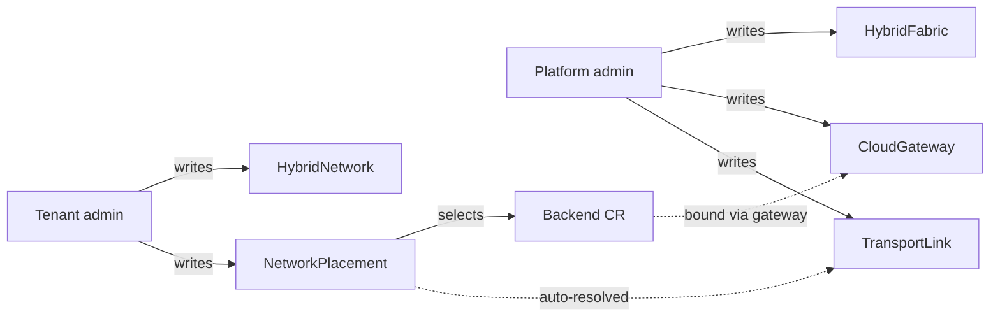

---

### 19.2 End-to-end creation sequence

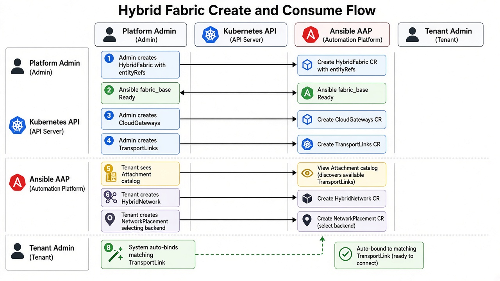

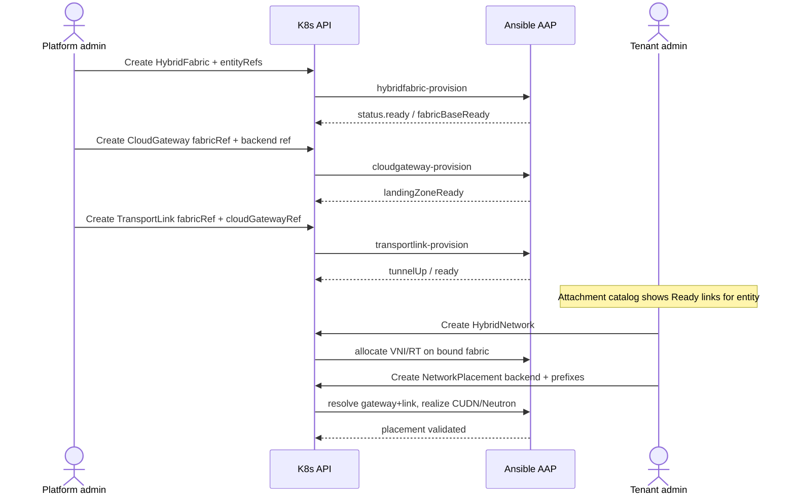

#### 2.1 Step A — Admin creates `HybridFabric`

**Where:** Admin console → Hybrid Fabrics → Create (or GitOps YAML in `sovereign-cloud`).

**What the admin supplies**

| Field | Purpose |
|-------|---------|
| `metadata.name` | Fabric identity (e.g. `acme-fabric`) |
| `spec.enabled` | Activate numbering / RR intent |
| `spec.domainAsn` | Fabric ASN (unique) |
| `spec.routeReflectors[]` | CENTRAL hub RR addresses |
| `spec.vniPool` | Platform-owned VNI range |
| `spec.transportDefaults` | MTU, default tunnel type |
| **`spec.entityRefs[]`** *(design)* | **Which Entities may consume this fabric** |

Ansible (`fabric_base` / `border_bgw`) brings the fabric to Ready. Until Ready, gateways/links should refuse attach (UI disables Next; Ansible preflight fails).

#### 2.2 Step B — Admin creates `CloudGateway`(s)

One gateway per spoke attachment (e.g. HCP1, OSO1).

| Field | Purpose |
|-------|---------|
| `spec.fabricRef` | Must reference a Ready fabric |
| `spec.cloud` | `openshift` \| `openstack` \| … |
| `spec.domainAsn` | Fabric ASN (per-spoke ASNs retired 2026-10-07) |
| `spec.openstackCloudOSORef` / Virt / PlatformOpenshift refs | Which backend this gateway fronts |
| Labels `hybridsovereign.redhat/entity` | Optional denormalized entity hint |

**Admission:** gateway’s backend must belong to an Entity listed on the fabric’s `entityRefs` (see §3). Otherwise create is rejected.

#### 2.3 Step C — Admin creates `TransportLink`(s)

Binds a gateway into the fabric’s control/data plane.

| Field | Purpose |
|-------|---------|
| `spec.fabricRef` | Same fabric as gateway |
| `spec.cloudGatewayRef` | Target gateway |
| `spec.tunnelType` | `none` (lab adjacency) or `wireguard` / `ipsec` / `macsec` |
| `spec.vaultConfigRef` | Required when tunnel ≠ `none` |

When `status.ready` / `tunnelUp` is true, the attachment point becomes **eligible for tenant placements**.

#### 2.4 Step D — Tenant creates `HybridNetwork` then `NetworkPlacement`

Tenant does **not** pick a TransportLink name in the happy path.

1. Create `HybridNetwork` (name + description).  
2. Platform allocates VNI/RT from a fabric bound to that entity (`status.fabric`, `status.vni`, …).  
3. Create `NetworkPlacement` with `backend.kind/name` + `prefixes`.  
4. Ansible resolves: backend → CloudGateway → Ready TransportLink → realize CUDN EVPN or RHOSO native OVN `--evpn-vni` Type-5.

---

### 19.3 Tagging a Hybrid Fabric to one or more Entities

Today’s shipped `HybridFabric` CRD has **no** `entityRefs` field yet. This section is the **design contract** to implement (CRD + UI + Ansible admission).

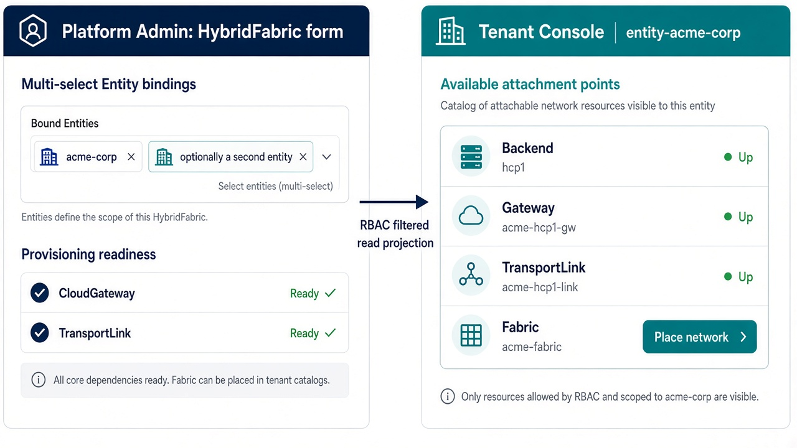

#### 3.1 Why multi-entity tagging exists

| Pattern | Example | When to use |
|---------|---------|-------------|
| **1 fabric : 1 entity** | `acme-fabric` → `[acme-corp]` | Default strong isolation (Acme vs Chad) |
| **1 fabric : N entities** | `shared-dmz-fabric` → `[acme-corp, partner-a]` | Controlled shared VPN domain (same ASN/VNI pool) — rare; security review required |
| **N fabrics : 1 entity** | `acme-prod-fabric`, `acme-dr-fabric` → both tag `acme-corp` | Prod vs DR / dual region |

Chad must **not** appear on `acme-fabric.entityRefs`, and Acme must **not** appear on `chad-fabric.entityRefs`, for the lab isolation story.

#### 3.2 Spec shape (design)

```yaml
apiVersion: hybridsovereign.redhat/v1alpha1
kind: HybridFabric
metadata:
  name: acme-fabric
  namespace: sovereign-cloud
spec:
  enabled: true
  domainAsn: 65010
  vniPool:
    start: 51000
    end: 51127
  routeReflectors:
    - name: central-rr-a
      address: 10.255.10.1
  # --- entity tagging (design delta) ---
  entityRefs:
    - name: acme-corp          # Entity.metadata.name in sovereign-cloud
    # - name: partner-a        # optional second consumer
  # Optional default when entity has multiple fabrics:
  # primaryForEntities: [acme-corp]
```

**Also set labels** (for list/watch filters and GitOps):

```yaml
metadata:
  labels:
    hybridsovereign.redhat/entity: acme-corp           # primary / first ref
    # multi-value via additional labels or only entityRefs in spec
```

For multi-entity fabrics, prefer **`spec.entityRefs[]` as source of truth**; labels may only carry the primary entity for column display.

#### 3.3 Admin UI — bind Entities

**Create / Edit Hybrid Fabric → step “Entity access”**

```text
+------------------------------------------------------------------+
|  Hybrid Fabric: acme-fabric                                      |
|  Step 2 of 4 — Entity access                                     |
+------------------------------------------------------------------+
|  Entities that may use this fabric                               |
|                                                                  |
|  [x] acme-corp          Entity Ready · NS entity-acme-corp       |
|  [ ] chad               Entity Ready · NS entity-chad            |
|  [ ] partner-a          Entity Ready                             |
|                                                                  |
|  Selected: acme-corp                                             |
|                                                                  |
|  ! Security: every selected entity shares this ASN and VNI pool. |
|    Prefer one entity per fabric unless a shared VRF is intended. |
|                                                                  |
|  [Back]                                    [Next: Route reflectors]|
+------------------------------------------------------------------+
```

**Operations**

- Add entity → append to `entityRefs` → reconcile; tenant catalog for that entity gains this fabric’s Ready links.  
- Remove entity → blocked if that entity still has HybridNetworks with `status.fabric == this fabric` and active placements.  
- Ansible validates each `entityRefs[].name` resolves to an existing `Entity` CR.

#### 3.4 Admission rules (platform)

| Action | Rule |
|--------|------|
| Create CloudGateway | Backend’s entity ∈ fabric.`entityRefs` |
| Create TransportLink | Gateway’s fabricRef fabric contains entity of gateway’s backend |
| Create HybridNetwork | Entity NS maps to Entity name ∈ at least one Ready fabric’s `entityRefs` |
| Create NetworkPlacement | Backend entity ∈ fabric used by parent HybridNetwork; Ready TransportLink exists for that backend |

---

### 19.4 How the tenant sees fabrics / links (without managing them)

Tenants need enough visibility to **choose the right placement**, but not enough to mutate hub RR or tunnels.

#### 4.1 Attachment catalog (projected read model)

The tenant console exposes a **read-only catalog** computed for `entity-<name>`:

| Column | Source |
|--------|--------|
| Fabric | `HybridFabric` where `entityRefs` contains this entity **and** `status.ready` |
| Gateway | `CloudGateway` with `fabricRef` + backend in this entity NS |
| Transport link | `TransportLink` for that gateway with `status.ready` / `tunnelUp` |
| Backend | Resolved `PlatformOpenshift` / `CloudOSO` / `CloudVirt` name + Ready |
| Tunnel type | From TransportLink (informational) |
| Place | CTA → Placement wizard pre-filled with that backend |

```text
Tenant console · entity-acme-corp · Hybrid networking
+--------------------------------------------------------------------------------+
| Attachment points (platform-managed — read only)              [Refresh]        |
+----------------+------------------+------------------+----------+--------------+
| Fabric         | Backend          | Gateway          | Link     | Tunnel       |
| acme-fabric ●  | PlatformOpenshift| acme-hcp1-gw     | ● Up     | none         |
|                | /hcp1            |                  | hcp1-link |              |
| acme-fabric ●  | CloudOSO/oso1    | acme-oso1-gw     | ● Up     | none         |
|                |                  |                  | oso1-link |              |
+----------------+------------------+------------------+----------+--------------+
| Chad rows never appear here — chad-fabric.entityRefs excludes acme-corp.       |
+--------------------------------------------------------------------------------+
| Your Hybrid Networks                                          [+ Create]       |
| acme-core · VNI 51001 · RT 65010:51001 · fabric acme-fabric · 2 placements     |
+--------------------------------------------------------------------------------+
```

**RBAC implementation options** (pick one in implementation):

1. **Aggregated API / proxy** — tenant UI calls a platform service that lists `sovereign-cloud` CRs filtered by entity; tenants have no direct list on `HybridFabric`.  
2. **Role binding** — ClusterRole allowing `get/list/watch` on HybridFabric/CloudGateway/TransportLink **only** via label selector `hybridsovereign.redhat/entity in (acme-corp)` (weaker for multi-entityRefs; prefer option 1).  
3. **Copied ConfigMap** — Ansible writes `entity-acme-corp/fabric-attachments` ConfigMap on gateway/link Ready; tenant reads ConfigMap in own NS (GitOps-friendly, eventual consistency).

Recommended: **(1) or (3)** so tenants never need cluster-scoped fabric RBAC.

#### 4.2 Placement wizard — selecting the “right” transport link

Tenant flow:

1. Open Hybrid Network → **Add placement** (or from catalog **Place**).  
2. Wizard shows only backends that appear in the attachment catalog with **Link ● Up**.  
3. Tenant picks **backend** + **prefixes** (not link name).  
4. On create, `NetworkPlacement` stores backend only.  
5. Ansible / operator fills status:

```yaml
status:
  cloudGatewayRef: acme-hcp1-gw
  transportLinkRef: acme-hcp1-link
  prerequisiteReady: true
  fabricApplied: true
  backendApplied: true
  validated: true
```

Detail page shows the resolved link so the tenant can **verify** which transport was used:

```text
Placement acme-core-hcp1
  Backend:     PlatformOpenshift/hcp1
  Fabric:      acme-fabric          (from HybridNetwork.status.fabric)
  Gateway:     acme-hcp1-gw         (resolved)
  Transport:   acme-hcp1-link ● Up  (resolved)
  Prefixes:    10.110.0.0/24
```

If two links somehow match (misconfiguration), Ansible fails closed: `prerequisiteReady=false`, message `ambiguous transport for backend hcp1`.

#### 4.3 Multiple fabrics for one entity

If `acme-corp` is tagged on **two** Ready fabrics:

| UI behavior | Detail |
|-------------|--------|
| Create HybridNetwork | Wizard asks **which fabric** (required) when `len(fabrics)>1` |
| Spec design | `HybridNetwork.spec.fabricRef` *(delta)* or annotation `hybridsovereign.redhat/fabric` |
| Catalog | Group attachment rows by fabric |
| Default | If fabric has `primaryForEntities` containing this entity, preselect it |

Single-fabric entities skip the fabric picker (auto-bind).

#### 4.4 What tenants must never see / edit

| Hidden or read-only | Why |
|---------------------|-----|
| RR addresses, BGW Vault refs | Hub trust boundary |
| VNI pool start/end editors | Numbering authority |
| Editable VNI / RT on HybridNetwork | Isolation integrity |
| Create/Delete TransportLink | Platform day-0 only |
| Other entities’ catalogs | Multi-tenant confidentiality |

---

### 19.5 Worked example — Acme vs Chad

#### 5.1 Admin day-0

1. Tag `acme-fabric.entityRefs = [acme-corp]`.  
2. Create gateways + links for HCP1 and OSO1.  
3. Tag `chad-fabric.entityRefs = [chad]`.  
4. Create gateways + links for HCP2 and HCP3 only.

#### 5.2 Tenant acme-corp

- Catalog shows **two** rows: hcp1 + oso1 (both `acme-fabric`).  
- Creates `HybridNetwork/acme-core` → allocated on `acme-fabric`.  
- Places onto `hcp1` then `oso1` → status shows each resolved TransportLink.  
- Never sees Chad links.

#### 5.3 Tenant chad

- Catalog shows **only** hcp2 + hcp3.  
- Cannot select `CloudOSO/oso1` (not in catalog; admission would reject).  

#### 5.4 Shared fabric (optional advanced)

```yaml
spec:
  entityRefs:
    - name: acme-corp
    - name: partner-a
```

Both tenants see the **same** fabric’s attachment points that map to backends in **their** NS only. Partner cannot place onto Acme’s `hcp1` because that backend CR lives in `entity-acme-corp`.

---

### 19.6 CR / API deltas checklist (implementation)

| Item | Change |
|------|--------|
| `HybridFabric.spec.entityRefs[]` | `{ name: string }[]` — required for tenant consume |
| `HybridFabric.spec.primaryForEntities[]` | optional defaults |
| `HybridNetwork.spec.fabricRef` | required when entity has >1 fabric |
| `NetworkPlacement.status.cloudGatewayRef` / `transportLinkRef` | already in CRD — Ansible must populate |
| Admin UI | Entity multi-select on fabric create/edit |
| Tenant UI | Attachment catalog + placement wizard filter |
| RBAC / projection | Service or ConfigMap mirror (§4.1) |
| Ansible | Enforce entityRefs on gateway, link, network, placement |

---

### 19.7 Failure & empty states (copy)

| State | Message |
|-------|---------|
| Fabric has empty `entityRefs` | “Bind at least one Entity before tenants can place networks.” |
| Gateway backend entity ∉ fabric | “Backend entity is not tagged on fabric {name}.” |
| No Ready TransportLink | “No attachment point for this backend yet — ask platform admin to create a Transport Link.” |
| Tenant catalog empty | “Your entity is not tagged on any Ready Hybrid Fabric.” |
| Ambiguous link | “Multiple Ready Transport Links match this backend; platform must leave exactly one.” |

---

### 19.8 Summary

| Question | Answer |
|----------|--------|
| Who creates fabrics / gateways / links? | **Platform admin** in `sovereign-cloud`, in order Fabric → Gateway → TransportLink; Ansible marks Ready. |
| How is a fabric tagged to entities? | **`spec.entityRefs[]`** (design) — one or many Entity names; admin multi-select; labels optional. |
| How does a tenant pick the right transport? | Tenant picks a **Ready backend** from an **attachment catalog** filtered by entityRefs; system **auto-resolves** `cloudGatewayRef` + `transportLinkRef` onto placement status. |

For EVPN/CUDN realization and Ansible task tables per layer, see [`fabric.md`](#1-executive-intent).

---

## 20. Talk-show: EVPN fabric live demo & test procedure

**Audience cue:** 25–35 minute technical talk-show segment.  
**Hosts:** Platform engineer (control plane) + Network engineer (packets).  
**Lab snapshot:** 2026-09-30T13:22Z UTC on hub `cluster-zznqw`, spokes HCP1/2/3, RHOSO `cluster-c254x` FR6.

This section is both a **rehearsal script** and a **repeatable test procedure**. Lines marked **LIVE** are results from the lab run that authored this section.

### 20.1 Cold open (60 seconds)

> **Host A:** “Two tenants. One shared underlay. Zero shared VRFs.”  
> **Host B:** “Tonight we prove Hybrid Fabric EVPN the hard way — with ping.”

Show the one-slide topology:

| Fabric | ASN | VNI (this lab) | Sites | Overlay prefixes |
|--------|-----|----------------|-------|------------------|
| `acme-fabric` | 65010 | **51000** | HCP1 + OSO1 | `10.110.0.0/24` + `10.110.1.0/24` |
| `chad-fabric` | 65020 | **52000** | HCP2 + HCP3 | `10.120.0.0/24` + `10.120.1.0/24` |

**LIVE — Sovereign Ready columns**

```text
acme-fabric / chad-fabric                  Ready
acme-hcp1-gw, acme-oso1-gw                 Ready (FR6 landing + spokeASN 65012)
acme-oso1-link                             Ready (RR peers 10.255.10.1,10.255.10.2)
acme-core-hcp1 / acme-core-oso1            Ready backendApplied=true vni=51000
chad-app-hcp2 / chad-app-hcp3              Ready backendApplied=true vni=52000
```

### 20.2 Act I — “The platform already did day-0”

**Story beat:** Admin created fabrics → gateways → links → networks → placements. Tenants never typed a VNI.

**Test procedure (control plane)**

1. On hub: `oc get hybridfabric,cloudgateway,transportlink -n sovereign-cloud`  
2. `oc get hybridnetwork,networkplacement -A` — confirm disjoint VNIs (`51000` vs `52000`) and `canonicalRt` (`65010:51000` vs `65020:52000`).  
3. Open AAP job URLs from CR status — show FR6 probe message on `acme-oso1-gw`.

**Pass criteria:** every Acme/Chad fabric object `Ready=true`; OSO gateway message cites `--evpn-vni` / FR6; no tenant CR contains a writable VNI field.

**LIVE:** Pass.

### 20.3 Act II — “Turn the CNO key” (HCP EVPN prerequisites)

**Story beat:** CUDNs existed for days with `EVPN feature is not enabled`. EVPN is not magic — CNO must opt in.

**Test procedure (each HCP)**

```bash
oc patch network.operator cluster --type=merge -p '{
  "spec": {
    "additionalRoutingCapabilities": { "providers": ["FRR"] },
    "defaultNetwork": {
      "ovnKubernetesConfig": {
        "gatewayConfig": { "routingViaHost": true, "ipForwarding": "Global" },
        "routeAdvertisements": "Enabled"
      }
    }
  }
}'
```

Wait until `openshift-frr-k8s` DaemonSet is Ready, then create:

1. **Unmanaged `VTEP`** with `cidrs: [<HybridFabric spec.underlay.cidr>]` (192.168.64.0/18): the VTEP is each worker's eth1 on the hub underlay (NodePool `additionalNetworks`, DHCP from the BGW). No dummy `evpn-vtep0`, no pinned routes, no WireGuard pods.  
2. **`FRRConfiguration`** with one neighbor: the BGW loopback (`10.255.10.10`, fabric ASN 65010, iBGP, `ebgp-multihop 32` via raw config, `l2vpn evpn` + `ipv4 unicast` activated). No `bgp router-id`, `update-source` or `allowas-in`.  
3. **`RouteAdvertisements`** selecting `evpn: "true"` FRR + CUDN labels (unchanged)  

Namespace for probes **must be created with** both:

- `hybridsovereign.redhat/hybridnetwork: <network>`  
- `k8s.ovn.org/primary-user-defined-network: ""`  

(the primary-UDN label cannot be added later — ValidatingAdmissionPolicy enforces create-time only.)

**Pass criteria:** `ClusterUserDefinedNetwork` shows `TransportAccepted=True` and `NetworkCreated=True`; `oc get vtep` → `Accepted=True Reason=Allocated`; `RouteAdvertisements` → `Accepted`.

**LIVE:** Pass on HCP1/2/3 after CNO patch + VTEP/FRR/RA apply.  
**Note:** RH documents primary CUDN EVPN as **bare-metal only**; virt/HCP is best-effort (design §10.1).

### 20.4 Act III — Acme IP-VRF on stage (positive, same site)

**Story beat:** Two pods walk onto HCP1 wearing the Acme jersey (`10.110.0.0/24`).

**Test procedure**

```bash
# Primary UDN IP is NOT always status.podIP — read the annotation:
oc get pod -n acme-core-probe evpn-probe-a \
  -o jsonpath='{.metadata.annotations.k8s\.ovn\.org/pod-networks}' | jq .
# Look for role=primary → e.g. 10.110.0.5/26 on interface ovn-udn1

oc exec -n acme-core-probe evpn-probe-a -- ping -c 3 <peer-primary-udn-ip>
```

**Pass criteria:** 0% loss on primary UDN addresses inside `10.110.0.0/24`.

**LIVE:**

```text
Acme HCP1: 10.110.0.5 → 10.110.0.7   3/3 replies (avg ~6.5 ms)   PASS
```

### 20.5 Act IV — Chad dual-HCP (positive intra, cliffhanger cross-site)

**Story beat:** Chad gets the same treatment on two clusters — same VNI `52000`, different site prefixes.

**Test procedure**

1. Intra HCP2: ping within `10.120.0.0/24`  
2. Intra HCP3: ping within `10.120.1.0/24`  
3. Cross HCP2→HCP3: ping `10.120.1.x` from HCP2  

**Pass criteria:** (1)(2) pass; (3) passes only when hub RR reflects Type-5 for `chad-fabric`.

**LIVE (retest 2026-09-30 ~16:30Z):** Hub RR + **WireGuard VTEP underlay PASS**. Acme HCP1 cross-node UDN **PASS**. Chad HCP2↔HCP3 UDN **PASS** on BGP-active nodes (SNAT collapses per-HCP workers to one BGP TCP 5-tuple toward Chad RR :1179 — second worker stays Idle; schedule probes on Established nodes). Vault `hybridsovereign/fabric/wireguard/hub` written; HCP TransportLinks flipped to `tunnelType: wireguard` + `vaultConfigRef`. OSO WG deferred (gateway `192.168.4.77` not reachable from CENTRAL for UDP/51820).
**Talk-show line:** “Same VNI, different sites — CENTRAL RR now tells the Type-5 story; the remaining cliffhanger is VTEP underlay reachability for the data plane.”

### 20.6 Act V — Isolation cold open (negative probes)

**Story beat:** The applause is the silence — Chad must not hear Acme.

**Test procedure**

```bash
# From Chad HCP2 primary UDN, ping Acme HCP1 primary UDN
oc exec -n chad-app-probe evpn-probe-a -- ping -c 3 <acme-udn-ip>   # expect 100% loss
# From Acme HCP1, ping Chad HCP2 primary UDN
oc exec -n acme-core-probe evpn-probe-a -- ping -c 3 <chad-udn-ip>   # expect 100% loss
```

**Pass criteria:** 100% packet loss both directions; no shared RT import.

**LIVE:**

```text
Chad2 10.120.0.9 → Acme 10.110.0.5    0/2 received   PASS (isolated)
Acme  10.110.0.5 → Chad2 10.120.0.7   0/3 received   PASS (isolated)
```

### 20.7 Act VI — RHOSO FR6 cameo (OSO1)

**Story beat:** Cut to OpenStack — native OVN BGP-EVPN, not the deprecated agent.

**Test procedure**

```bash
openstack router show acme-core-oso1-evpn-rtr -c id -c evpn_vni -c status
# Expect evpn_vni == HybridNetwork.status.vni (51000)
openstack network show acme-core-oso1
openstack subnet show acme-core-oso1-subnet-0 -c cidr   # 10.110.1.0/24
```

Optional packet proof (when hub RR + underlay VTEP reachability exist):

1. Boot a VM (or hold a port) on `acme-core-oso1`  
2. From HCP1 UDN pod: `ping` / `traceroute` to `10.110.1.x`  
3. Confirm path stays inside VNI `51000` / RT `65010:51000`

**LIVE (retest 2026-09-30 ~15:40Z):** Neutron EVPN router ACTIVE `evpn_vni: 51000`. Hub RR control plane **PASS**: Acme spokes Established to `10.10.10.10/11:179`, Type-5 `10.110.0.0/26`+`10.110.0.64/26` reflected (AS-path via hub `65010`). Chad uses separate hub RR pods on **:1179** (SNAT 5-tuple collision on :179). Cross-node / cross-site **dataplane** still **BLOCKED** — VTEP `/32` underlay (e.g. `10.255.11.11`↛`10.255.11.12`) is not forwarded between workers; BGP VRF routes install but VXLAN outer dest is unreachable. HCP1→`10.110.1.1` OSO likewise waits on VTEP underlay.

### 20.8 Act VII — Scoreboard & encore checklist

| Scene | Probe | Result (retest 2026-09-30 15:40Z) |
|-------|-------|-------------------------------------|
| I | Fabric / gateway / link / placement Ready | **PASS** (`hubRrReady=true`) |
| II | CNO FRR + RA + VTEP/CUDN Accepted | **PASS** |
| III | Acme HCP1 intra UDN (same node) | **PASS** (`10.110.0.5↔.7`) |
| III | Acme HCP1 cross-node UDN | **PASS** (WireGuard VTEP underlay) |
| III | Acme Type-5 BGP reflection | **PASS** |
| IV | Chad intra HCP2 / HCP3 | **PASS** |
| IV | Chad Type-5 BGP reflection HCP2↔HCP3 | **PASS** (`:1179` Chad RR) |
| IV | Chad HCP2 ↔ HCP3 dataplane | **PASS** (WireGuard; BGP node endpoints) |
| V | Chad ↛ Acme / Acme ↛ Chad | **PASS** |
| VI | OSO FR6 `--evpn-vni` object | **PASS** (ACTIVE) |
| VI | HCP1 ↔ OSO1 traceroute | **BLOCKED** (VTEP underlay) |

**Encore (unblock dataplane)**

1. ~~Deploy managed hub FRR pods~~ — **done** (Acme `:179` + Chad `:1179`).  
2. ~~Spoke BGP sessions + Type-5 reflection~~ — **done** (ebgp-multihop rawConfig, allowas-in 1, hub prepends ASN, FRR 10.3.1).  
3. **VTEP underlay (WireGuard):** hub–spoke WG on CENTRAL `10.10.10.11:51820` + HCP hostNetwork agents — **PASS** for HCP VTEP/UDN. OSO WG spoke still TODO.  
4. Re-run Act III cross-node, Act IV cross-site dataplane, Act VI HCP↔OSO.  
5. Hub RT export filters so Acme `65010:51000` never imports Chad `65020:52000`.  
6. Codify Chad `:1179` RR + single-speaker pin into provision Ansible (currently live lab workaround for SNAT 5-tuple collision).

### 20.9 Operator’s cheat sheet (commands in show order)

```bash
# Hub inventory
oc get hybridfabric,cloudgateway,transportlink -n sovereign-cloud
oc get hybridnetwork,networkplacement -A

# HCP (via hub jump / ClusterIP kube-apiserver)
oc get network.operator cluster -o yaml | rg 'routeAdvertisements|routingViaHost|ipForwarding|FRR'
oc get vtep,clusteruserdefinednetwork,routeadvertisements
oc get frrconfiguration -n openshift-frr-k8s

# Primary UDN IP extraction + ping
oc get pod -n <probe-ns> <pod> -o jsonpath='{.metadata.annotations.k8s\.ovn\.org/pod-networks}' | jq .
oc exec -n <probe-ns> <pod> -- ip -4 addr show ovn-udn1
oc exec -n <probe-ns> <pod> -- ping -c 3 <peer-udn-ip>

# OSO FR6
openstack router show acme-core-oso1-evpn-rtr -c evpn_vni -c status
```

### 20.10 Closing line

> **Host B:** “Overlapping CIDRs are allowed. Shared routers are not.”  
> **Host A:** “Hybrid Fabric doesn’t hope tenants pick different subnets — it gives them different VNIs, different RTs, and a fail-closed FR6 path when OpenStack isn’t ready.”  
> **Together:** “That’s entity-isolated EVPN. Cue the credits — and the route reflector encore.”

---

## 21. Reference implementation (verified)

The design above is realized with ordinary platform features plus two gateway VMs. Nothing custom runs on hosted-cluster nodes or EDPM computes: OpenShift peers through OVN-Kubernetes EVPN + FRR-k8s, OpenStack through the EDPM `frr` and `neutron-ovn` (`ovn-evpn` extension) services. It was verified end to end in a lab (hub OCP 4.22, RHOSO 18.0.22 on OCP 4.20): BGP Established from a hosted-cluster worker and from an EDPM compute to the BGW loopback, Type-5 routes reflected between them with the spokes' own VTEPs as next hop, and pod-to-VM ping across the VRF including 1272-byte payloads. The lab-only pieces are listed in Appendix A.

### 21.1 Addressing (reference values)

| Role | Address | Notes |
|---|---|---|
| Hub underlay L2 | 192.168.64.0/18 | `HybridFabric.spec.underlay`; NAD `fabric-underlay` (OVN-K layer2, no IPAM) |
| BGW underlay | 192.168.64.1/18 | DHCP server for hosted-cluster workers |
| Worker underlay (VTEP) | DHCP 192.168.64.100-192.168.127.250 | VTEP CR `cidrs: [192.168.64.0/18]` |
| BGW loopback | 10.255.10.10/32 | `borderGateway.loopback`; BGP peer of every spoke |
| Tunnel net | 10.254.254.0/24 | BGW .1, one address per site gateway |
| Site underlay L2 | 192.168.80.0/24 | NetConfig network `fabric`; `br-fabric` on the management-cluster nodes |
| Site gateway | 192.168.80.1/24 | `siteUnderlay.gatewayAddress` |
| EDPM compute fabric NIC (VTEP) | 192.168.80.100-150 | NodeSet `fabric` network fixed IPs |
| Tenant overlays | any RFC1918 | unique per HybridNetwork only (§16) |

Control plane: iBGP in the fabric ASN everywhere; the BGW is route reflector (`bgp listen range`, `route-reflector-client`, `attribute-unchanged next-hop`). The BGW never re-originates EVPN routes (FRR does not re-export imported EVPN routes), so per-spoke ASNs are not used.

### 21.2 Hub border gateway VM (`hybridfabric_provision/tasks/deploy_border_gateway.yml`)

Objects in the fabric namespace:

- NAD `<spec.underlay.nadName>`: `ovn-k8s-cni-overlay`, `topology: layer2`, no subnets (MAC-only port security, so the VM can route transit traffic), `mtu: 1400`.
- Secret `<bgw>-cloudinit` (first boot) and Secret `<bgw>-config` (`wg0.conf`, `frr.conf`, dnsmasq, nftables) attached as a disk; the guest re-reads it at every boot and EDA restarts the VMI when it changes.
- VirtualMachine `<bgw>`: CentOS Stream 9 / RHEL 9, 2 vCPU / 4 GiB, interfaces `default` (masquerade) + `underlay` (bridge binding, fixed MAC).
- Service `<bgw>-wss` (443 -> 8443) and Route `<bgw>` with `tls.termination: passthrough`.

Guest:

- `lo` = loopback /32; `eth1` = underlay gateway address, NetworkManager keyfile matched on MAC, no default route; `wg0` = tunnel address, MTU 1380, listen 51820, one peer per site gateway (AllowedIPs = gateway tunnel /32 + that site's underlay CIDR).
- sysctl `ip_forward=1`, `rp_filter=2`. nftables input policy drop with exceptions for established, loopback, ICMP, SSH, TCP 8443 on eth0, TCP 179 + UDP 4789 + DHCP from eth1/wg0, UDP 51820 on lo; forward only eth1 <-> wg0.
- dnsmasq on eth1 only: DHCP range, no router/DNS options, option 26 (MTU), option 121 routes for the loopback and every site underlay via the BGW.
- wstunnel server `--restrict-to 127.0.0.1:51820 wss://0.0.0.0:8443`.
- FRR bgpd:

```
bgp extcommunity-list standard FABRIC-RT permit rt <asn>:<vni>    ! one per ledger VNI
route-map SPOKES-EVPN-IN permit 10
 match extcommunity FABRIC-RT
route-map SPOKES-EVPN-IN deny 100
router bgp <asn>
 bgp router-id <loopback>
 bgp cluster-id <loopback>
 no bgp ebgp-requires-policy
 no bgp default ipv4-unicast
 neighbor SPOKES peer-group
 neighbor SPOKES remote-as <asn>
 neighbor SPOKES ebgp-multihop 32
 bgp listen range <hub underlay> peer-group SPOKES
 bgp listen range <each site underlay> peer-group SPOKES
 bgp listen range <tunnel net> peer-group SPOKES
 address-family ipv4 unicast
  neighbor SPOKES activate
  neighbor SPOKES route-reflector-client
 address-family l2vpn evpn
  neighbor SPOKES activate
  neighbor SPOKES route-reflector-client
  neighbor SPOKES attribute-unchanged next-hop
  neighbor SPOKES route-map SPOKES-EVPN-IN in
```

### 21.3 Hosted-cluster spoke

- An identical underlay NAD (same network `name`, `netAttachDefName` pointing at its own namespace) in the HostedCluster VM namespace `clusters-<hc>-<hc>`; Multus namespace isolation requires the copy.
- NodePool `spec.platform.kubevirt.additionalNetworks: [{name: clusters-<hc>-<hc>/<nadName>}]`, `attachDefaultNetwork: true`. Workers DHCP eth1 from the BGW (address, MTU 1400, option-121 routes); OVN-K adds it to `k8s.ovn.org/host-cidrs`.
- VTEP CR `<network>-evpn-vtep`: `mode: Unmanaged`, `cidrs: [<hub underlay>]`.
- FRRConfiguration `<network>-evpn` (namespace `openshift-frr-k8s`): one neighbor, the BGW loopback, fabric ASN, `toAdvertise`/`toReceive` all; raw config adds `ebgp-multihop 32` and activates the neighbor in `l2vpn evpn` and `ipv4 unicast`. No router-id, update-source or allowas-in.
- CUDN and RouteAdvertisements as in §10.2. Transport `none`.

### 21.4 OpenStack site

Management cluster (namespace `openstack`, `cloudgateway_provision/tasks/openstack_site_gateway.yml`):

- NNCP `fabric-underlay-<node>` on every worker node: linux-bridge `br-fabric` with port `siteUnderlay.interface`, no IP, STP off, MTU `siteUnderlay.mtu`.
- NAD `openstack/fabric`: `type: bridge`, `bridge: br-fabric`, `ipam: {}`, annotation `k8s.v1.cni.cncf.io/resourceName: bridge.network.kubevirt.io/br-fabric`.
- Site gateway VM `fabric-gw-<cloudoso>`: CentOS Stream 9 DataSource, 1 vCPU, interfaces `default` (masquerade) + `fabric` (bridge on `openstack/fabric`). Guest: eth1 = site gateway address, MTU 1442; wg0 = site tunnel address /32, MTU 1380, peer = BGW public key, endpoint 127.0.0.1:51820, AllowedIPs = BGW tunnel /32, BGW loopback /32, hub underlay, keepalive 25; wstunnel client `-L 'udp://127.0.0.1:51820:127.0.0.1:51820?timeout_sec=0' wss://<bgw route>:443`; `ip_forward=1`, `rp_filter=2`; nftables forward eth1 <-> wg0 only.

EDPM landing (`openstack_edpm_evpn.yml` / `openstack_edpm_nodeset.yml`):

- NetConfig: network `fabric` (site CIDR, MTU, allocation range, **subnet `routes`** to the BGW loopback, hub underlay and tunnel net via the site gateway). Routes must live in NetConfig: the dataplane operator overwrites `<net>_host_routes`. Patched once before any NodeSet.
- NodeSets from `CloudOSO.spec.dataplaneNodeSetRefs`, **one at a time, in CR order**. Per NodeSet: `nodes[].networks += {name: fabric, subnetName: subnet1, fixedIP}` (fixed IPs unique across all NodeSets); per-node `edpm_neutron_ovn_evpn_local_ip`; ansibleVars `fabric_cidr`, `fabric_mtu`, the compute-interface block in `edpm_network_config_template` (`siteUnderlay.nodeSetInterfaces[<nodeset>]`, else `computeInterface`), `edpm_enable_chassis_gw: true` (required; without it the EVPN router's HA chassis group stays empty), `edpm_frr_bgp_asn`, `edpm_frr_bgp_ipv4_src_network: fabric`, `edpm_frr_bgp_peers: [<loopback>]`, `edpm_frr_bgp_uplinks: []`, `edpm_frr_bgp_uplinks_scope: internal`, `edpm_frr_bgp_l2vpn: true`, `edpm_frr_bgp_l2vpn_uplink_activate: true`, `edpm_frr_bgp_l2vpn_peers: []`, `edpm_frr_bgp_neighbor_ttl_security_hops: 0`, `edpm_frr_bgp_expose_only_host: true`, `edpm_frr_bgp_learning_routes: false`, `edpm_frr_bgp_ipv6: false`, `edpm_frr_bfd: false`, `edpm_neutron_ovn_agent_agent_extensions: ovn-evpn`, `edpm_neutron_ovn_evpn_vxlan_port: 4789`, `edpm_neutron_ovn_agent_ovn_evpn_bgp_as`, `edpm_neutron_ovn_agent_ovn_evpn_bgp_local_interface`, `edpm_nftables_user_rules` for UDP 4789 / TCP 179 from the fabric prefixes; services `frr` after `install-certs`, `neutron-ovn` after `ovn`.
- One OpenStackDataPlaneDeployment per NodeSet, `fabric-<gateway>-<nodeset>-<fingerprint>`, `servicesOverride: [install-certs, configure-network, frr, ovn, neutron-ovn]`, with `edpm_network_config_update: true` for that run only. The next NodeSet starts only after this one is Ready; NodeSets whose fingerprint annotation already matches are skipped; the rollout stops after `cgw_edpm_max_failures` failures (default 0) and reports the rest as NotAttempted in `CloudGateway.status.edpmNodeSets`.
- Operational rules: a NodeSet cannot be patched while one of its deployments is in progress; re-running `ovn` alone clears the `ovn-evpn-*` OVS external IDs, so `neutron-ovn` always follows `ovn`; the Neutron EVPN router must be created after the chassis is gateway-enabled (placement checks `evpn-hcg-<router>` and recreates the router once when empty); Neutron networks use MTU 1300.

### 21.5 MTU budget

| Segment | MTU |
|---|---|
| Hub pod network / hub underlay NAD / worker eth1 | 1400 |
| Site underlay (bridge, compute fabric NIC, site gateway eth1) | 1442 (lab physical limit, Appendix A) |
| Tunnel interface (both gateways) | 1380 |
| VXLAN payload end to end | 1330 |
| CUDN and Neutron tenant networks | 1300 |

MSS clamping is not possible at the gateways (inner TCP is inside VXLAN); the overlay MTUs are the control.

---

## 22. Cutover for an existing environment

Use when an environment already runs an earlier fabric build (per-tenant fabrics, hub route-reflector pods, hand-built gateway VMs).

**Keep:** the hub underlay NAD (the new BGW reuses it), Vault key pairs (seed `fabric/<fabric>/bgw` with the existing BGW pair so site gateways stay valid), HybridNetwork VNIs (the ledger migration and the allocator's preferred-VNI rule keep them), NetConfig/NodeSet fabric settings (re-applied idempotently), PlatformOpenshift `status.networking` (kept as legacy, §16).

**Order:**

1. Seed Vault: `fabric/<fabric>/bgw`, `fabric/wireguard/<gateway>`, `oso/<cloudoso>/mgmt-kubeconfig`. Set `CloudOSO.spec.dataplaneNodeSetRefs`.
2. Immediately before the sync, delete the old hub BGW VM, its Secrets, Service and Route. Two VMs with the same loopback and underlay address must never run at once. The fabric is down until the new BGW finishes first boot.
3. Delete the old site gateway VMs on the management clusters if the BGW Route host changes (their tunnel endpoint is fixed at first boot).
4. Sync GitOps. The platform fabric is created; retired fabrics are pruned and their teardown completes once their VNIs have been moved (it never deletes an underlay NAD or BGW name still used by another fabric).
5. The first fabric reconcile migrates legacy VNI ledgers and creates the BGW with the RT allow-list.
6. HybridNetworks keep their VNIs; a network that changes fabric ASN gets a new RT and its placements re-render CUDN, FRRConfiguration and VTEP. If OVN-K rejects in-place changes, delete and recreate those objects (CUDN pods must be recreated).
7. NodePools of clusters that were not on the underlay roll their workers onto it.
8. CloudGateways recreate site gateway VMs; EDPM runs one fingerprinted deployment per NodeSet; TransportLinks confirm the BGW peers.
9. Verify: every spoke Established to the loopback, Type-5 routes present, positive probe within a VRF, negative probe across VRFs.

---

## 23. Open items

- Live config reload on the BGW: today a new VNI (RT allow-list) or a new site peer restarts the BGW VM (all sessions flap for 1-2 min). Alternatives: a pool-wide static allow-list or an in-guest config fetch.
- RT filter behaviour (`match extcommunity` on reflected EVPN routes) not yet verified on FRR 8.5.
- High availability: a second BGW (second loopback, both reflectors) and VRRP for the site gateway address.
- Live migration of gateway VMs: the underlay NAD and per-node `br-fabric` allow it; untested.
- One BGW serving several fabrics would need one loopback and BGP instance per fabric; one BGW per fabric is the model.
- WireGuard handshake is only observed indirectly (guest-agent interface report + BGP state).
- Per-cluster underlay ranges via dnsmasq tags.

---

## Appendix A. Lab environment notes

Specific to the lab the reference implementation was built in (hub and OpenStack site in separate cloud-hosted lab environments). Physical deployments do not need these.

| Item | Why | Where |
|---|---|---|
| kubemacpool ignore label (`mutatevirtualmachines.kubemacpool.io=ignore`) on the fabric namespace and HostedCluster VM namespaces | The hub's kubemacpool webhook was unavailable and blocked VM create/update; fabric NICs use explicit MACs or DHCP, so no MAC pool is needed | `hybridfabric_provision`, `platformopenshift_provision` |
| MAC-translation DaemonSet `openstack/fabric-gw-macnat` (`siteUnderlay.macNatShim`) | The lab hypervisor enforces source-MAC filtering on node NICs, so a bridged VM cannot talk on the spare NIC. The DaemonSet runs on every node, reads the local NIC MAC at runtime and applies an nft bridge table that swaps the gateway VM MAC and the node MAC on that NIC | `cloudgateway_provision` |
| WireGuard carried by wstunnel over the hub ingress | Between the two lab environments only TCP 443/6443 on public VIPs is reachable (no UDP, no NodePorts, overlapping node networks) | `transportlink_provision`, both gateway VMs |
| Underlay MTU 1442 | Every lab segment passes 1442-byte frames and drops 1500 | `siteUnderlay.mtu`, §21.5 |
| BGW image imported from a registry containerdisk | The hub's OS image DataSources were not populated | `borderGateway.image` |
| Site gateway VM memory request 256Mi with guest overhead overcommit | Lab management-cluster nodes are almost fully memory-committed | `cloudgateway_provision` vars |
| Legacy cluster CIDRs | Hub and hosted clusters predate the CG-NAT assumption (hub 10.232.0.0/14 + 172.231.0.0/16; clusters 10.128-10.151/14, 172.30-172.33/16) and are flagged `LegacyClusterCidrs` | §16 |

Live lab state is captured in `fabric-verify.md`.
