# Hybrid Fabric Design — Principal Network & Security Engineering Blueprint

**Status:** Design target (Hybrid VPC operators + AAP/Ansible realization)  
**Audience:** Principal network engineers, principal security engineers, platform architects  
**Scope:** Entity-isolated EVPN fabrics; central hub; HCP + RHOSO spokes; OpenShift 4.22 `ClusterUserDefinedNetwork`  
**Topology / Ansible / CUDN:** this file. Images: `design/images/`.  
**Admin create flow, entity tagging, tenant attachment catalog:** [`../designs/fabric.md`](../designs/fabric.md).

---

## Table of contents

1. [Executive intent](#1-executive-intent)
2. [Threat model & isolation guarantees](#2-threat-model--isolation-guarantees)
3. [Scenario inventory](#3-scenario-inventory)
4. [Hub-spoke topology](#4-hub-spoke-topology)
5. [Acme dedicated EVPN VRF (HCP1 ↔ OSO1)](#5-acme-dedicated-evpn-vrf-hcp1--oso1)
6. [Chad fabric (HCP2 ↔ HCP3 only)](#6-chad-fabric-hcp2--hcp3-only)
7. [Object model & CRD contracts](#7-object-model--crd-contracts)
8. [Ansible realization layers (what must be done)](#8-ansible-realization-layers-what-must-be-done)
9. [Day-0 / Day-1 procedures](#9-day-0--day-1-procedures)
10. [OpenShift 4.22 & RHOSO realization](#10-openshift-422--rhoso-realization)
11. [Sample manifests (Acme + Chad)](#11-sample-manifests-acme--chad)
12. [UI — admin & tenant create forms](#12-ui--admin--tenant-create-forms)
13. [Bill of materials & success criteria](#13-bill-of-materials--success-criteria)
14. [CRD deltas & non-goals](#14-crd-deltas--non-goals)
15. [PlatformOpenshift fabric awareness](#15-platformopenshift-fabric-awareness) (incl. [§15.0 AWS has no fabric attach](#150-fabric-attachment-scope-by-platformopenshift-type-locked))
16. [PlatformOpenshift IP conflict prevention (fabric IPAM)](#16-platformopenshift-ip-conflict-prevention-fabric-ipam)
17. [PlatformOpenshift install with or without fabric / EVPN / CUDN](#17-platformopenshift-install-with-or-without-fabric--evpn--cudn)
18. [UI dropdowns — entity tagging & OCP fabric attach (console + standalone)](#18-ui-dropdowns--entity-tagging--ocp-fabric-attach-console--standalone)

**Also read:** [designs/fabric.md](../designs/fabric.md) — how admins create fabric/gateway/link, tag fabrics to one or more Entities (`entityRefs`), and how tenants view an attachment catalog so placements auto-resolve the correct TransportLink.

---

## 1. Executive intent

Deliver **entity-isolated EVPN fabrics** on Sovereign Hybrid Cloud such that:

1. The **central OpenShift cluster** is the **hub** — route reflection, border gateway, VNI/RT numbering authority, and Ansible control plane.
2. **Hosted Control Planes (HCP)** and an **external RHOSO** attach as **spokes**.
3. Tenants express only *network intent* (`HybridNetwork` + `NetworkPlacement`); the platform owns **VNI / VRF / route-target (RT)** numbering.
4. **Acme** never joins **Chad** VRFs (and the reverse), even on a shared `CloudVirt/local-virt` underlay.

As a principal network and security engineer, treat this as a **VPN isolation product**: overlapping tenant CIDRs are allowed; safety is **cryptographic/control-plane separation** (distinct ASN spaces, VNI pools, RT import filters), not “hope the CIDRs differ.”

---

## 2. Threat model & isolation guarantees

| Threat | Attack / failure mode | Control |
|--------|----------------------|---------|
| Cross-entity route leak | Chad imports Acme RT | Disjoint ASN + VNI pools; RT import filters per fabric; admission on `fabricRef` |
| Tenant numbering abuse | Tenant picks VNI/RT | Forbidden in `HybridNetwork.spec`; UI never exposes editors |
| Shared underlay confusion | Same CNV hosts multiple HCPs | Per-fabric CUDN labels + IP-VRF; no shared CUDN selectors across entities |
| Secret sprawl | BGP/tunnel keys in Git | Vault only; `vaultConfigRef` / `vaultCredentialRef` |
| Privilege escalation via placement | Tenant places onto foreign CloudOSO | Backend must match entity NS; fabric membership check in Ansible preflight |
| Hub RR compromise | Single RR | Dual RR addresses; GR-aware FIB hold; least-privilege spoke kubeconfigs |
| Double encapsulation MTU blackhole | WG+VXLAN without clamp | Prefer `tunnelType: none` on adjacent underlay; MSS clamp in fabric defaults |

**Security invariants (non-negotiable)**

- One `HybridFabric` per isolation domain (typically per Entity).
- Spokes peer **only** their fabric’s RR set on CENTRAL.
- `NetworkPlacement` cannot apply until a Ready `TransportLink` exists for that gateway.
- Negative probes (Acme→Chad / Chad→Acme) are first-class acceptance tests.

---

## 3. Scenario inventory

| Alias | Kind | Entity | Environment | Fabric role |
|-------|------|--------|-------------|-------------|
| **CENTRAL** | OpenShift hub (ACM, Hypershift, Sovereign operators, AAP) | platform | hub | RR + BGW + numbering + Ansible |
| **HCP1** | `PlatformOpenshift` `type: hosted` | **acme** | `CloudVirt/local-virt` | Acme spoke (CUDN EVPN) |
| **OSO1** | `CloudOSO` external RHOSO | **acme** | Neutron + ovn-bgp-agent | Acme spoke |
| **HCP2** | `PlatformOpenshift` `type: hosted` | **chad** | `CloudVirt/local-virt` | Chad spoke |
| **HCP3** | `PlatformOpenshift` `type: hosted` | **chad** | `CloudVirt/local-virt` | Chad spoke |

| Fabric CR | Allowed spokes | Forbidden |
|-----------|----------------|-----------|
| `HybridFabric/acme-fabric` | HCP1, OSO1 | HCP2, HCP3, any Chad CR |
| `HybridFabric/chad-fabric` | HCP2, HCP3 | HCP1, OSO1, any Acme CR |

**Example numbering plan**

| Fabric | ASN | VNI pool | Example network | Canonical RT |
|--------|-----|----------|-----------------|--------------|
| acme-fabric | 65010 | 51000–51127 | acme-core → 51001 | `65010:51001` |
| chad-fabric | 65020 | 52000–52127 | chad-app → 52001 | `65020:52001` |

Pools **must never overlap**.

---

## 4. Hub-spoke topology

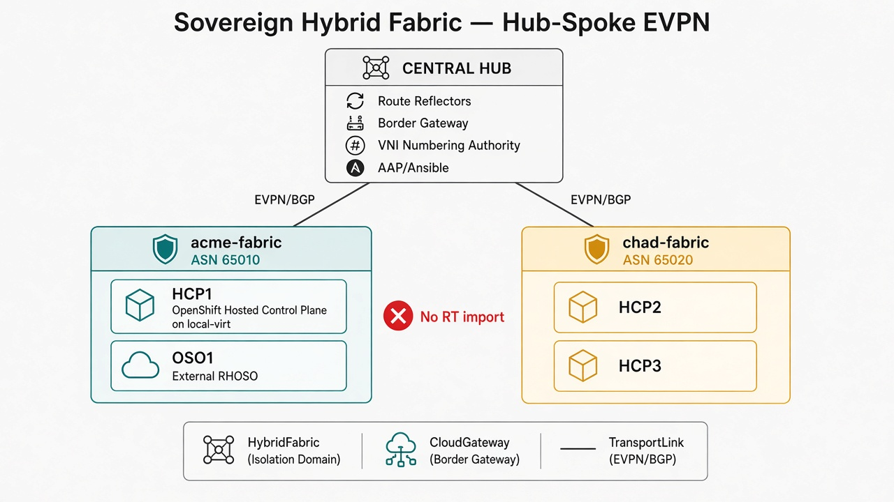

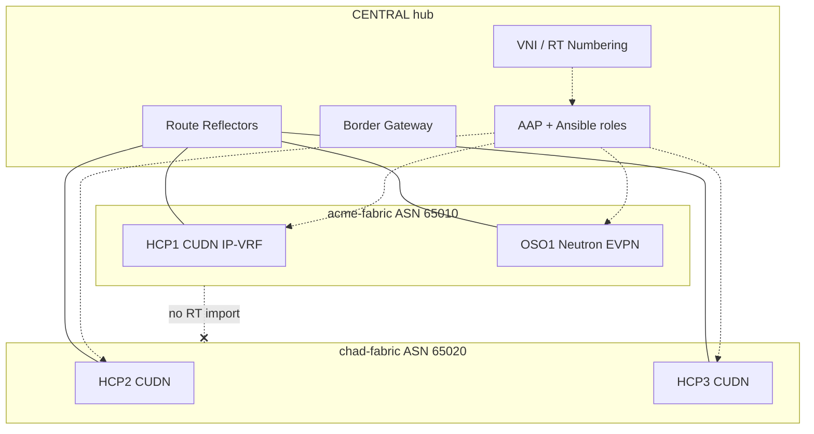
```mermaid
flowchart TB
  subgraph hub["CENTRAL hub"]
    RR["Route Reflectors"]
    BGW["Border Gateway"]
    NA["VNI / RT Numbering"]
    AAP["AAP + Ansible roles"]
  end
  subgraph acme["acme-fabric ASN 65010"]
    HCP1["HCP1 CUDN IP-VRF"]
    OSO1["OSO1 Neutron EVPN"]
  end
  subgraph chad["chad-fabric ASN 65020"]
    HCP2["HCP2 CUDN"]
    HCP3["HCP3 CUDN"]
  end
  RR --- HCP1
  RR --- OSO1
  RR --- HCP2
  RR --- HCP3
  NA -.-> AAP
  AAP -.-> HCP1
  AAP -.-> OSO1
  AAP -.-> HCP2
  AAP -.-> HCP3
  acme -.-x|no RT import| chad
```

```text
                    +-------------------------------+
                    |   CENTRAL (hub)               |
                    |  RR / BGW / Numbering / AAP   |
                    +-------------+-----------------+
           EVPN/BGP |             | EVPN/BGP
     +--------------+--+       +--+--------------+
     |                 |       |                 |
+----+----+       +----+----+ +----+----+   +----+----+
|  HCP1   |       |  OSO1   | |  HCP2   |   |  HCP3   |
|  acme   |       |  acme   | |  chad   |   |  chad   |
| CUDN VRF|       | Neutron | | CUDN    |   | CUDN    |
+---------+       +---------+ +---------+   +---------+
     \_______________/             \_____________/
        acme-fabric                   chad-fabric
```

**Why hub-spoke (not full mesh)**

- Control-plane scale: O(N) BGP sessions to RR, not O(N²).
- Policy enforcement point: CENTRAL is the only place that reflects routes; import filters are fabric-scoped.
- Operational blast radius: RR maintenance is centralized; spoke VTEPs remain locally autonomous for data plane once programmed.

---

## 5. Acme dedicated EVPN VRF (HCP1 ↔ OSO1)

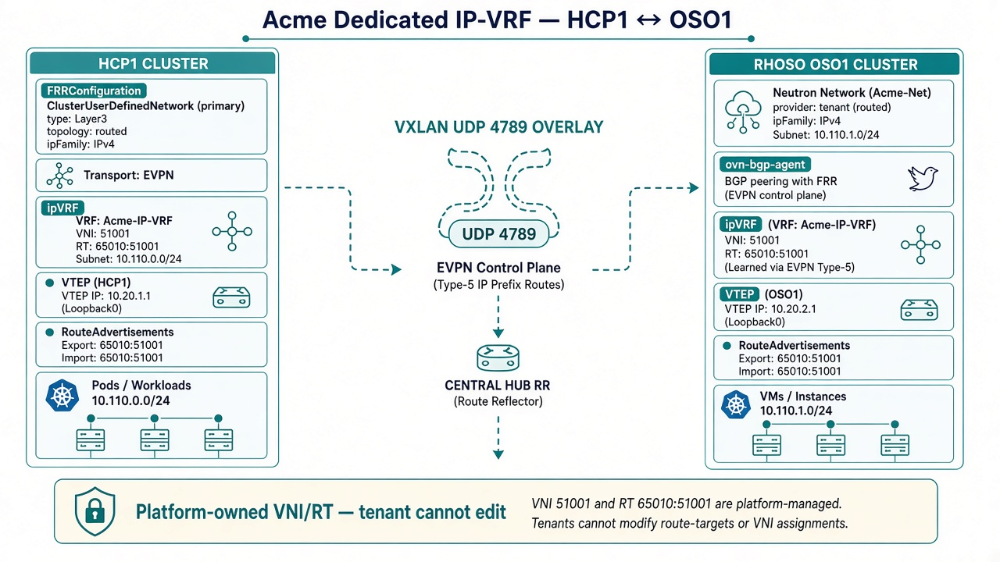

Acme uses OpenShift **4.22 primary ClusterUserDefinedNetwork** with:

- `transport: EVPN`
- dedicated **IP-VRF** (L3 VRF) for routed HCP1 ↔ OSO1
- optional **MAC-VRF** only if L2 stretch is required (typically **not** between OCP and RHOSO)

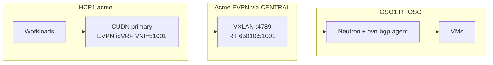
```mermaid
flowchart LR
  subgraph hcp1["HCP1 acme"]
    CUDN["CUDN primary\nEVPN ipVRF VNI=51001"]
    W[Workloads]
  end
  subgraph fabric["Acme EVPN via CENTRAL"]
    VX["VXLAN :4789\nRT 65010:51001"]
  end
  subgraph oso["OSO1 RHOSO"]
    NEU["Neutron + ovn-bgp-agent"]
    VM[VMs]
  end
  W --> CUDN --> VX --> NEU --> VM
```

**Security reading:** HCP1 and OSO1 share one VPN (same VNI/RT). Chad’s VNIs are absent from Acme’s import policy. Shared physical underlay does not imply shared VRF.

---

## 6. Chad fabric (HCP2 ↔ HCP3 only)

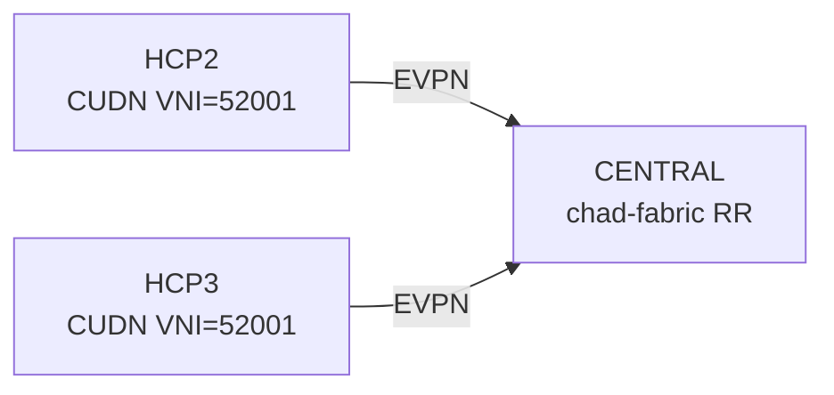
```mermaid
flowchart LR
  H2["HCP2\nCUDN VNI=52001"] -->|EVPN| RR["CENTRAL\nchad-fabric RR"]
  H3["HCP3\nCUDN VNI=52001"] -->|EVPN| RR
```

| Constraint | Enforcement |
|------------|-------------|
| No OSO1 in Chad | No Chad `CloudGateway`/`TransportLink` for OSO1; UI backend picker omits foreign backends |
| Same VNI both HCPs | `allocate` once on `HybridNetwork`; both placements reuse status VNI/RT |
| L2 mobility optional | Layer2 + macVRF only if live-migration across HCPs is a requirement |

---

## 7. Object model & CRD contracts

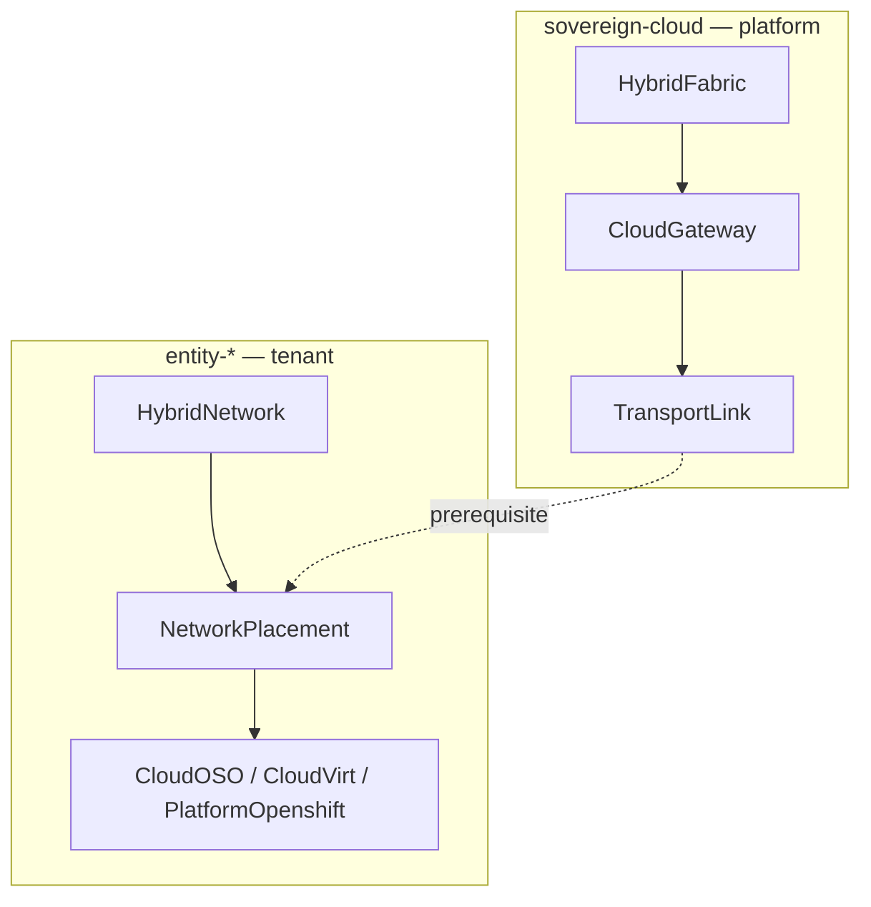
```mermaid
flowchart TB
  subgraph platform["sovereign-cloud — platform"]
    HF[HybridFabric]
    CG[CloudGateway]
    TL[TransportLink]
  end
  subgraph tenant["entity-* — tenant"]
    HN[HybridNetwork]
    NP[NetworkPlacement]
    BE["CloudOSO / CloudVirt / PlatformOpenshift"]
  end
  HF --> CG --> TL
  HN --> NP --> BE
  TL -.->|prerequisite| NP
```

| Kind | NS | Owner | Spec (intent) | Status (observed) |
|------|----|-------|---------------|-------------------|
| `HybridFabric` | `sovereign-cloud` | Platform | ASN, RRs, VNI pool, BGW, transport defaults | `fabricBaseReady`, `allocatedVniCount` |
| `CloudGateway` | `sovereign-cloud` | Platform | cloud, region, `fabricRef`, transport, OSO/Virt refs | `landingZoneReady`, `gatewayAddress` |
| `TransportLink` | `sovereign-cloud` | Platform | `fabricRef`, `cloudGatewayRef`, `tunnelType`, vault ref | `tunnelUp`, endpoints |
| `HybridNetwork` | `entity-*` | Tenant | description only (**no** VNI/RT) | `vni`, `vrfName`, `canonicalRt`, `fabric` |
| `NetworkPlacement` | `entity-*` | Tenant | `network`, `backend`, `prefixes`, `state` | `backendReady`, `validated`, gateway/link refs |

`NetworkPlacement.spec.backend.kind` ∈ `CloudAWS` | `CloudOSO` | `CloudVirt` | `PlatformOpenshift`.

Shipped CRDs: `gitops/custom-operators/crds/crd-{hybridfabric,cloudgateway,transportlink,hybridnetwork,networkplacement}.yaml`.

**Design deltas still needed**

| Delta | Why |
|-------|-----|
| `CloudGateway.spec.virtCloudVirtRef` / `platformOpenshiftRef` | Mirror `openstackCloudOSORef` for HCP/Virt |
| `HybridFabric.spec.entityRefs[]` (1..N Entities) | Tag fabric to consumers; see [designs/fabric.md](../designs/fabric.md) |
| `HybridNetwork.spec.fabricRef` when entity has multiple fabrics | Disambiguate numbering pool |
| Tenant attachment catalog (projection) | Tenants select backend; system resolves TransportLink |
| Placement admission | Backend entity ∈ entityRefs + Ready TransportLink |
| AAP role `backend_openshift_evpn` | Render 4.22 CUDN/FRR/VTEP/RA |

---

## 8. Ansible realization layers (what must be done)

Operators stay thin: on reconcile they launch AAP JobTemplates. **Ansible owns mutation** of underlay, OVN, Neutron, and numbering. Introduce layers **in order**; never skip prerequisites.


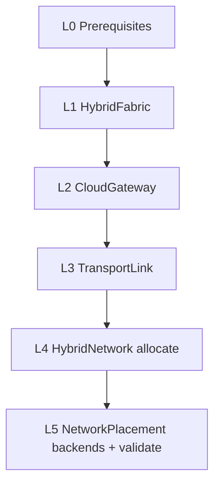
```mermaid
flowchart TB
  L0[L0 Prerequisites] --> L1[L1 HybridFabric]
  L1 --> L2[L2 CloudGateway]
  L2 --> L3[L3 TransportLink]
  L3 --> L4[L4 HybridNetwork allocate]
  L4 --> L5[L5 NetworkPlacement backends + validate]
```

### 8.0 Layer L0 — Prerequisites (manual / platform bootstrap; Ansible verifies)

**JobTemplate:** optional `fabric-preflight` (or first tasks of every provision playbook)

| Ansible must | Detail |
|--------------|--------|
| Assert underlay | Ping/TCP to RR loopbacks and spoke VTEP CIDRs; fail with clear message |
| Assert MTU | Path MTU ≥ VXLAN overhead (recommend 9000 fabric MTU) |
| Assert Vault | Paths exist for BGW creds, tunnel keys, OSO clouds.yaml, spoke kubeconfigs — **read only**, never log secrets |
| Assert CNO EVPN flags on each HCP | `gatewayConfig.routingViaHost=true`, `ipForwarding=Global`; route advertisements enabled |
| Assert FRR-k8s | `openshift-frr-k8s` namespace / CRDs present on EVPN clusters |
| Assert backends Ready | `PlatformOpenshift` HCP1–3, `CloudOSO/oso1`, `CloudVirt/local-virt` `.status.ready` |
| Record support caveat | If HCP is virt-hosted, set condition `EvpnLabOnly=True` (RH docs: primary CUDN EVPN bare-metal) |

**Security:** preflight uses least-privilege SA tokens from Vault; no cluster-admin in tenant namespaces.

---

### 8.1 Layer L1 — `HybridFabric` introduced

**Trigger:** `HybridFabric` create/update · **JT:** `hybridfabric-provision` · **Roles:** `fabric_base`, `border_bgw`, numbering

| Ansible must | Detail |
|--------------|--------|
| Validate pool | `vniPool.end >= start`; no overlap with other Ready fabrics’ pools (query API) |
| Validate ASN uniqueness | `domainAsn` not reused by another fabric |
| Create numbering store | ConfigMap (or CR status ledger) `fabric-numbering-<name>` with bitmap/next-VNI |
| Program hub RR intent | Render FRR/Nexus config fragments **or** document RR IPs for external ToR (lab may mock Ready when IPs reachable) |
| Border gateway | If `borderGateway` set: fetch Vault creds; configure BGW loopback + EVPN toward RR; never write keys to Git |
| Status | `fabricBaseReady`, `borderBgwReady`, `availableVniCount`, `ready` |
| Teardown | Only if `allocatedVniCount==0` and no TransportLinks reference fabric; else block |

**Idempotency:** re-run must not reallocate VNIs or reset the ledger.

---

### 8.2 Layer L2 — `CloudGateway` introduced

**Trigger:** `CloudGateway` · **JT:** `cloudgateway-provision` · **Role:** `cloud_landing_zone`

| Ansible must | Detail |
|--------------|--------|
| Resolve fabric | Load `fabricRef`; fail if fabric not Ready |
| Entity match | Gateway labels/entity must match fabric entity |
| Branch on `spec.cloud` | `openshift` → HCP/Virt (**hosted** PlatformOpenshift on CloudVirt) landing; `openstack` → CloudOSO / PlatformOpenshift type=openstack; **`aws` — no EVPN fabric landing** (do not create fabric CloudGateway for AWS PlatformOpenshift) |
| OSO path | Using `openstackCloudOSORef`, obtain admin/appcred from Vault; ensure BGP speaker / ovn-bgp-agent can peer hub RR |
| OCP path | Using spoke kubeconfig: ensure FRR-k8s + VTEP prerequisites; reserve spoke ASN `domainAsn` |
| Landing zone | Create/ensure provider resources (security groups, external nets hooks) **without** tenant VNIs yet |
| Status | `landingZoneReady`, `gatewayAddress` (VTEP or BGP peer IP), `peerCount` |

**Security:** spoke kubeconfig scoped to networking APIs where possible; audit log job id on CR `edaJobs`/`aapJob`.

---

### 8.3 Layer L3 — `TransportLink` introduced

**Trigger:** `TransportLink` · **JT:** `transportlink-provision` · **Role:** `transport`

| Ansible must | Detail |
|--------------|--------|
| Bind fabric + gateway | Both Ready; same fabricRef |
| Reject cross-fabric bind | e.g. Chad gateway → acme-fabric → **fail** |
| `tunnelType: none` | Verify L3 adjacency hub↔spoke; program EVPN BGP neighbors only (no WG/IPsec) |
| `wireguard` / `ipsec` / `macsec` | Pull `vaultConfigRef`; bring up tunnel; place EVPN session **inside** or beside per design; set MSS clamp from fabric defaults |
| Exchange endpoints | Write `borderEndpoint`, `cloudEndpoint`, `lastHandshakeAt` |
| Status | `tunnelUp`, `ready` |

**Teardown:** drain BGP (graceful), bring down tunnel, clear Vault-dependent runtime state — **do not** delete Vault secrets.

---

### 8.4 Layer L4 — `HybridNetwork` introduced (allocate)

**Trigger:** `HybridNetwork` · **JT:** `hybridnetwork-provision` · **Role:** `allocate`

| Ansible must | Detail |
|--------------|--------|
| Resolve entity | From namespace `entity-*` → Entity name |
| Select fabric | Entity’s fabric (label/`entityRef`); fail if missing/not Ready |
| Allocate VNI | Atomically from fabric pool; persist mapping `network → vni` |
| Derive VRF + RT | e.g. `vrfName=vrf-<network>`, `canonicalRt=<fabricAsn>:<vni>` |
| **Never** take VNI from tenant spec | Ignore/reject if somehow present |
| Status | `allocated`, `vni`, `vrfName`, `canonicalRt`, `fabric`, `fabricVniReady` |
| Teardown | Release VNI only when zero placements remain |

---

### 8.5 Layer L5 — `NetworkPlacement` introduced (realize + validate)

**Trigger:** `NetworkPlacement` · **JT:** `networkplacement-provision` · **Roles:** `fabric_vni`, `backend_openshift_evpn` **or** `backend_openstack`, `validate`

#### 8.5.1 Common preflight (every placement)

| Ansible must | Detail |
|--------------|--------|
| Load HybridNetwork | Must be allocated |
| Resolve backend CR | Kind/name in same entity NS; Ready |
| Resolve CloudGateway + TransportLink | For that backend on the entity fabric; both Ready → `prerequisiteReady=true` |
| Prefix validation | CIDR parse; conflict checks within same HybridNetwork as policy dictates |
| `state: absent` | Withdraw backend objects; keep VNI until last placement gone |

#### 8.5.2 Backend: PlatformOpenshift / HCP (`backend_openshift_evpn`)

On the **spoke HCP API** (kubeconfig from Vault), Ansible must create/update:

1. `FRRConfiguration` — BGP neighbors = fabric RR addresses; labels for RA selector  
2. `VTEP` — VXLAN VTEP definition (Unmanaged/managed per cluster standard)  
3. `RouteAdvertisements` — select FRR + CUDNs labeled for this HybridNetwork  
4. `ClusterUserDefinedNetwork` — `transport: EVPN`, `evpn.ipVRF.vni` + `routeTarget` from network status; subnets from placement prefixes  
5. Ensure workload namespaces carry selector labels for the CUDN  

Idempotent apply (SSA); record resource versions in placement status.

#### 8.5.3 Backend: CloudOSO (`backend_openstack`)

| Ansible must | Detail |
|--------------|--------|
| Neutron network/subnet | Prefixes from placement |
| ovn-bgp-agent / EVPN | Import/export **canonical RT** (rewrite strategy) |
| BGP peer hub RR | From fabric routeReflectors |
| Status | Neutron UUIDs, `backendApplied` |

#### 8.5.4 `fabric_vni` (hub side)

Ensure hub RR/BGW policy allows the VNI/RT for this fabric only (export filters). No cross-fabric import.

#### 8.5.5 `validate`

| Ansible must | Detail |
|--------------|--------|
| Positive probe | From HCP test pod (CUDN NS) to OSO DHCP/port IP (Acme) or HCP2↔HCP3 (Chad) |
| Negative probe | Confirm no route to other fabric’s prefixes |
| Status | `validated`, `lastValidatedAt`, `realizedPrefixes` |

#### 8.5.6 Placement state machine

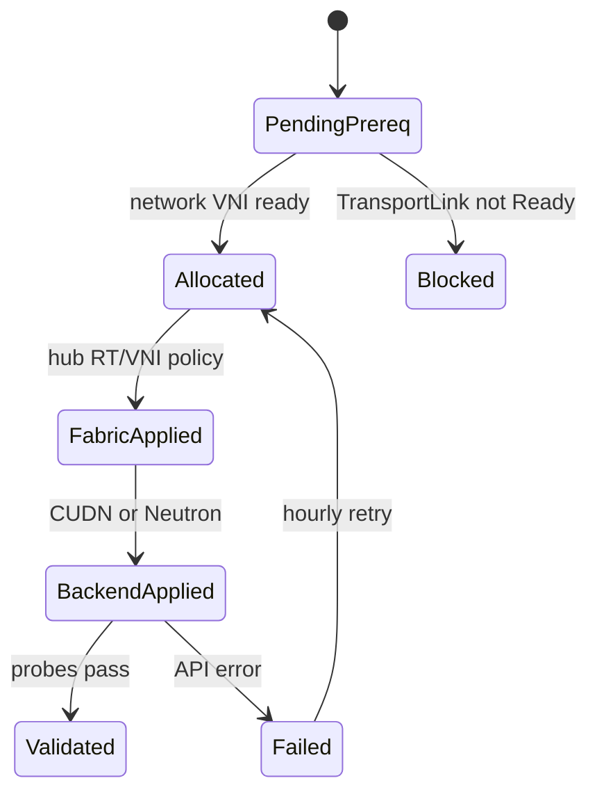
```mermaid
stateDiagram-v2
  [*] --> PendingPrereq
  PendingPrereq --> Allocated: network VNI ready
  Allocated --> FabricApplied: hub RT/VNI policy
  FabricApplied --> BackendApplied: CUDN or Neutron
  BackendApplied --> Validated: probes pass
  PendingPrereq --> Blocked: TransportLink not Ready
  BackendApplied --> Failed: API error
  Failed --> Allocated: hourly retry
```

---

### 8.6 Layer interaction matrix

| Layer introduced | Ansible creates / mutates | Must already exist |
|------------------|---------------------------|--------------------|
| L1 HybridFabric | Numbering CM, RR/BGW intent | L0 underlay + Vault |
| L2 CloudGateway | Landing zone, spoke ASN prep | L1 Ready |
| L3 TransportLink | BGP neighbors ± tunnel | L2 Ready |
| L4 HybridNetwork | VNI/RT allocation | L1 Ready |
| L5 NetworkPlacement | CUDN/FRR/VTEP/RA or Neutron + probes | L3 Ready + L4 allocated |
| Teardown L5 | Withdraw site | — |
| Teardown L4 | Free VNI | no placements |
| Teardown L3→L1 | Reverse order | no dependents |

### 8.7 JobTemplate catalog

| Kind | Provision | Teardown |
|------|-----------|----------|
| HybridFabric | `hybridfabric-provision` | `hybridfabric-teardown` |
| CloudGateway | `cloudgateway-provision` | `cloudgateway-teardown` |
| TransportLink | `transportlink-provision` | `transportlink-teardown` |
| HybridNetwork | `hybridnetwork-provision` | `hybridnetwork-teardown` |
| NetworkPlacement | `networkplacement-provision` | `networkplacement-teardown` |

Playbooks live under `eda/hybridvpc/` / `eda/rulebooks/`; SCM update-on-launch from Git.

---

## 9. Day-0 / Day-1 procedures

### 9.1 Day-0 — platform fabric engineer

1. Complete L0 checks (underlay, MTU, Vault, CNO, backends Ready).  
2. Create `HybridFabric/acme-fabric` and `chad-fabric` (disjoint pools). Wait Ready.  
3. Create Acme gateways `acme-hcp1-gw`, `acme-oso1-gw` → landing Ready.  
4. Create Acme TransportLinks (`tunnelType: none` in lab) → tunnel Up.  
5. Create Chad gateways/links for HCP2 and HCP3 **only**.  
6. **Negative test:** TransportLink Chad-gw → acme-fabric must fail.  
7. Hand off to tenant network admins.

### 9.2 Day-1 — tenant network admin

1. Create `HybridNetwork` (name + description).  
2. Add `NetworkPlacement`s with prefixes.  
3. Watch: allocated → fabricVniReady → backendReady → validated.  
4. Label namespaces / attach VMs.  
5. Decommission a site with `spec.state: absent` on that placement only.

---

## 10. OpenShift 4.22 & RHOSO realization

### 10.1 CNO prerequisites (each EVPN cluster)

```yaml
# Network.operator.openshift.io — excerpt
spec:
  defaultNetwork:
    ovnKubernetesConfig:
      gatewayConfig:
        routingViaHost: true
        ipForwarding: Global
```

Also enable route advertisements. **Support note:** RH documents BGP EVPN primary CUDN as **bare-metal only** — virt/HCP lab is best-effort until supported.

### 10.2 Objects Ansible renders on HCP (Acme example)

```yaml
apiVersion: frrk8s.metallb.io/v1beta1
kind: FRRConfiguration
metadata:
  name: acme-fabric-evpn
  namespace: openshift-frr-k8s
  labels:
    evpn: "true"
    hybridsovereign.redhat/fabric: acme-fabric
spec:
  nodeSelector: {}
  bgp:
    routers:
      - asn: 65011
        neighbors:
          - address: 10.255.10.1
            asn: 65010
          - address: 10.255.10.2
            asn: 65010
---
apiVersion: k8s.ovn.org/v1
kind: RouteAdvertisements
metadata:
  name: advertise-acme-evpn
spec:
  advertisements: ["PodNetwork"]
  frrConfigurationSelector:
    matchLabels:
      evpn: "true"
  networkSelectors:
    - networkSelectionType: ClusterUserDefinedNetworks
      clusterUserDefinedNetworkSelector:
        networkSelector:
          matchLabels:
            hybridsovereign.redhat/network: acme-core
---
apiVersion: k8s.ovn.org/v1
kind: ClusterUserDefinedNetwork
metadata:
  name: acme-core
  labels:
    hybridsovereign.redhat/network: acme-core
    hybridsovereign.redhat/fabric: acme-fabric
    advertise: "true"
spec:
  namespaceSelector:
    matchLabels:
      hybridsovereign.redhat/hybridnetwork: acme-core
  network:
    topology: Layer3
    layer3:
      role: Primary
      subnets:
        - cidr: 10.110.0.0/24
          hostSubnet: 24
    transport: EVPN
    evpn:
      vtep: acme-evpn-vtep
      ipVRF:
        vni: 51001
        routeTarget: "65010:51001"
```

### 10.3 RHOSO (OSO1)

Ansible: Neutron network/subnet `10.110.1.0/24` → ovn-bgp-agent export/import RT `65010:51001` → BGP EVPN toward CENTRAL RRs → write UUIDs on placement status.

### 10.4 Chad dual-HCP

| Cluster | VNI | RT | Prefix |
|---------|-----|----|--------|
| HCP2 | 52001 | 65020:52001 | 10.120.0.0/24 |
| HCP3 | 52001 | 65020:52001 | 10.120.1.0/24 |

Peers only chad-fabric RRs (`10.255.20.x`). No neighbor to ASN 65010.

---

## 11. Sample manifests (Acme + Chad)

### 11.1 Acme platform

```yaml
apiVersion: hybridsovereign.redhat/v1alpha1
kind: HybridFabric
metadata:
  name: acme-fabric
  namespace: sovereign-cloud
  labels:
    hybridsovereign.redhat/entity: acme-corp
spec:
  enabled: true
  domainAsn: 65010
  routeReflectors:
    - name: central-rr-a
      address: 10.255.10.1
    - name: central-rr-b
      address: 10.255.10.2
  vniPool: { start: 51000, end: 51127 }
  borderGateway:
    name: central-bgw-acme
    loopback: 10.255.10.10
    vaultCredentialRef: fabric/acme/bgw
  transportDefaults:
    mtu: 9000
    innerMssClamp: 1360
    defaultTunnelType: none
---
apiVersion: hybridsovereign.redhat/v1alpha1
kind: CloudGateway
metadata:
  name: acme-hcp1-gw
  namespace: sovereign-cloud
  labels:
    hybridsovereign.redhat/entity: acme-corp
    hybridsovereign.redhat/fabric: acme-fabric
spec:
  enabled: true
  cloud: openshift
  region: local-virt
  domainAsn: 65011
  fabricRef: acme-fabric
  transport: { type: none }
---
apiVersion: hybridsovereign.redhat/v1alpha1
kind: CloudGateway
metadata:
  name: acme-oso1-gw
  namespace: sovereign-cloud
  labels:
    hybridsovereign.redhat/entity: acme-corp
    hybridsovereign.redhat/fabric: acme-fabric
spec:
  enabled: true
  cloud: openstack
  region: regionOne
  domainAsn: 65012
  fabricRef: acme-fabric
  transport: { type: none }
  openstackCloudOSORef: oso1
---
apiVersion: hybridsovereign.redhat/v1alpha1
kind: TransportLink
metadata:
  name: acme-hcp1-link
  namespace: sovereign-cloud
spec:
  enabled: true
  fabricRef: acme-fabric
  cloudGatewayRef: acme-hcp1-gw
  tunnelType: none
---
apiVersion: hybridsovereign.redhat/v1alpha1
kind: TransportLink
metadata:
  name: acme-oso1-link
  namespace: sovereign-cloud
spec:
  enabled: true
  fabricRef: acme-fabric
  cloudGatewayRef: acme-oso1-gw
  tunnelType: none
```

### 11.2 Chad platform (HCP2 + HCP3 only)

```yaml
apiVersion: hybridsovereign.redhat/v1alpha1
kind: HybridFabric
metadata:
  name: chad-fabric
  namespace: sovereign-cloud
  labels:
    hybridsovereign.redhat/entity: chad
spec:
  enabled: true
  domainAsn: 65020
  routeReflectors:
    - name: central-rr-a
      address: 10.255.20.1
    - name: central-rr-b
      address: 10.255.20.2
  vniPool: { start: 52000, end: 52127 }
  transportDefaults:
    mtu: 9000
    defaultTunnelType: none
---
apiVersion: hybridsovereign.redhat/v1alpha1
kind: CloudGateway
metadata:
  name: chad-hcp2-gw
  namespace: sovereign-cloud
spec:
  enabled: true
  cloud: openshift
  region: local-virt
  domainAsn: 65021
  fabricRef: chad-fabric
  transport: { type: none }
---
apiVersion: hybridsovereign.redhat/v1alpha1
kind: CloudGateway
metadata:
  name: chad-hcp3-gw
  namespace: sovereign-cloud
spec:
  enabled: true
  cloud: openshift
  region: local-virt
  domainAsn: 65022
  fabricRef: chad-fabric
  transport: { type: none }
---
apiVersion: hybridsovereign.redhat/v1alpha1
kind: TransportLink
metadata:
  name: chad-hcp2-link
  namespace: sovereign-cloud
spec:
  enabled: true
  fabricRef: chad-fabric
  cloudGatewayRef: chad-hcp2-gw
  tunnelType: none
---
apiVersion: hybridsovereign.redhat/v1alpha1
kind: TransportLink
metadata:
  name: chad-hcp3-link
  namespace: sovereign-cloud
spec:
  enabled: true
  fabricRef: chad-fabric
  cloudGatewayRef: chad-hcp3-gw
  tunnelType: none
```

### 11.3 Acme tenant

```yaml
apiVersion: hybridsovereign.redhat/v1alpha1
kind: HybridNetwork
metadata:
  name: acme-core
  namespace: entity-acme-corp
spec:
  description: Acme core VRF — HCP1 + OSO1 via EVPN IP-VRF
---
apiVersion: hybridsovereign.redhat/v1alpha1
kind: NetworkPlacement
metadata:
  name: acme-core-hcp1
  namespace: entity-acme-corp
spec:
  network: acme-core
  backend: { kind: PlatformOpenshift, name: hcp1 }
  prefixes: ["10.110.0.0/24"]
  state: present
---
apiVersion: hybridsovereign.redhat/v1alpha1
kind: NetworkPlacement
metadata:
  name: acme-core-oso1
  namespace: entity-acme-corp
spec:
  network: acme-core
  backend: { kind: CloudOSO, name: oso1 }
  prefixes: ["10.110.1.0/24"]
  state: present
```

### 11.4 Chad tenant

```yaml
apiVersion: hybridsovereign.redhat/v1alpha1
kind: HybridNetwork
metadata:
  name: chad-app
  namespace: entity-chad
spec:
  description: Chad app VRF — HCP2 + HCP3 only
---
apiVersion: hybridsovereign.redhat/v1alpha1
kind: NetworkPlacement
metadata:
  name: chad-app-hcp2
  namespace: entity-chad
spec:
  network: chad-app
  backend: { kind: PlatformOpenshift, name: hcp2 }
  prefixes: ["10.120.0.0/24"]
  state: present
---
apiVersion: hybridsovereign.redhat/v1alpha1
kind: NetworkPlacement
metadata:
  name: chad-app-hcp3
  namespace: entity-chad
spec:
  network: chad-app
  backend: { kind: PlatformOpenshift, name: hcp3 }
  prefixes: ["10.120.1.0/24"]
  state: present
```

---

## 12. UI — admin & tenant create forms

Persona map: platform fabric admin → admin plugin; tenant network admin → tenant plugin. **Tenants never edit VNI/RT.**

### 12.1 Create Hybrid Fabric


Wizard: (1) Identity — name, **Entity multi-select dropdown** (`entityRefs`), ASN, enabled (2) Numbering — VNI pool, RR addresses (3) Transport defaults — MTU, default tunnel type. Full dropdown contracts: **§18**.

### 12.2 Register Cloud Gateway

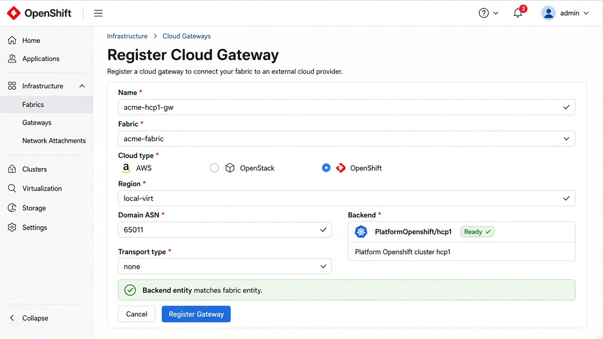

Fabric filter → cloud type → **backend dropdown** (Ready PlatformOpenshift / CloudOSO / CloudVirt) → transport. Validate entity match before submit. See **§18**.

### 12.3 Create Transport Link

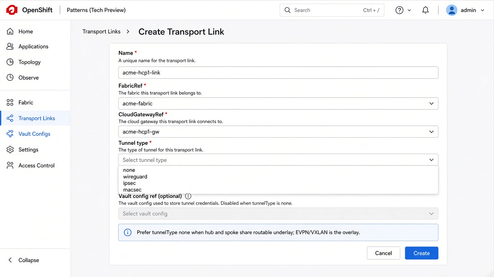

Prefer `none` when underlay-adjacent; Vault ref required for wireguard/ipsec/macsec.

### 12.4 Place Hybrid Network


Backend + prefixes; read-only VNI/RT card from parent network status. Disable backends lacking Ready TransportLink.

### 12.5 Reference dashboards (existing mocks)

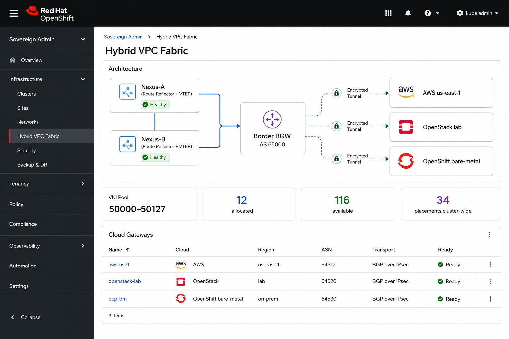

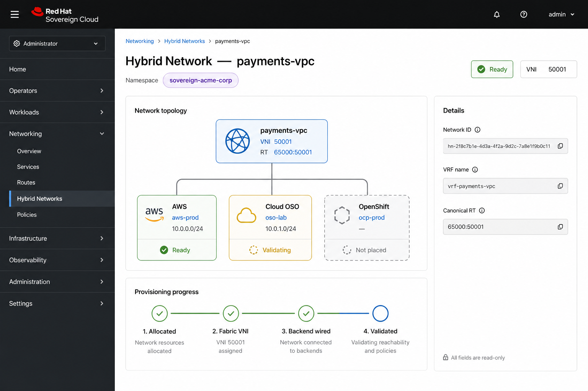


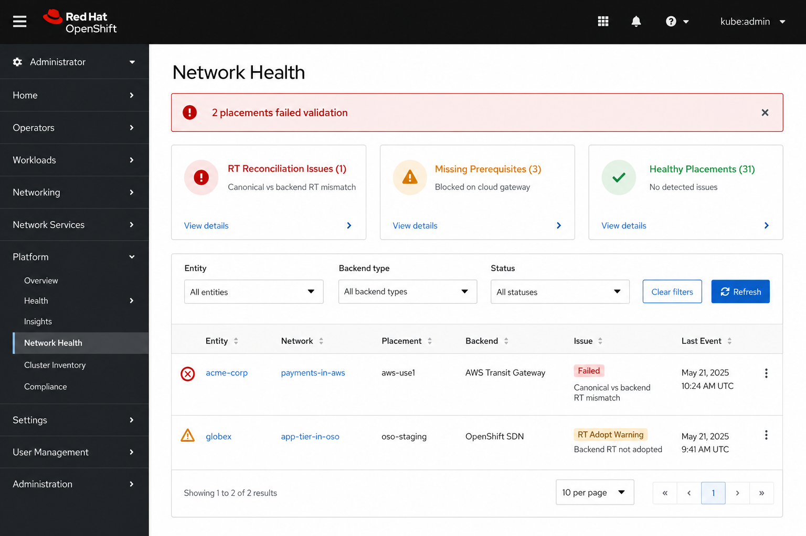

### 12.6 UI → CR → Ansible

| UI action | CR | Ansible layer |
|-----------|----|----|
| Create fabric | HybridFabric | L1 |
| Register gateway | CloudGateway | L2 |
| Create link | TransportLink | L3 |
| Create network | HybridNetwork | L4 |
| Add placement | NetworkPlacement | L5 |
| Remove site | Placement `state: absent` | L5 teardown |

| Plugin touchpoints: `AdminHybridFabricsPage`, `AdminCloudGatewaysPage`, `AdminTransportLinksPage`, `TenantHybridNetworksPage`, `TenantNetworkPlacementsPage`, detail pages under `ui/packages/*-console-plugin`.

**Standalone dashboards:** same forms/selectors in `ui/packages/admin-dashboard` and `ui/packages/tenant-dashboard` (see **§18**).

---

## 13. Bill of materials & success criteria

### 13.1 Must have before first packet

| Area | Requirement |
|------|-------------|
| CENTRAL | Hub OCP; ACM/Hypershift; Sovereign fabric operators; AAP JTs; Vault |
| HCP | OCP **4.22+**, CNO EVPN flags, FRR-k8s |
| RHOSO | External CloudOSO Ready; ovn-bgp-agent (or equiv.) |
| CloudVirt | `local-virt` Ready for HCP hosting |
| Underlay | Hub ↔ spoke VTEP reachability (or tunnels); MTU plan |
| Numbering | Disjoint fabric ASN + VNI pools |

### 13.2 Success criteria

- [ ] Acme: HCP1 CUDN pod ↔ OSO1 VM in `acme-core` prefixes; traceroute via EVPN VRF  
- [ ] Chad: HCP2 ↔ HCP3 on `chad-app`  
- [ ] Negative: HCP2 cannot reach Acme OSO prefixes  
- [ ] CENTRAL RR shows Type-2/Type-5 per fabric without cross-import  
- [ ] Tenant UI has no VNI/RT editors; admin UI shows pool utilization  
- [ ] Introducing each CR layer only succeeds when Ansible preflight for that layer passes  

### 13.3 Observability

| Signal | Source |
|--------|--------|
| BGP / EVPN | FRR on nodes; `show bgp l2vpn evpn` |
| CUDN Ready | Spoke `ClusterUserDefinedNetwork` |
| Sovereign Ready | CR printer columns + Network Health UI |
| Ansible | AAP job URL on CR status |

---

## 14. CRD deltas & non-goals

**Deltas:** Virt/HCP refs on CloudGateway; fabric↔entity binding (`entityRefs`); placement admission; `backend_openshift_evpn` role; **PlatformOpenshift fabric join** (`spec.fabric` / status fabricMembership — §15).

**Non-goals for this blueprint**

- AWS EVPN path / **PlatformOpenshift type=aws fabric attach** (explicitly unsupported — §15.0)  
- Tenants choosing VNIs  
- Full-mesh spoke BGP  
- Secrets or real cluster domains in Git samples  

**References**

- OpenShift 4.22 Advanced Networking — BGP EVPN for user-defined networks  
- OVN-Kubernetes — MAC-VRF vs IP-VRF  
- In-repo CRDs `gitops/custom-operators/crds/`; samples `samples/hybridvpc/`  
- Prior UI notes `architecture/mocks/DESIGN_UI.md`  
- Admin / entity tagging / tenant catalog: [designs/fabric.md](../designs/fabric.md)

---

## 15. PlatformOpenshift fabric awareness

An OCP cluster represented by `PlatformOpenshift` lives in an **Entity namespace**. **Fabric / EVPN / CUDN attachment is not universal across `spec.type` values** — see **§15.0**. Where supported, the cluster **may** join Hybrid Fabric(s) the Entity is tagged on (`HybridFabric.spec.entityRefs`) so tenants can place `HybridNetwork`s onto it — but fabric attach remains **optional** (see **§17**).

### 15.0 Fabric attachment scope by PlatformOpenshift type (locked)

| `PlatformOpenshift.spec.type` | Environment backend | Fabric / EVPN / CUDN attach? | Notes |
|-------------------------------|---------------------|------------------------------|--------|
| `hosted` | **CloudVirt** (`spec.hosted.environment`) | **Yes** (optional) | HCP on CNV; primary fabric path for lab/prod Virt |
| `openstack` | **CloudOSO** (`spec.openstack.environment`) | **Yes** (optional) | IPI/UPI on RHOSO; joins via OSO/OVN EVPN path with CloudOSO gateway |
| `aws` | **CloudAWS** (`spec.aws.environment`) | **No** | **No fabric attachment capability.** No `spec.fabric` join, no CloudGateway/TransportLink for this cluster, no HybridNetwork placement onto this PlatformOpenshift for EVPN CUDN |

**Also in scope for fabric (not PlatformOpenshift):**

| Backend CR | Fabric attach? |
|------------|----------------|
| `CloudOSO` (external RHOSO cloud, e.g. OSO1) | **Yes** — via `CloudGateway` `openstackCloudOSORef` + TransportLink + NetworkPlacement |
| `CloudVirt` (CNV environment) | **Yes** — as underlay for `type: hosted`, and as placement backend when applicable |
| `CloudAWS` | **No** EVPN fabric path in this design (out of scope; CRD may still allow non-fabric NetworkPlacement historically — fabric UI must not offer AWS) |

**Implications**

1. **Ansible:** `platform_fabric_join` runs only when `spec.type in [hosted, openstack]`. For `type: aws`, force `status.fabricMembership=[{phase: Skipped, message: "AWS PlatformOpenshift has no fabric attachment"}]` and skip gateway/link creation.  
2. **Admission:** Reject `spec.fabric.joinPolicy` other than `None` / omit fabric fields on AWS CRs; reject CloudGateway with `platformOpenshiftRef` pointing at an AWS PlatformOpenshift.  
3. **UI (§18):** Hide Fabric / JoinPolicy / FabricSelect controls on PlatformOpenshift create/edit when type=AWS; BackendSelect for HybridNetwork placement omits AWS PlatformOpenshift clusters.  
4. **Standalone vs fabric:** AWS clusters still install normally (§17 standalone path only — fabric toggle not offered).

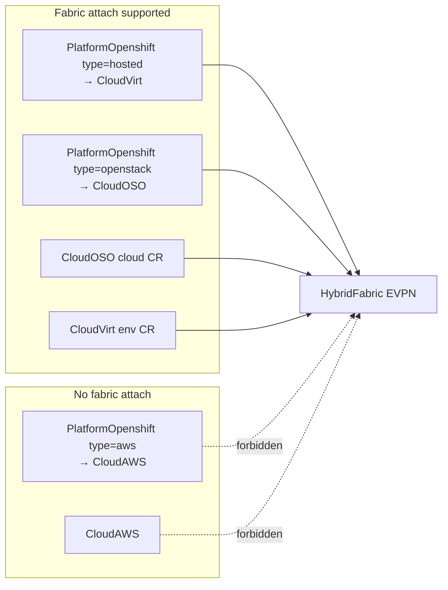
```mermaid
flowchart LR
  subgraph yes["Fabric attach supported"]
    H[PlatformOpenshift type=hosted\n→ CloudVirt]
    O[PlatformOpenshift type=openstack\n→ CloudOSO]
    CO[CloudOSO cloud CR]
    CV[CloudVirt env CR]
  end
  subgraph no["No fabric attach"]
    A[PlatformOpenshift type=aws\n→ CloudAWS]
    CA[CloudAWS]
  end
  H --> Fabric[HybridFabric EVPN]
  O --> Fabric
  CO --> Fabric
  CV --> Fabric
  A -.->|forbidden| Fabric
  CA -.->|forbidden| Fabric
```

`PlatformOpenshift` CRD fabric fields apply to **hosted** and **openstack** only. This section is the design for making those clusters **aware of fabric configuration** in three complementary ways **when the operator opts in**:

| Mode | When it runs | Who triggers it |
|------|--------------|-----------------|
| **A. Install-time join** | During `platformopenshift-provision` | Cluster create / first Ready |
| **B. Post-install reconcile** | Later reconcile / hourly retry / `reconcileNow` | Fabric or gateway appears after the cluster already exists |
| **C. External tagging** | Explicit admin/tenant intent on the PlatformOpenshift CR | Label / annotation / `spec.fabric` — no automatic join |

All three must end in the same desired state: a **CloudGateway + TransportLink** (or equivalent spoke EVPN prep) binding this cluster into a fabric the Entity can see — and `PlatformOpenshift.status` reflecting membership.

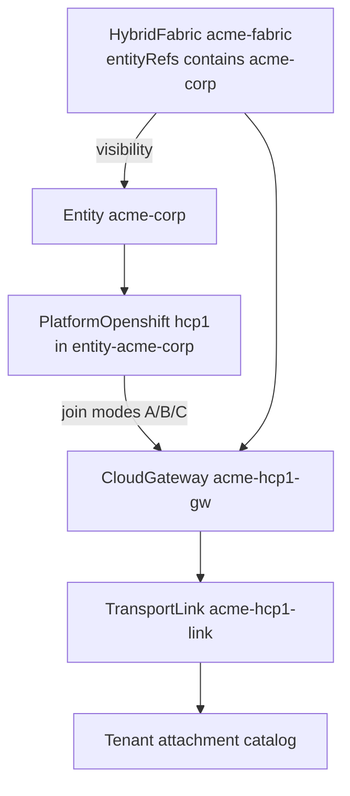
```mermaid
flowchart TB
  Ent[Entity acme-corp]
  HF[HybridFabric acme-fabric\nentityRefs contains acme-corp]
  PO[PlatformOpenshift hcp1\nin entity-acme-corp]
  CG[CloudGateway acme-hcp1-gw]
  TL[TransportLink acme-hcp1-link]
  Cat[Tenant attachment catalog]

  Ent --> PO
  HF -->|visibility| Ent
  PO -->|join modes A/B/C| CG
  CG --> TL
  TL --> Cat
  HF --> CG
```

### 15.1 What “aware” means for PlatformOpenshift

The provisioned OCP must not invent VNIs. Awareness means the **control plane on CENTRAL** (operator + Ansible) has associated this cluster with fabric(s) and prepared spoke-side prerequisites:

| Concern | Observed on PlatformOpenshift (design status) | Platform objects created |
|---------|-----------------------------------------------|---------------------------|
| Which fabrics may attach | `status.fabricMembership[].fabric` | — |
| Join phase | `Pending` \| `Joined` \| `Degraded` \| `Skipped` | — |
| Gateway / link | `status.fabricMembership[].cloudGatewayRef` / `transportLinkRef` | `CloudGateway`, `TransportLink` in `sovereign-cloud` |
| Spoke EVPN prep | `status.fabricMembership[].evpnPrepReady` | CNO flags check, FRR-k8s present (full CUDN still on NetworkPlacement) |
| Entity visibility | Catalog lists this backend when membership Joined + link Ready | Projection / ConfigMap |

**Security:** a PlatformOpenshift may only join fabrics where `entityRefs` contains its Entity. Cross-entity fabric join is rejected.

### 15.2 Spec / status contract (design delta)

```yaml
apiVersion: hybridsovereign.redhat/v1alpha1
kind: PlatformOpenshift
metadata:
  name: hcp1
  namespace: entity-acme-corp
  labels:
    # Mode C — external tagging (optional; see §15.5)
    hybridsovereign.redhat/fabric: acme-fabric
  annotations:
    # Force re-evaluate fabric join without recreating the cluster
    ansible.sdk.operatorframework.io/reconcileNow: "true"
spec:
  type: hosted
  hosted:
    environment: local-virt
  # --- fabric awareness (design) ---
  fabric:
    # joinPolicy: how this cluster attaches to entity-visible fabrics
    joinPolicy: AutoWhenFabricReady   # None | AutoWhenFabricReady | ExplicitOnly
    # ExplicitOnly: only fabrics listed here (must ⊆ entity-visible fabrics)
    fabricRefs: []                   # e.g. [acme-fabric]
    # When entity has multiple fabrics and Auto*: which to prefer
    preferredFabricRef: ""           # optional
    # Create CloudGateway+TransportLink automatically (platform NS)
    manageGatewayAndLink: true
    tunnelType: none                 # override; default from HybridFabric.transportDefaults
status:
  entity: acme-corp
  ready: true
  fabricMembership:
    - fabric: acme-fabric
      phase: Joined                  # Pending | Joined | Degraded | Skipped
      cloudGatewayRef: acme-hcp1-gw
      transportLinkRef: acme-hcp1-link
      evpnPrepReady: true
      lastJoinedAt: "2026-09-28T12:00:00Z"
      message: ""
```

| `joinPolicy` | Behavior |
|--------------|----------|
| `None` | Never auto-join; cluster usable without fabric (placements stay blocked until Mode C / manual gateway) |
| `AutoWhenFabricReady` | **Default.** Discover fabrics tagged to this Entity; join when fabric (+ optional preferred) is Ready |
| `ExplicitOnly` | Join only `spec.fabric.fabricRefs[]` (each must be in entity’s `entityRefs`) |

### 15.3 Mode A — Awareness during PlatformOpenshift installation

Runs inside **`platformopenshift-provision`** after the spoke is API-reachable (HCP Ready / kubeconfig in Vault).

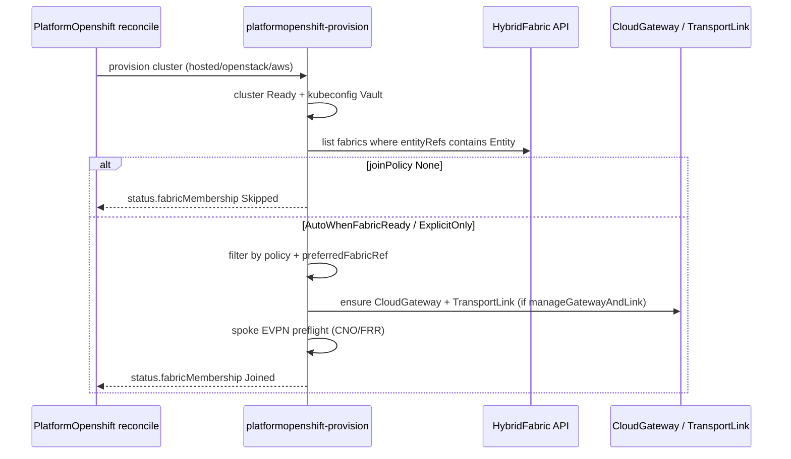
```mermaid
sequenceDiagram
  participant PO as PlatformOpenshift reconcile
  participant AAP as platformopenshift-provision
  participant HF as HybridFabric API
  participant CG as CloudGateway / TransportLink

  PO->>AAP: provision cluster (hosted/openstack/aws)
  AAP->>AAP: cluster Ready + kubeconfig Vault
  AAP->>HF: list fabrics where entityRefs contains Entity
  alt joinPolicy None
    AAP-->>PO: status.fabricMembership Skipped
  else AutoWhenFabricReady / ExplicitOnly
    AAP->>AAP: filter by policy + preferredFabricRef
    AAP->>CG: ensure CloudGateway + TransportLink (if manageGatewayAndLink)
    AAP->>AAP: spoke EVPN preflight (CNO/FRR)
    AAP-->>PO: status.fabricMembership Joined
  end
```

**Ansible tasks (install-time fabric join role: `platform_fabric_join`)**

| Step | Action |
|------|--------|
| 1 | Resolve Entity from PlatformOpenshift namespace / `status.entity` |
| 2 | List Ready `HybridFabric` in `sovereign-cloud` with `entityRefs` containing Entity |
| 3 | Apply `joinPolicy` / `fabricRefs` / `preferredFabricRef` → selected fabric set (often one) |
| 4 | If empty and Auto*: set membership `Pending` (“waiting for fabric tag”), **do not fail** cluster provision |
| 5 | If `manageGatewayAndLink`: idempotently create/update `CloudGateway` (`cloud: openshift`, `platformOpenshiftRef: <name>`, `fabricRef`) and `TransportLink` |
| 6 | Spoke preflight: route advertisements / gatewayConfig / FRR-k8s (record `evpnPrepReady`) |
| 7 | Patch PlatformOpenshift status `fabricMembership[]` |
| 8 | Emit event so tenant attachment catalog refreshes |

**Install-time principle:** cluster success is **not** blocked on fabric absence, EVPN readiness, or CUDN. HCP can become Ready with `fabricMembership.phase=Skipped` (`joinPolicy: None`) or `Pending` (waiting for fabric). When a fabric is later tagged / becomes Ready, Mode B completes the join. Full rule set: **§17**.

### 15.4 Mode B — Reconcile if fabric is added after installation

Typical case: Entity and HCP1 already exist; platform admin later creates `acme-fabric` and adds `acme-corp` to `entityRefs`, or creates the fabric first and tags the Entity afterward.

**Triggers**

| Trigger | Mechanism |
|---------|-----------|
| HybridFabric Ready / `entityRefs` change | Fabric operator annotates related PlatformOpenshift CRs in tagged entity namespaces with `reconcileNow`, **or** watches → enqueue via shared index |
| CloudGateway / TransportLink Ready for this backend | Placement path works; PlatformOpenshift status still refreshed on next reconcile |
| Periodic | Existing `reconcilePeriod` (e.g. 1h) on PlatformOpenshift watch |
| Manual | Annotate PlatformOpenshift `reconcileNow` |

**Reconcile algorithm (`platform_fabric_join` on every successful Ready cluster)**

1. If cluster not Ready → skip fabric join.  
2. Recompute desired fabric set (same as Mode A steps 2–3).  
3. **Diff** desired vs `status.fabricMembership`:  
   - Missing → create gateway/link + prep (join).  
   - Extra (fabric removed from entityRefs or from `fabricRefs`) → **detach** policy: mark membership removed; optionally teardown gateway/link if `manageGatewayAndLink` and no NetworkPlacements reference this backend on that fabric.  
4. If desired fabric exists but gateway/link not Ready → `phase=Pending` / `Degraded` with message.  
5. Never tear down the HostedControlPlane when leaving a fabric — only fabric attachment objects.

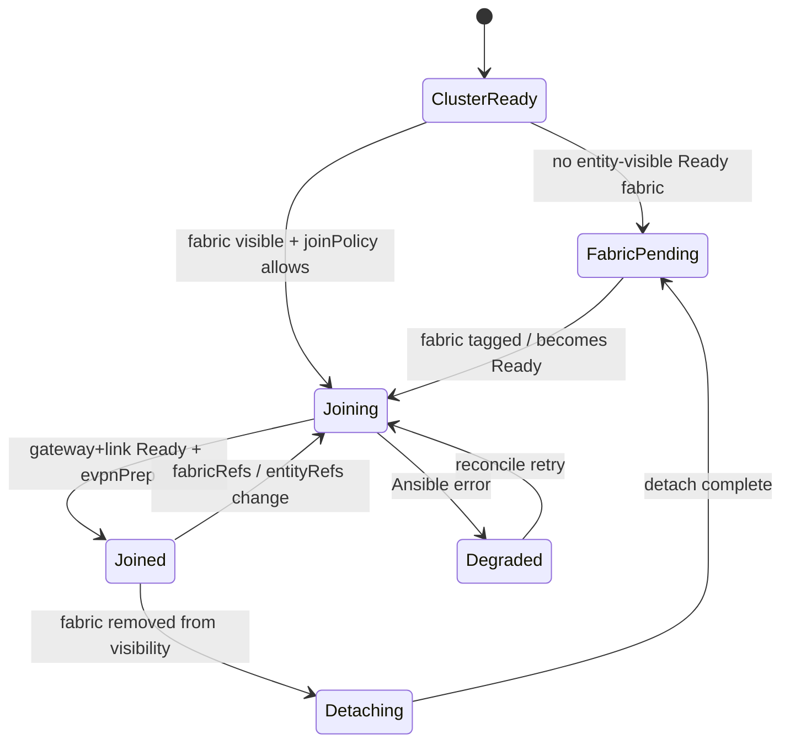
```mermaid
stateDiagram-v2
  [*] --> ClusterReady
  ClusterReady --> FabricPending: no entity-visible Ready fabric
  ClusterReady --> Joining: fabric visible + joinPolicy allows
  FabricPending --> Joining: fabric tagged / becomes Ready
  Joining --> Joined: gateway+link Ready + evpnPrep
  Joined --> Joining: fabricRefs / entityRefs change
  Joined --> Detaching: fabric removed from visibility
  Detaching --> FabricPending: detach complete
  Joining --> Degraded: Ansible error
  Degraded --> Joining: reconcile retry
```

### 15.5 Mode C — External tagging mechanism

Use when auto-join is undesirable (regulated environments, shared multi-entity fabrics, or staged rollout).

**Option C1 — Spec explicit list** (`joinPolicy: ExplicitOnly`)

```yaml
spec:
  fabric:
    joinPolicy: ExplicitOnly
    fabricRefs: [acme-fabric]
    manageGatewayAndLink: true
```

Admin/tenant (with RBAC) sets `fabricRefs` only to fabrics in the Entity’s visibility set. Reconcile (Mode B loop) performs join.

**Option C2 — Label / annotation tagging**

```yaml
metadata:
  labels:
    hybridsovereign.redhat/fabric: acme-fabric
  # multi-fabric (design):
  # hybridsovereign.redhat/fabrics: "acme-fabric,acme-dr-fabric"
```

Ansible treats labels as desired `fabricRefs` when `joinPolicy` is `AutoWhenFabricReady` **or** a dedicated `joinPolicy: LabelDriven`. Labels must still pass the entityRefs membership check (label alone cannot join Chad’s HCP to Acme’s fabric).

**Option C3 — Platform-owned CloudGateway only (no PO spec)**

Admin manually creates `CloudGateway` + `TransportLink` pointing at this PlatformOpenshift (`platformOpenshiftRef`). PlatformOpenshift reconcile **discovers** reverse references and only updates `status.fabricMembership` (read-only awareness). `manageGatewayAndLink: false`.

| Option | Who tags | Cluster mutates gateway/link? |
|--------|----------|-------------------------------|
| C1 spec.fabricRefs | Tenant/platform via CR | Yes if manageGatewayAndLink |
| C2 labels | GitOps / UI tag editor | Yes if policy allows |
| C3 manual gateway | Platform admin only | No — PO status mirrors |

### 15.6 Interaction with HybridNetwork / NetworkPlacement

```text
Entity visibility (HybridFabric.entityRefs)
        │
        ▼
PlatformOpenshift fabricMembership Joined  ←── Modes A/B/C
        │
        ▼
Attachment catalog shows backend hcp1
        │
        ▼
Tenant NetworkPlacement → backend PlatformOpenshift/hcp1
        │
        ▼
Ansible resolves TransportLink from membership / gateway
        │
        ▼
CUDN EVPN / validate on spoke
```

Placement must **fail soft** if `fabricMembership` is missing or not `Joined` (`prerequisiteReady=false`, message: “PlatformOpenshift hcp1 is not joined to a Ready fabric”).

### 15.7 Worked examples

**Acme HCP1 created before fabric**

1. `PlatformOpenshift/hcp1` provisions → Ready, `fabricMembership=[{phase:Pending}]`.  
2. Admin creates `acme-fabric` with `entityRefs: [acme-corp]`.  
3. Fabric operator (or hourly reconcile) requeues hcp1 → Mode B creates gateway/link → `Joined`.  
4. Tenant catalog shows hcp1; placements succeed.

**Acme HCP1 created after fabric Ready**

1. Fabric already tagged to acme-corp.  
2. Mode A during install creates gateway/link before playbook ends → `Joined` on first Ready.  

**Chad HCP2 must not join acme-fabric**

1. Even if someone labels `hybridsovereign.redhat/fabric=acme-fabric` on Chad’s HCP, Ansible rejects: Entity `chad` ∉ `acme-fabric.entityRefs`.  
2. Status `Degraded` / event with clear deny message.

**Entity tagged on two fabrics**

1. `preferredFabricRef: acme-fabric` or ExplicitOnly list picks one for auto gateway.  
2. Second fabric requires Explicit `fabricRefs` or second label entry if multi-join is enabled (`manageGatewayAndLink` creates one gateway per fabric).

### 15.8 Ansible / operator implementation notes

| Component | Responsibility |
|-----------|----------------|
| `platformopenshift-provision` | Call `platform_fabric_join` at end of successful install (Mode A) |
| `platformopenshift` reconcile / kind_reconcile | Always invoke join diff when cluster Ready (Mode B) |
| `hybridfabric-provision` | On Ready / entityRefs change, annotate PlatformOpenshift in tagged entity NS with `reconcileNow` |
| `cloudgateway` / `transportlink` | When `platformOpenshiftRef` set, optional back-ref status on PO |
| Shared role `platform_fabric_join` | Single implementation for A/B/C |

**Idempotency:** gateway name convention `{{ entity }}-{{ platformopenshift.name }}-gw` (e.g. `acme-corp-hcp1-gw`) so re-entry does not duplicate.

### 15.9 UI implications

Dropdown-first create/edit for entity tagging and OCP fabric attach: **§18** (Console plugins + standalone dashboards).

| Surface | Behavior |
|---------|----------|
| PlatformOpenshift create wizard | **JoinPolicySelect** + **FabricSelect** / **FabricMultiSelect** (entity-filtered) |
| PlatformOpenshift detail | Panel **Fabric membership** + action **Attach to fabric…** (same dropdowns) |
| Admin HybridFabric detail | **EntityMultiSelect** for `entityRefs`; “Member clusters” table |
| Tenant catalog / placement | **BackendSelect** dropdown only (Joined + link Up) |

### 15.10 Summary

| Question | Answer |
|----------|--------|
| How does PlatformOpenshift know about fabrics? | Via Entity → `HybridFabric.entityRefs` discovery, plus optional `spec.fabric` / labels. |
| At install? | Mode A: `platform_fabric_join` after cluster Ready; Pending if no fabric yet. |
| After install? | Mode B: reconcile on fabric tag/Ready, `reconcileNow`, or hourly period. |
| External tagging? | Mode C: `ExplicitOnly` + `fabricRefs`, labels, or admin-created CloudGateway with status mirror. |
| Goal | OCP (hosted/openstack) inside an Entity can join fabrics that Entity can see; NetworkPlacement resolves TransportLink. **AWS PlatformOpenshift cannot attach.** |
| Required at install? | **No** for fabric. See §17. AWS is always fabric-free (§15.0). |

---

## 17. PlatformOpenshift install with or without fabric / EVPN / CUDN

### 17.1 Non-negotiable product rule

`kind: PlatformOpenshift` MUST support install **with or without** fabric where fabric is allowed — and **AWS is never fabric-attached**:

| `spec.type` | Standalone install (no fabric) | Fabric / EVPN / CUDN attach |
|-------------|-------------------------------|------------------------------|
| `hosted` (CloudVirt) | **Yes** | **Optional** (§15–§17) |
| `openstack` (CloudOSO) | **Yes** | **Optional** |
| `aws` (CloudAWS) | **Yes** (only path) | **No — not supported** (§15.0) |

For **hosted** and **openstack**:

| Path | Meaning | Cluster becomes Ready? |
|------|---------|------------------------|
| **Standalone** | No HybridFabric, no EVPN, no CUDN | **Yes** — full OCP/HCP install |
| **Fabric-attached** | Joins HybridFabric; EVPN/CUDN available for HybridNetwork placements | **Yes** — same install, plus optional join |

Fabric, EVPN, and CUDN are **additive** for CloudVirt/CloudOSO-backed clusters only — not prerequisites for cluster birth, and **not available** for AWS PlatformOpenshift.

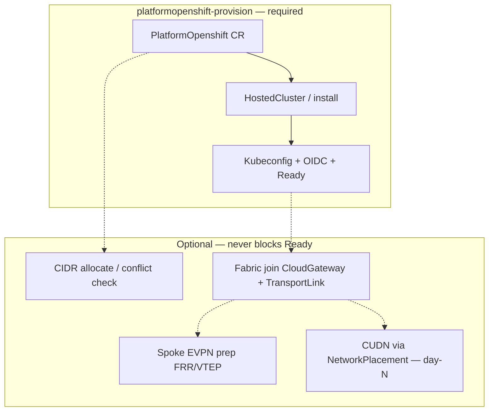
```mermaid
flowchart TB
  subgraph install["platformopenshift-provision — required"]
    PO[PlatformOpenshift CR]
    HC[HostedCluster / install]
    Kube[Kubeconfig + OIDC + Ready]
  end
  subgraph optional["Optional — never blocks Ready"]
    IPAM[CIDR allocate / conflict check]
    Join[Fabric join CloudGateway + TransportLink]
    EVPN[Spoke EVPN prep FRR/VTEP]
    CUDN[CUDN via NetworkPlacement — day-N]
  end
  PO --> HC --> Kube
  PO -.-> IPAM
  Kube -.-> Join -.-> EVPN
  Join -.-> CUDN
```

### 17.2 Separation of concerns

| Layer | When | Blocks PlatformOpenshift Ready? | Owner CR |
|-------|------|----------------------------------|----------|
| Cluster install (control plane, workers, kubeconfig, OIDC) | Always | Yes (this *is* Ready) | `PlatformOpenshift` |
| Unique cluster/service CIDRs | Recommended always | Only if `allowConflict: false` **and** hard conflict with an *explicit* peer claim — **not** because fabric is missing | `spec.networking` |
| HybridFabric join | Optional | **Never** | `spec.fabric.joinPolicy` |
| EVPN underlay prep (FRR, VTEP, CNO flags) | Optional, after join | **Never** | join + fabric roles |
| Primary CUDN + HybridNetwork overlay | Optional, tenant day-N | **Never** on PlatformOpenshift | `HybridNetwork` + `NetworkPlacement` |

**CUDN is not created at PlatformOpenshift install.** CUDN appears only when a tenant places a `HybridNetwork` onto that backend (or an explicit platform day-N job). A cluster with no placements has default OVN pod networking only.

### 17.3 Spec knobs (how to choose the path)

```yaml
apiVersion: hybridsovereign.redhat/v1alpha1
kind: PlatformOpenshift
metadata:
  name: hcp-standalone
  namespace: entity-acme-corp
spec:
  type: hosted
  hosted:
    environment: local-virt
  # --- standalone: no fabric ---
  fabric:
    joinPolicy: None              # skip fabric / EVPN / gateway entirely
    manageGatewayAndLink: false
  networking:
    allocateFromFabric: false     # use platform default IPAM pools or explicit CIDRs
    # clusterNetwork: ["10.140.0.0/14"]
    # serviceNetwork: ["172.32.0.0/16"]
```

```yaml
# --- fabric-capable (may join now or later) ---
spec:
  fabric:
    joinPolicy: AutoWhenFabricReady   # or ExplicitOnly
    manageGatewayAndLink: true
  networking:
    allocateFromFabric: true
    fabricRef: acme-fabric            # optional; discover if empty
```

| `fabric.joinPolicy` | Install outcome | Later HybridNetwork placement |
|---------------------|-----------------|-------------------------------|
| `None` | Ready; `fabricMembership=[{phase: Skipped}]` | Blocked until policy changed or Mode C gateway exists |
| `AutoWhenFabricReady` | Ready even if no fabric yet (`Pending`); joins when fabric appears | Allowed after `Joined` + TransportLink Up |
| `ExplicitOnly` | Ready; joins only listed `fabricRefs` that are Ready; otherwise Pending/Skipped per ref | Same |

### 17.4 Ansible contract (must / must-not)

| Phase | Must | Must not |
|-------|------|----------|
| Cluster provision | Create HostedCluster / ACM install; wait Ready; store kubeconfig | Fail because `HybridFabric` missing |
| Cluster provision | Fail only on real install errors (pull secret, capacity, API) | Fail because EVPN CNO flags unset |
| IPAM | Allocate unique CIDRs from fabric pools **or** built-in platform pools when no fabric | Require a Ready HybridFabric to allocate |
| Fabric join | Run `platform_fabric_join` after Ready when policy ≠ None | Roll back or delete the cluster if join fails |
| Fabric join failure | Set `fabricMembership.phase=Degraded` + message; keep `status.ready=true` for the cluster | Flip PlatformOpenshift to failed |
| CUDN | No-op at install | Create `ClusterUserDefinedNetwork` during provision |
| NetworkPlacement (later) | Create CUDN/EVPN objects; require Joined + link | Re-run full PlatformOpenshift install |

### 17.5 Status model for both paths

**Standalone Ready**

```yaml
status:
  ready: true
  message: PlatformOpenshift provisioned
  networking:
    clusterNetwork: ["10.140.0.0/14"]
    serviceNetwork: ["172.32.0.0/16"]
    allocationSource: legacy-default   # or explicit
    conflictCheck: passed
  fabricMembership:
    - fabric: ""
      phase: Skipped
      message: joinPolicy=None
```

**Fabric-attached Ready (joined)**

```yaml
status:
  ready: true
  networking:
    allocationSource: fabric-ipam
    fabricRef: acme-fabric
    conflictCheck: passed
  fabricMembership:
    - fabric: acme-fabric
      phase: Joined
      cloudGatewayRef: acme-corp-hcp1-gw
      transportLinkRef: acme-corp-hcp1-link
      evpnPrepReady: true
```

**Ready but waiting for fabric (valid)**

```yaml
status:
  ready: true
  fabricMembership:
    - fabric: ""
      phase: Pending
      message: No Ready HybridFabric visible to entity; cluster usable standalone
```

### 17.6 Tenant / UI implications

| UI | Standalone cluster | Fabric-joined cluster |
|----|--------------------|------------------------|
| PlatformOpenshift create | Default or toggle “Attach to Hybrid Fabric” off | Toggle on + fabric picker |
| PlatformOpenshift detail | Badge: **Standalone** | Badge: **Fabric: acme-fabric · Joined** |
| Tenant attachment catalog | Backend **absent** (or greyed “not on fabric”) | Backend listed when Joined + link Up |
| HybridNetwork placement | Cannot select this backend until joined | Normal placement → CUDN created |

### 17.7 Lifecycle sequences

**A. Install without fabric**

1. Create `PlatformOpenshift` with `joinPolicy: None` (or no fabric exists).  
2. Provision completes → Ready.  
3. Workloads use default cluster network.  
4. No CloudGateway, TransportLink, CUDN, or EVPN objects.

**B. Install without fabric, attach later**

1. Same as A (or `AutoWhenFabricReady` + Pending).  
2. Admin creates HybridFabric + tags Entity; or sets `fabricRefs` / flips joinPolicy.  
3. Reconcile Mode B joins → gateway/link → catalog shows backend.  
4. Tenant NetworkPlacement creates CUDN/EVPN overlays.

**C. Install with fabric already Ready**

1. `AutoWhenFabricReady` or `ExplicitOnly` with Ready fabric.  
2. After cluster Ready, join runs in same job or follow-up reconcile.  
3. Cluster Ready **and** Joined; placements can proceed.  
4. Still no CUDN until a HybridNetwork is placed.

### 17.8 What “without EVPN / CUDN” means technically

| Component | Without fabric path | With fabric path (after placement) |
|-----------|---------------------|--------------------------------------|
| OVN default pod network | Yes | Yes (unchanged) |
| `ClusterUserDefinedNetwork` primary + `transport: EVPN` | No | Yes — per HybridNetwork placement |
| FRR / VTEP / RouteAdvertisements | Not required | Required on spoke before CUDN EVPN |
| HybridNetwork / NetworkPlacement | N/A | Tenant day-N |
| Inter-site VRF to OSO1 / other HCP | No | Yes via fabric RT/VNI |

### 17.9 Acceptance tests

- [ ] PlatformOpenshift hosted install with `joinPolicy: None` reaches Ready with zero HybridFabric CRs in the cluster.  
- [ ] Same install does not create CloudGateway, TransportLink, CUDN, FRRConfiguration, or VTEP.  
- [ ] PlatformOpenshift with `AutoWhenFabricReady` and no fabric reaches Ready with `fabricMembership.Pending`.  
- [ ] After fabric is tagged and Ready, reconcile moves membership to Joined without recreating the HostedCluster.  
- [ ] NetworkPlacement onto a Skipped/Pending backend fails soft (`prerequisiteReady=false`), not by deleting the OCP.  
- [ ] First successful placement creates CUDN EVPN; deleting the placement removes CUDN without uninstalling PlatformOpenshift.

### 17.10 Summary

| Question | Answer |
|----------|--------|
| Can PlatformOpenshift install without a fabric? | **Yes — required** for hosted/openstack; **AWS is always without fabric**. |
| Can it install without EVPN? | **Yes.** EVPN prep is part of optional join / placement (hosted/openstack only). |
| Can it install without CUDN? | **Yes.** CUDN is created only by HybridNetwork placement (day-N) on fabric-capable backends. |
| Does missing fabric fail the cluster? | **No.** Ready is independent; membership is Skipped or Pending. |
| Does AWS support fabric attach? | **No** — see §15.0. UI hides fabric controls; Ansible skips join. |
| How do you opt in later? | hosted/openstack: change `joinPolicy` / `fabricRefs`, or Mode B when Entity gains a fabric; then place HybridNetworks. |


---

## 16. PlatformOpenshift IP conflict prevention (fabric IPAM)

### 16.1 Problem

Hypershift / sample installs historically hard-code the same CIDRs on every cluster:

- `clusterNetwork: 10.132.0.0/14`
- `serviceNetwork: 172.31.0.0/16`

When **HCP1, HCP2, HCP3** (and future clusters) join the **same HybridFabric**, identical pod/service ranges cause:

| Failure mode | Impact on fabric |
|--------------|------------------|
| Duplicate underlay / node identity assumptions | Ambiguous VTEP or node routes |
| Accidental Type-5 leak of clusterNetwork into EVPN | Blackholes / asymmetric routing across VRFs |
| NetworkPlacement prefix overlap with a cluster CIDR | Hybrid overlay collides with spoke pod/service space |
| Troubleshooting confusion | Same CIDR on two HCPs — unreachable “twins” |

**Design rule:** every `PlatformOpenshift` that may join a fabric MUST have a **unique, conflict-checked** address plan recorded on `status.networking` **before** HostedCluster / install manifests are applied.

**Standalone clusters (no fabric):** installation still proceeds (§17). IPAM uses built-in platform pools or explicit `spec.networking` CIDRs when `allocateFromFabric: false` or no Ready fabric exists — never blocks Ready solely because HybridFabric is absent.

### 16.2 CRD changes (implemented)

#### `HybridFabric.spec.ipam`

| Field | Purpose |
|-------|---------|
| `clusterNetworkPool.cidr` + `blockPrefixLength` | Superspace carved per OCP (e.g. `10.128.0.0/12` → `/14` blocks) |
| `serviceNetworkPool` | Per-cluster service CIDRs (e.g. `172.30.0.0/15` → `/16`) |
| `machineNetworkPool` | Optional node/underlay blocks (VTEP-adjacent) |
| `hybridOverlayReserved[]` | CIDRs reserved for `NetworkPlacement` prefixes — never allocated as cluster/service/machine |
| `denyOverlappingClusterCidrs` | Default true — reject overlapping joins |

#### `PlatformOpenshift.spec.networking`

| Field | Purpose |
|-------|---------|
| `allocateFromFabric` | Default **true** — carve from fabric IPAM |
| `fabricRef` | Which fabric pools to use (else discover) |
| `clusterNetwork` / `serviceNetwork` / `machineNetwork` | Explicit override (still conflict-checked) |
| `allowConflict` | Escape hatch (must stay false for fabric members) |

#### `PlatformOpenshift.status.networking`

Records allocated CIDRs, `allocationSource` (`fabric-ipam` \| `explicit` \| `legacy-default`), and `conflictCheck` (`passed` \| `failed`).

Also: `spec.fabric` join policy fields and `status.fabricMembership[]` (see §15).

### 16.3 Ansible flow (implemented)

Task: `eda/common/tasks/platformopenshift_fabric_ipam.yml`  
Included from `platformopenshift_provision` **before** hosted/openstack/aws dispatch.

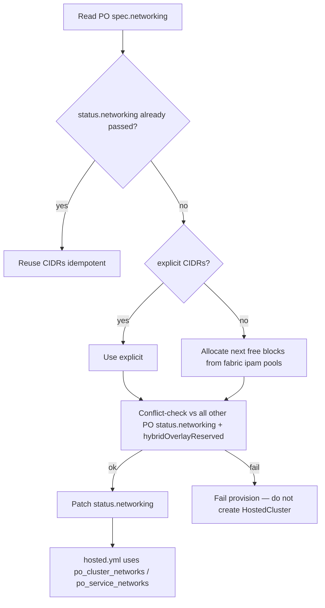
```mermaid
flowchart TD
  A[Read PO spec.networking] --> B{status.networking already passed?}
  B -->|yes| Z[Reuse CIDRs idempotent]
  B -->|no| C{explicit CIDRs?}
  C -->|yes| D[Use explicit]
  C -->|no| E[Allocate next free blocks from fabric ipam pools]
  D --> F[Conflict-check vs all other PO status.networking + hybridOverlayReserved]
  E --> F
  F -->|ok| G[Patch status.networking]
  F -->|fail| H[Fail provision — do not create HostedCluster]
  G --> I[hosted.yml uses po_cluster_networks / po_service_networks]
```

**Conflict domain:** all PlatformOpenshift `status.networking` CIDRs cluster-wide (plus fabric `hybridOverlayReserved`), not only same namespace — so Acme HCP1 and Chad HCP2 cannot silently share `10.132.0.0/14` if both are inventoried (lab default). When fabrics are isolated by VRF, overlapping **tenant overlay** prefixes across fabrics remain allowed; **cluster** CIDRs should still be globally unique in the platform inventory to avoid underlay mistakes.

### 16.4 Example — two HCPs on acme-fabric

```yaml
# HybridFabric
spec:
  ipam:
    clusterNetworkPool: { cidr: 10.128.0.0/12, blockPrefixLength: 14 }
    serviceNetworkPool: { cidr: 172.30.0.0/15, blockPrefixLength: 16 }
    hybridOverlayReserved: ["10.110.0.0/16"]
```

| Cluster | clusterNetwork | serviceNetwork |
|---------|----------------|----------------|
| hcp1 | 10.128.0.0/14 | 172.30.0.0/16 |
| hcp2 (next alloc) | 10.132.0.0/14 | 172.31.0.0/16 |

`NetworkPlacement` prefixes under `10.110.0.0/16` never get handed out as cluster CIDRs.

### 16.5 NetworkPlacement validation (required companion)

When placing a HybridNetwork onto a PlatformOpenshift backend, Ansible `validate` / `backend_openshift_evpn` MUST reject placement prefixes that overlap that cluster’s `status.networking` (or any peer on the same fabric if policy says so). Tenant overlays stay inside `hybridOverlayReserved`.

### 16.6 Operator / UI checklist

- [x] CRD fields on HybridFabric + PlatformOpenshift  
- [x] IPAM allocate + conflict task; hosted networking wired  
- [ ] UI: show allocated CIDRs on PlatformOpenshift detail; warn on create if fabric IPAM exhausted  
- [ ] NetworkPlacement playbook overlap check against `status.networking`  
- [ ] `platform_fabric_join` refuses Joined phase when `conflictCheck != passed`

### 16.7 Sample PlatformOpenshift (explicit CIDRs)

```yaml
apiVersion: hybridsovereign.redhat/v1alpha1
kind: PlatformOpenshift
metadata:
  name: hcp1
  namespace: entity-acme-corp
spec:
  type: hosted
  hosted:
    environment: local-virt
  networking:
    allocateFromFabric: true
    fabricRef: acme-fabric
    # omit clusterNetwork/serviceNetwork to auto-allocate
  fabric:
    joinPolicy: AutoWhenFabricReady
```

---

## 18. UI dropdowns — entity tagging & OCP fabric attach (console + standalone)

### 18.1 Goal

All **entity tagging** and **OpenShift (`PlatformOpenshift`) fabric attach** actions MUST be available as **PatternFly dropdown / multi-select selectors** — not free-text name fields — in both:

| Surface | Package | Audience |
|---------|---------|----------|
| OpenShift Console dynamic plugin (admin) | `ui/packages/admin-console-plugin` | Platform fabric admin |
| OpenShift Console dynamic plugin (tenant) | `ui/packages/tenant-console-plugin` | Tenant network / platform admin |
| Standalone admin SPA | `ui/packages/admin-dashboard` | Same admin flows outside Console |
| Standalone tenant SPA | `ui/packages/tenant-dashboard` | Same tenant flows outside Console |

Shared controls live in `ui/packages/shared` (extend `RbacMultiSelect` patterns into reusable `EntityMultiSelect`, `FabricSelect`, `PlatformOpenshiftSelect`, etc.) so Console plugins and standalone apps render **identical selector UX**.

**Hard rules**

- Options are loaded from live Ready CRs (list API), never hard-coded entity/fabric names.
- Dropdowns show **display name + Ready badge**; values written to CR are resource **names**.
- Cross-entity options are filtered out for tenant surfaces.
- YAML escape hatch remains available; forms are the default path.
- **AWS exclusion (§15.0):** when PlatformOpenshift `type: aws`, do not render fabric-attach dropdowns; gateway/placement selectors never list AWS PlatformOpenshift for EVPN fabric.

### 18.2 Selector inventory (required)

| Selector ID | Type | Writes | Used on |
|-------------|------|--------|---------|
| `EntityMultiSelect` | Multi-select dropdown + chips | `HybridFabric.spec.entityRefs[].name` | Admin create/edit HybridFabric |
| `FabricSelect` | Single-select | `PlatformOpenshift.spec.networking.fabricRef`, `spec.fabric.preferredFabricRef`, gateway `fabricRef`, link `fabricRef`, optional `HybridNetwork.spec.fabricRef` | Admin + tenant (filtered). **Hidden for PlatformOpenshift type=aws** |
| `FabricMultiSelect` | Multi-select | `PlatformOpenshift.spec.fabric.fabricRefs` when `joinPolicy=ExplicitOnly` | PlatformOpenshift create/edit — **hosted / openstack only** |
| `JoinPolicySelect` | Single-select enum | `PlatformOpenshift.spec.fabric.joinPolicy` | PlatformOpenshift create/edit — **hidden when type=aws** (AWS has no fabric attach — §15.0) |
| `PlatformOpenshiftSelect` | Single-select | CloudGateway `platformOpenshiftRef` / backend name | Admin Register CloudGateway; options **type hosted or openstack only** (exclude aws) |
| `BackendSelect` | Single-select (kind + name) | `NetworkPlacement.spec.backend` | Tenant placement; Joined+link-Up; **CloudOSO, CloudVirt, PlatformOpenshift hosted/openstack** — never AWS PlatformOpenshift for fabric EVPN |
| `CloudOSOSelect` / `CloudVirtSelect` | Single-select | Gateway / placement backends | Admin gateway; tenant placement (**fabric-capable backends**) |
| `TransportLinkSelect` | Read-only or single-select (advanced) | Normally **auto-resolved**; optional override in admin advanced panel | Admin Transport Link create uses GatewaySelect instead |
| `CloudGatewaySelect` | Single-select | `TransportLink.spec.cloudGatewayRef` | Admin Create Transport Link |

### 18.3 Admin — HybridFabric entity tagging (dropdown)

**Surfaces:** Console `AdminHybridFabricsPage` / create wizard · Standalone `admin-dashboard` → Fabrics → Create / Edit.

```text
+------------------------------------------------------------------+
|  Entities that may use this fabric *                             |
|  [ EntityMultiSelect ▼ ]                                         |
|    ☑ acme-corp     Ready · NS entity-acme-corp                   |
|    ☐ chad          Ready · NS entity-chad                        |
|    ☐ partner-a     Ready                                         |
|  Selected chips: [ acme-corp × ]                                 |
|  Helper: One entity per fabric recommended for strong isolation. |
+------------------------------------------------------------------+
```

| Behavior | Detail |
|----------|--------|
| Data source | `GET entities.hybridsovereign.redhat` (cluster/namespaced per platform) — only `status.ready=true` (or phase ready) |
| Empty state | “No Ready Entities — create an Entity first” |
| Persist | `spec.entityRefs: [{name: "acme-corp"}, ...]` |
| Edit | Same multi-select; removing an entity blocked in UI if HybridNetworks still bound (call admission / show error from API) |
| Standalone parity | Same component import from `@hybridsovereign/shared` |

### 18.4 Admin / tenant — PlatformOpenshift fabric attach (dropdowns)

**Surfaces:** Console `AdminPlatformDetailPage` / `TenantPlatformDetailPage` / create PlatformOpenshift · Standalone admin + tenant dashboards → Platforms → Create / Edit → **Fabric** step.

**Show this step only when `spec.type` is `hosted` or `openstack`.** If the user selects **AWS**, omit the entire Fabric attachment panel and show a static note: “AWS PlatformOpenshift clusters do not attach to Hybrid Fabric / EVPN / CUDN. Use CloudOSO or CloudVirt-backed OpenShift for fabric networking.”

```text
+------------------------------------------------------------------+
|  Fabric attachment                                               |
|  Join policy   [ JoinPolicySelect ▼  Auto when fabric ready    ] |
|                                                                  |
|  when ExplicitOnly:                                              |
|  Fabrics       [ FabricMultiSelect ▼ ]                           |
|                  ☑ acme-fabric   ASN 65010 · Ready · tagged you  |
|                  ☐ chad-fabric   (disabled — entity not tagged)  |
|                                                                  |
|  when Auto / Explicit:                                           |
|  Preferred     [ FabricSelect ▼  acme-fabric                   ] |
|  IPAM fabric   [ FabricSelect ▼  (same or inherit preferred)   ] |
|                                                                  |
|  ☐ Manage CloudGateway + TransportLink automatically             |
|  Tunnel type   [ none ▼ ]                                        |
+------------------------------------------------------------------+
```

| Behavior | Detail |
|----------|--------|
| Fabric options | Only fabrics where `entityRefs` contains this PlatformOpenshift’s Entity |
| Disabled options | Fabrics that do not tag this entity — visible greyed with tooltip “Entity not tagged on this fabric” |
| `joinPolicy: None` | Hide fabric multi-select; show info “Standalone install — no EVPN/CUDN until attached later” |
| Attach later | Detail page action **Attach to fabric…** opens same dropdowns; patches `spec.fabric` + annotate `reconcileNow` |
| OCP tagging label Mode C | Optional advanced: map `FabricSelect` → label `hybridsovereign.redhat/fabric` |

### 18.5 Admin — CloudGateway / TransportLink dropdowns

```text
Register Cloud Gateway
  Fabric     [ FabricSelect ▼ ]          # Ready fabrics
  Cloud type [ openshift ▼ ]
  Backend    [ PlatformOpenshiftSelect ▼ ]  # Ready POs in entities tagged on selected fabric
             or [ CloudOSOSelect ▼ ] / [ CloudVirtSelect ▼ ]

Create Transport Link
  Fabric     [ FabricSelect ▼ ]
  Gateway    [ CloudGatewaySelect ▼ ]    # gateways for that fabric, Ready landing zone
  Tunnel     [ none | wireguard | … ▼ ]
```

Backend dropdown **re-filters** when Fabric changes. Selecting a PlatformOpenshift that is not yet Joined is allowed (gateway create can drive join); show warning chip “Cluster fabricMembership Pending”.

### 18.6 Tenant — placement & catalog (dropdowns only)

```text
Place Hybrid Network
  Fabric (if entity has >1)  [ FabricSelect ▼ ]
  Backend kind               [ PlatformOpenshift | CloudOSO | CloudVirt ▼ ]
  Backend                    [ BackendSelect ▼ ]   # only catalog rows: Joined + TransportLink Up
  Prefixes                   CIDR fields
  Transport (read-only)      acme-hcp1-link · Up     # resolved, not a free-text field
```

Standalone `tenant-dashboard` uses the same `BackendSelect` against the attachment catalog API/ConfigMap projection.

### 18.7 Shared component API (implementation sketch)

```tsx
// ui/packages/shared — reuse across console plugins + standalone
<EntityMultiSelect
  value={entityRefs}                 // string[]
  onChange={setEntityRefs}
  readyOnly
/>
<FabricSelect
  entityName={entity}                // filter entityRefs membership
  value={fabricRef}
  onChange={setFabricRef}
  readyOnly
/>
<FabricMultiSelect entityName={entity} value={fabricRefs} onChange={...} />
<JoinPolicySelect value={joinPolicy} onChange={...} />
<PlatformOpenshiftSelect
  entityNamespace={ns}
  fabricRef={fabricRef}              // optional further filter
  value={name}
  onChange={...}
  readyOnly
/>
```

Map to CR on submit (no raw typing of CR names in required fields).

### 18.8 Console plugin vs standalone wiring

| Concern | Console plugins | Standalone dashboards |
|---------|-----------------|------------------------|
| Auth | Console SSO / SAR | Same Keycloak / kubeconfig stack already used by dashboards |
| Routing | `console-extensions.json` pages | React Router in `admin-dashboard` / `tenant-dashboard` `App.tsx` |
| Forms | Embed shared selectors in create/edit pages | Same shared selectors in dashboard create routes |
| Lists | PF tables in plugin pages | Same tables or thin wrappers |
| Feature flag | Optional `hybridVpcSelectors: true` until CRD fields ship | Same flag via dashboard config |

**Do not** implement entity/fabric attach as YAML-only in one surface and dropdowns in the other — parity is required.

### 18.9 Page / route checklist

| Action | Console admin plugin | Console tenant plugin | Standalone admin | Standalone tenant |
|--------|----------------------|-----------------------|------------------|-------------------|
| Tag fabric → entities | HybridFabric create/edit `EntityMultiSelect` | — (read-only fabric summary) | Same | — |
| Attach OCP → fabric | Platform create/edit + detail “Attach” | Platform create/edit (own NS) + detail | Same | Same |
| Gateway backend OCP | `PlatformOpenshiftSelect` | — | Same | — |
| Placement backend | — | `BackendSelect` dropdown | — | Same |
| Join policy | Dropdown on Platform form | Dropdown on Platform form | Same | Same |

### 18.10 Validation & empty / error copy

| Condition | Dropdown UX |
|-----------|-------------|
| No Ready Entities | EntityMultiSelect disabled + link “Create Entity” |
| No fabrics tag this entity | FabricSelect empty: “Ask platform admin to tag your Entity on a HybridFabric” |
| joinPolicy None | Fabric selectors hidden |
| Selected fabric not Ready | Option badge Not Ready; submit blocked |
| PlatformOpenshift not Joined | BackendSelect omits it for tenants; admin gateway select shows warning |
| IPAM / conflict failed | Show status.networking.conflictMessage near FabricSelect |

### 18.11 Acceptance tests (UI)

- [ ] Admin can tag one or more Entities on HybridFabric **only** via EntityMultiSelect (no required free-text entity field).  
- [ ] PlatformOpenshift create exposes JoinPolicySelect + FabricSelect/MultiSelect for **hosted/openstack**; **AWS hides fabric controls** (§15.0).  
- [ ] Tenant BackendSelect lists only CloudOSO / CloudVirt / fabric-joined hosted|openstack PlatformOpenshift — never AWS PlatformOpenshift for EVPN placement.  
- [ ] Identical selector behavior in Console plugins and standalone admin/tenant dashboards (shared package).  
- [ ] Changing FabricSelect re-filters PlatformOpenshiftSelect / BackendSelect options without page reload.

### 18.12 Summary

| Need | UI answer |
|------|-----------|
| Entity tagging on fabric | **EntityMultiSelect** dropdown on HybridFabric create/edit (console + standalone admin) |
| OCP attach to fabric | **JoinPolicySelect** + **FabricSelect** / **FabricMultiSelect** on PlatformOpenshift **hosted/openstack only** (console + standalone); **AWS: no fabric UI** |
| Gateway / placement binding | **PlatformOpenshiftSelect** (non-AWS) / **CloudOSOSelect** / **CloudVirtSelect** / **BackendSelect** — never free-text CR names; never AWS for fabric EVPN |
| Parity | Shared components in `ui/packages/shared` consumed by `*-console-plugin` and `*-dashboard` |
