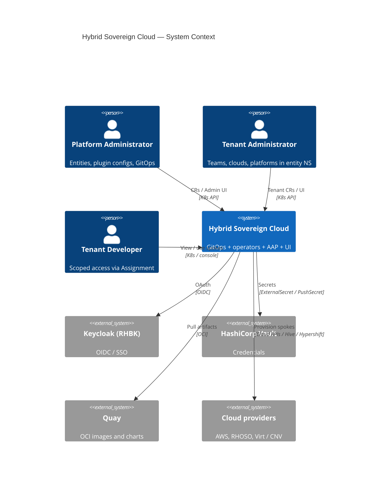
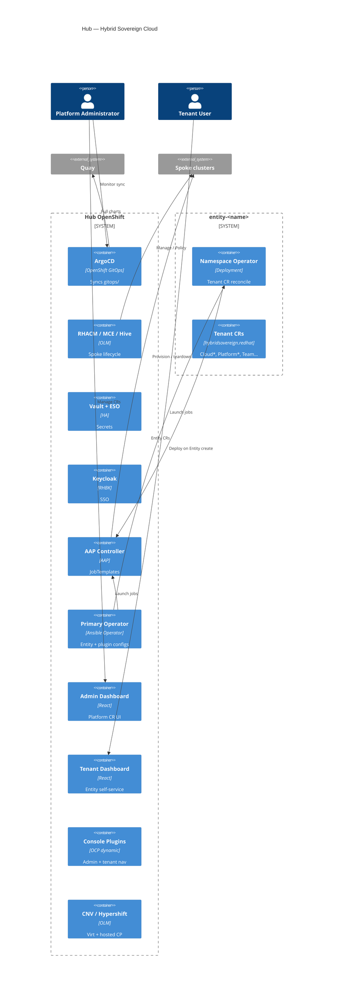
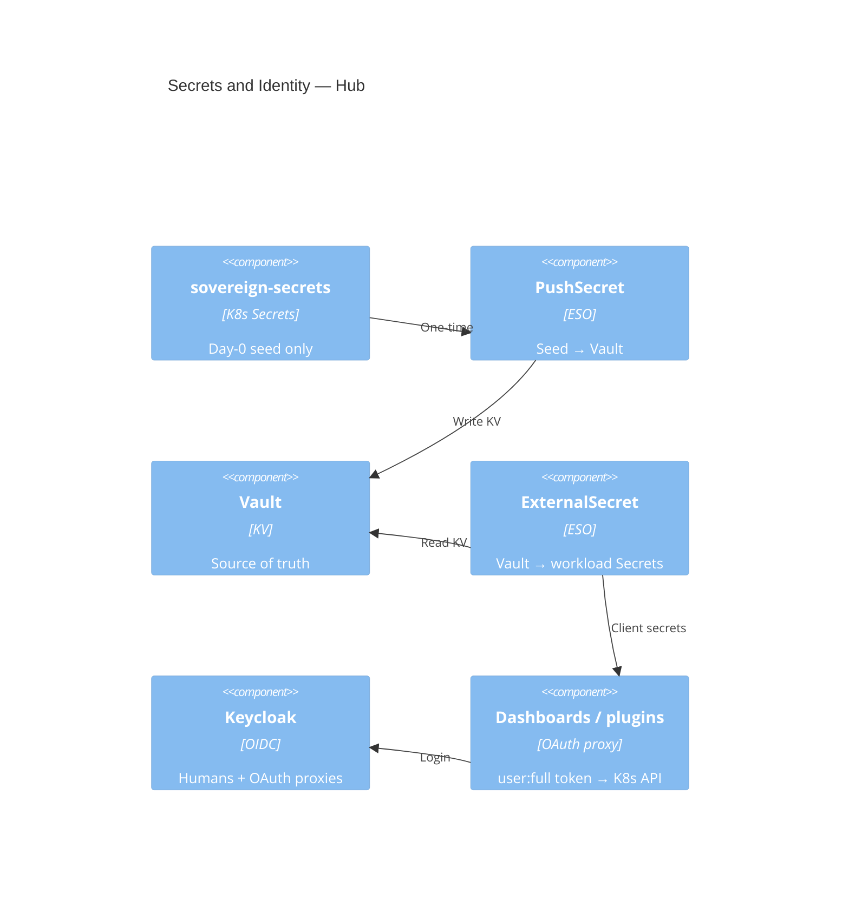
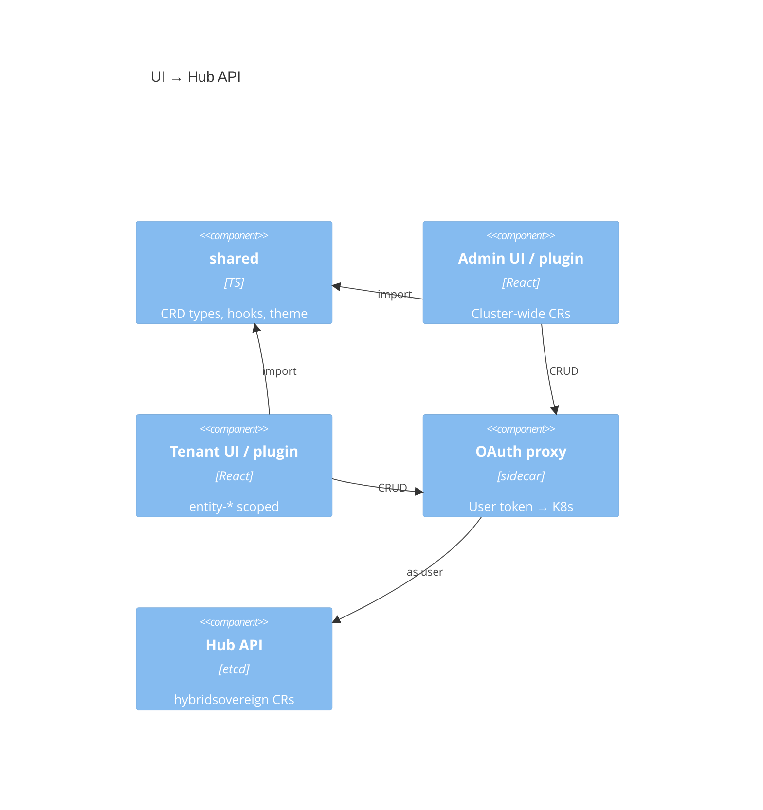
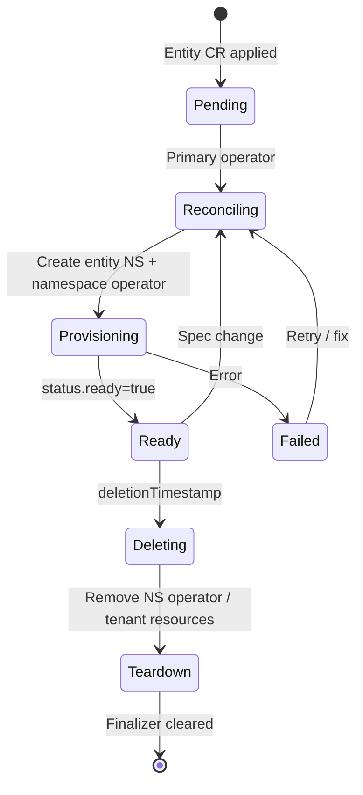
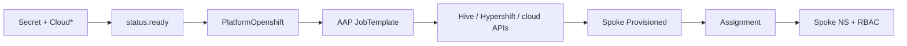

# Hybrid Sovereign Cloud — C4 Architecture

**API group:** `hybridsovereign.redhat/v1alpha1`  
**Runtime deploy:** ArgoCD sync of `gitops/`  
**Last updated:** 2026-09-25

Day-2 usage (CRDs, workshop, how-tos): [`../../docs/README.md`](../README.md).

This document is the **only** C4 model for the platform. It describes the **current** single-hub design. Operators launch **AAP JobTemplates** directly. There is no Kafka/AMQ event bus and no separate central/services cluster pair.

---

## Table of contents

1. [L1 — System context](#l1--system-context)
2. [L2 — Containers (hub)](#l2--containers-hub)
3. [L3 — Operators](#l3--operators)
4. [L3 — Clouds and platforms](#l3--clouds-and-platforms)
5. [L3 — Secrets and identity](#l3--secrets-and-identity)
6. [L3 — Platform services](#l3--platform-services)
7. [L3 — UI](#l3--ui)
8. [L3 — IAAC git sync (optional)](#l3--iaac-git-sync-optional)
9. [L4 — Entity lifecycle](#l4--entity-lifecycle)
10. [L4 — Provisioning flow](#l4--provisioning-flow)
11. [Namespaces and placement](#namespaces-and-placement)
12. [Non-negotiables](#non-negotiables)

---

## L1 — System context

Hybrid Sovereign Cloud is a multi-tenant hybrid cloud management platform on **one OpenShift hub**. Platform admins onboard entities, register clouds, and provision spoke OpenShift clusters. Tenants self-service teams, projects, assignments, and cloud environments inside `entity-*` namespaces.



### Actors

| Actor | Does |
|-------|------|
| Platform Administrator | Entity onboarding, plugin configs, GitOps |
| Tenant Administrator | Cloud\*, Platform\*, Team, Assignment in `entity-*` |
| Tenant Developer | Work in Assignment-scoped spoke namespaces |

### External systems

| System | Role |
|--------|------|
| Keycloak (RHBK) | SSO for UI, console, Vault OIDC |
| Vault | All credentials (never in Git) |
| Quay | Images and Helm OCI charts |
| RHACM / MCE / Hive | Spoke and HostedCluster lifecycle |
| AAP | JobTemplates for provision / teardown |
| AWS / RHOSO / CNV | Where spokes run |

### Topology

| Role | What |
|------|------|
| **Hub** | Single OpenShift: ArgoCD, ACM/MCE, Vault, Keycloak, AAP, operators, UIs, CNV, `entity-*` |
| **Spokes** | PlatformOpenshift clusters (`openstack` \| `aws` \| `hosted`) |

---

## L2 — Containers (hub)



---

## L3 — Operators

Two Ansible Operator tiers. Heavy work is **AAP JobTemplates**, not in-process long plays and not Kafka consumers.

```mermaid
C4Component
    title Operators → AAP

    Container_Boundary(primary, "Primary Operator — sovereign-cloud") {
        Component(entity, "Entity role", "Ansible", "NS + namespace operator")
        Component(pluginCfg, "Plugin config roles", "Ansible", "RbacConfig, AAPConfig, QuayConfig")
    }

    Container_Boundary(ns, "Namespace Operator — entity-*") {
        Component(tenancy, "Tenancy roles", "Ansible", "Team, Project, Persona, Assignment")
        Component(cloud, "Cloud roles", "Ansible", "CloudAWS, CloudOSO, CloudVirt")
        Component(plat, "Platform role", "Ansible", "PlatformOpenshift")
        Component(orgs, "Plugin org roles", "Ansible", "Rbac, AAPOrg, QuayOrg, Vault, VaultKV")
    }

    Component(aap, "AAP Controller", "JobTemplates", "Provision / teardown")

    Rel(entity, ns, "Creates Deployment")
    Rel(tenancy, aap, "Assignment jobs")
    Rel(cloud, aap, "Cloud prep jobs")
    Rel(plat, aap, "Cluster build jobs")
```

### CR ownership

**Primary** (`operator/primary/` — watches `sovereign-cloud` / `sovereign-cloud-plugins`):

| Kind | Role |
|------|------|
| Entity | Create `entity-<name>` + namespace operator |
| RbacConfig, AAPConfig, QuayConfig | Platform plugin config |

**Namespace** (`operator/namespace/` — one Deployment per entity):

| Kind | Role |
|------|------|
| Team, Project, Persona, Assignment | Tenancy |
| CloudAWS, CloudOSO, CloudVirt | Cloud registration |
| PlatformOpenshift | Spoke provision (`openstack` \| `aws` \| `hosted`) |
| Rbac, AAPOrg, QuayOrg, Vault, VaultKV | Plugin orgs |
| Hybrid\* / Network\* / UIHealthChecker | Networking / health (as enabled) |

Code: `operator/primary/watches.yaml`, `operator/namespace/watches.yaml`. Runtime images/charts: `gitops/`.

---

## L3 — Clouds and platforms

```text
Secret (creds) → Cloud* ready → PlatformOpenshift → Hive / Hypershift → Spoke
                                      ↓
                              Team + Assignment → spoke NS + RBAC
```

| Kind | Meaning |
|------|---------|
| **CloudAWS** | AWS account + Route53 child domain |
| **CloudOSO** | RHOSO / OpenStack environment |
| **CloudVirt** | CNV / virt target for hosted clusters |
| **PlatformOpenshift** | Spoke cluster on that cloud |

| `spec.type` | Requires | Spec block |
|-------------|----------|------------|
| `openstack` | CloudOSO ready | `spec.openstack.environment` |
| `aws` | CloudAWS ready | `spec.aws.environment` |
| `hosted` | CloudVirt ready | `spec.hosted.environment` |

Credentials: `credentialsSecretRef` or `vaultPath` — never in Git.  
How-tos: [`docs/how-to/`](../../docs/how-to/).

---

## L3 — Secrets and identity



| Rule | Detail |
|------|--------|
| No secrets in Git | Charts use ExternalSecret / PushSecret only |
| Day-0 | Manual Secrets in `sovereign-secrets` → PushSecret → Vault |
| Humans | Keycloak OIDC |
| Workloads | Vault Kubernetes auth via ESO |
| UI | User OAuth token for CRUD — never pod SA for user actions |

---

## L3 — Platform services

All on the **hub** (enabled set varies by lab pins in GitOps):

| Service | Role |
|---------|------|
| ArgoCD | Sync `gitops/` |
| RHACM / MCE / Hive | ManagedCluster, ClusterDeployment, HostedCluster |
| Vault + External Secrets | Credentials |
| Keycloak (RHBK) | SSO |
| AAP Controller | JobTemplates |
| ODF / Quay / Postgres | Storage / registry / DB as enabled |
| CNV + Hypershift | CloudVirt and `type: hosted` platforms |

Not part of the active architecture: Kafka / AMQ Streams, AAP EDA activations, Event Forwarder, dual-cluster chart copies.

---

## L3 — UI

Four packages under `ui/` plus `@hybridsovereign/shared`:

| Package | Audience | Deploy |
|---------|----------|--------|
| Admin dashboard | Platform admins | `sovereign-cloud` |
| Tenant dashboard | Tenant users | `sovereign-cloud` |
| Admin console plugin | Platform admins in OCP console | ConsolePlugin |
| Tenant console plugin | Tenants in OCP console | ConsolePlugin |



Creates the same CRs as `oc apply`. Usage: [`docs/usage/ui/`](../../docs/usage/ui/README.md).

---

## L3 — IAAC git sync (optional)

When enabled, a Python StatefulSet (`iaac/`) lists `hybridsovereign.redhat` CRs on the hub, strips status/secrets, and mirrors YAML to Gitea for audit. Credentials via Vault → ExternalSecret. Not on the critical provision path.

---

## L4 — Entity lifecycle



| Step | What happens |
|------|----------------|
| 1 | `Entity` created in `sovereign-cloud` |
| 2 | Primary operator validates `description`, `billingID` |
| 3 | Namespace `entity-<name>` + namespace operator Deployment |
| 4 | Status `ready`; tenant CRs can be created |
| 5 | On delete: tear down tenant resources; **never** delete `sovereign-*` NS |

Status fields of interest: `status.ready`, `status.status`, `status.entity`, `status.message`.

---

## L4 — Provisioning flow



| Watch | Command |
|-------|---------|
| Clouds | `oc get cloudaws,cloudoso,cloudvirt -n entity-<e>` |
| Platforms | `oc get platformopenshift -n entity-<e>` |
| Hive / HCP | `oc get clusterdeployment,hostedcluster -A` |
| ACM | `oc get managedcluster` |
| AAP | Job links on CR status when present |

Workshop: [`docs/workshop/`](../../docs/workshop/README.md).

---

## Namespaces and placement

| Namespace | Contents |
|-----------|----------|
| `openshift-gitops` | ArgoCD |
| Vault / ESO / Keycloak / AAP NS | Platform services |
| `sovereign-cloud` | Primary operator, dashboards, console plugins |
| `sovereign-cloud-plugins` | Plugin config CRs; IAAC when enabled |
| `sovereign-secrets` | Day-0 seeds (not GitOps-owned) |
| `entity-<name>` | Namespace operator + tenant CRs |

| CR type | Namespace |
|---------|-----------|
| Entity | `sovereign-cloud` |
| RbacConfig, AAPConfig, QuayConfig | `sovereign-cloud-plugins` |
| Cloud\*, Platform\*, Team, Project, Assignment, Rbac, orgs… | `entity-<name>` |

Entity namespaces must carry label `hybridsovereign.redhat/entity`.

---

## Non-negotiables

1. **No secrets in Git** — Vault + ExternalSecret / PushSecret only.  
2. **Never delete `sovereign-*` namespaces.**  
3. **GitOps after bootstrap** — platform via `gitops/`; `oc` for investigation (and lab tenant CRs).  
4. **One hub** — no central/services split.  
5. **Operators → AAP** — no Kafka/EDA path.

---

## Related (active only)

| Doc | Purpose |
|-----|---------|
| [`docs/README.md`](../README.md) | Usage index |
| [`docs/flow.md`](../../docs/flow.md) | Simple flow |
| [`docs/usage/crds/`](../../docs/usage/crds/README.md) | CRD usage |
| [`docs/workshop/`](../../docs/workshop/README.md) | Hands-on labs |
| [`docs/ztp.md`](../../docs/ztp.md) | GitOps contract |
| [`specs/README.md`](../../specs/README.md) | Feature specs |
