# Hybrid Sovereign Cloud — Technical Reference

Single technical reference for the **current** single-hub platform (Operators → AAP, `gitops/`). Day-2 usage: [`../../docs/README.md`](../README.md). C4: [`c4.md`](c4.md).

## Table of contents

1. [OCI Registry (Quay)](#oci-registry-quay)
2. [Keycloak (Red Hat Build of Keycloak)](#keycloak-red-hat-build-of-keycloak)
3. [Ansible Execution Environment](#ansible-execution-environment)
4. [Red Hat Advanced Cluster Security (RHACS)](#red-hat-advanced-cluster-security-rhacs)
5. [HashiCorp Vault](#hashicorp-vault)
6. [AAP — Ansible Automation Platform](#aap-ansible-automation-platform)
7. [Ansible Flow: VMware Credential Bootstrap (vmware-init role)](#ansible-flow-vmware-credential-bootstrap-vmware-init-role)
8. [Developer Tutorial: OpenShift Virtualization and MTV Setup](#developer-tutorial-openshift-virtualization-and-mtv-setup)
9. [Technical: OpenShift Virtualization (CNV)](#technical-openshift-virtualization-cnv)
10. [Technical: Migration Toolkit for Virtualization (MTV)](#technical-migration-toolkit-for-virtualization-mtv)
11. [OpenShift Data Foundation (ODF) — Noobaa](#openshift-data-foundation-odf-noobaa)
12. [Red Hat Quay Registry](#red-hat-quay-registry)
13. [Crunchy Postgres for Kubernetes (PGO)](#crunchy-postgres-for-kubernetes-pgo)
14. [Gitea - Self-Hosted Git Service](#gitea-self-hosted-git-service)
15. [Sovereign Cloud Dashboard](#sovereign-cloud-dashboard)
16. [Dashboard API Reference](#dashboard-api-reference)
17. [Plugin RBAC Operator — Technical Reference](#plugin-rbac-operator-technical-reference)
18. [Tenancy Dashboard](#tenancy-dashboard)
19. [Plugin Vault Operator](#plugin-vault-operator)
20. [Plugin AAP Operator](#plugin-aap-operator)
21. [Plugin Quay Operator](#plugin-quay-operator)
22. [Observability — Prometheus Metrics & Kubernetes Events](#observability-prometheus-metrics-kubernetes-events)
23. [Operator Performance — Concurrent Reconciles](#operator-performance-concurrent-reconciles)
24. [Cleanup Procedures — Hub reset](#cleanup-procedures-hub-reset)
25. [Phased Deployment Sequence](#phased-deployment-sequence)
26. [Keycloak–Vault OIDC Integration](#keycloak-vault-oidc-integration)
27. [Cluster Builds ApplicationSet](#cluster-builds-applicationset)
28. [Cluster Builds — OpenStack Path](#cluster-builds-openstack-path)
29. [ocp-base Chart — Base Configuration for Provisioned Clusters](#ocp-base-chart-base-configuration-for-provisioned-clusters)
30. [Two-Layer RBAC Design](#two-layer-rbac-design)
31. [PlatformOpenshift Operator — Keycloak OIDC Integration](#platformopenshift-operator-keycloak-oidc-integration)
32. [41 — Two-Layer RBAC Design](#41-two-layer-rbac-design)
33. [Per-CR RBAC Pattern](#per-cr-rbac-pattern)
34. [AAP Job Template Catalog](#aap-job-template-catalog)
35. [Security Interaction Diagrams](#security-interaction-diagrams)
36. [Platform QA Test Checklist](#platform-qa-test-checklist)
37. [OpenStack Migration UI and Operator](#openstack-migration-ui-and-operator)
38. [UIHealthChecker — On-demand URL probes](#uihealthchecker-on-demand-url-probes)
39. [Hybrid VPC EVPN — OpenStack (OSO) + OpenShift Virt](#hybrid-vpc-evpn-openstack-oso-openshift-virt)
40. [Platform Deviations & Remediation Tracker](#platform-deviations-remediation-tracker)

---

## OCI Registry (Quay)

### What it does

The OCI registry stores Helm charts as OCI artifacts. ArgoCD pulls charts from here to deploy to clusters.

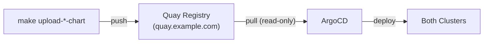

### Access Model

| Account | Access | Used for |
|---|---|---|
| Admin token (`OCI_REGISTRY_TOKEN`) | Read + Write | Creating repos, pushing charts |
| Robot account (`hybrid-sovereign+pull`) | **Read-only** | ArgoCD pulling charts |

### Charts stored

| Chart | OCI Path | Version |
|---|---|---|
| rhacm | `oci://quay.example.com/hybrid-sovereign/rhacm` | 0.5.0 |
| sovereign-namespaces | `oci://quay.example.com/hybrid-sovereign/sovereign-namespaces` | 0.2.1 |
| rhbk | `oci://quay.example.com/hybrid-sovereign/rhbk` | 0.10.0 |
| rhbk-config | `oci://quay.example.com/hybrid-sovereign/rhbk-config` | 0.4.0 |
| acs | `oci://quay.example.com/hybrid-sovereign/acs` | 0.2.0 |
| vault | `oci://quay.example.com/hybrid-sovereign/vault` | 0.5.0 |
| aap | `oci://quay.example.com/hybrid-sovereign/aap` | 0.5.1 |
| odf | `oci://quay.example.com/hybrid-sovereign/odf` | 0.5.0 |
| quay | `oci://quay.example.com/hybrid-sovereign/quay` | 0.5.1 |
| crunchy-postgres | `oci://quay.example.com/hybrid-sovereign/crunchy-postgres` | 0.4.0 |
| gitea | `oci://quay.example.com/hybrid-sovereign/gitea` | 0.4.0 |
| external-secrets | `oci://quay.example.com/hybrid-sovereign/external-secrets` | 0.1.2 |
| ansible-job | `oci://quay.example.com/hybrid-sovereign/ansible-job` | 0.1.2 |
| vault-secret-store | `oci://quay.example.com/hybrid-sovereign/vault-secret-store` | 0.3.0 |
| sovereign-jobs | `oci://quay.example.com/hybrid-sovereign/sovereign-jobs` | 0.1.0 |

### How OCI_REGISTRY is parsed

The `OCI_REGISTRY` env var can be:
- A hostname: `quay.example.com`
- A full URL: `https://quay.example.com/organization/hybrid-sovereign`

The Makefile extracts:
- **OCI_HOST**: `quay.example.com` (used for `helm registry login`)
- **OCI_NAMESPACE**: `hybrid-sovereign` (used as the OCI path prefix)

---

## Keycloak (Red Hat Build of Keycloak)

### What it does

Keycloak provides identity and access management (IAM) for the platform. It runs on the hub in HA mode within the dedicated `rhbk` namespace.

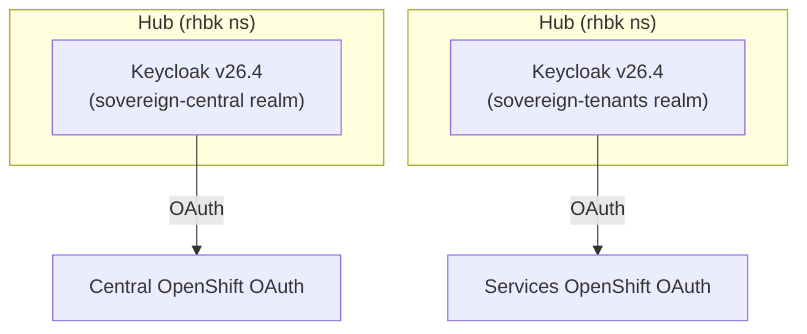

### Namespace

All Keycloak resources (operator, instances, secrets) live in the `rhbk` namespace on the hub.

### Realms

| Realm | Cluster | Purpose |
|---|---|---|
| `sovereign-central` | Hub | Admin access to hub |
| `sovereign-tenants` | Hub | Tenant access to hub |

### Clients

| Client | Realm | Role |
|---|---|---|
| `sovereign-central` | sovereign-central | Service account, OAuth for hub |
| `sovereign-tenants-services` | sovereign-tenants | Service account, OAuth for hub |

### Deployment

- **Namespace:** `rhbk` (dedicated)
- **Operator:** `rhbk-operator` (channel `stable-v26.4`, OLM Subscription)
- **HA mode:** 2 instances per cluster
- **Dev mode:** HTTP enabled, embedded H2 database (production: external PostgreSQL + TLS)
- **Charts:**
  - `rhbk` (v0.10.0) — operator + Keycloak instance
  - `rhbk-config` (v0.4.0) — Ansible configuration job

### OAuth integration

The `keycloak-oauth` Ansible role configures OpenShift OAuth to use Keycloak as an identity provider. For the hub, the route certificate is signed by the ingress operator CA. The role:

1. Reads the ingress CA from `default-ingress-cert` ConfigMap in `openshift-config-managed`
2. Creates a `keycloak-services-ca` ConfigMap in `openshift-config`
3. References it via `ca.name` in the OAuth OpenID provider spec

This prevents `x509: certificate signed by unknown authority` errors.

### Ansible Configuration Pipeline

The `rhbk-config` chart deploys a Kubernetes Job that:

1. Obtains admin token from Keycloak master realm
2. Creates `sovereign-central` realm (idempotent)
3. Creates `sovereign-central` client with service account

The Ansible runner image is built from `bootstrap/ansible/imagebuild/ansiblerunner/Containerfile` and includes:
- The playbook at `/runner/project/configure-keycloak.yml`
- All roles at `/runner/project/roles/`
- Keycloak, Kubernetes, and OpenShift CLI tools

### Chart Split Architecture

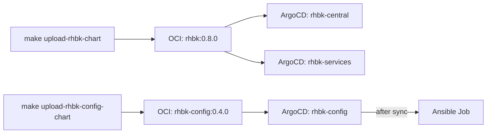

---

## Ansible Execution Environment

### What it is

A container image (`ansible-runner`) that contains all Ansible collections and CLI tools needed to configure the platform.

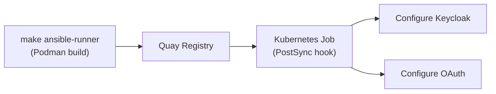

### Base Image

`registry.redhat.io/ansible-automation-platform-26/ee-supported-rhel9:2.0-1777391447`

### Installed Collections

| Collection | Purpose |
|---|---|
| `infra.aap_configuration` | AAP configuration |
| `community.aws` | AWS automation |
| `openstack.cloud` | OpenStack automation |
| `middleware_automation.keycloak` | Keycloak realm/client management |
| `community.general` | General utilities |
| `kubernetes.core` | Kubernetes/OpenShift API operations |

### Installed CLIs

| CLI | Purpose |
|---|---|
| `oc` / `kubectl` | OpenShift/Kubernetes operations |
| `openstack` | OpenStack CLI |
| `helm` | Helm chart management |

### Build and Push

```bash
make ansible-runner
```

This:
1. Creates the Quay repository (if needed)
2. Logs in to the image registry
3. Builds the container with Podman
4. Pushes to `quay.example.com/hybrid-sovereign/ansible-runner:latest`

---

## Red Hat Advanced Cluster Security (RHACS)

### Overview

ACS provides vulnerability management, compliance, network segmentation,
and runtime threat detection for the hub.

### Deployment

| Component | Cluster | Namespace |
|-----------|---------|-----------|
| Operator | Hub | `rhacs-operator` |
| Hub | Hub | `stackrox` |
| Console Plugin | Hub | cluster-scoped |

### Chart: `bootstrap/helm/charts/acs`

- **Operator**: OLM Subscription from `redhat-operators`, channel `stable`
- **Central**: `platform.stackrox.io/v1alpha1` CR with HA scanner
- **Console Plugin**: `ConsolePlugin` CR for OpenShift console integration

### ArgoCD Applications

- `acs-central` — full stack on hub (operator + Central instance)
- `acs-services` — operator-only on hub (SecuredCluster added later)

### Dynamic Plugin

The `rhacs` console plugin is registered via a `ConsolePlugin` CR and enabled
in the OpenShift `Console` operator configuration.

---

## HashiCorp Vault

### Overview

Vault provides secrets management, encryption-as-a-service, and PKI for the Sovereign Cloud platform. Two Vault clusters are deployed: `vault-central` (hub) and `vault-services` (hub).

### Deployment

| Component | Cluster | Namespace | Mode |
|-----------|---------|-----------|------|
| vault-central | Hub | `vault` | HA Raft (3 replicas) |
| vault-services | Hub | `vault` | HA Raft (3 replicas) |
| vault-central-namespace | Hub | `vault-central` | Init secret backup |

#### vault-central (Primary)

All platform secrets live in `vault-central`. It is the single source of truth for:
- OCI registry credentials
- Keycloak admin credentials (single hub)
- Vault init keys for both vaults
- Dashboard OAuth secrets
- Gitea admin credentials
- Keycloak client secrets

#### vault-services (Tenant)

`vault-services` is used by the Plugin Vault operator to provision dedicated Vault instances per tenant. It does NOT store platform-level secrets.

### Chart: `bootstrap/helm/charts/vault`

Wraps the upstream HashiCorp Vault Helm chart with OpenShift overrides:
- `global.openshift: true`
- HA Raft mode, 3 replicas
- Images mirrored to `quay.example.com/hybrid-sovereign/`
- OpenShift Route (TLS edge termination)
- UI + Agent Injector enabled

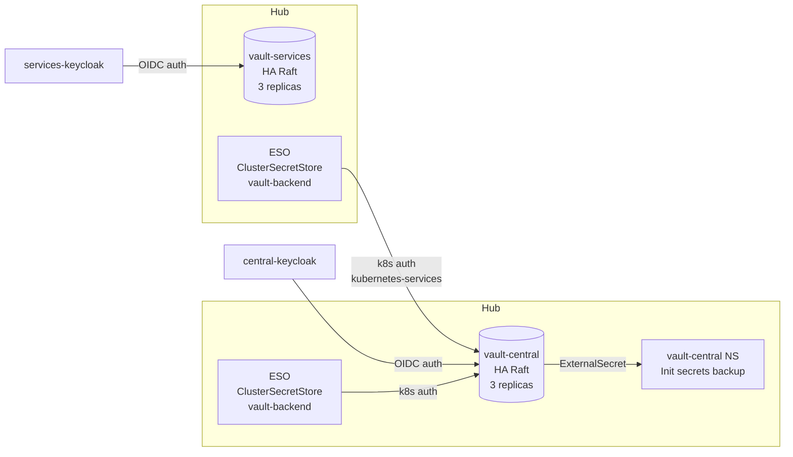

### Authentication Methods

#### Kubernetes Auth (for External Secrets Operator)

Two Kubernetes auth mounts are configured on `vault-central`:

| Mount | Cluster | Purpose |
|-------|---------|---------|
| `kubernetes-central` | Hub | ESO SA token review (hub) |
| `kubernetes-services` | Hub | ESO SA token review (hub) |

The ESO ServiceAccount `external-secrets-vault-sa` in the `external-secrets` namespace is bound to the `external-secrets-policy` role (read on `central/*`) on both mounts.

**Setup:** Configured by the `vaultK8sAuth` Ansible job at sync wave 26, after vault initialization.

#### OIDC Auth (for human access)

| Vault | OIDC Provider | Realm | Admin Group |
|-------|---------------|-------|-------------|
| vault-central | central-keycloak | `sovereign-central` | `sovereign-admin` |
| vault-services | services-keycloak | `sovereign-tenants` | `sovereign-admin` |

The `sovereign-admin` Keycloak group maps to the `sovereign-admin-policy` (full access) on both vaults.

**Setup:** Configured by the `vaultOidcAuth` Ansible job at sync wave 29.

#### Token Auth (init-only)

The Vault root token is used **only** during initialization (vault-init job, wave 23). After k8s auth is configured (wave 26), the root token should not be used for routine operations.

**Deviation from best practice:** Root token is stored in k8s Secret `vault-init-secrets` for the vault-kv job at wave 24 and backup in `vault-central` namespace. Future improvement: use short-lived root token and revoke after init.

### KV Engines

| Path | Purpose |
|------|---------|
| `central/` | Platform secrets (all components) |

Key vault paths under `central/data/`:

| Path | Contents |
|------|----------|
| `vault-init` | root_token, unseal_keys for vault-central |
| `vault-services-init` | root_token, unseal_keys for vault-services |
| `rhbk-hub-admin` | Keycloak central admin credentials |
| `rhbk-hub-admin` | Keycloak services admin credentials |
| `keycloak-clients` | OAuth client secrets (vault, gitea, quay-central, openshift-central) |
| `oci-credentials` | OCI registry robot credentials |
| `gitea-admin` | Gitea admin user/password/token |
| `osohelper-creator-sa` | OSOHelper cross-cluster SA token |
| `dashboard-oauth` | Sovereign Dashboard OAuth cookie + client secrets |
| `tenancy-dashboard-oauth` | Tenancy Dashboard OAuth cookie + client secrets |
| `vault-services-client` | Vault OIDC client for services keycloak |
| `aap-admin` | AAP admin credentials |
| `quay-admin` | Quay admin credentials |

### Initialization Sequence

```
Wave 15: vault-central deployed (HA Raft, uninitialized)
Wave 15: vault-services deployed (HA Raft, uninitialized)
Wave 20: vault-services-init job (initializes vault-services, stores keys in vault-central NS)
Wave 23: vault-init job (initializes vault-central, stores keys in vault-init-secrets)
Wave 24: vault-kv job (enables KV v2 engine at central/)
Wave 25: deliver-vault-token job (creates vault-central-token on hub)
Wave 26: vault-k8s-auth job (enables kubernetes auth on both vaults, creates ESO roles/policies)
Wave 29: vault-oidc-auth job (enables OIDC auth with Keycloak on both vaults)
```

### ClusterSecretStore

Two `ClusterSecretStore` resources named `vault-backend` (one per cluster) connect ESO to vault-central using k8s auth:

| Cluster | Chart | Auth Mount | SA |
|---------|-------|------------|----|
| Hub | vault-secret-store v0.3.0 | `kubernetes-central` | `external-secrets-vault-sa` |
| Hub | vault-secret-store v0.3.0 | `kubernetes-services` | `external-secrets-vault-sa` |

### vault-central Namespace

A dedicated `vault-central` namespace stores backup copies of init secrets:
- `vault-init-secrets-copy` — vault-central root token + unseal keys
- `vault-services-init-secrets-copy` — vault-services root token + unseal keys

These are delivered via ExternalSecret from vault-central KV. They provide a cluster-native fallback reference without requiring vault CLI access.

### Ansible Roles

| Role | Purpose |
|------|---------|
| `vault-init` | Initialize + unseal vault-central, store keys |
| `vault-kv` | Create KV v2 engine `central/` |
| `vault-k8s-auth` | Enable kubernetes auth mounts, create ESO policy + role |
| `vault-oidc-auth` | Enable OIDC auth with Keycloak on both vaults |
| `deliver-vault-token` | Create vault-central-token secret on hub |

---

## AAP — Ansible Automation Platform

**Last updated:** 2026-09-25

AAP on the **hub** runs JobTemplates launched by Hybrid Sovereign operators (Cloud\*, Platform\*, Assignment, plugins).

| Component | Where | Role |
|-----------|-------|------|
| Controller | Hub `aap` | Job execution for platform automation |
| Automation Hub | Optional | Content |

**Retired:** AAP EDA / Kafka rulebook activations; separate “services” vs “central” AAP instances.

---

## Ansible Flow: VMware Credential Bootstrap (vmware-init role)

### Role Location

`bootstrap/ansible/roles/vmware-init/`

### Playbook

`bootstrap/ansible/project/vmware-init.yml`

### Trigger

The `vmwareInit` sovereignJob in `bootstrap/helm/central/values.yaml` runs this playbook as a Kubernetes Job (syncWave `"24"`, after Vault KV engine is available at wave `"24"`).

### Task Sequence

```
1. Read vmware-bootstrap-credentials Secret from sovereign-cloud-jobs
   (kubernetes.core.k8s_info, retries: 10, no_log: true)

2. Decode host/username/password/cacert fields from base64
   (set_fact, no_log: true)

3. Retrieve Vault root token from vault-init-secrets Secret
   (kubernetes.core.k8s_info, no_log: true)

4. POST to Vault KV v2 API: central/data/vmware-credentials
   (uri module, POST, no_log: true)
   Body: { data: { url, username, password, cacert } }

5. Log confirmation message (no credential values exposed)
```

### Idempotency

The `uri` POST to Vault KV v2 creates a new version if the path already exists. This is safe and idempotent — re-running after credential rotation writes version N+1 to Vault, and the ExternalSecret picks up the new version at its next refresh interval (default: 1h).

### no_log Usage

All four credential-handling tasks use `no_log: true`. The confirmation debug task does NOT use `no_log` and only prints the path, not any values.

### Variables

| Variable | Default | Source |
|---|---|---|
| `vault_addr` | `http://vault.central-vault.svc:8200` | Env var `VAULT_ADDR` |
| `vault_namespace` | `central-vault` | Env var `VAULT_NAMESPACE` |
| `vault_kv_path` | `central` | Role default |
| `vault_secret_name` | `vault-init-secrets` | Role default |
| `vmware_vault_key` | `vmware-credentials` | Role default |

---

## Developer Tutorial: OpenShift Virtualization and MTV Setup

### Prerequisites

- `oc` logged in to hub
- `make check-env` passes
- `VMWARE_HOST`, `VMWARE_USERNAME`, `VMWARE_PASSWORD` set in environment
- Vault central is initialized and the `vmwareInit` job is expected to run

### Step 1: Upload Charts to OCI

```bash
cd bootstrap

## Upload CNV chart (first time or after any chart change)
make upload-cnv-chart

## Upload MTV chart
make upload-mtv-chart
```

### Step 2: Commit and Push to Enable ArgoCD Applications

```bash
git add bootstrap/helm/central/values.yaml bootstrap/helm/central/Chart.yaml
git commit -m "feat(phase-1): enable cnv mtv ArgoCD applications"
git push origin 009-install-virtualization-vmware
```

Trigger ArgoCD to pick up the change immediately:
```bash
oc annotate application sovereign-central-apps -n openshift-gitops \
  argocd.argoproj.io/refresh=hard --overwrite
```

### Step 3: Seed VMware Credentials

```bash
cd bootstrap
make init-central-secrets
```

Then wait for `vmwareInit` Job to complete:
```bash
oc get job -n sovereign-cloud-jobs | grep vmware
## Completed
```

### Step 4: Verify CNV

```bash
oc get hyperconverged kubevirt-hyperconverged -n openshift-cnv \
  -o jsonpath='{.status.conditions[?(@.type=="Available")].status}'
## True

oc get pdb -n openshift-cnv
## virt-api-pdb, virt-controller-pdb
```

### Step 5: Verify MTV Provider

```bash
oc get externalsecret vmware-vcenter-es -n openshift-mtv
## READY=True, STATUS=SecretSynced

oc get provider vmware-vcenter -n openshift-mtv \
  -o jsonpath='{.status.conditions[?(@.type=="Ready")].status}'
## True

oc describe provider vmware-vcenter -n openshift-mtv | grep -A5 Inventory
```

### Troubleshooting

**HyperConverged stuck in Progressing**: Check OLM is healthy — `oc get csv -n openshift-cnv`. If the CSV shows `Failed`, check node resources.

**ExternalSecret showing SecretSyncedError**: The `vmwareInit` Job may not have completed yet. Check: `oc logs -n sovereign-cloud-jobs $(oc get pod -n sovereign-cloud-jobs -l job-name=vmware-init -o name)`.

**Provider NotReady**: Check `oc describe provider vmware-vcenter -n openshift-mtv`. Common cause: incorrect `VMWARE_HOST` (must be hostname reachable from cluster) or TLS cert mismatch (set `vmware.cacert` in production).

### Making Chart Changes

1. Edit files in `bootstrap/helm/charts/openshift-cnv/` or `bootstrap/helm/charts/openshift-mtv/`
2. Bump `version:` in the chart's `Chart.yaml`
3. Run `helm lint bootstrap/helm/charts/<chart>/`
4. Run `make upload-<chart>-chart`
5. Update `<chart>.chartVersion` in `bootstrap/helm/central/values.yaml`
6. Bump `bootstrap/helm/central/Chart.yaml` version
7. Commit + push + ArgoCD refresh

---

## Technical: OpenShift Virtualization (CNV)

### Overview

CNV is deployed on the hub via the `cnv` ArgoCD Application (syncWave `"12"`), which references the `openshift-cnv` Helm chart at `oci://quay.example.com/hybrid-sovereign/openshift-cnv`.

### ArgoCD Application

| Field | Value |
|---|---|
| Application name | `cnv` |
| ArgoCD project | `central` |
| Destination cluster | `https://kubernetes.default.svc` (central) |
| Destination namespace | `openshift-cnv` |
| Sync wave | `12` |
| Self-heal | true |
| Prune | true |

### Chart Resources

| Resource | Kind | Notes |
|---|---|---|
| `openshift-cnv` | Namespace | Created at wave `-1` |
| `openshift-cnv-operatorgroup` | OperatorGroup | Targets `openshift-cnv` namespace |
| `kubevirt-hyperconverged-operator-subscription` | Subscription | Channel: `stable`, source: `redhat-operators` |
| `kubevirt-hyperconverged` | HyperConverged | Wave `5`, skips dry-run |
| `virt-api-pdb` | PodDisruptionBudget | `minAvailable: 1`, selector `kubevirt.io=virt-api` |
| `virt-controller-pdb` | PodDisruptionBudget | `minAvailable: 1`, selector `kubevirt.io=virt-controller` |

### HyperConverged CR Configuration

Feature gates are configurable via `cnv.values.hyperconverged.featureGates` in `bootstrap/helm/central/values.yaml`. Default: both `deployKubeSecondaryDNS` and `enableCommonBootImageImport` are disabled to reduce resource consumption.

### Expected Status

After successful deployment:

```bash
oc get hyperconverged kubevirt-hyperconverged -n openshift-cnv \
  -o jsonpath='{.status.conditions[?(@.type=="Available")].status}'
## True

oc get deployment -n openshift-cnv | grep -E "virt-api|virt-controller"
## virt-api        2/2
## virt-controller 2/2
```

### Upgrading CNV

1. Update `subscription.channel` in `bootstrap/helm/charts/openshift-cnv/values.yaml` if changing channels
2. Bump `Chart.yaml version`
3. Run `make upload-cnv-chart`
4. Update `cnv.chartVersion` in `bootstrap/helm/central/values.yaml`
5. Commit + push → ArgoCD syncs automatically

### Dashboard Integration

CNV does not currently expose CRDs consumed by `user_dashboard` or `tenancy_dashboard`. If VM management is added to dashboards in a future feature, this section must be updated.

---

## Technical: Migration Toolkit for Virtualization (MTV)

### Overview

MTV is deployed on the hub via the `mtv` ArgoCD Application (syncWave `"28"`), which references the `openshift-mtv` Helm chart at `oci://quay.example.com/hybrid-sovereign/openshift-mtv`.

### ArgoCD Application

| Field | Value |
|---|---|
| Application name | `mtv` |
| ArgoCD project | `central` |
| Destination cluster | `https://kubernetes.default.svc` (central) |
| Destination namespace | `openshift-mtv` |
| Sync wave | `28` |
| Self-heal | true |
| Prune | true |

### Chart Resources

| Resource | Kind | Notes |
|---|---|---|
| `openshift-mtv` | Namespace | Created at wave `-1` |
| `openshift-mtv-operatorgroup` | OperatorGroup | Targets `openshift-mtv` namespace |
| `mtv-operator` | Subscription | Channel: `release-v2.7`, source: `redhat-operators` |
| `vmware-vcenter-es` | ExternalSecret | Wave `3`; pulls from Vault → `vmware-vcenter-secret` |
| `forklift-controller` | ForkliftController | Wave `5`; `controller_replicas: 2`, `ui_replicas: 2` |
| `vmware-vcenter` | Provider | Wave `6`; type `vsphere`, references `vmware-vcenter-secret` |
| `mtv-controller-pdb` | PodDisruptionBudget | `minAvailable: 1`, selector `app=forklift-controller` |

### VMware Credential Flow

```
VMWARE_HOST/USERNAME/PASSWORD (env vars on bastion)
  ↓ make init-central-secrets
  ↓ sovereign-init init chart (--set vmware.*)
  ↓ vmware-bootstrap-credentials Secret (sovereign-cloud-jobs)
  ↓ vmwareInit Ansible Job (sovereignJobs, wave 24)
  ↓ Vault KV central/data/vmware-credentials
  ↓ vmware-vcenter-es ExternalSecret (openshift-mtv, wave 3)
  ↓ vmware-vcenter-secret Kubernetes Secret (openshift-mtv)
  ↓ vmware-vcenter Provider CR (openshift-mtv, wave 6)
```

### Vault Secret Structure

Path: `central/data/vmware-credentials`

| Key | Description |
|---|---|
| `url` | `https://<VMWARE_HOST>` |
| `username` | vCenter service account username |
| `password` | vCenter service account password |
| `cacert` | PEM CA certificate (empty in lab; required in production) |

### Expected Status

```bash
## Provider ready
oc get provider vmware-vcenter -n openshift-mtv \
  -o jsonpath='{.status.conditions[?(@.type=="Ready")].status}'
## True

## ExternalSecret synced
oc get externalsecret vmware-vcenter-es -n openshift-mtv \
  -o jsonpath='{.status.conditions[?(@.type=="Ready")].status}'
## True
```

### Rotating VMware Credentials

1. Update `VMWARE_PASSWORD` in `~/.bashrc` and export
2. Run `make init-central-secrets` (re-seeds `vmware-bootstrap-credentials` Secret)
3. Delete the `vmwareInit` Job so ArgoCD recreates it:
   ```bash
   oc delete job -n sovereign-cloud-jobs -l app.kubernetes.io/name=vmware-init
   ```
4. ArgoCD recreates the Job at next sync; new credentials written to Vault
5. ExternalSecret TTL expires and re-syncs automatically (default: 1h)

### Dashboard Integration

MTV does not currently expose CRDs consumed by `user_dashboard` or `tenancy_dashboard`. If migration management is added to dashboards in a future feature, this section must be updated.

---

## OpenShift Data Foundation (ODF) — Noobaa

### Overview

ODF provides object storage via Noobaa for use by Quay and other services
that require S3-compatible bucket storage.

### Deployment

| Component | Cluster | Namespace |
|-----------|---------|-----------|
| ODF Operator | Hub | `openshift-storage` |
| Noobaa | Hub | `openshift-storage` |

### Chart: `bootstrap/helm/charts/odf`

- **Operator**: OLM Subscription, channel `stable-4.20`
- **Noobaa**: `NooBaa` CR with postgres DB backend and minimal resources

### ArgoCD Applications

- `odf-central` — Noobaa on hub
- `odf-services` — Noobaa on hub

### Usage

Once deployed, Noobaa provides:
- S3 endpoints for bucket operations
- ObjectBucketClaim support for dynamic bucket provisioning
- Used as backend storage for Quay registry

---

## Red Hat Quay Registry

### Overview

Quay provides enterprise container image registry with vulnerability
scanning (via Clair), mirroring, and access control.

### Deployment

| Component | Cluster | Namespace |
|-----------|---------|-----------|
| Operator | Hub | `quay-enterprise` |
| Registry Instance | Hub | `quay-enterprise` |
| Clair | Hub | `quay-enterprise` |

### Chart: `bootstrap/helm/charts/quay`

- **Operator**: OLM Subscription, channel `stable-3.13`
- **Registry**: `QuayRegistry` CR with object storage set to unmanaged
  (uses Noobaa buckets from ODF)

### ArgoCD Applications

- `quay-central` — full Quay on hub
- `quay-services` — full Quay on hub

### Object Storage

Quay uses Noobaa (ODF) as its object storage backend. The
`objectstorage` component is set to `managed: false` — storage
configuration must be provided via a config secret referencing
the Noobaa S3 endpoint and credentials.

---

## Crunchy Postgres for Kubernetes (PGO)

### Overview

Crunchy Postgres for Kubernetes provides production-grade PostgreSQL clusters
with HA, automated backups, and monitoring for use by RHBK, AAP, and Quay.

### Deployment

| Component | Cluster | Namespace |
|-----------|---------|-----------|
| Operator | Hub | `openshift-operators` |

### Chart: `bootstrap/helm/charts/crunchy-postgres`

- **Operator**: OLM Subscription (`crunchy-postgres-operator`) from `certified-operators`, channel `v5`
- Cluster-scoped installation (no OperatorGroup needed in `openshift-operators`)

### ArgoCD Applications

- `crunchy-postgres-central` — operator on hub
- `crunchy-postgres-services` — operator on hub

### PostgresCluster Instances (Planned)

Once the operator is running, dedicated `PostgresCluster` CRs will be created for:
- RHBK (the hub) — HA Postgres for Keycloak
- AAP (hub) — HA Postgres for Automation Platform
- Quay (the hub) — HA Postgres for registry

---

## Gitea - Self-Hosted Git Service

### Overview

Gitea provides a lightweight, self-hosted Git service on the hub for internal repository management.

### Deployment

| Property | Value |
|---|---|
| Cluster | Hub |
| Namespace | `gitea` |
| Chart | `bootstrap/helm/charts/gitea` (subchart: `gitea-charts/gitea` v12.5.3) |
| OCI location | `oci://quay.example.com/hybrid-sovereign/gitea` |
| Make target | `make upload-gitea-chart` |
| ArgoCD App | `gitea` |

### Architecture

Gitea is deployed using the upstream Gitea Helm chart as a subchart dependency. All container images are mirrored to `quay.example.com/hybrid-sovereign/` to satisfy cluster image policies.

#### Components

- **Gitea**: Main application (rootless container)
- **PostgreSQL**: Internal database (Bitnami subchart)
- **Valkey Cluster**: Cache/session store

#### Mirrored Images

| Original | Mirrored |
|---|---|
| `docker.gitea.com/gitea:1.25.5-rootless` | `quay.example.com/hybrid-sovereign/gitea:1.25.5-rootless` |
| `docker.io/bitnamilegacy/postgresql:17.6.0` | `quay.example.com/hybrid-sovereign/postgresql:17.6.0-debian-12-r4` |
| `docker.io/bitnamilegacy/valkey-cluster:8.1.3` | `quay.example.com/hybrid-sovereign/valkey-cluster:8.1.3-debian-12-r3` |
| `docker.io/bitnamilegacy/os-shell:12` | `quay.example.com/hybrid-sovereign/os-shell:12-debian-12-r51` |

### Access

Gitea is exposed via an OpenShift Route at `gitea-gitea.apps.<cluster-domain>`.

### Integration

Gitea is configured as a Keycloak OIDC client (`gitea` in the `sovereign-central` realm) for SSO authentication.

---

## Sovereign Cloud Dashboard

### Overview

The Sovereign Cloud Dashboard is a React/Node.js web application that provides a management interface for tenant entities in the Hybrid Sovereign Cloud platform. It authenticates users via OpenShift OAuth (oauth-proxy sidecar) and communicates with the Kubernetes API to manage `Entity` custom resources.

### Deployment

| Property | Value |
|---|---|
| Cluster | **Services** (deployed by central ArgoCD) |
| Namespace | `sovereign-cloud` (on hub) |
| Chart | Admin dashboard under `ui/packages/admin-dashboard` (see make targets) |
| OCI location | `oci://quay.example.com/hybrid-sovereign/sovereign-cloud-dashboard` |
| Make target | UI build/push from `hybridcloud/` (not legacy `user_dashboard/`) |
| ArgoCD App | `sovereign-cloud-dashboard` |

### Technology Stack

| Layer | Technology |
|---|---|
| Frontend | React 19, Material UI 9, Vite 8 |
| Backend | Node.js (Express 5) |
| Auth | OpenShift OAuth via `ose-oauth-proxy` sidecar |
| API | Kubernetes API (Entity CRD) using the logged-in user's OAuth access token |
| Security | Helmet.js, express-rate-limit, CSP, HSTS |
| Container | UBI9 Node.js 20 (multi-stage build) |
| Deployment | Helm chart, ArgoCD Application |
| Registry | Quay (OCI) |

### Architecture

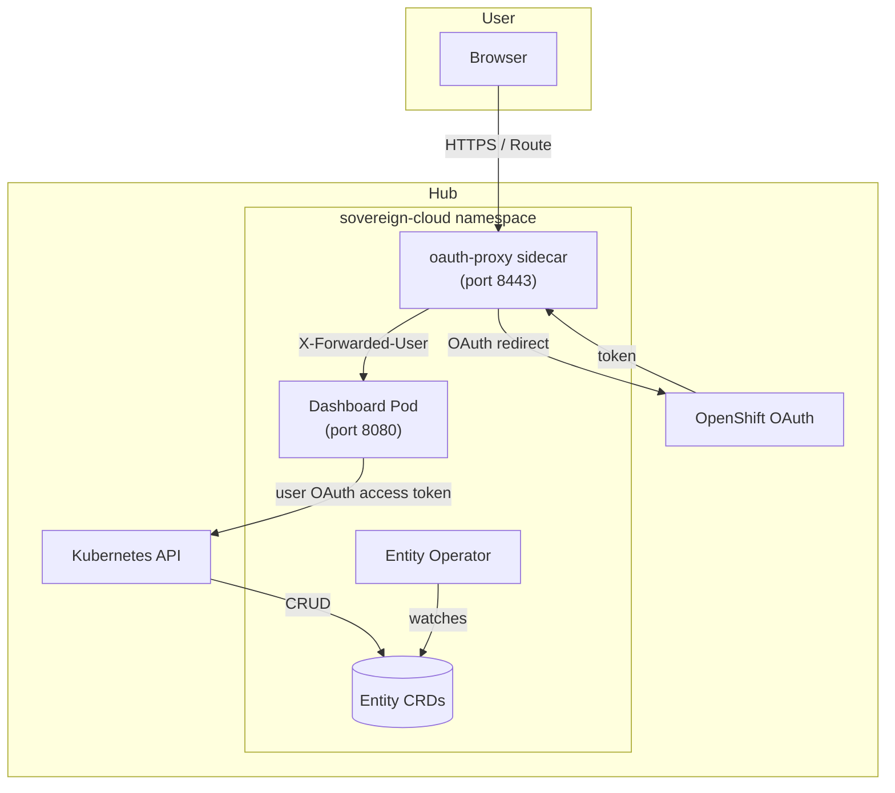

### Authentication Flow

1. User navigates to the dashboard Route
2. `oauth-proxy` sidecar intercepts the request
3. If unauthenticated, proxy redirects to OpenShift OAuth server
4. User authenticates with OpenShift credentials
5. OAuth server redirects back; proxy validates the token
6. Proxy forwards request to Express backend with `X-Forwarded-User` and `X-Forwarded-Email` headers
7. The backend obtains the user's OAuth access token (via the OAuth proxy session) and uses it for all Kubernetes API calls
8. OpenShift RBAC evaluates that user identity on each API request (no static ServiceAccount token for user-driven API access)

### Configuration

The dashboard talks to the **hub** Kubernetes API (in-cluster). Legacy build env vars `OCP_SERVICES_SERVER` / `OCP_CENTRAL_SERVER` are not used at runtime on the single-hub platform.

### Security Hardening

| Control | Implementation |
|---|---|
| TLS | Route with `reencrypt` termination; serving cert auto-provisioned |
| Auth proxy | `ose-oauth-proxy` with `--cookie-secure`, `--cookie-httponly`, `--cookie-samesite=Strict` |
| HTTP headers | Helmet.js: CSP, HSTS, X-Frame-Options, Referrer-Policy, Permissions-Policy |
| Rate limiting | `express-rate-limit` on API endpoints |
| Input validation | Server-side validation for Entity name, billingID, description, websiteLink |
| Body limits | JSON body limited to 16KB |

### Pages

#### Overview (`/overview`)

Cluster-wide **custom resource health** view (**no entity namespace filter**):

- **Donut chart** summarizing aggregate readiness across tracked kinds
- **Per-kind status tables** for quick scanning of failing or stale objects
- **Reconciliation alerts** highlighting recent errors or stalled controllers

Use this page for platform operators who need visibility across all Hybrid Sovereign CRs on the hub.

#### Services (`/services`)

Lists **OpenShift Routes** relevant to the platform (discovery via Kubernetes API). Each route row runs **live health checks** (HTTP reachability against the route URL or configured probe target) so teams see green/red signal without opening the console.

#### UI Health (`/networking/uihealth`)

Lists `UIHealthChecker` CRs (URL registry). **Refresh** reloads targets and runs pod-side probes; there is no operator reconcile for liveness. See [57-hybridvpc-uihealth.md](./57-hybridvpc-uihealth.md).

#### Entity List (`/entities`)

- Lists all `Entity` CRs from the `sovereign-cloud` namespace
- Collapsed view: name, namespace chip, billing ID
- Expanded view: full status fields, console URL link
- Delete button with confirmation dialog

#### Entity Create (`/entities/create`)

- Form with client-side and server-side validation
- Fields: name, description (multiline), billingID, websiteLink
- Name: lowercase alphanumeric with hyphens
- BillingID: alphanumeric with `._-`, max 63 chars

### Directory Structure

Canonical package: `ui/packages/admin-dashboard/` (monorepo). Legacy standalone `user_dashboard/` is removed. Helm/OCI packaging lives under `bootstrap/helm/`; see `ui/packages/admin-dashboard/README.md` for the React app layout.

---

## Dashboard API Reference

### Overview

The dashboard backend exposes a REST API that proxies requests to the Kubernetes API server. All endpoints are protected by the `oauth-proxy` sidecar — unauthenticated requests never reach the backend.

### Authentication

Authentication is handled entirely by the `ose-oauth-proxy` sidecar. The proxy injects user identity via headers:

| Header | Description |
|---|---|
| `X-Forwarded-User` | OpenShift username |
| `X-Forwarded-Email` | User email address |
| `X-Forwarded-Access-Token` | OAuth access token (not used for K8s API) |

All Kubernetes API calls use the pod's **ServiceAccount token**, not the user's OAuth token.

### Health Endpoint

| Endpoint | Method | Auth | Description |
|---|---|---|---|
| `/healthz` | GET | No (skipped by proxy) | Liveness/readiness probe |

### User Endpoint

| Endpoint | Method | Description |
|---|---|---|
| `/api/user` | GET | Returns authenticated user info from forwarded headers |

### Entity Endpoints

All entity endpoints proxy to `apis/hybridsovereign.redhat/v1alpha1/namespaces/sovereign-cloud/entities`.

| Endpoint | Method | Description |
|---|---|---|
| `/api/entities` | GET | List all Entity CRs |
| `/api/entities/:name` | GET | Get a single Entity |
| `/api/entities` | POST | Create a new Entity |
| `/api/entities/:name` | DELETE | Delete an Entity |

#### POST /api/entities

Request body:

```json
{
  "name": "acme-corp",
  "spec": {
    "description": "ACME Corporation tenant",
    "billingID": "BILL-ACME-001",
    "websiteLink": "https://acme-corp.example.com"
  }
}
```

#### Input Validation (server-side)

| Field | Rules |
|---|---|
| `name` | Required, lowercase alphanumeric + hyphens, max 253 chars |
| `billingID` | Required, alphanumeric + `._-`, max 63 chars |
| `description` | Required, string |
| `websiteLink` | Optional, string |

#### Response Format

Returns Kubernetes API responses directly. Each Entity object includes `metadata`, `spec`, and `status` fields.

#### Error Responses

| Code | Meaning |
|---|---|
| 400 | Validation error (invalid name, missing fields) |
| 401 | Not authenticated (proxy will redirect before this) |
| 403 | Forbidden (insufficient RBAC) |
| 409 | Conflict (Entity already exists) |
| 429 | Rate limit exceeded |
| 500 | Internal server error |

---

## Plugin RBAC Operator — Technical Reference

**Version:** refactorrbac v1.0
**Cluster:** Services
**Namespace:** `sovereign-cloud-plugins`
**CRD group:** `hybridsovereign.redhat`

### CRDs

#### RbacConfig

```yaml
apiVersion: hybridsovereign.redhat/v1alpha1
kind: RbacConfig
metadata:
  name: keycloak-sovereign-tenants-services
  namespace: sovereign-cloud-plugins
spec:
  type: keycloak
  secret: rhbk-hub-admin   # ExternalSecret-managed admin creds
```

**Status fields:**

| Field | Description |
|---|---|
| `clientId` | Keycloak OIDC client ID created |
| `clientSecretName` | ExternalSecret name delivering client creds |
| `vaultPath` | Vault KV path: `central/plugin-rbac/<name>` |
| `ready` | `true` when reconcile completes |

**Secret delivery chain** (Constitution Principle I):

```
Keycloak OIDC client secret
  → operator writes to Vault KV central/plugin-rbac/<name>
  → ExternalSecret reads from Vault
  → K8s Secret <name>-client (creationPolicy: Owner)
```

The operator **never** creates a `kind: Secret` directly.

#### Rbac

```yaml
apiVersion: hybridsovereign.redhat/v1alpha1
kind: Rbac
metadata:
  name: acme-platform-admins
  namespace: entity-acme-corp
spec:
  config: keycloak-sovereign-tenants-services
  description: "Platform administrators for ACME Corp"
```

**Status fields:**

| Field | Description |
|---|---|
| `group` | Keycloak group path (`entity-name/rbac-name`) — consumed by Entity operator |
| `ready` | `true` when Keycloak group is reconciled |

### Reconciliation Flow

#### RbacConfig reconcile

```
RbacConfig CR applied
  → Assert namespace == sovereign-cloud-plugins
  → Read admin Secret (ExternalSecret-managed)
  → Obtain Keycloak admin token (no_log)
  → Create/update OIDC client (confidential, serviceAccountsEnabled)
  → Assign realm-management roles to service account
  → Retrieve client secret from Keycloak (no_log)
  → Write {client_id, client_secret, keycloak_url} to Vault central/plugin-rbac/<name>
  → Create ExternalSecret → K8s Secret <name>-client
  → Update status.clientSecretName, status.vaultPath, status.ready=true
```

#### Rbac reconcile

```
Rbac CR applied in entity namespace
  → Validate namespace has hybridsovereign.redhat/entity label
  → Read RbacConfig status.clientSecretName
  → Obtain service account token via client_credentials (no_log)
  → Ensure parent entity group exists in Keycloak
  → Create/update subgroup <entity-name>/<rbac-name>
  → Set subgroup attributes (entity, billing-id, config, namespace)
  → Update status.group = <entity-name>/<rbac-name>
  → Update status.ready=true
```

#### Rbac finalizer

```
Rbac CR deleted
  → Delete Keycloak subgroup
  → Count remaining Rbac CRs in namespace (excluding self)
  → If count == 0: delete parent entity group from Keycloak
  → Emit Deleted event
```

#### RbacConfig finalizer

```
RbacConfig CR deleted
  → Delete Keycloak OIDC client
  → Read vault-init-secrets for root token (no_log)
  → DELETE central/metadata/plugin-rbac/<name> in Vault
  → Delete ExternalSecret <name>-client
```

### Security — no_log Coverage

All tasks that handle credentials use `no_log: true`:

- Decode admin/service credentials (`b64decode` set_fact)
- Obtain Keycloak access token (URI task + token set_fact)
- Read/decode Vault root token
- Write to Vault KV
- Retrieve Keycloak client secret

### Performance at Scale


Key patterns:
- Token obtained **once per reconcile** — not per-loop iteration
- Keycloak `group-by-path` endpoint used for O(1) group lookup
- Parent group deletion only fires when last Rbac CR is removed (sibling count check via K8s API cache)

### Helm chart values

| Key | Default | Purpose |
|---|---|---|
| `samples.enabled` | `true` | Deploy sample Rbac CRs for all three tenants |
| `defaultRbacConfig.enabled` | `true` | Deploy default RbacConfig pointing to Keycloak |
| `externalSecret.enabled` | `true` | Deploy ExternalSecret for admin credentials |
| `replicas` | `1` | Set to `2` for HA in production |
| `resources.limits.cpu` | `500m` | Increase for high-throughput reconciliation |

---

## Tenancy Dashboard

### Overview

The Tenancy Dashboard is a web UI on the hub. It drives tenancy and plugin custom resources using the **signed-in user’s OpenShift OAuth token** (no static ServiceAccount for user-facing API calls): `Team`, `Assignment`, `Project`, `PlatformOpenshift`, `CloudOSO`, `Rbac`, `RbacConfig`, `Vault`, `VaultKV`, `AAPOrg`, `AAPConfig`, `QuayOrg`, and `QuayConfig`.

### Deployment

| Property | Value |
|---|---|
| Cluster | **Services** (deployed by central ArgoCD) |
| Namespace | `sovereign-cloud` |
| Chart | Tenant dashboard chart under `ui/packages/tenant-dashboard` (see make targets) |
| OCI location | `oci://quay.example.com/hybrid-sovereign/tenancy-dashboard` |
| Current chart version | 0.9.8 |
| Current image tag | 3.3.0 |

### Technology stack

| Layer | Technology |
|---|---|
| Frontend | React with MUI (Material UI) |
| Backend | Node.js (Express) |
| Auth | OpenShift OAuth via `ose-oauth-proxy` sidecar |
| Theme | Red Hat red palette (`#CC0000` primary) |

### Features

- **CRUD** for `Team`, `Assignment`, `Project`, `PlatformOpenshift`, and `CloudOSO`
- **Vault / AAP / Quay**: create and manage `Vault`, `VaultKV`, `AAPOrg`, `QuayOrg` against plugin configs; coordinate with [Plugin Vault](./21-plugin-vault.md), [Plugin AAP](./22-plugin-aap.md), [Plugin Quay](./23-plugin-quay.md)
- **RBAC**: list/create `Rbac` resources; `RbacConfig` picker from `sovereign-cloud-plugins`
- **YAML view** for resources; **Assignment** inline edit
- **Resource detail** pages with tabbed sections (overview, status, related objects)
- **Overview hub** (entity-scoped): **donut chart** and resource health for accessible namespaces — for **cluster-wide** CR health (no entity filter), use [Sovereign Cloud Dashboard](./15-sovereign-dashboard.md) → **Overview**
- **Searchable sidebar** for quick navigation
- Shared UX: **StatusBadge**, **EmptyState**, **CopyButton**

### Kubernetes API access

The server uses the **logged-in user's OAuth access token** for calls to the Kubernetes API. The creator’s username is captured from the `X-Forwarded-User` header and annotated on created resources where applicable.

### Entity namespaces

Namespaces with the label `hybridsovereign.redhat/entity` scope the UI. A searchable sidebar and dropdowns refresh from the API when opened.

### Architecture

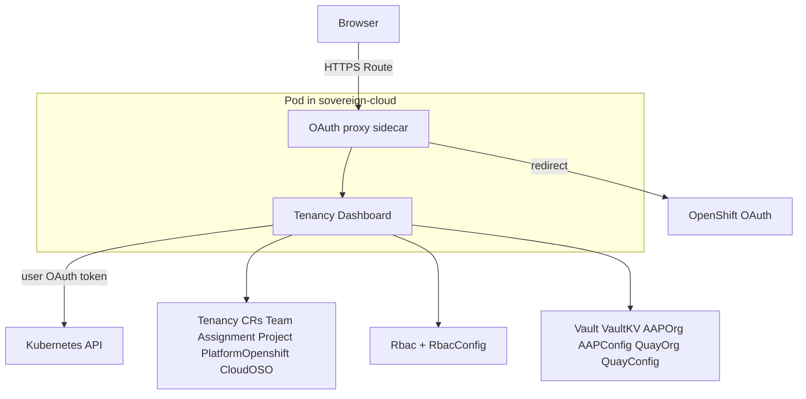

### Related docs

- [Sovereign Cloud Dashboard](./15-sovereign-dashboard.md) — entity-focused UI
- [Plugin RBAC](./19-plugin-rbac.md)
- [Plugin Vault](./21-plugin-vault.md)
- [Plugin AAP](./22-plugin-aap.md)
- [Plugin Quay](./23-plugin-quay.md)
- [Tenancy operators](./24-tenancy-operators.md)

---

## Plugin Vault Operator

### Overview

The Plugin Vault Operator (`plugin_vault`) manages dedicated HashiCorp Vault instances and KV secrets engines for tenant entities in the Hybrid Sovereign Cloud platform. Each Vault instance is scoped to a single entity namespace, providing cryptographic isolation between tenants.

### Custom Resources

#### Vault (`vaults.hybridsovereign.redhat`)

Deploys a dedicated Vault instance in an entity namespace.

| Field | Description |
|-------|-------------|
| `spec.ha` | Deploy in HA mode (default: true) |
| `spec.rbacConfig` | Reference to an RbacConfig in sovereign-cloud-plugins |
| `status.vaultUrl` | External route URL |
| `status.vaultInternalUrl` | In-cluster service URL |
| `status.adminSecretName` | Secret containing root token and unseal keys |
| `status.oidcClientId` | OIDC client registered in Keycloak |
| `status.entity` | Entity this Vault belongs to |

#### VaultKV (`vaultkvs.hybridsovereign.redhat`)

Creates a KV v2 secrets engine with RBAC-based access policies.

| Field | Description |
|-------|-------------|
| `spec.vault` | Reference to a Vault CR in the same namespace |
| `spec.vaultAdminRbac` | Array of Rbac CR names for admin access |
| `spec.vaultReaderRbac` | Array of Rbac CR names for read-only access |
| `status.kvPath` | KV v2 engine mount path |
| `status.adminPolicy` | Vault policy name for admin access |
| `status.readerPolicy` | Vault policy name for reader access |
| `status.loginUrl` | OIDC login URL for accessing Vault |

### Architecture

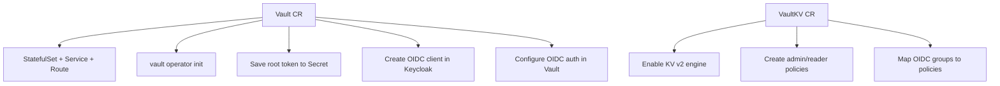

### Operator Deployment

- **Namespace**: `sovereign-cloud-plugins` (hub)
- **Chart**: `plugin-vault` (OCI: `oci://quay.example.com/hybrid-sovereign/plugin-vault`)
- **Image**: `quay.example.com/hybrid-sovereign/plugin-vault:0.0.12`
- **Chart version**: 0.2.8

### OIDC Integration

For each Vault instance, the operator:
1. Creates a Keycloak OIDC client in the `sovereign-tenants` realm
2. Enables the OIDC auth method in the Vault instance
3. Configures a default OIDC role with `groups` claim
4. VaultKV creates external identity groups mapped to Keycloak RBAC groups

### Entity Isolation

- Each Vault runs in its own entity namespace
- OIDC clients are scoped per Vault with entity-specific redirect URIs
- Vault policies restrict access to specific KV paths
- Cross-entity access is prevented by separate Vault instances and OIDC clients

### Samples

| File | Description |
|------|-------------|
| `config/samples/vault-acme-corp.yaml` | Vault for acme-corp entity (HA) |
| `config/samples/vaultkv-acme-corp.yaml` | KV store with developers admin, viewers read |
| `config/samples/vault-globex.yaml` | Vault for globex entity (standalone) |
| `config/samples/vaultkv-globex.yaml` | KV store with different RBAC groups |

---

## Plugin AAP Operator

### Overview

The **Plugin AAP** operator (`plugin_aap`) reconciles **`AAPConfig`** and **`AAPOrg`** resources. **`AAPConfig`** (only in **`sovereign-cloud-plugins`**) connects to the **Ansible Automation Platform controller**, installs an OIDC authenticator backed by **`RbacConfig`**, and reports controller URL readiness. **`AAPOrg`** (per **entity namespace**) creates an **organization** in AAP and maps **Keycloak `Rbac` groups** to AAP roles.

### Deployment

| Property | Value |
|---|---|
| Cluster | **Services** (central ArgoCD `Application`) |
| Namespace | `sovereign-cloud-plugins` |
| Chart | **`plugin-aap`** (`oci://quay.example.com/hybrid-sovereign/plugin-aap`) |
| Chart version | **0.2.1** |
| Image tag | **0.0.8** |
| Scope | Cluster-scoped operator; watches entity namespaces |

### Custom resources

| Kind | API | Placement | Role |
|---|---|---|---|
| `AAPConfig` | `hybridsovereign.redhat/v1alpha1` | `sovereign-cloud-plugins` | Controller API + OIDC/auth method configuration |
| `AAPOrg` | `hybridsovereign.redhat/v1alpha1` | Entity namespaces | Create org; bind OIDC teams to admin / job-executor |

#### `AAPConfig` spec (summary)

| Field | Required | Description |
|---|---|---|
| `spec.secret` | yes | Kubernetes `Secret` in `sovereign-cloud-plugins` with `host`, `username`, `password` for the controller API |
| `spec.rbacConfig` | yes | `RbacConfig` name used to wire Keycloak OIDC for the authenticator |

Status includes **`ready`**, **`aapControllerUrl`**, **`authMethodType`**, **`authMethodId`**, **`keycloakClientId`**, **`realm`**, and related diagnostics.

#### `AAPOrg` spec (summary)

| Field | Required | Description |
|---|---|---|
| `spec.aapConfig` | yes | `AAPConfig` name in `sovereign-cloud-plugins` |
| `spec.aapAdminRbac` | no | `Rbac` CR names mapped to **org admin** |
| `spec.aapJobExecutorRbac` | no | `Rbac` CR names mapped to **job executor** |

Status includes **`ready`**, **`orgId`**, **`orgName`**, **`aapControllerUrl`**, OAuth role mapping fields, **`conditions`**, etc.

### ExternalSecret: AAP admin credentials

When enabled in Helm, an **`ExternalSecret`** (sync wave **3**) materializes **`aap-admin-credentials`** from Vault into `sovereign-cloud-plugins`:

| Vault property | Secret key |
|----------------|------------|
| `host` | `host` |
| `username` | `username` |
| `password` | `password` |

`AAPConfig.spec.secret` must reference this (or equivalent) **`Secret`** for API access.

### AAP Controller API integration

The operator drives the controller **REST API** (URL from secrets) to configure organizations, teams, RBAC projections, and the dedicated **OIDC authenticator** advertised by **`AAPConfig`** status (`aapControllerUrl`, `authMethodId`).

### Architecture

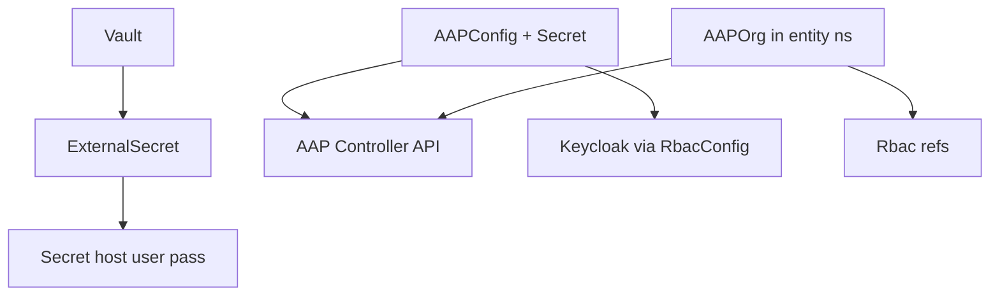

### Related docs

- [AAP workload](./10-aap.md)
- [Secrets flow](./18-secrets-flow.md)
- [Plugin RBAC](./19-plugin-rbac.md)
- [Tenancy Dashboard](./20-tenancy-dashboard.md)

---

## Plugin Quay Operator

### Overview

The **Plugin Quay** operator (`plugin_quay`) reconciles **`QuayConfig`** and **`QuayOrg`**. **`QuayConfig`** (only in **`sovereign-cloud-plugins`**) connects to **Red Hat Quay**, configures **OIDC** using a **`RbacConfig`**, and tracks registry URL readiness. **`QuayOrg`** (per **entity namespace**) creates an **organization** and maps **Keycloak `Rbac` groups** to Quay roles (admin, creator, member).

### Deployment

| Property | Value |
|---|---|
| Cluster | **Services** (central ArgoCD `Application`) |
| Namespace | `sovereign-cloud-plugins` |
| Chart | **`plugin-quay`** (`oci://quay.example.com/hybrid-sovereign/plugin-quay`) |
| Chart version | **0.2.4** |
| Image tag | **0.0.7** |
| Scope | Cluster-scoped operator; watches entity namespaces |

### Custom resources

| Kind | API | Placement | Role |
|---|---|---|---|
| `QuayConfig` | `hybridsovereign.redhat/v1alpha1` | `sovereign-cloud-plugins` | Quay API endpoint + OIDC setup |
| `QuayOrg` | `hybridsovereign.redhat/v1alpha1` | Entity namespaces | Org + OIDC-backed team memberships |

#### `QuayConfig` spec (summary)

| Field | Required | Description |
|---|---|---|
| `spec.secret` | yes | `Secret` in `sovereign-cloud-plugins` with `host`, `token` for Quay admin API |
| `spec.rbacConfig` | yes | `RbacConfig` for OIDC client / realm linkage |

Status includes **`ready`**, **`quayUrl`**, **`oidcConfigured`**, **`keycloakClientId`**, **`realm`**, **`message`**, etc.

#### `QuayOrg` spec (summary)

| Field | Required | Description |
|---|---|---|
| `spec.quayConfig` | yes | `QuayConfig` name in `sovereign-cloud-plugins` |
| `spec.quayAdminRbac` | no | `Rbac` names → Quay **admin** |
| `spec.quayCreatorRbac` | no | `Rbac` names → **creator** |
| `spec.quayMemberRbac` | no | `Rbac` names → **member** |

Status includes **`ready`**, **`orgName`**, **`quayUrl`**, **`orgUrl`**, **`loginUrl`**, **`conditions`**, etc.

### ExternalSecret: Quay admin credentials

When enabled, **`ExternalSecret`** (sync wave **3**) syncs **`quay-admin-credentials`** from Vault:

| Vault property | Secret key |
|----------------|------------|
| `host` | `host` |
| `token` | `token` |

### Quay API integration

The operator uses Quay **application credentials** (`host` + `token`) from the synced secret to create organizations, OIDC-synced teams, and role bindings surfaced in **`QuayOrg`** status (**`orgUrl`**, **`loginUrl`**).

### Architecture

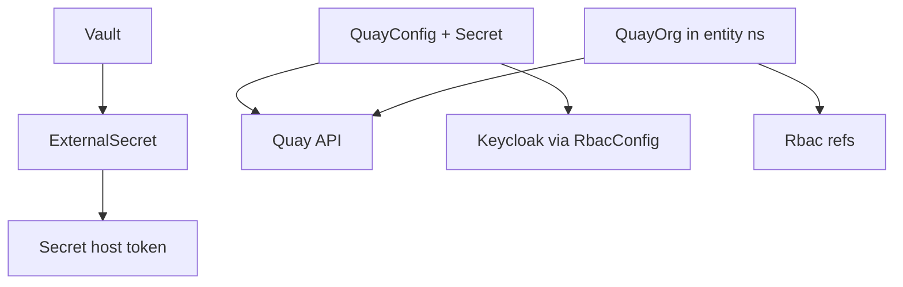

### Related docs

- [Quay registry](./12-quay.md)
- [Secrets flow](./18-secrets-flow.md)
- [Plugin RBAC](./19-plugin-rbac.md)
- [Tenancy Dashboard](./20-tenancy-dashboard.md)

---

## Observability — Prometheus Metrics & Kubernetes Events

### Overview

Operators in the Hybrid Sovereign Cloud platform expose Prometheus metrics via controller-runtime (port `8443`). Ansible-based operators use the Ansible Operator SDK; the Go-based SDX operator (`plugin-sdx`) uses controller-runtime directly. Operators emit structured Kubernetes Events for audit and troubleshooting.

### Deployed Operators and Monitoring Resources

#### Tenancy Operators (sovereign-cloud namespace)

| Operator | ServiceMonitor | PrometheusRule |
|----------|---------------|----------------|
| Entity Operator | `entity-operator-metrics` | `entity-operator-rules` |
| Team Operator | `team-operator-metrics` | `team-operator-rules` |
| Assignment Operator | `assignment-operator-metrics` | `assignment-operator-rules` |
| Project Operator | `project-operator-metrics` | `project-operator-rules` |
| PlatformOpenshift Operator | `platformopenshift-operator-metrics` | `platformopenshift-operator-rules` |
| CloudOSO Operator | `cloudoso-operator-metrics` | `cloudoso-operator-rules` |

#### Plugin Operators (sovereign-cloud-plugins namespace)

| Operator | ServiceMonitor | PrometheusRule |
|----------|---------------|----------------|
| Plugin RBAC | `plugin-rbac-metrics` | `plugin-rbac-rules` |
| Plugin AAP | `plugin-aap-metrics` | `plugin-aap-rules` |
| Plugin Quay | `plugin-quay-metrics` | `plugin-quay-rules` |
| Plugin Vault | `plugin-vault-metrics` | `plugin-vault-rules` |
| Plugin SDX | `plugin-sdx-metrics` | `plugin-sdx-rules` |

### Standard Prometheus Metrics (All Operators)

All operators built on the Ansible Operator SDK expose these controller-runtime metrics:

| Metric | Type | Description |
|--------|------|-------------|
| `controller_runtime_reconcile_total{controller,result}` | Counter | Total reconciliations by controller and result (success/error/requeue) |
| `controller_runtime_reconcile_errors_total{controller}` | Counter | Total reconciliation errors |
| `controller_runtime_reconcile_time_seconds{controller}` | Histogram | Reconciliation duration |
| `controller_runtime_max_concurrent_reconciles{controller}` | Gauge | Max concurrent reconciles |
| `workqueue_depth{name}` | Gauge | Current work queue depth |
| `workqueue_adds_total{name}` | Counter | Total items added |
| `workqueue_queue_duration_seconds{name}` | Histogram | Time items spend in queue |
| `workqueue_work_duration_seconds{name}` | Histogram | Processing time per item |
| `workqueue_retries_total{name}` | Counter | Total retries |
| `leader_election_master_status` | Gauge | Whether this instance is the leader |
| `rest_client_requests_total{code,host,method}` | Counter | K8s API requests |

### PrometheusRule Alerts

#### Per-Operator Alerts (applied to all operators)

| Alert | Expression | Severity | Description |
|-------|-----------|----------|-------------|
| `<Operator>ReconcileErrors` | `increase(controller_runtime_reconcile_total{result="error"}[5m]) > 0` | warning | Reconciliation errors in last 5 minutes |
| `<Operator>OperatorDown` | `up{job="<operator>-metrics"} == 0` | critical | Operator metrics endpoint unreachable for 5 minutes |

### Kubernetes Events

All operators emit structured events via the `events.k8s.io/v1` API.

#### Tenancy Operators

| Operator | Event Reason | Action | Description |
|----------|-------------|--------|-------------|
| Entity | Created/Updated | Reconcile | Entity namespace created/updated |
| Entity | Deleted | Delete | Entity namespace cleanup |
| Team | Created/Updated | Reconcile | Team CR synced |
| Team | Deleted | Delete | Team cleanup |
| Assignment | Reconciled | Reconcile | Assignment CR linked teams/projects/platforms |
| Assignment | Deleted | Delete | Assignment cleanup |
| Project | Created/Updated | Reconcile | Project CR reconciled |
| Project | Deleted | Delete | Project cleanup |
| PlatformOpenshift | Created/Updated | Reconcile | Platform registration updated |
| PlatformOpenshift | Deleted | Delete | Platform cleanup |
| CloudOSO | Created/Updated | Reconcile | CloudOSO configuration synced |
| CloudOSO | Deleted | Delete | CloudOSO cleanup |

#### Plugin Operators

| Operator | Event Reason | Action | Description |
|----------|-------------|--------|-------------|
| Plugin RBAC (Rbac) | Created/Updated | Reconcile | Keycloak group created/updated |
| Plugin RBAC (Rbac) | Deleted | Delete | Keycloak group removed |
| Plugin RBAC (RbacConfig) | Created/Updated | Reconcile | Keycloak client and Secret synced |
| Plugin RBAC (RbacConfig) | Deleted | Delete | Keycloak client removed |
| Plugin AAP (AAPOrg) | Created/Updated | Reconcile | AAP organization synced |
| Plugin AAP (AAPConfig) | Created/Updated | Reconcile | AAP connection configured |
| Plugin Quay (QuayOrg) | Created/Updated | Reconcile | Quay organization synced |
| Plugin Quay (QuayConfig) | Created/Updated | Reconcile | Quay connection configured |
| Plugin Vault (VaultKV) | Created/Updated | Reconcile | Vault KV engine synced |
| Plugin Vault (VaultConfig) | Created/Updated | Reconcile | Vault connection configured |
| Plugin SDX | SyncComplete | Reconcile | Full CR sync to Gitea completed (`Iaac.status.conditions`) |

### Querying Metrics

#### Example PromQL Queries

```promql
## Reconciliation rate across all operators
sum(rate(controller_runtime_reconcile_total[5m])) by (controller, result)

## Error rate for a specific operator
rate(controller_runtime_reconcile_total{controller="entity",result="error"}[5m])

## Average reconciliation duration
histogram_quantile(0.95, rate(controller_runtime_reconcile_time_seconds_bucket[5m]))

## Work queue depth across operators
workqueue_depth

## Leader election status
leader_election_master_status == 1
```

#### Viewing Events

```bash
## All events from a specific operator
oc get events.events.k8s.io -n entity-acme-corp --field-selector reason=Reconciled

## All events for a specific CR
oc get events.events.k8s.io -A | grep "plugin-rbac"

## Recent operator events across all namespaces
oc get events.events.k8s.io -A --sort-by='.metadata.creationTimestamp' | tail -20
```

---

## Operator Performance — Concurrent Reconciles

### Configuration

All operators built by this repository are configured for **10 concurrent reconciles** (`maxConcurrentReconciles: 10` in `operator/watches.yaml`).

### Operator Table

| Operator | Kind(s) | maxConcurrentReconciles | Memory Limit | Notes |
|----------|---------|------------------------|--------------|-------|
| `Entity` | Entity | 10 | 1Gi | Provisions tenant namespaces |
| `Team` | Team | 10 | 1Gi | |
| `Assignment` | Assignment | 10 | 1Gi | |
| `Projects` | Project | 10 | 1Gi | |
| `PlatformOpenshift` | PlatformOpenshift | 10 | 1Gi | |
| `plugin_rbac` | RbacConfig, Rbac | 10 | 1Gi | 2 CRD kinds |
| `plugin_aap` | AAPConfig, AAPOrg | 10 | 1Gi | 2 CRD kinds |
| `plugin_quay` | QuayConfig, QuayOrg | 10 | 1Gi | 2 CRD kinds |
| `plugin_sdx` | Iaac | 1 | 256Mi | Go controller; leader election enabled |
| `plugin_vault` | Vault, VaultKV | 10 | **2Gi** | Stateful: deploys Vault instances |
| `CloudOSO` | CloudOSO | 10 | **2Gi** | Stateful: interacts with OpenStack |

### Memory Guidance

Operators that create external infrastructure (Vault instances, OpenStack resources) have elevated memory limits:
- **plugin_vault**, **CloudOSO**: 2Gi limit / 512Mi request — handles 10 Vault instance reconcile goroutines
- All others: 1Gi limit / 256Mi request

### Tuning Background

- `maxConcurrentReconciles` determines how many CRs can be reconciled in parallel.
- With 10 concurrent reconciles and typical reconcile durations of 5–30s, a single operator pod handles 20–120 CR reconciles per minute.
- `reconcilePeriod` controls re-queue frequency on no-change events. Ranges from 5m (plugins, SDX) to 30m (Entity).
- Memory: each concurrent reconcile goroutine peaks at ~50–100MB for operators that spawn subprocesses (Ansible Runner containers). 2Gi headroom for stateful operators prevents OOMKill under load.

### Image Tags (Phase 2)

After bumping `maxConcurrentReconciles`, all operator images must be rebuilt with `make all` from each operator directory:

```bash
## Example for Entity operator
cd Entity && make all
## Repeat for: Team, Assignment, Projects, PlatformOpenshift,
## plugin_rbac, plugin_aap, plugin_quay, plugin_sdx,
## plugin_vault, CloudOSO
```

The new image tags are reflected in `bootstrap/helm/central/values.yaml`.

---

## Cleanup Procedures — Hub reset

### Overview

Destructive “clean slate” for platform workloads on the **hub** while preserving OpenShift GitOps. Prefer `./scripts/ztp-wipe.sh` for GitOps-era labs (see [docs/ztp.md](../../../docs/ztp.md)).

### Preserved

- ArgoCD (`openshift-gitops`)
- **Never delete** `sovereign-*` namespaces

### Sequence (legacy playbooks)

Older playbook names still say “services” / “central” — both target the **same hub** today:

```
1. Disable ArgoCD auto-sync on root app
2. cleanup-services-cluster.yml   # hub platform CRs / OLM (legacy name)
3. cleanup-central-cluster.yml    # hub management namespaces (legacy name)
4. cleanup-argocd.yml
5. Verify — only ArgoCD pods in openshift-gitops
```

```bash
cd bootstrap/
## disable sync on root Application, then:
ansible-playbook ansible/project/cleanup-services-cluster.yml
ansible-playbook ansible/project/cleanup-central-cluster.yml
ansible-playbook ansible/project/cleanup-argocd.yml
oc get pods -n openshift-gitops
```

### Warnings

- No automatic rollback; PVC data is lost with namespaces.
- Do not run against production tenant data.
- Never manually delete `sovereign-*` namespaces.
- Prefer GitOps wipe script over these playbooks when using `gitops/`.

---

## Phased Deployment Sequence

### Overview

After Phase 3 cleanup (full cluster reset), applications are re-deployed one at a time by enabling each Application in `bootstrap/helm/central/values.yaml`, committing, and waiting for ArgoCD to sync to `Synced + Healthy` before proceeding to the next.

All applications start with `enabled: false`. Enable one at a time, commit, wait, then proceed.

**Key constraint:** The entire deployment must proceed through central ArgoCD only. No `oc apply` or direct changes. If ArgoCD fails to sync, fix the chart, uninstall completely via ArgoCD pruning (set `enabled: false`, sync, then re-enable), and reinstall.

### Template Directory Layout

```
bootstrap/helm/central/templates/
├── centralCluster/           # Resources targeting hub
├── servicesCluster/          # Resources targeting hub
└── hybridSovereignOperators/ # Custom operators + dashboards (hub)
```

### Deployment Checklist

#### Group 1 — Namespaces + Foundation

| # | App Key (values.yaml) | Template Location | Wave | Notes |
|---|----------------------|-------------------|------|-------|
| 1 | `sovereignNamespaces` | centralCluster/ | 1 | Central namespaces |
| 2 | `sovereignNamespacesServices` | servicesCluster/ | 1 | Services namespaces |
| 3 | `sovereignJobsRbac` | centralCluster/ | 3 | Job SA + RBAC |

#### Group 2 — Storage + Platform

| # | App Key | Template | Wave | Notes |
|---|---------|----------|------|-------|
| 4 | `rhacm` | centralCluster/ | 10 | MultiClusterHub |
| 5 | `odfCentral` | centralCluster/ | 12 | ODF/NooBaa |
| 6 | `odfServices` | servicesCluster/ | 12 | |
| 7 | `crunchyPostgres` | centralCluster/ | 11 | |
| 8 | `crunchyPostgresServices` | servicesCluster/ | 11 | |

#### Group 3 — Secrets Infrastructure

| # | App Key | Template | Wave | Notes |
|---|---------|----------|------|-------|
| 9 | `externalSecrets` | centralCluster/ | 5 | ESO central |
| 10 | `externalSecretsServices` | servicesCluster/ | 5 | ESO services |
| 11 | `vault` | centralCluster/ | 15 | vault-central HA Raft |
| 12 | `vaultServices` | servicesCluster/ | 15 | vault-services HA Raft |
| 13 | `vaultServicesInit` | centralCluster/ | 20 | Init vault-services |
| 14 | `vaultSecretStore` | centralCluster/ | 22 | ClusterSecretStore (k8s auth) |
| 15 | `vaultSecretStoreServices` | servicesCluster/ | 22 | (retries until wave 26) |
| 16 | `sovereignJobs.vaultInit` | (job) | 23 | Init vault-central |
| 17 | `sovereignJobs.vaultKv` | (job) | 24 | Create KV engine |
| 18 | `sovereignJobs.deliverVaultToken` | (job) | 25 | Send token to the hub |
| 19 | `sovereignJobs.vaultK8sAuth` | (job) | 26 | Enable k8s auth → ESO starts |

#### Group 4 — Identity

| # | App Key | Template | Wave | Notes |
|---|---------|----------|------|-------|
| 20 | `rhbk` | centralCluster/ | 20 | RHBK central |
| 21 | `rhbkServices` | servicesCluster/ | 20 | RHBK services |
| 22 | `vaultCentralNamespace` | centralCluster/ | 27 | Init secret backup |
| 23 | `sovereignJobs.keycloakRealms` | (job) | 27 | Create realms |
| 24 | `sovereignJobs.keycloakGroups` | (job) | 27 | Create groups |
| 25 | `sovereignJobs.keycloakClients` | (job) | 27 | Create clients + push secrets |
| 26 | `sovereignJobs.keycloakRbac` | (job) | 27 | RBAC bindings |
| 27 | `sovereignJobs.keycloakOauth` | (job) | 27 | OAuth clients |

#### Group 5 — Keycloak Config (continued) + OIDC Auth

| # | App Key | Template | Wave | Notes |
|---|---------|----------|------|-------|
| 28 | `sovereignJobs.keycloakServicesRealms` | (job) | 28 | Services realm |
| 29 | `sovereignJobs.keycloakServicesGroups` | (job) | 28 | Services groups |
| 30 | `sovereignJobs.keycloakServicesClients` | (job) | 28 | Services clients (openshift-services, quay-services, aap) |
| 31 | `sovereignJobs.vaultOidcAuth` | (job) | 29 | Enable OIDC on both vaults |
| 32 | `sovereignJobs.keycloakTestUsers` | (job) | 32 | Create + delete test users (leave groups) |
| 33 | `sovereignJobs.giteaInit` | (job) | 35 | Init Gitea admin + API token |
| 34 | `sovereignJobs.giteaCreateRepo` | (job) | 36 | Create tenancy repo |

#### Group 6 — Platform Services

| # | App Key | Template | Wave | Notes |
|---|---------|----------|------|-------|
| 33 | `gitea` | servicesCluster/ | 18 | Gitea |
| 34 | `quay` | centralCluster/ | 35 | Quay central |
| 35 | `quayServices` | servicesCluster/ | 35 | Quay services |
| 36 | `aap` | servicesCluster/ | 30 | AAP controller+EDA |

#### Group 7 — Core Operators

| # | App Key | Template | Wave | Notes |
|---|---------|----------|------|-------|
| 37 | `entityOperator` | hybridSovereignOperators/ | 38 | |
| 38 | `teamOperator` | hybridSovereignOperators/ | 38 | |
| 39 | `projectOperator` | hybridSovereignOperators/ | 38 | |
| 40 | `assignmentOperator` | hybridSovereignOperators/ | 39 | |
| 41 | `platformOpenshiftOperator` | hybridSovereignOperators/ | 38 | |

#### Group 8 — Plugin Operators

| # | App Key | Template | Wave | Notes |
|---|---------|----------|------|-------|
| 42 | `pluginRbac` | hybridSovereignOperators/ | 39 | |
| 43 | `pluginVault` | hybridSovereignOperators/ | 39 | |
| 44 | `pluginAap` | hybridSovereignOperators/ | 39 | |
| 45 | `pluginQuay` | hybridSovereignOperators/ | 39 | |
| 46 | `pluginSdx` | servicesCluster/ | 33 | Replaces deprecated `pluginIaac` |

#### Group 9 — Dashboards

| # | App Key | Template | Wave | Notes |
|---|---------|----------|------|-------|
| 47 | `sovereignDashboard` | hybridSovereignOperators/ | 40 | User dashboard |
| 48 | `tenancyDashboard` | hybridSovereignOperators/ | 41 | Tenancy dashboard |

### Intervention Procedure

If ArgoCD sync fails for an application:

1. Investigate: `oc get application <name> -n openshift-gitops -o yaml`
2. Check pod logs: `oc logs -n <ns> -l app=<name>`
3. Fix the Helm chart or values
4. Uninstall: set `enabled: false` in values.yaml, commit, wait for ArgoCD to prune
5. Reinstall: set `enabled: true`, commit, wait for `Synced + Healthy`
6. Only proceed to next application after current is `Synced + Healthy`

---

### Deployment Status (As of 2026-05-14)

#### ✅ Completed Groups

| Group | Status | Notes |
|-------|--------|-------|
| Group 1-4 (Infrastructure) | ✅ Synced/Healthy | Vault, Keycloak, ESO, namespaces |
| Group 5 (Keycloak Config) | ✅ Synced/Healthy | Realms, groups, clients, OIDC auth configured |
| Group 6 (Platform Services - partial) | ✅ Gitea deployed | Quay and AAP pending |
| Group 7 (Core Operators) | ✅ Synced/Healthy | Entity, Team, Project, Assignment, PlatformOpenshift |
| Group 8 (Plugin Operators) | ✅ Synced/Healthy | RBAC, Vault, AAP, Quay, SDX plugins |
| Group 9 (Dashboards) | ✅ Synced/Healthy | Sovereign + Tenancy dashboards |

#### Sample CRs Deployed (All READY)

| Resource | Count | Namespaces |
|----------|-------|-----------|
| Entity | 2 | sovereign-cloud (acme-corp, globex-industries) |
| Team | 2 | entity-acme-corp, entity-globex-industries |
| Project | 2 | entity-acme-corp, entity-globex-industries |
| Assignment | 2 | entity-acme-corp, entity-globex-industries |
| PlatformOpenshift | 2 | entity-acme-corp, entity-globex-industries |
| Rbac | 3 | entity-acme-corp (x2), entity-globex-industries (x1) |
| Vault | 2 | entity-acme-corp, entity-globex-industries |
| VaultKV | 2 | entity-acme-corp, entity-globex-industries |
| AAPOrg | 2 | entity-acme-corp, entity-globex-industries (pending AAP) |
| QuayOrg | 2 | entity-acme-corp, entity-globex-industries (pending Quay) |

#### Key Deployment Fixes Applied

1. **Ansible-runner image rebuild required** for new playbooks (baked into image)
2. **Entity CRs created via job** not chart samples (billingID case mismatch)
3. **AAPOrg/QuayOrg CRs created via job** (spec.config → spec.aapConfig/quayConfig)
4. **ServerSideApply removed** from all operator Applications (CRD schema mismatches)
5. **ignoreDifferences added** for Namespace labels and ESO-managed ExternalSecret fields
6. **operator-samples job** at wave 45 creates all sample CRs and triggers resync

#### Pending

- Quay (single hub clusters) - `enabled: false`, pending ODF prerequisites
- AAP (hub) - `enabled: true` but AAPOrg CRs pending AAP backend
- CrunchyData operator - explicitly excluded per user request

---

## Keycloak–Vault OIDC Integration

### Overview

Both Vault instances (vault-central and vault-services) are configured with Keycloak OIDC as the primary authentication method for human access. The `sovereign-admin` group in each Keycloak realm maps to full admin access on its respective Vault instance.

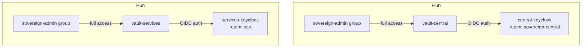

### Configuration

#### Central Vault + Central Keycloak

| Parameter | Value |
|-----------|-------|
| Auth mount | `oidc` |
| OIDC discovery URL | `https://rhbk-central.apps.central.lab.example.com/realms/sovereign-central` |
| Client ID | `vault` |
| Client secret | Vault KV `central/data/keycloak-clients` → `vault` |
| Admin group | `sovereign-admin` |
| Admin policy | `sovereign-admin-policy` (full access to `*`) |
| Default role | `sovereign-admin` |

#### Services Vault + Services Keycloak

| Parameter | Value |
|-----------|-------|
| Auth mount | `oidc` |
| OIDC discovery URL | `https://rhbk-services.apps.services.lab.example.com/realms/sso` |
| Client ID | `vault` |
| Client secret | Vault KV `central/data/vault-services-client` → `client_secret` |
| Admin group | `sovereign-admin` |
| Admin policy | `sovereign-admin-policy` (full access to `*`) |
| Default role | `sovereign-admin` |

### Setup Sequence

The OIDC integration is configured automatically by the `vaultOidcAuth` sovereign-job at sync wave 29:

```
Wave 27: keycloakClients job creates 'vault' client in sovereign-central
         and pushes client_secret to the hub/data/keycloak-clients
Wave 28: keycloakServicesRealms job creates sovereign-tenants realm
Wave 29: vaultOidcAuth job:
  1. Reads vault client secret from the hub/data/keycloak-clients
  2. Enables OIDC auth on vault-central → central-keycloak
  3. Creates sovereign-admin OIDC role + group alias
  4. Creates 'vault' client on the hub-keycloak
  5. Enables OIDC auth on vault-services → services-keycloak
  6. Creates sovereign-admin OIDC role + group alias
```

### Kubernetes Auth for ESO

In addition to OIDC for humans, vault-central has two Kubernetes auth mounts for the External Secrets Operator:

| Mount | Cluster | Purpose |
|-------|---------|---------|
| `kubernetes-central` | Hub | Hub ESO reads platform secrets |
| `kubernetes-services` | Hub | Hub ESO reads platform secrets |

Both mounts use the `external-secrets-vault-sa` ServiceAccount in the `external-secrets` namespace with the `external-secrets-policy` (read on `central/*`).

**Setup:** Configured by the `vaultK8sAuth` sovereign-job at sync wave 26.

### Vault Policy Reference

| Policy | Applies To | Capabilities |
|--------|-----------|--------------|
| `external-secrets-policy` | ESO ServiceAccount | read, list on `central/*` |
| `sovereign-admin-policy` | sovereign-admin OIDC group | create, read, update, delete, list, sudo on `*` |

### Identity Group Mapping

Vault uses an **external identity group** to map the Keycloak `sovereign-admin` group claim to the `sovereign-admin-policy`. On first successful OIDC login by a member of `sovereign-admin`, Vault creates an entity + alias bound to this group.

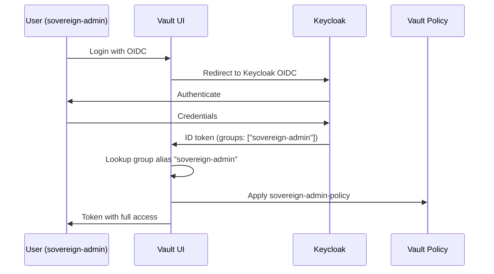

### Client Configuration in Keycloak

The `vault` client in each Keycloak realm must have:
- **Grant types**: standard flow (authorization code)
- **Redirect URIs**: `http://localhost:8250/oidc/callback` (Vault CLI), `https://vault.../ui/vault/auth/oidc/oidc/callback` (Vault UI)
- **Groups claim**: enabled (mapper that includes user groups in the token)

The Vault client for central keycloak is created by the `keycloakClients` job. The services keycloak client is created by the `vaultOidcAuth` job.

---

## Cluster Builds ApplicationSet

> **DEPRECATED (Phase 1 / Phase 5):** The `cluster-builds-clusters` ApplicationSet and the Gitea `cluster_builds` repo are **no longer used** for cluster provisioning as of operator v0.5.6 (OSO) / v0.3.6 (AWS). Both operators now deploy the `mce-cluster-build` Helm chart **directly** to the hub. `clusterBuilds.enabled=false` in `bootstrap/helm/central/values.yaml` prevents the ApplicationSet from being rendered. The associated Gitea init jobs (`giteaInit`, `giteaCreateRepo`, `giteaClusterBuildsRepo`) are also disabled.

### Overview (Historical)

The `cluster-builds-clusters` `ApplicationSet` (Helm-rendered manifest in `bootstrap/helm/central/templates/centralCluster/cluster-builds-applicationset.yaml`) provided GitOps-triggered provisioning of ACM/Hive `ClusterDeployments` sourced from `cluster_builds` in Gitea. Parameters lived under **`builds/aws/*/build.yaml`** (AWS hyperscaler flows) plus **`builds/oso/*/build.yaml`** for OpenStack. Removing a qualifying `build.yaml` pruned the generated Argo Application, which cascaded cluster teardown consistent with Hive settings.

Legacy generic Application examples under a flat top-level `aws/*.yaml` are **not** the shape modern helpers emit; workloads are nested per cluster (`builds/{provider}/{name}/`).

### Architecture

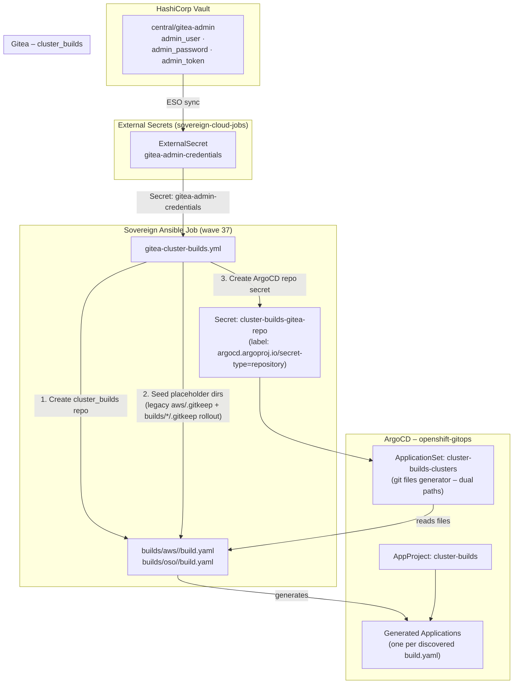

### Components

#### Sovereign Job: `giteaClusterBuildsRepo` (wave 37)

- **Playbook**: `bootstrap/ansible/project/gitea-cluster-builds.yml`
- **Runs via**: `job-gitea-cluster-builds-repo` ArgoCD Application
- **Idempotent**: All tasks guard against double-creation

Tasks performed:
1. Wait for Gitea to be reachable
2. Create `cluster_builds` repository (skipped if exists)
3. Create `aws/.gitkeep` placeholder at repo root (skipped if exists) — **legacy sentinel** tracked in `bootstrap/ansible/project/gitea-cluster-builds.yml`
4. Read `admin_token` from `gitea-admin-credentials` K8s Secret (ESO-managed from Vault)
5. Create/update `cluster-builds-gitea-repo` Secret in `openshift-gitops` with `argocd.argoproj.io/secret-type: repository` and `insecure: "true"` for the cluster-internal CA

Rolling OSO/AWS alignment adds `builds/aws/.gitkeep` and `builds/oso/.gitkeep` (or equivalent scaffolding) via the same job when extended to keep empty directories tracked for git generators—see playbook history.

#### AppProject: `cluster-builds`

- **Allows**: Any source repository, any destination namespace, any resource kind
- **Destinations**: Both hub (`https://kubernetes.default.svc`) and hub
- **Sync wave**: `-1` (created before any Applications)

#### ApplicationSet: `cluster-builds-clusters` (wave 50 via `bootstrap/helm/central/values.yaml` `clusterBuilds.syncWave`)

- **Helm manifest**: `bootstrap/helm/central/templates/centralCluster/cluster-builds-applicationset.yaml`
- **Generators**: Git file generator watches **`builds/aws/*/build.yaml`** and **`builds/oso/*/build.yaml`** in the single `cluster_builds` repo checkout (see `bootstrap/helm/central/templates/centralCluster/cluster-builds-applicationset.yaml`)
- **Mode**: `goTemplate: true` with `goTemplateOptions.missingkey=zero`
- **Template**: Multi-source Helm release (`charts/charts/mce-cluster-build` + `$values/...`) targeting `openshift-gitops`; `valueFiles` resolves via `{ index .path.segments 0..2 }` so both `builds/aws/<name>/` and `builds/oso/<name>/` trees share one template block
- **Sync policy**: Automated prune + selfHeal, CreateNamespace, ServerSideApply, SkipDryRunOnMissingResource, bounded retries

**Path reality check:** Operators commit **`builds/aws/<cluster>/build.yaml`** and **`builds/oso/<cluster>/build.yaml`**, never legacy flat `aws/<cluster>.yaml` files—the ApplicationSet derives `$values/...` paths from git generator `path.segments` so directory layout must mirror `builds/<provider>/<cluster>/helm_values/build-values.yaml`.

### Application File Schema

Each `build.yaml` discovered by the ApplicationSet (under `builds/aws/<name>/` or `builds/oso/<name>/`) must expose at minimum:

```yaml
app:
  name: <string>                  # unique Argo Application + Hive release name, e.g. ocp-qwert
  chartsTargetRevision: <string>  # charts repo branch/tag for mce-cluster-build chart
```

Helm values for the release live beside the file at `helm_values/build-values.yaml` within the same directory and are referenced through the multi-source `$values` ref.

`chartsTargetRevision` is echoed for Git provenance. The Helm chart semver applied by Argo still comes from `bootstrap/helm/central/values.yaml` → `clusterBuilds.mceChartVersion` (`cluster-builds-applicationset.yaml`), unless templating later wires `chartsTargetRevision` directly into `targetRevision`.

#### Example

```yaml
## builds/aws/ocp-qwert/build.yaml
app:
  name: ocp-qwert
  chartsTargetRevision: main
```

```yaml
## builds/oso/ocp-acme/build.yaml
app:
  name: ocp-acme
  chartsTargetRevision: main
```

### Secret Management

| Secret | Namespace | Source | Managed By |
|--------|-----------|--------|------------|
| `gitea-admin-credentials` | `sovereign-cloud-jobs` | Vault `central/gitea-admin` | ESO ExternalSecret (giteaInit job) |
| `cluster-builds-gitea-repo` | `openshift-gitops` | Derived from `gitea-admin-credentials.admin_token` | Ansible job (`gitea-cluster-builds.yml`) |

No credentials are stored in Git. The token flow is: **Vault → ESO → K8s Secret → Ansible Job → ArgoCD Repo Secret**.

### Deployment Notes

- **Wave ordering**: Job (37) → AppProject+ApplicationSet (50 via sovereign-central-apps sync)
- **TLS**: The ArgoCD repo secret includes `insecure: "true"` because Gitea uses an OpenShift internal CA not in ArgoCD's trust bundle. This is acceptable for an internal cluster-local registry.
- **Empty repo**: Until operators add real cluster directories, keep placeholder files such as `builds/aws/.gitkeep` **and** `builds/oso/.gitkeep` so both generator globs remain valid git paths. The legacy job still seeds `aws/.gitkeep`; harmonize with `builds/*` when modernizing the playbook.
- **Prune**: Deleting a `build.yaml` removes the ApplicationSet parameter, prunes the Argo Application, and (with Hive defaults) cascades cloud teardown.

### Issue Log

| # | Issue | Fix |
|---|-------|-----|
| 23 | ApplicationSet YAML parse error — `{{.app.name}}` parsed as YAML flow map key | Quoted all go-template vars with `"{{.app.name}}"` in Helm template using `{{ "{{" }}..{{ "}}" }}` escaping |
| 24 | ApplicationSet TLS error — Gitea internal CA not trusted by ArgoCD | Added `insecure: "true"` to `cluster-builds-gitea-repo` ArgoCD repo secret |

---

## Cluster Builds — OpenStack Path

> **DEPRECATED:** The OpenStack cluster build path via helper operators has been removed. This document is retained as historical reference only.

### Overview (Historical)

The `cluster_builds` Git repository federated **dual provider trees** underneath `builds/`. Operators rendered **ACM/Hive-compatible** payloads for both hyperscaler AWS and Sovereign-hosted OpenStack. This document contrasts the **`builds/oso/*`** traversal with existing AWS sequencing.

Canonical ApplicationSet Helm template lives at `bootstrap/helm/central/templates/centralCluster/cluster-builds-applicationset.yaml` alongside `cluster-builds-appproject.yaml` and `argocd-cluster-builds-repo.yaml`.

### Repository layout (`cluster_builds`)

```
cluster_builds/
├── builds/
│   ├── aws/
│   │   └── <cluster-name>/
│   │       ├── build.yaml
│   │       └── helm_values/build-values.yaml
│   └── oso/
│       └── <cluster-name>/
│           ├── build.yaml
│           └── helm_values/build-values.yaml
└── README (optional housekeeping)
```

- **AWS helpers** synthesize manifests under **`builds/aws/<name>/`**.  
- **OSO helpers** synthesize manifests under **`builds/oso/<name>/`** with parallel naming for Application metadata.

### ApplicationSet dual-path behaviour

Multi-source **`cluster-builds-clusters`** `ApplicationSet` instances discover **either** subtree:

- **`builds/aws/*/build.yaml`**
- **`builds/oso/*/build.yaml`**

`bootstrap/helm/central/templates/centralCluster/cluster-builds-applicationset.yaml` configures one `git.files` stanza enumerating **both** patterns; Helm **`valueFiles`** interpolate `$values/{{ index .path.segments 0 }}/…/helm_values/build-values.yaml` so AWS and OSO trees reuse one template stanza while keeping provider-specific path prefixes (`builds/aws/...` vs `builds/oso/...`). OSO payloads must still set **`provider.type: OpenStack`** in `helm_values/build-values.yaml`.

### Helm: `charts/charts/mce-cluster-build`

- **AWS path** sets `provider.type: AWS`.  
- **OSO path** sets `provider.type: OpenStack` with:

  - `clouds.yaml` credentials resolved from **`oso/projects/{name}/clouds-config`** (and related ExternalSecrets or SyncSecret manifests created by ACM templates).  
  - **External/provider network** identifiers required by installer + Hive validations.  
  - **Floating IP** assignments for ingress / API semantics called out inside values (mirrors helper allocation actions).

Charts remain single chart surface; divergence is wholly values-driven (`values.yaml`, `templates/cluster-deployment.yaml` OpenStack branch).

### Hive `ClusterDeployment` notes (OpenStack)

- Uses installer-compatible **`clouds.yaml`** bundle + OpenStack Keystone auth instead of IAM minted credentials.  
- Requires reachable **provider external network**, router/LB scaffolding, security groups compliant with Sovereign Ansible automation.  
- Cluster DNS remains **delegated Sovereign apex** with **Route53 `A`** records targeting **floating IP** VIPs versus AWS-alias records.

### Operational cross-checklist

| Item | Verification |
| ---- | ------------- |
| Gitea commits | Presence of **`build.yaml`** + sibling Helm values directories |
| Argo rendered app | Matches `cluster-builds` Project + multi-source Helm chart linkage |
| Provider switch | Inspect `helm_values/build-values.yaml` `provider.type` |
| Networking | Floating IP inventory reconciles with Hive machine status conditions |

---

## ocp-base Chart — Base Configuration for Provisioned Clusters

### Overview

`ocp-base` is a Helm chart that delivers baseline operator prerequisites to every OpenShift cluster provisioned by the Sovereign Cloud platform. It is deployed automatically via an ACM `ConfigurationPolicy` (`policy-basechart-operators`) that targets any `ManagedCluster` labeled `basechart: "true"`.

**OCI location**: `oci://quay.example.com/hybrid-sovereign/ocp-base` (public visibility)  
**Chart version**: `0.2.0`  
**Deployed to**: ocp-sdx-oso1, ocp-sdx-oso2, ocp-sdx-aws1 (and all future built clusters). Legacy clusters `ocp-ses8`–`ocp-ses12` are deprecated.

### Components Installed

| Component | Namespace | Source |
|---|---|---|
| External Secrets Operator | `external-secrets` | `community-operators` / `stable` channel |
| OpenShift GitOps Operator | `openshift-operators` | `redhat-operators` / `latest` channel |

### Delivery Flow

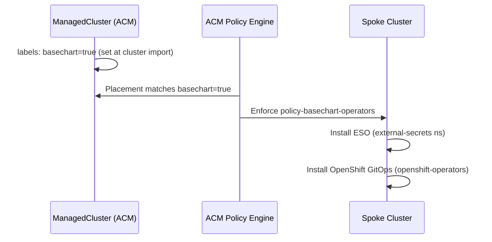

### Label Injection Points

`basechart: "true"` is applied at cluster import via the **mce-cluster-build chart** (`managed-cluster.yaml`) — label is present from initial cluster registration into ACM.

### ACM Policy Structure

The policy `policy-basechart-operators` in namespace `openshift-gitops` on hub:

```
policy-basechart-operators
├── policy-basechart-eso-namespace          (Namespace: external-secrets)
├── policy-basechart-eso-operatorgroup      (OperatorGroup: external-secrets)
├── policy-basechart-eso-subscription       (Subscription: external-secrets-operator)
└── policy-basechart-gitops-subscription    (Subscription: openshift-gitops-operator)

Placement: placement-policy-basechart-operators
  matchLabels: {basechart: "true"}

PlacementBinding: binding-policy-basechart-operators
```

### Chart Values

```yaml
externalSecrets:
  enabled: true          # set false to skip ESO install
  channel: stable
  installPlanApproval: Automatic
  source: community-operators
  sourceNamespace: openshift-marketplace

gitopsOperator:
  enabled: true          # set false to skip GitOps operator install
  channel: latest
  installPlanApproval: Automatic
  source: redhat-operators
  sourceNamespace: openshift-marketplace

vault:
  enabled: false         # future: ClusterSecretStore wiring per spoke
  url: ""
  authPath: ""
  role: ""
  secretStoreName: vault-backend
```

### Upload Procedure

```bash
## From charts repo root
export OCI_REGISTRY_TOKEN=<token>
make upload-ocp-base-chart
```

The upload target:
1. Creates/verifies the `ocp-base` repository in Quay with **public** visibility
2. Packages the chart via `helm package`
3. Pushes to `oci://quay.example.com/hybrid-sovereign/ocp-base`

### Hardening


### Deviations

None. ESO is installed via `community-operators` (same as central). GitOps uses `redhat-operators`. Both are standard OCP catalog sources available on all provisioned clusters.

### Related Components

- [`mce-cluster-build`](33-cluster-builds-appset.md) — sets `basechart: true` label on `ManagedCluster` at provision time
- Bootstrap `acm-policy-basechart.yaml` — ACM policy deploying this chart's content to spoke clusters

---

## Two-Layer RBAC Design

### Overview

The Sovereign Cloud RBAC model uses two complementary layers of Keycloak groups to control both **who can manage resources** in the platform and **what role users get inside the tools**.

```
Layer 1 (Namespace/Platform level)     Layer 2 (Tool level)
─────────────────────────────────      ──────────────────────
acme-entity-admins   → create any CR   acme-devops        → cluster-admin + OS admin
acme-cloud-admins    → create cloud     acme-developers    → member + dev access
acme-platform-admins → create clusters  acme-operators     → operator roles
acme-vault-admins    → create Vault KV  acme-quay-admins   → Quay org admin
acme-team-admins     → create Teams     acme-aap-admins    → AAP org admin
acme-project-admins  → create Projects  acme-aap-executors → run AAP jobs
acme-assignment-admins → create Assigns acme-viewers       → read-only
```

### Rbac CR

Every group is created via an `Rbac` CR in the entity namespace:

```yaml
apiVersion: hybridsovereign.redhat/v1alpha1
kind: Rbac
metadata:
  name: acme-entity-admins
  namespace: entity-acme-corp
spec:
  config: keycloak-sovereign-tenants-services
  description: "Full entity administrators for Acme Corp"
```

When the `plugin-rbac` operator reconciles this CR, it:
1. Looks up the `RbacConfig` named `keycloak-sovereign-tenants-services`
2. Gets Keycloak admin credentials from the associated secret
3. Creates a Keycloak group `acme-corp/acme-entity-admins` in the `sovereign-tenants` realm
4. Sets `status.ready: true` and stores the Keycloak `groupId` in status

### Group Hierarchy

All groups are created as sub-groups of the entity's top-level Keycloak group:

```
sovereign-tenants realm
└── acme-corp/
    ├── acme-entity-admins        (Layer 1 - namespace admin)
    ├── acme-cloud-admins         (Layer 1)
    ├── acme-cloud-viewers        (Layer 1)
    ├── acme-platform-admins      (Layer 1)
    ├── acme-platform-viewers     (Layer 1)
    ├── acme-vault-admins         (Layer 1)
    ├── acme-vault-viewers        (Layer 1)
    ├── acme-project-admins       (Layer 1)
    ├── acme-team-admins          (Layer 1)
    ├── acme-assignment-admins    (Layer 1)
    ├── acme-devops               (Layer 2 - cloud power user)
    ├── acme-developers           (Layer 2 - developer access)
    ├── acme-operators            (Layer 2 - ops role)
    ├── acme-viewers              (Layer 2 - read-only)
    ├── acme-quay-admins          (Layer 2 - Quay admin)
    ├── acme-aap-admins           (Layer 2 - AAP admin)
    └── acme-aap-executors        (Layer 2 - AAP job executor)
```

### Test Users

| Username | Groups | Description |
|---|---|---|
| `admin@acme.test` | `acme-entity-admins` | Full platform admin |
| `cloud-admin@acme.test` | `acme-cloud-admins`, `acme-devops` | Cloud env admin, cluster-admin |
| `platform-admin@acme.test` | `acme-platform-admins`, `acme-devops` | Cluster admin |
| `developer@acme.test` | `acme-developers`, `acme-cloud-viewers`, `acme-platform-viewers` | Developer |
| `ops@acme.test` | `acme-operators`, `acme-platform-viewers` | Operations |
| `viewer@acme.test` | `acme-viewers`, `acme-cloud-viewers`, `acme-platform-viewers` | Read-only |
| `vault-admin@acme.test` | `acme-vault-admins` | Vault management |
| `team-admin@acme.test` | `acme-team-admins`, `acme-project-admins`, `acme-assignment-admins` | Org management |

All test users have password `Test1234!` (non-production).

### RBAC Flow

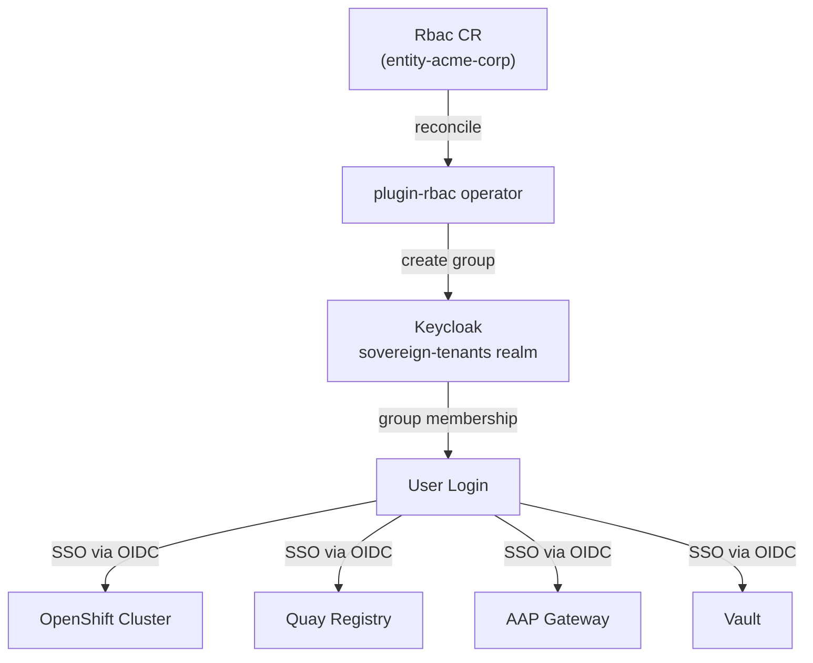

### OIDC per OpenShift Cluster

Each cluster provisioned by `PlatformOpenshift` gets its own Keycloak OIDC client:

1. Operator creates client `{cluster-name}-keycloak-oidc` in Keycloak
2. Adds `groups` protocol mapper to propagate group membership in JWT
3. Creates ACM `Policy` + `Placement` + `PlacementBinding` on hub
4. ACM pushes `OAuth` config with OIDC identity provider to the spoke cluster

The OAuth config uses `groups` claim to map Keycloak group membership to OpenShift group membership.

### Hardening Checklist

- [x] OIDC client secrets stored in K8s Secrets (not ConfigMaps)
- [x] Vault credentials pulled via ExternalSecrets only (no secrets in Git)
- [x] Keycloak admin password in Vault, rotated via ESO refresh
- [x] Groups created per entity, scoped to entity namespace
- [x] `no_log: true` on all tasks handling credentials
- [ ] Audit logging for group membership changes (future)
- [ ] Periodic group sync verification job (future)

---

## PlatformOpenshift Operator — Keycloak OIDC Integration

### Overview

Every `PlatformOpenshift` CR that reaches `status.clusterInstalled: true` automatically gets a Keycloak OIDC client created and an ACM `ConfigurationPolicy` pushed to configure SSO on the spoke cluster.

### Implementation

#### Task file: `keycloak_oidc.yml`

Located at: `PlatformOpenshift/operator/roles/platformopenshift/tasks/keycloak_oidc.yml`

**Flow:**
1. Read Keycloak admin credentials from Secret `rhbk-admin-credentials` (populated via ExternalSecret from Vault)
2. Obtain Keycloak admin token from `KEYCLOAK_INTERNAL_URL/realms/master`
3. Create OIDC client `{cluster-name}-keycloak-oidc` in `sovereign-tenants` realm
4. Add `groups` protocol mapper (propagates Keycloak groups to JWT `groups` claim)
5. Build ACM `Policy`, `Placement`, `PlacementBinding` YAML
6. POST resources to hub API using `osohelper-creator-sa` token

#### Operator Environment Variables

| Variable | Default | Description |
|---|---|---|
| `KEYCLOAK_INTERNAL_URL` | `http://rhbk-services-service.rhbk.svc:8080` | Internal Keycloak URL |
| `KEYCLOAK_EXTERNAL_URL` | `https://rhbk-services.apps.services.lab.example.com` | External Keycloak URL for OIDC issuer |
| `KEYCLOAK_REALM` | `sovereign-tenants` | Keycloak realm |

#### RBAC Requirements

The `osohelper-creator-sa` ServiceAccount on the hub requires:
```yaml
- apiGroups: [policy.open-cluster-management.io]
  resources: [policies, placementbindings]
  verbs: [create, delete, get, list, watch, update, patch]
- apiGroups: [cluster.open-cluster-management.io]
  resources: [placements]
  verbs: [create, delete, get, list, watch, update, patch]
```

This cross-cluster ServiceAccount configuration is managed via the Helm chart for the relevant operator.

#### ACM Resources Created

| Resource | Name | Namespace |
|---|---|---|
| Policy | `{cluster-name}-keycloak-oidc` | `openshift-gitops` |
| Placement | `{cluster-name}-keycloak-oidc-placement` | `openshift-gitops` |
| PlacementBinding | `{cluster-name}-keycloak-oidc-binding` | `openshift-gitops` |

The Policy uses `Placement.matchLabels.name: {cluster-name}` to target the correct ManagedCluster.

#### OAuth Config Pushed to Spoke

```yaml
apiVersion: config.openshift.io/v1
kind: OAuth
metadata:
  name: cluster
spec:
  identityProviders:
    - name: keycloak-sso
      type: OpenID
      openID:
        clientID: "{cluster-name}-keycloak-oidc"
        clientSecret:
          name: openid-client-secret-keycloak
        extraScopes: [profile, email]
        claims:
          preferredUsername: [preferred_username]
          name: [name]
          email: [email]
          groups: [groups]
        issuer: "https://rhbk-services.apps.services.lab.example.com/realms/sso"
```

The OIDC client secret is also pushed as a Kubernetes `Secret` named `openid-client-secret-keycloak` in `openshift-config` namespace via the ACM ConfigurationPolicy.

#### PlatformOpenshift Status Fields

| Field | Type | Description |
|---|---|---|
| `status.oidcConfigured` | boolean | Whether OIDC client and ACM policy have been created |
| `status.oidcClientId` | string | The Keycloak OIDC client ID for this cluster |

### Hardening Notes

- Client secrets are stored in Kubernetes Secrets (not ConfigMaps) on the spoke cluster
- Keycloak admin credentials pulled from Vault via ExternalSecret (not hardcoded)
- `no_log: true` on all tasks handling credentials
- OIDC client uses `service-accounts-enabled: false` (no machine auth via OIDC)
- Redirect URIs scoped to cluster console and OAuth callback URLs only

---

## 41 — Two-Layer RBAC Design

### Overview

Sovereign Cloud enforces two distinct RBAC layers for every tenant:

| Layer | Name | Where Enforced | What It Controls |
|---|---|---|---|
| 1 | Namespace RBAC | Kubernetes (entity namespace) | Who can create/view each CR type |
| 2 | Tool RBAC | Underlying platform (OSO/AWS/OCP/Vault/AAP) | Who has which role in the provisioned tool |

---

### Layer 1 — Namespace RBAC (Entity Operator)

#### Overview

Layer 1 is configured in `spec.namespaceRbac` of the `Entity` CR. The Entity operator reads this field during reconciliation and creates:

- A **creator** `Role` with `[get, list, watch, create, update, patch, delete]` verbs for each resource type  
- A **viewer** `Role` with `[get, list, watch]` for each resource type
- A **RoleBinding** mapping Keycloak group paths (via Rbac CR `status.group`) to each role

The `entityAdmin` list is automatically prepended to every creator binding.

#### Resource Types Covered

`cloudosos`, `cloudawss`, `platformopenshifts`, `vaultkvs`, `vaults`, `quayorgs`, `aaporgs`, `projects`, `teams`, `assignments`, `rbacs`

#### Entity CR Example

```yaml
spec:
  namespaceRbac:
    entityAdmin: [platform-admins]
    cloudOSO:
      creators: [infra-team]
      viewers: [devs, viewers]
    platformOpenshift:
      creators: [platform-admins, infra-team]
      viewers: [devs]
    vaultKV:
      creators: [platform-admins, devs]
      viewers: [viewers]
```

#### How Group Paths Are Resolved

Each entry is an Rbac CR name. The operator looks up the Rbac CR and reads `status.group`, which contains the Keycloak group path `/<entity-name>/<rbac-name>`. This path is used as the Kubernetes `Group` subject in RoleBindings, enabling SSO-to-RBAC linkage without any user/group sync.

#### Kubernetes Role/RoleBinding Structure

```
Role: cloudosos-creator  → verbs: [get, list, watch, create, update, patch, delete]
Role: cloudosos-viewer   → verbs: [get, list, watch]
RoleBinding: cloudosos-creator → subjects: [Group: /acme-corp/platform-admins, Group: /acme-corp/infra-team]
RoleBinding: cloudosos-viewer  → subjects: [Group: /acme-corp/devs]
```

---

### Layer 2 — Tool RBAC (Plugin/Operator)

Layer 2 is configured in `spec.toolRbac` on each provisioned resource CR. The responsible operator reads the RBAC groups and applies roles within the underlying platform.

#### VaultKV — 4-Tier Vault Policies

| Field | Policy Name | Capabilities |
|---|---|---|
| `vaultAdminRbac` | `{kv}-admin` | Full CRUD + list + metadata delete |
| `vaultOpsRbac` | `{kv}-ops` | CRUD data + delete/list metadata |
| `vaultDeveloperRbac` | `{kv}-developer` | Create + read data, read metadata |
| `vaultReaderRbac` | `{kv}-reader` | Read + list data and metadata |

#### AAPOrg — 3-Tier AAP Teams

| Field | AAP Team | Roles Granted |
|---|---|---|
| `aapAdminRbac` | `{org}-admins` | Project Admin, Inventory Admin, Template Admin, Execute, Auditor |
| `aapJobExecutorRbac` | `{org}-executors` | Execute |
| `aapViewerRbac` | `{org}-viewers` | Auditor (read-only) |

#### QuayOrg — 3-Tier (Existing, Unchanged)

| Field | Quay Role |
|---|---|
| `quayAdminRbac` | Organization Admin |
| `quayCreatorRbac` | Creator |
| `quayMemberRbac` | Member |

#### PlatformOpenshift — 4-Tier Cluster RBAC

Pushed via ACM ConfigurationPolicy → ClusterRoleBinding on the spoke cluster:

| Field | ClusterRole |
|---|---|
| `clusterAdminRbac` | `cluster-admin` |
| `clusterOperatorRbac` | `self-provisioner` |
| `clusterDeveloperRbac` | `edit` |
| `clusterViewerRbac` | `view` |

#### CloudOSO / CloudAWS (Deferred)

Fields `toolRbac.projectAdminRbac/projectMemberRbac/projectViewerRbac` (CloudOSO) and `accountAdminRbac/accountPoweruserRbac/accountViewerRbac` (CloudAWS) are present in CRDs but operator implementation is deferred pending platform IAM integration testing.

---

### Permission Matrix

```mermaid
graph TD
  subgraph "Layer 1 (K8s Namespace)"
    EA[entityAdmin] -->|creator binding| ALL[All resource types]
    C[creators] -->|Role: {resource}-creator| CRUD[get/list/watch/create/update/patch/delete]
    V[viewers] -->|Role: {resource}-viewer| RONLY[get/list/watch]
  end

  subgraph "Layer 2 (Tool RBAC)"
    VK[VaultKV] --> VA[vaultAdminRbac → admin policy]
    VK --> VO[vaultOpsRbac → ops policy]
    VK --> VD[vaultDeveloperRbac → developer policy]
    VK --> VR[vaultReaderRbac → reader policy]
    AAP[AAPOrg] --> AA[aapAdminRbac → admin team]
    AAP --> AE[aapJobExecutorRbac → executor team]
    AAP --> AV[aapViewerRbac → viewer team]
    OCP[PlatformOpenshift] --> OA[clusterAdminRbac → cluster-admin]
    OCP --> OO[clusterOperatorRbac → self-provisioner]
    OCP --> OD[clusterDeveloperRbac → edit]
    OCP --> OV[clusterViewerRbac → view]
  end
```

---

### Rbac CR Group Path Resolution

All RBAC fields accept **Rbac CR names** (not direct group names). This indirection:

1. Allows multiple CRs to reference the same Keycloak group
2. Decouples platform roles from Keycloak group path format
3. Enables the UI to offer a group selector without knowing group paths

Resolution flow:

```
Rbac CR name → lookup CR status.group → Keycloak group path (/entity/rbac-name)
```

---

### Dashboard Integration

#### Layer 1 RBAC via Dashboard

The `Entity` create/edit flow in tenancy dashboard exposes `namespaceRbac` as a collapsible section with `RbacGroupSelector` chips for each resource type.

#### Layer 2 RBAC via Dashboard

Every Create form (CloudOSO, CloudAWS, PlatformOpenshift, VaultKV, AAPOrg, QuayOrg, Team, Project, Assignment) includes an **Access** step in the multi-step stepper form, using `RbacGroupSelector` to choose groups for each role tier.

#### Permissions Endpoint

`GET /api/permissions?namespace=<ns>` returns a JSON map of `{ resource: { list, create, delete } }` based on `SelfSubjectAccessReview` calls made with the user's forwarded token.

The frontend `usePermissions` hook consumes this to:
- Hide nav items for resources the user cannot list
- Disable or hide Create buttons for resources the user cannot create
- Show/hide edit buttons based on patch permissions

---

### Hardening Checklist

- [x] No credentials stored in CRD spec fields — all secrets via Vault + ExternalSecret
- [x] Operator uses `no_log: true` for all credential variables  
- [x] `entityAdmin` auto-included in creator bindings — no accidental lockout
- [x] Rbac CR indirection — group paths not hardcoded in CR manifests
- [x] ACM PolicyTemplate enforcement mode for spoke cluster RBAC
- [x] SelfSubjectAccessReview checks use the user's own forwarded token (no privilege escalation)
- [ ] CloudOSO/CloudAWS IAM wiring — deferred (CRD fields present, operator logic pending)
- [ ] Audit logging for group-to-role changes — planned for next iteration

---

### Related Documents

- [39-rbac-design.md](39-rbac-design.md) — Original RBAC design (Layer 1 only)
- [40-platformopenshift-oidc.md](40-platformopenshift-oidc.md) — OIDC client creation per cluster

---

## Per-CR RBAC Pattern

### Overview

Starting with feature `002-manage-tenancy-crs`, operators create fine-grained
Kubernetes `Role` and `RoleBinding` resources scoped to individual Custom Resources.
This allows Keycloak groups to have `get/list/watch` permissions on specific CRs
without seeing all CRs of that type.

### Affected CR Types

| CR Type | Spec Field | Role Name Pattern | Cleanup Method |
|---------|-----------|-------------------|----------------|
| `PlatformOpenshift` | `spec.clusterViewerRbac[]` | `platform-<cr-name>-viewer` | `platformopenshift_delete` finalizer role |
| `Team` | `spec.teamViewerRbac[]` | `<cr-name>-team-viewer` | `team_delete` finalizer role (label selector) |
| `Project` | `spec.projectViewerRbac[]` | `project-<cr-name>-viewer` | Owner reference GC (same namespace) |

### Role Structure

Each per-CR `Role` grants view access to the specific CR instance:

```yaml
apiVersion: rbac.authorization.k8s.io/v1
kind: Role
metadata:
  name: project-my-project-viewer
  namespace: entity-acme-corp
  labels:
    app.kubernetes.io/managed-by: project-operator
    hybridsovereign.redhat/cr-name: my-project
rules:
  - apiGroups: ["hybridsovereign.redhat"]
    resources: ["projects"]
    resourceNames: ["my-project"]
    verbs: ["get", "list", "watch"]
```

### RoleBinding Structure

One `RoleBinding` per Keycloak group in the `*ViewerRbac` list:

```yaml
apiVersion: rbac.authorization.k8s.io/v1
kind: RoleBinding
metadata:
  name: project-my-project-viewer-acme-corp-devs
  namespace: entity-acme-corp
  labels:
    app.kubernetes.io/managed-by: project-operator
    hybridsovereign.redhat/cr-name: my-project
subjects:
  - kind: Group
    apiGroup: rbac.authorization.k8s.io
    name: "acme-corp/acme-corp-devs"   # Keycloak group path
roleRef:
  kind: Role
  name: project-my-project-viewer
  apiGroup: rbac.authorization.k8s.io
```

### Operator ClusterRole Requirement

Operators that create per-CR Roles and RoleBindings need these permissions in
their `ClusterRole`:

```yaml
- apiGroups:
    - rbac.authorization.k8s.io
  resources:
    - roles
    - rolebindings
  verbs:
    - create
    - delete
    - get
    - list
    - patch
    - update
    - watch
```

This is required in: `team-operator-manager`, `platformopenshift-operator-manager`,
`project-operator-manager` ClusterRoles.

### Cleanup

#### Team and PlatformOpenshift: Finalizer-Based

These operators have a `finalizer` role (`team_delete`, `platformopenshift_delete`)
that uses label selectors to delete all per-group `RoleBinding` resources:

```yaml
- name: Delete per-CR viewer RoleBindings
  kubernetes.core.k8s:
    state: absent
    api_version: rbac.authorization.k8s.io/v1
    kind: RoleBinding
    namespace: "{{ ansible_operator_meta.namespace }}"
    label_selectors:
      - "app.kubernetes.io/managed-by={{ operator_name }}"
      - "hybridsovereign.redhat/cr-name={{ ansible_operator_meta.name }}"
```

#### Project: Owner Reference GC

`Project` operator resources are in the same namespace as the CR. The operator
proxy auto-injects owner references on creation. Kubernetes GC removes Role and
RoleBinding when the Project CR is deleted. No explicit finalizer role is needed.
See DEV-002 in `deviations.md` for trade-offs.

### CR Status Lifecycle

All CRs managed by these operators follow the standardized 3-state lifecycle:

```
CR created (no status)
  → operator picks up: status: reconciling, lastReconciledAt: <timestamp>
  → Ansible runs:
      success → status: ready, lastReconciledAt: <timestamp>
      failure → status: failed, message: <error>, lastReconciledAt: <timestamp>
```

The UI displays "pending" if no status field is present (CR just created, operator
hasn't picked it up yet).

---

## AAP Job Template Catalog

**Feature**: EDA → AAP Job Template Architecture  
**Audience**: Platform engineers, operator developers  
**Last updated**: 2026-06-15

---

### Overview

All provisioning and teardown operations are executed as AAP Controller job templates. EDA activations receive Kubernetes events and call `run_job_template` — the heavy Ansible logic runs inside AAP's managed Execution Environments.

**AAP Controller URL**: `https://sovereign-aap-controller-aap.apps.central.lab.example.com`  
**Organisation**: `sovereign`  
**Project**: `sovereign-eda-project` (mirrors Gitea `eda/` repo)  
**Inventory**: `sovereign-localhost` (single `localhost`, `ansible_connection=local`)

---

### Job Template Catalog

| Template Name | Operator | EE Image | Playbook |
|---|---|---|---|
| `entity-provision` | Entity | `de-entity:0.1.6` | `rulebooks/entity-provision-playbook.yml` |
| `entity-teardown` | Entity | `de-entity:0.1.6` | `rulebooks/entity-teardown-playbook.yml` |
| `team-provision` | Team | `de-entity:0.1.6` | `rulebooks/team-provision-playbook.yml` |
| `team-teardown` | Team | `de-entity:0.1.6` | `rulebooks/team-teardown-playbook.yml` |
| `project-provision` | Project | `de-entity:0.1.6` | `rulebooks/project-provision-playbook.yml` |
| `project-teardown` | Project | `de-entity:0.1.6` | `rulebooks/project-teardown-playbook.yml` |
| `persona-provision` | Persona | `de-persona:0.1.2` | `rulebooks/persona-provision-playbook.yml` |
| `persona-teardown` | Persona | `de-persona:0.1.2` | `rulebooks/persona-teardown-playbook.yml` |
| `assignment-provision` | Assignment | `de-assignment:0.1.4` | `rulebooks/assignment-provision-playbook.yml` |
| `assignment-teardown` | Assignment | `de-assignment:0.1.4` | `rulebooks/assignment-teardown-playbook.yml` |
| `cloudaws-provision` | CloudAWS | `de-cloudaws:0.1.4` | `rulebooks/cloudaws-provision-playbook.yml` |
| `cloudaws-teardown` | CloudAWS | `de-cloudaws:0.1.4` | `rulebooks/cloudaws-teardown-playbook.yml` |
| `cloudoso-provision` | CloudOSO | `de-cloudoso:0.1.6` | `rulebooks/cloudoso-provision-playbook.yml` |
| `cloudoso-teardown` | CloudOSO | `de-cloudoso:0.1.6` | `rulebooks/cloudoso-teardown-playbook.yml` |
| `openstack-migration-dummy` | OpenStackMigration | `de-openstack-migration:0.1.0` | `rulebooks/openstack-migration-dummy-playbook.yml` |
| `platformopenshift-provision` | PlatformOpenshift | `de-platformopenshift:0.1.4` | `rulebooks/platformopenshift-provision-playbook.yml` |
| `platformopenshift-teardown` | PlatformOpenshift | `de-platformopenshift:0.1.4` | `rulebooks/platformopenshift-teardown-playbook.yml` |
| `rbacconfig-provision` | RBACConfig | `de-entity:0.1.6` | `rulebooks/rbacconfig-provision-playbook.yml` |
| `rbac-provision` | RBAC | `de-entity:0.1.6` | `rulebooks/rbac-provision-playbook.yml` |
| `vault-provision` | Vault | `de-entity:0.1.6` | `rulebooks/vault-provision-playbook.yml` |
| `vaultkv-provision` | VaultKV | `de-entity:0.1.6` | `rulebooks/vaultkv-provision-playbook.yml` |
| `aapconfig-provision` | AAPConfig | `de-entity:0.1.6` | `rulebooks/aapconfig-provision-playbook.yml` |
| `aaporg-provision` | AAPOrg | `de-entity:0.1.6` | `rulebooks/aaporg-provision-playbook.yml` |
| `quayconfig-provision` | QuayConfig | `de-entity:0.1.6` | `rulebooks/quayconfig-provision-playbook.yml` |
| `quayorg-provision` | QuayOrg | `de-entity:0.1.6` | `rulebooks/quayorg-provision-playbook.yml` |

All templates are configured with `ask_variables_on_launch: true`.

---

### Credentials

| Credential Name | Type | Vault Path | Purpose |
|---|---|---|---|
| `sovereign-vault-token` | HashiCorp Vault (Approle) | `central/vault-services-client` | Vault access for ExternalSecrets |
| `sovereign-aws-creds` | AWS | `central/aws-credentials` | CloudAWS environment provisioning |
| `sovereign-openstack-creds` | OpenStack | `central/openstack-credentials` | CloudOSO provisioning |
| `sovereign-gitea-cred` | Source Control | Gitea admin token | AAP project checkout |
| `sovereign-central-cluster-credential` | OpenShift/K8s Bearer Token | `central/aap-central-cluster-sa` | Hub API access |

---

### Execution Environments

Each EE is registered in AAP pointing to `quay.example.com/hybrid-sovereign/<name>:<tag>`:

| EE Name | Image Tag | Collections | Key Python Deps |
|---|---|---|---|
| `de-entity` | 0.1.6 | `kubernetes.core`, `ansible.controller` | `kubernetes>=28.1.0` |
| `de-persona` | 0.1.2 | `kubernetes.core`, `ansible.controller` | `kubernetes>=28.1.0` |
| `de-assignment` | 0.1.4 | `kubernetes.core`, `ansible.controller` | `kubernetes>=28.1.0` |
| `de-cloudaws` | 0.1.4 | `kubernetes.core`, `amazon.aws>=8.0.0` | `kubernetes`, `boto3` |
| `de-cloudoso` | 0.1.6 | `kubernetes.core`, `openstack.cloud`, `amazon.aws>=8.0.0` | `kubernetes`, `openstacksdk` |
| `de-openstack-migration` | 0.1.0 | `kubernetes.core`, `ansible.controller` | `kubernetes>=28.1.0` |
| `de-platformopenshift` | 0.1.4 | `kubernetes.core` | `kubernetes>=28.1.0` |

> **Note**: `de-cloudoso:0.1.6` build requires patching the `ansible-builder`-generated `Containerfile` to remove `openshift-clients` (not available in base image) and `systemd-python` (requires missing `systemd-devel`) from bindep and pip requirements. See `eda/cloudoso/Makefile`.

---

### EDA Rulebook Configuration

#### run_job_template Structure

All 24 EDA rulebooks follow this pattern:

```yaml
rules:
  - name: Handle <Kind>CreateRequested
    condition: >
      event.payload.reason == "<Kind>CreateRequested"
      and event.payload.regarding.kind == "<Kind>"
    action:
      run_job_template:
        name: <operator>-provision
        organization: sovereign
        job_args:
          extra_vars:
            event_payload: "{{ event.payload }}"
```

#### aap_resource_token

EDA activations receive the `aap_resource_token` (from Vault `central/aap-admin-central`) to authenticate against AAP Controller when calling `run_job_template`. This is passed during activation creation by the `eda-config` role.

---

### CR Status Update Pattern

Each provision role calls `patch_cr_status.yml` twice:

#### START (immediately after hub credentials are set)

```yaml
- name: Announce AAP job started in CR status
  ansible.builtin.include_tasks: patch_cr_status.yml
  vars:
    cr_status_body:
      status: reconciling
      message: "Job started"
  when: lookup('env', 'TOWER_JOB_ID') | length > 0
```

#### END (after provisioning completes)

```yaml
- name: Patch <Kind> CR status
  ansible.builtin.include_tasks: patch_cr_status.yml
  vars:
    cr_status_body:
      status: ready
      ready: true
      observedGeneration: "{{ cr_generation }}"
```

#### patch_cr_status.py Logic

The embedded Python script:

1. Reads `TOWER_JOB_ID` and `TOWER_URL` from OS environment (auto-set by AAP runner)
2. Builds AAP job URL: `{tower_url}/execution/jobs/playbook/{tower_job_id}/output`
3. Sets `edaJobs = [single_entry]` — replaces the entire array with 1 entry
4. Falls back to S3 log URL → EDA activation URL if AAP vars not set

```python
tower_job_id = os.environ.get('TOWER_JOB_ID', '')
tower_url = os.environ.get('TOWER_URL', '')
if tower_job_id and tower_url:
    job_url = f"{tower_url}/execution/jobs/playbook/{tower_job_id}/output"
```

---

### AAP Controller Configuration Job

The `aap-controller-config` Kubernetes Job (sync wave 33) runs the `aap-controller-config` Ansible role using `infra.aap_configuration.dispatch` to configure all of the above in a single idempotent run.

**Job spec location**: `bootstrap/helm/central/values.yaml` → `sovereignJobs.jobs.aapControllerConfig`  
**Role location**: `bootstrap/ansible/roles/aap-controller-config/`  
**Playbook**: `bootstrap/ansible/project/aap-controller-config.yml`

To re-run after changes, bump `RUN_ID` in `values.yaml` and push — ArgoCD will recreate the Job.

---

### RBAC Requirements

The `sovereign-aap-controller` service account (namespace `aap`) requires:

| Resource | Namespace | Verbs | Purpose |
|---|---|---|---|
| `secrets` (argocd-cluster-services, eda-s3-creds) | `openshift-gitops` | `get`, `list` | Read ArgoCD cluster creds and S3 creds |
| `externalsecrets` | `sovereign-cloud-jobs` | `get`, `list`, `create`, `update`, `patch`, `delete` | Manage temp ExternalSecrets for cloud creds |
| `secrets` | `sovereign-cloud-jobs` | `get`, `list` | Read synced cloud credential secrets |

Chart: `bootstrap/helm/charts/sovereign-job-rbac/` (current version `0.1.8`)

---

### Troubleshooting

#### Job fails immediately (< 15s)

- Check `TOWER_JOB_ID` and `TOWER_URL` env vars are set in the EE
- Check EE image pull succeeded (`oc get pod -n aap -l job-name=...`)

#### CR status not updated with AAP job ID

- Verify `patch_cr_status.yml` explicitly sets `TOWER_JOB_ID` and `TOWER_URL` as env vars
- Check the Python script runs with correct environment in the job output

#### ExternalSecret not syncing cloud credentials

- Check the `vault-backend` ClusterSecretStore can access the Vault path
- Verify Vault path uses correct keys (`access-key`/`secret-access-key` for Route53, `clouds.yaml` for OpenStack)
- Force refresh: `oc annotate externalsecret <name> -n sovereign-cloud-jobs force-sync=$(date +%s) --overwrite`

#### cloudoso fails with `identity:list_projects`

- The `clouds.yaml` stored in Vault at `oso/accounts/<account>` must use `domain_name: <domain>` (not `project_domain_name`) to obtain a domain-scoped token
- Example working clouds.yaml:
  ```yaml
  clouds:
    openstack:
      auth:
        auth_url: https://identity.example.com
        username: admin
        password: <password>
        user_domain_name: shc_domain
        domain_name: shc_domain
      identity_api_version: 3
  ```

---

---

## Security Interaction Diagrams

**Date:** 2026-06-16  
**Purpose:** Visual reference for security boundaries — secrets flow, cross-cluster auth, EDA events, and OIDC chain.

Each diagram is intentionally small (≤15 nodes). No styling/colors applied per documentation standards.

---

### 1. Secrets Flow — Vault → ESO → Kubernetes Secret → Pod

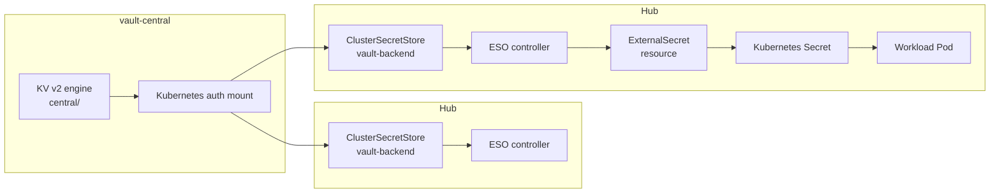

**Notes:**

- vault-central is the single source of truth for platform credentials.
- ESO authenticates via Kubernetes auth — not the Vault root token.
- PushSecret (not shown) flows operator-generated secrets back to Vault KV.

---

### 2. Cross-Cluster Auth — Central ArgoCD SA → Services API Bearer Token

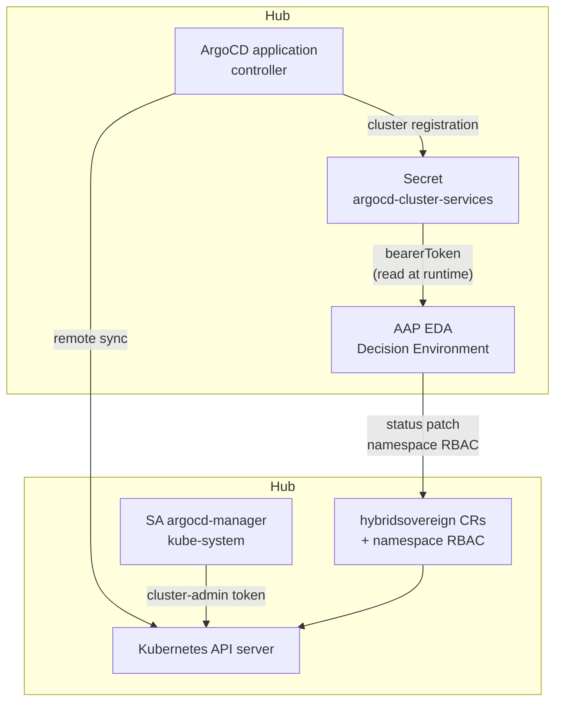

**Security boundary:** The ArgoCD cluster secret token currently grants cluster-admin on the hub. EDA decision environments read this token to write CR status and provision namespace Roles.

---

### 3. EDA Event Security Boundaries

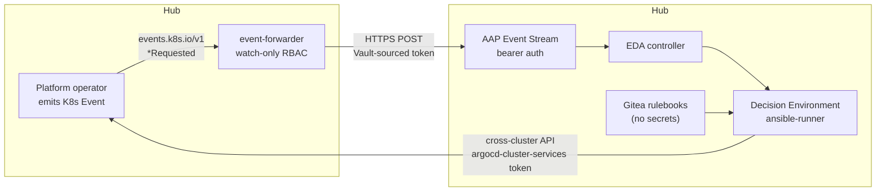

**Boundaries:**

- Forwarder: read-only ClusterRole (events + namespaces).
- Event Stream: bearer token from Vault via ExternalSecret.
- EE: credentials at runtime only; `no_log` on token extraction tasks.

---

### 4. OIDC Chain — Keycloak → OpenShift OAuth → Dashboard oauth-proxy → User

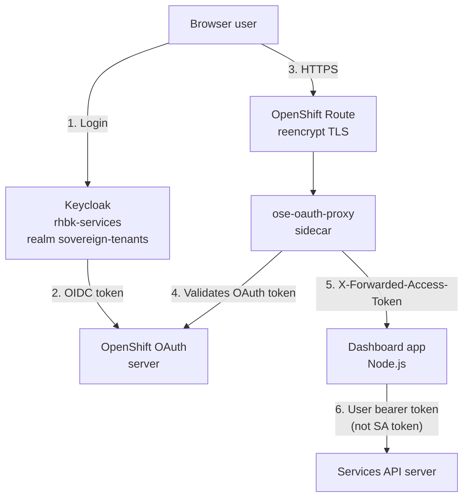

**Notes:**

- OAuth client secrets stored in Vault (`central/dashboard-oauth`, `central/tenancy-dashboard-oauth`).
- Cookie flags: httponly, secure, samesite enforced on dashboard routes.
- Dashboard SA has impersonation rights but mutations use the forwarded user token.

---

---

## Platform QA Test Checklist

Manual and automated validation checklist for the Hybrid Sovereign Cloud platform.
Automated checks live in `global_tests/`; run `ansible-playbook playbooks/validate-all.yml`
from that directory with required OCP environment variables set.

### Pre-Deployment Checks

- [ ] Environment variables set (`OCP_HUB_SERVER`/`OCP_HUB_USERNAME`/`OCP_HUB_PASSWORD` (or legacy `OCP_CENTRAL_*` / `OCP_SERVICES_*`))
- [ ] Hub reachable: `oc login $OCP_CENTRAL_SERVER`
- [ ] Hub reachable: `oc login ${OCP_HUB_SERVER:-$OCP_SERVICES_SERVER}`
- [ ] ArgoCD accessible at `https://openshift-gitops-server-openshift-gitops.apps.central.lab.example.com/`
- [ ] Vault accessible at `https://vault-central.apps.central.lab.example.com/`
- [ ] Services Vault accessible at `https://vault-services.apps.services.lab.example.com/`
- [ ] Keycloak SSO accessible at `https://sso-rhbk-services.apps.services.lab.example.com/`
- [ ] OCI registry credentials verified (`make check-env` from bootstrap repo)

### Infrastructure Checks

- [ ] All ArgoCD Applications: Synced + Healthy (`oc get applications -n openshift-gitops --context hub-admin`)
- [ ] All sovereign-cloud pods: Running (`oc get pods -n sovereign-cloud --context hub-admin`)
- [ ] All sovereign-cloud-plugins pods: Running (`oc get pods -n sovereign-cloud-plugins --context hub-admin`)
- [ ] Vault central: initialized and unsealed (`GET /v1/sys/health` returns HTTP 200, `sealed=false`)
- [ ] Vault services: initialized and unsealed
- [ ] Keycloak: `sovereign-tenants` realm OIDC discovery returns HTTP 200
- [ ] Keycloak pods running in `services-rhbk` namespace
- [ ] Hub nodes Ready
- [ ] Hub nodes Ready

### Operator Health Checks

- [ ] Entity operator: running and reconciling Entity CRs
- [ ] Team operator: running
- [ ] Assignment operator: running
- [ ] Persona operator: running
- [ ] PlatformOpenshift operator: running
- [ ] CloudOSO operator: running
- [ ] CloudAWS operator: running (or skipped when `aws_excluded=true`)
- [ ] plugin-rbac operator: running in sovereign-cloud-plugins
- [ ] plugin-aap, plugin-quay, plugin-vault, plugin-iaac: running in sovereign-cloud-plugins

### RBAC Integrity Checks

- [ ] Rbac CRs exist in entity namespaces (e.g. `entity-acme-corp`)
- [ ] Each Rbac CR has `status.ready == true`
- [ ] `plugin-rbac-manager` ClusterRoleBinding present on hub
- [ ] Entity namespace RoleBindings present (entity-admin, cloudoso-admin, etc.)
- [ ] Persona CRs exist and are ready
- [ ] Team CRs exist and are ready
- [ ] Assignment CRs exist and are ready
- [ ] Keycloak groups created for each Rbac CR (verify via admin API or tenancy dashboard)

### Dashboard Functionality Checks

- [ ] User dashboard route reachable: `https://sovereign-cloud-dashboard-sovereign-cloud.apps.services.lab.example.com/`
- [ ] Tenancy dashboard route reachable: `https://tenancy-dashboard-sovereign-cloud.apps.services.lab.example.com/`
- [ ] User dashboard: login via OAuth works
- [ ] User dashboard: entity list loads
- [ ] User dashboard: operators page shows all operators
- [ ] Tenancy dashboard: entity namespace selector works
- [ ] Tenancy dashboard: Team list loads
- [ ] EDA job chip URLs use operator-provided `job.url` (expected format: `/execution/jobs/playbook/` on AAP, not `/#/jobs/`)
- [ ] No hardcoded cluster URLs in dashboard source (URLs built from route CRs or CR status)

### Cluster Build Verification

- [ ] `ocp-ses10`: `status.clusterHealth == Healthy`
- [ ] `ocp-ses10`: `status.consoleURL` reachable
- [ ] `ocp-ses10`: `status.clusterVersion` populated
- [ ] `ocp-ses4`: `status.clusterHealth == Healthy`
- [ ] `ocp-ses4`: `status.consoleURL` reachable
- [ ] `ocp-ses4`: `status.clusterVersion` populated
- [ ] CloudOSO CR (`ses4-env`): status ready
- [ ] CloudAWS CR (`ses10-env`): status ready (when AWS enabled)

### EDA / Event Flow Checks

- [ ] Entity create/delete triggers EDA events (automated: `validate-eda.yml`)
- [ ] AAP activations present and active (when AAP token available)
- [ ] EDA job chips appear on dashboard CR list pages

### Automated Test Playbooks

| Playbook | Roles | Purpose |
|----------|-------|---------|
| `validate-all.yml` | All | Full platform validation + HTML report |
| `validate-infrastructure.yml` | check_argocd, check_nodes | ArgoCD apps and cluster nodes |
| `validate-operators.yml` | check_operators | Operator pod health |
| `validate-services.yml` | check_vault_connectivity, check_keycloak_oidc | Vault and Keycloak endpoints |
| `validate-tenancy.yml` | check_personas, check_rbac_bindings, check_cluster_builds | Tenancy CRs and cluster builds |
| `validate-eda.yml` | check_eda_events | Entity create/delete EDA flow |
| `validate-dashboards.yml` | check_dashboards | Route health probes |

### Sign-Off Table

| Check Category | Pass/Fail | Tester | Date | Notes |
|----------------|-----------|--------|------|-------|
| Pre-deployment | | | | |
| Infrastructure | | | | |
| Operators | | | | |
| RBAC | | | | |
| Dashboards | | | | |
| Cluster Builds | | | | |
| EDA / Events | | | | |

### Known Gaps / Follow-Up

- ArgoCD Applications may not appear when querying wrong cluster context; always use `hub-admin`.
- Keycloak admin credentials are in Vault; automated user provisioning tests require Vault KV access.
- EDA activation checks require AAP bearer token (not stored in git).
- Stale pods in `ContainerStatusUnknown` should be cleaned by node/kubelet; filter by `Running` phase for health counts.
- CloudAWS CR may show `failed` when AWS sandbox credentials are unavailable (`aws_excluded=true` in global_tests).

---

## OpenStack Migration UI and Operator

### Overview

The `OpenStackMigration` CR (`hybridsovereign.redhat/v1alpha1`) requests migration of a VM from an MTV `Provider` to a target `CloudOSO` environment. The operator emits `OpenStackMigrationRequested` events; EDA launches the central AAP job template `openstack-migration-dummy` with extra vars derived from the CR spec.

### MTV catalog ConfigMap

| Field | Location |
|-------|----------|
| ConfigMap | `sovereign-cloud/mtv-migration-catalog` |
| Key | `catalog.json` |
| Populated by | `job-mtv-catalog-sync` sovereign Job on the hub |

Schema (populated from the hub `forklift-inventory` REST API per MTV `Provider` CR):

```json
{
  "providers": [
    {
      "name": "vmware-vcenter",
      "namespace": "openshift-mtv",
      "type": "vsphere",
      "inventoryId": "6d2b9198-45f3-4636-91dd-543a7e9e7d64"
    }
  ],
  "vms": {"vmware-vcenter": ["vm-a", "vm-b"]},
  "vmDetails": {
    "vmware-vcenter": [
      {"name": "vm-a", "id": "vm-1", "powerState": "poweredOn"}
    ]
  },
  "syncedAt": "2026-06-25T00:00:00Z"
}
```

### UI

- Console plugin: **Sovereign Cloud → Migrate to OpenStack**
- Submit creates **one CR per selected VM**; each triggers a separate dummy AAP job
- List page shows `status.edaJobs` with links to AAP job output

### CloudOSO VRF fields (Phase 1)

| Spec field | Type | Ansible fact |
|------------|------|--------------|
| `enableVRF` | boolean | `ep_enable_vrf` |
| `vrfId` | string | `ep_vrf_id` |

Passed through in `environmentprep.yml`; no OpenStack mutation until a future phase.

---

## UIHealthChecker — On-demand URL probes

**Last updated**: 2026-07-22  
**API**: `uihealthcheckers.hybridsovereign.redhat/v1alpha1`  
**UI**: Admin dashboard → Hybrid VPC → UI Health (`/networking/uihealth`)

### Purpose

`UIHealthChecker` is a **URL registry** for platform service health checks. It does **not** drive infrastructure reconcile or EDA provision/teardown.

Once the CR exists with `spec.url`, the admin dashboard can probe that URL from the **dashboard pod** (cluster egress). Results are live-only in the UI session — they are not written back as operator status phases like `reconciling`.

### Lifecycle

| Step | Behavior |
|------|----------|
| Create CR | Operator marks `status.ready=true` / `status.status=ready` immediately (`Registered`). No Kafka/EDA job. |
| Refresh / Run checks | Admin dashboard `POST /api/uihealth/probe` with each CR’s `spec.url`. |
| Delete CR | Operator sets `deletionComplete` and removes the finalizer. No infra teardown. |

There is **no** `AwaitingEDA` / `reconciling` loop for this kind.

### Spec fields

| Field | Description |
|-------|-------------|
| `url` | Absolute HTTP(S) URL probed from the admin dashboard pod |
| `displayName` | Optional friendly name in the table |
| `group` | Logical group (`central`, `services`, `quay`, …) |
| `expectedStatus` | Default `200` |
| `timeoutSeconds` | Default `10` |

### UI columns

Name · Group · URL · **Live** (probe result). The old Status/reconcile badge is not shown — registration is implied by the CR row.

### Samples

`hybridcloud/samples/hybridvpc/uihealthcheckers.yaml` seeds Vault, RHBK, AAP, Gitea, and Quay targets in `sovereign-cloud`.

---

## Hybrid VPC EVPN — OpenStack (OSO) + OpenShift Virt

**Status:** design only — **no deploy** in this document.  
**Scope:** CloudOSO + CloudVirt (+ PlatformOpenshift `virt` / `hosted`). **AWS EVPN is out of scope.**  
**Source:** [architecture/mocks/DESIGN_UI.md](../../mocks/DESIGN_UI.md).

### Goal

Give tenants isolated logical networks (`HybridNetwork`) that can be placed on OSO and Virt backends (`NetworkPlacement`) while platform operators own day-0 fabric numbering (`HybridFabric`, `CloudGateway`, `TransportLink`). Overlapping tenant CIDRs stay safe because **VNIs / VRFs / RTs are platform-owned**, never tenant-picked.

### CR reuse (no new top-level kinds required for MVP)

| CR | Role |
|----|------|
| `HybridFabric` | Platform VNI pool, enabled fabric singleton |
| `CloudGateway` | Per-cloud gateway attachment (OSO Neutron / Virt OVN) |
| `TransportLink` | Underlay/overlay link binding a gateway into the fabric |
| `HybridNetwork` | Tenant L3 network intent (no VNI/VRF/RT in `spec`) |
| `NetworkPlacement` | Binds a `HybridNetwork` to `CloudOSO` \| `CloudVirt` \| `PlatformOpenshift` |

`CloudVirt` is CloudOSO-parity for CNV environments (`vaultPath`, `baseDomain`, `toolRbac`, optional `enableVRF` / `vrfId`).

### Topology (OSO + Virt only)

```mermaid
flowchart LR
  subgraph platform [Platform sovereign-cloud]
    HF[HybridFabric]
    CG_OSO[CloudGateway OSO]
    CG_VIRT[CloudGateway Virt]
    TL_OSO[TransportLink OSO]
    TL_VIRT[TransportLink Virt]
  end
  subgraph tenant [entity NS]
    HN[HybridNetwork]
    NP_OSO[NetworkPlacement OSO]
    NP_VIRT[NetworkPlacement Virt]
    CO[CloudOSO]
    CV[CloudVirt]
    PO_V[PlatformOpenshift virt]
    PO_H[PlatformOpenshift hosted]
  end
  HF --> CG_OSO --> TL_OSO
  HF --> CG_VIRT --> TL_VIRT
  HN --> NP_OSO --> CO
  HN --> NP_VIRT --> CV
  PO_V --> CV
  PO_H --> CV
  TL_OSO -.->|EVPN/VXLAN| Neutron[OpenStack Neutron]
  TL_VIRT -.->|EVPN/OVN| OVN[OVN-Kubernetes / CNV]
```

### Local tunnel recommendation

For lab / workshop clusters where OSO and Virt share a routable underlay (or are the same site):

- Prefer `tunnelType: none` on `TransportLink` (direct EVPN/VXLAN without extra encapsulation).
- Use an explicit tunnel type only when sites are not L2/L3 adjacent.

Do **not** invent AWS-specific tunnel modes in this design.

### Virt → PlatformOpenshift / OVN mapping

| PlatformOpenshift `type` | Backend environment | Network plane |
|--------------------------|---------------------|---------------|
| `virt` | `CloudVirt` (CNV VMs hosting OCP) | OVN secondary networks / NAD; optional VRF via `CloudVirt.spec.enableVRF` |
| `hosted` | `CloudVirt` + ACM Hypershift HCP | Same Virt underlay; HCP/nodepools attach via OVN EVPN CRs when available |
| `openstack` | `CloudOSO` | Neutron + ovn-bgp-agent (adopt/rewrite RT strategy) |

`NetworkPlacement.spec.backend.kind` should accept `CloudVirt` alongside `CloudOSO` / `PlatformOpenshift` (already extended in CRD).

### Numbering & status (platform-owned)

Tenants never set VNI/VRF/RT in `HybridNetwork.spec`. Observed fields land on status only, for example:

- `.status.vni`
- `.status.vrfName`
- `.status.routeTargets`

Allocation increments `HybridFabric.status.allocatedVniCount` and records placement readiness after gateway + transport prerequisites resolve.

### CRD deltas (design — not implemented here)

1. `CloudVirt` — shipped as CRD stub; CNV environmentprep playbook remains iterative.
2. `NetworkPlacement` backend enum includes `CloudVirt`.
3. `TransportLink.spec.tunnelType` documents `none` as the OSO↔Virt lab default.
4. `CloudGateway` gains optional `virtCloudVirtRef` (mirrors `openstackCloudOSORef`).
5. Optional: `HybridFabric.spec.backends.virt` capability flags for OVN EVPN CR detection.

### Operator / AAP flow (future implement)

1. Platform creates `HybridFabric` + OSO/Virt `CloudGateway` + `TransportLink`.
2. Tenant creates `HybridNetwork` then `NetworkPlacement` → CloudOSO or CloudVirt / PlatformOpenshift.
3. Kind operators launch AAP JobTemplates (allocate → fabric_vni → backend_oso|backend_virt → validate).
4. Fail or >3h job → cancel + relaunch once; status updates must not loop.

### Non-goals

- No AWS EVPN path in this document.
- No cluster deploy / `oc apply` from this design.
- No hardcoded cluster domains or credentials in Git manifests.

### References

- UI / CR sketches: [DESIGN_UI.md](../../mocks/DESIGN_UI.md)
- ZTP secret + GitOps contract: [docs/ztp.md](../../../docs/ztp.md)
- CNV baseline: [10-openshift-cnv.md](./10-openshift-cnv.md)

---

## Platform Deviations & Remediation Tracker

This document records implementation deviations from platform best practices,
including WHY, WHERE, and the remediation / production target.

---

### DEV-001: PlatformOpenshift AWS Delete Flow Deferred

**Feature**: 002-manage-tenancy-crs  
**Phase**: Phase 8 (Delete Flow Validation)  
**Status**: Deferred

**Why**: The `ocp-sdx-aws1` AWS cluster (replacing deprecated `ocp-ses10`) and associated
`ses10-env` CloudAWS CR represent live sandbox infrastructure that requires careful
coordination to destroy. AWS resource cleanup (VPC, Route53, ELBs) via Hive involves a
longer teardown cycle and was intentionally excluded from the automated delete validation
run in Phase 8.

**Where**:
- `entity-acme-corp/ocp-sdx-aws1` (PlatformOpenshift, type: aws)
- `entity-acme-corp/ses10-env` (CloudAWS)

> **Note**: `ocp-ses8`–`ocp-ses12` (including `ocp-ses10`) are deprecated. Current
> PlatformOpenshift clusters: `ocp-sdx-oso1`, `ocp-sdx-oso2` (OpenStack via
> `acme-dev-openstack` CloudOSO), `ocp-sdx-aws1` (AWS via `ses10-env` CloudAWS).

**Finalizer implementation is complete**:
- `hybridsovereign.redhat/platformopenshift-cleanup` finalizer set on CR
- `platformopenshift_delete` role handles AWSHelper CR deletion on hub
- `hybridsovereign.redhat/cloudaws-cleanup` finalizer set on CR
- `cloudaws_delete` role handles cleanup

**Remediation / Production Target**:
1. In a maintenance window, delete `ocp-sdx-aws1` PlatformOpenshift CR and monitor
   until Hive ClusterDeployment shows `Deprovisioned` on hub.
2. Verify all AWS resources (VPC, subnets, Route53 records, IAM roles) are cleaned up
   via the AWS Console or `aws` CLI investigation.
3. Delete `ses10-env` CloudAWS CR after cluster is fully gone.
4. Close this deviation by updating status to "Validated" here.

---

### DEV-003: Assignment Delete — SA Token Expiry Gap

**Feature**: 003-fix-ocp-cloudrbac-cleanup-ocp  
**Phase**: Phase 5 US3  
**Status**: Known, production hardening required

**Why**: The `assignment_delete` finalizer role reads the `osohelper-creator-sa` or
`awshelper-creator-sa` secret token from the hub to authenticate to the
hub. If the token is rotated, expired, or deleted between Assignment creation
and deletion, the `assert` step in the delete role fails and the finalizer is never cleared.

**Where**:
- `Assignment/operator/roles/assignment_delete/tasks/main.yml` (lines: `assert` task)
- `sovereign-cloud/osohelper-creator-sa` (Secret)
- `sovereign-cloud/awshelper-creator-sa` (Secret)

**Remediation / Production Target**:
1. Add `ignore_errors: true` to the `assert` step with a clear failure message and
   manual cleanup instructions logged when token is unavailable.
2. Use `TokenRequest` API for short-lived projected tokens instead of long-lived SA secrets.
3. **Manual recovery** if finalizer is stuck:
   `oc patch assignment <name> -n <ns> --type json -p '[{"op":"remove","path":"/metadata/finalizers"}]'`
   then `oc delete osohelper <name> -n sovereign-cloud-helpers` on hub.

---

### DEV-002: Project Operator Delete Flow via Owner References (No Finalizer)

**Feature**: 002-manage-tenancy-crs  
**Phase**: Phase 3D / Phase 8

**Why**: The `Project` operator creates per-CR viewer `Role` and `RoleBinding` resources
within the same namespace as the Project CR. Kubernetes garbage collection via owner
references (automatically injected by the operator proxy) handles cleanup without needing
a dedicated finalizer role.

**Where**: `Projects/operator/roles/project/tasks/main.yml`

**Validation**: Tested — `test-delete-project` CR deletion confirmed both
`project-test-delete-project-viewer` Role and matching RoleBinding were removed within
30s via owner reference GC.

**Remediation / Production Target**:
If the Project operator begins managing cross-namespace resources in future phases
(e.g., assigning members to external systems), add a `project_delete` finalizer role
following the same pattern as the `Team` operator. Until then, owner reference GC
is sufficient and simpler.

---
