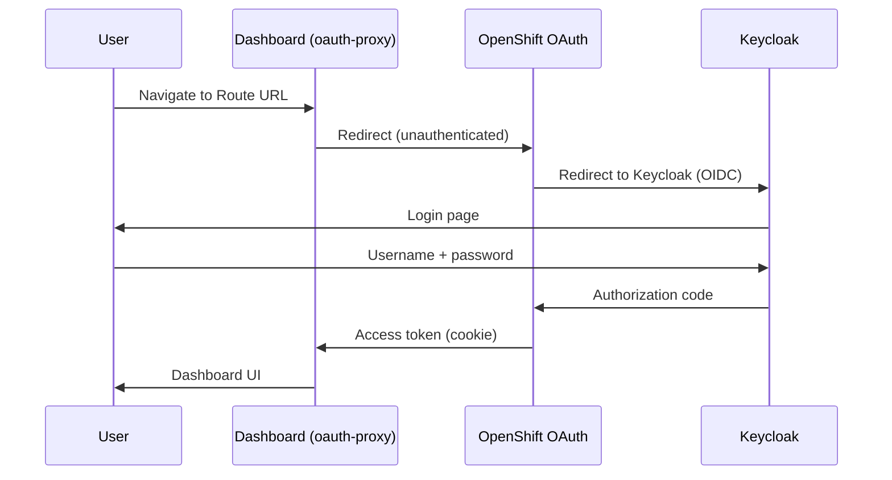

# Hybrid Sovereign Cloud — Workshop & Tutorials

Day-0 / ZTP workshop notes plus day-2 tutorials. Hands-on CR labs: [`../../docs/workshop/README.md`](../../docs/workshop/README.md). GitOps: [`../../docs/ztp.md`](../../docs/ztp.md).

## Table of contents

2. [Workshop — Day 0 secrets (only manual step)](#workshop-day-0-secrets-only-manual-step)
3. [Workshop — ZTP guardrails](#workshop-ztp-guardrails)
4. [Day-2 Operations: HashiCorp Vault](#day-2-operations-hashicorp-vault)
5. [Day-2 Operations: Keycloak (RHBK)](#day-2-operations-keycloak-rhbk)
6. [Day-2 Operations: Custom Operators](#day-2-operations-custom-operators)
7. [Day-2 Operations: ArgoCD](#day-2-operations-argocd)
8. [Day-2 Operations: Plugin Operators](#day-2-operations-plugin-operators)
9. [Tutorial: Sovereign Cloud Dashboard (User Dashboard)](#tutorial-sovereign-cloud-dashboard-user-dashboard)
10. [Tutorial: Tenancy Dashboard](#tutorial-tenancy-dashboard)
11. [Developer Tutorial — Entity RBAC Configuration](#developer-tutorial-entity-rbac-configuration)

---

## Workshop — Day 0 secrets (only manual step)

This is the **only** human step before ArgoCD owns the **hub**. Everything after goes through Git → `gitops/`.

### Rules

1. Source **uncommented** exports from `~/.bashrc` only (ignore `#` commented lines).
2. Never commit secret values to Git. Never script bashrc → Git.
3. Upload into namespace `sovereign-secrets` only.
4. Across many hubs, **only** OCP/AWS/OSO login credentials differ.

### Required variables

| Purpose | Preferred | Accepted aliases |
|---------|-----------|------------------|
| AWS | `AWS_ACCESS_KEY_ID`, `AWS_SECRET_ACCESS_KEY`, `AWS_ACCOUNT_ID` | `AWS_ACCESSKEY`, `AWS_SECRET_KEY`, `AWS_ACCOUNT` |
| OpenStack | `OSO_CLOUDS` (path to `clouds.yaml`) | — |
| Hub API seed | `OCP_HUB_SERVER`, `OCP_HUB_USERNAME`, `OCP_HUB_PASSWORD` | `OCP_CENTRAL_*`, legacy `OCP_SERVICES_*` |

### Create Secrets

```bash
oc -n sovereign-secrets create secret generic aws-credentials \
  --from-literal=AWS_ACCESS_KEY_ID="$AWS_ACCESS_KEY_ID" \
  --from-literal=AWS_SECRET_ACCESS_KEY="$AWS_SECRET_ACCESS_KEY" \
  --from-literal=ACCOUNT_ID="$AWS_ACCOUNT_ID"

oc -n sovereign-secrets create secret generic oso-clouds \
  --from-file=clouds.yaml="$OSO_CLOUDS"

## Prefer OCP_HUB_*; fall back to legacy OCP_SERVICES_* if unset
API="${OCP_HUB_SERVER:-$OCP_SERVICES_SERVER}"
USER="${OCP_HUB_USERNAME:-$OCP_SERVICES_USERNAME}"
PASS="${OCP_HUB_PASSWORD:-$OCP_SERVICES_PASSWORD}"
API_HOST=$(printf '%s' "$API" | sed -E 's|https?://||')
oc -n sovereign-secrets create secret generic openshift-kubeadmin-seed \
  --from-literal=api_host="$API_HOST" \
  --from-literal=username="$USER" \
  --from-literal=password="$PASS"
```

Do **not** label these `hybridsovereign.redhat/gitops-owned=true`.  
`scripts/ztp-wipe.sh` **preserves** these three names across full wipe.

### What happens next

1. Root Argo Application syncs `gitops/` @ `main`.
2. `hs-security` PushSecrets copy seeds into Vault KV.
3. Sample CRs reference `vaultPath` / Secret refs — no credentials and no cluster URLs in Git.

Full contract: [docs/ztp.md](../../../docs/ztp.md).

---

## Workshop — ZTP guardrails

Operators running the Hybrid Sovereign demojam on **50+** OpenShift clusters must follow these rules.

### Absolute

| Rule | Detail |
|------|--------|
| Zero hardcoding | No cluster `apps.` / `api.` domains, IPs, or passwords in Git manifests |
| Dynamic credentials | Only bashrc → `sovereign-secrets` → PushSecret → Vault differs per cluster |
| Absolute GitOps | Config changes only via Git commit to this repo; Argo natural poll/selfHeal |
| No mid-rollout sync | Forbidden: `argocd app sync`, hard refresh annotations, forced sync patches during soak |
| Secret boundary | `~/.bashrc` is manual Day 0 only; ignore `#` comments |
| Never delete `sovereign-*` NS shells | Empty contents via wipe script only |
| FQ wipe only | Always `./scripts/ztp-wipe.sh` — never bare CRD plurals (ZTP-004) |

### Failure handling

| Situation | Action |
|-----------|--------|
| One `hs-*` app stuck | Investigate read-only → fix in Git → push → `./scripts/ztp-app.sh cleanup APP` → wait natural sync |
| Same root cause after fix+wipe | Log in `gitops/issues.md` and **HALT** that thread (no wipe loop) |
| Fresh cold start | Full `./scripts/ztp-wipe.sh` (includes single field-content trigger) |

### Sleep-poll

Default interval **3–5 minutes**. Checkpoint to `/tmp/ztp-agent-state/` before each sleep. Long soaks (hours) are expected for ACM/MCE and cloud provision jobs.

### Platform types

`PlatformOpenshift.spec.type`: `openstack` | `aws` | `hosted`.  
Environments: `CloudOSO`, `CloudAWS`, `CloudVirt`.

See [ZTP.md](../../../docs/ztp.md) and [issues.md](../../../gitops/issues.md).

---

## Day-2 Operations: HashiCorp Vault

### Overview

This guide covers day-2 lifecycle management for the two Vault instances in Sovereign Cloud: `vault-central` (hub) and `vault-services` (hub). Both run in HA Raft mode (3 replicas) in the `vault` namespace.

### Prerequisites

- `oc` CLI logged into the hub as `sovereign-admin`
- `vault` CLI installed locally
- Access to the Vault UI at the OpenShift Route

---

### 1. Checking Vault Status

```bash
## Check vault-central pods
oc get pods -n vault -l app.kubernetes.io/name=vault

## Check raft cluster status
oc exec -n vault vault-0 -- vault operator raft list-peers

## Check seal status
oc exec -n vault vault-0 -- vault status
```

Expected output: `Initialized: true`, `Sealed: false`, `HA Mode: active` on the leader pod.

---

### 2. Unseal after Restart

Vault HA Raft **automatically unseals** using the stored Raft backend on restart, as long as at least 2 of 3 replicas are healthy. Manual unseal is only needed if all replicas restart simultaneously and the Raft backend state is lost.

#### Manual Unseal (emergency only)

```bash
## Retrieve unseal key from vault-central namespace
UNSEAL_KEY=$(oc get secret vault-init-secrets-copy -n vault-central \
  -o jsonpath='{.data.unseal_key_1}' | base64 -d)

## Unseal all pods
for pod in vault-0 vault-1 vault-2; do
  oc exec -n vault $pod -- vault operator unseal "$UNSEAL_KEY"
done
```

---

### 3. Logging In via OIDC

```bash
## Set Vault address
export VAULT_ADDR=https://vault-central.apps.central.lab.example.com

## Login via OIDC (opens browser)
vault login -method=oidc role=sovereign-admin

## Verify identity
vault token lookup
```

This uses your Keycloak `sovereign-admin` group membership to obtain a Vault token with full access.

---

### 4. Adding New KV Secrets

All platform secrets live under the `central/` KV v2 engine at `central/data/<path>`.

```bash
## Write a new secret
vault kv put central/data/my-component \
  username="admin" \
  password="$(openssl rand -base64 24)"

## Read it back
vault kv get central/data/my-component

## List all secrets in central/
vault kv list central/
```

#### Using ExternalSecret to deliver the new secret

After writing to Vault, create an `ExternalSecret` in the consuming namespace:

```yaml
apiVersion: external-secrets.io/v1beta1
kind: ExternalSecret
metadata:
  name: my-component-secret
  namespace: my-namespace
spec:
  refreshInterval: 1h
  secretStoreRef:
    name: vault-backend
    kind: ClusterSecretStore
  target:
    name: my-component-secret
  data:
    - secretKey: username
      remoteRef:
        key: central/data/my-component
        property: username
    - secretKey: password
      remoteRef:
        key: central/data/my-component
        property: password
```

---

### 5. Policy Management

#### Create a custom policy

```hcl
## my-component-policy.hcl
path "central/data/my-component" {
  capabilities = ["read"]
}
path "central/metadata/my-component" {
  capabilities = ["read", "list"]
}
```

```bash
vault policy write my-component-policy my-component-policy.hcl
vault policy read my-component-policy
vault policy list
```

#### Assign policy to a Kubernetes service account role

```bash
vault write auth/kubernetes-central/role/my-component \
  bound_service_account_names=my-sa \
  bound_service_account_namespaces=my-namespace \
  policies=my-component-policy \
  ttl=1h
```

---

### 6. Root Token Management

The root token is stored in `vault-init-secrets` (vault namespace) and in `vault-init-secrets-copy` (vault-central namespace) as a **post-init bootstrap bridge**. It must not be used for day-2 operations.

```bash
## Retrieve root token (emergency only)
ROOT_TOKEN=$(oc get secret vault-init-secrets -n vault \
  -o jsonpath='{.data.root_token}' | base64 -d)

## Check token capabilities
VAULT_TOKEN=$ROOT_TOKEN vault token lookup
```

> **Best practice:** Revoke the root token after completing OIDC configuration. Generate a new one only if the OIDC auth method becomes unavailable (use `vault operator generate-root`).

---

### 7. Kubernetes Auth Troubleshooting

#### ESO ClusterSecretStore not Ready

```bash
## Check ClusterSecretStore status
oc get clustersecretstore vault-backend -o yaml | grep -A 20 status

## Check ESO SA token
oc get sa external-secrets-vault-sa -n external-secrets
oc describe clusterrolebinding external-secrets-vault-crb

## Test Vault k8s auth manually
SA_TOKEN=$(oc create token external-secrets-vault-sa -n external-secrets)
vault write auth/kubernetes-central/login \
  role=external-secrets \
  jwt=$SA_TOKEN
```

#### ExternalSecret failing

```bash
## Check ExternalSecret events
oc describe externalsecret <name> -n <namespace>

## Look for specific error in ESO logs
oc logs -n external-secrets -l app.kubernetes.io/name=external-secrets | tail -50
```

Common causes:
- KV path does not exist yet in Vault (write the secret first)
- `ClusterSecretStore` not healthy (check Kubernetes auth mount)
- Wrong `property` name (use `vault kv get` to see exact keys)

---

### 8. Rotating a Secret

```bash
## Update the secret in Vault (creates a new version in KV v2)
vault kv patch central/data/my-component \
  password="$(openssl rand -base64 24)"

## Force ExternalSecret immediate refresh
oc annotate externalsecret my-component-secret -n my-namespace \
  force-sync=$(date +%s) --overwrite
```

ESO will automatically refresh the Kubernetes Secret within the configured `refreshInterval`.

---

### 9. Vault UI Access

| Vault | URL | Auth Method |
|-------|-----|-------------|
| vault-central | `https://vault-central.apps.central.lab.example.com/ui` | OIDC (sovereign-admin) |
| vault-services | `https://vault-services.apps.services.lab.example.com/ui` | OIDC (sovereign-admin) |

---

---

## Day-2 Operations: Keycloak (RHBK)

### Overview

Two Keycloak (Red Hat Build of Keycloak v26.4) instances run in HA mode:

| Instance | Cluster | Namespace | Realm |
|----------|---------|-----------|-------|
| central-keycloak | Hub | `rhbk` | `sovereign-central` |
| services-keycloak | Hub | `rhbk` | `sovereign-tenants` |

Both are managed by the `rhbk-operator` (OLM subscription) and configured by Ansible jobs.

### Prerequisites

- `oc` CLI with access to the relevant cluster
- Keycloak admin credentials from Vault:
  - `central/data/rhbk-hub-admin` — central admin credentials
  - `central/data/rhbk-hub-admin` — services admin credentials

---

### 1. Accessing the Keycloak Admin Console

```bash
## Retrieve admin credentials
ADMIN_PASS=$(vault kv get -field=password central/data/rhbk-hub-admin)
ADMIN_USER=$(vault kv get -field=username central/data/rhbk-hub-admin)

## Get the route
KEYCLOAK_URL=$(oc get route -n rhbk -o jsonpath='{.items[0].spec.host}')
echo "https://$KEYCLOAK_URL"
```

Log in at `https://<route>/admin` with the retrieved credentials.

---

### 2. Realm Management

#### List realms

```bash
## Using Keycloak REST API
TOKEN=$(curl -s -X POST \
  "https://$KEYCLOAK_URL/realms/master/protocol/openid-connect/token" \
  -d "client_id=admin-cli&grant_type=password&username=$ADMIN_USER&password=$ADMIN_PASS" \
  | jq -r '.access_token')

curl -s -H "Authorization: Bearer $TOKEN" \
  "https://$KEYCLOAK_URL/admin/realms" | jq '.[].realm'
```

#### Create a new realm

New realms should be created via the Ansible `keycloak-realms` role (playbook `configure-keycloak.yml`). Do not create realms manually — they will not persist configuration across operator reconciliation.

To add a new realm, update `bootstrap/ansible/roles/keycloak-realms/defaults/main.yml` and trigger a re-run of the `keycloak-realms` job via ArgoCD.

---

### 3. Client Management

#### Add a new OIDC client

Update the `keycloak-clients` Ansible role defaults to include the new client definition, then sync the `keycloak-clients` ArgoCD Application to re-run the job.

For a one-off addition via API:

```bash
curl -s -X POST \
  "https://$KEYCLOAK_URL/admin/realms/sovereign-central/clients" \
  -H "Authorization: Bearer $TOKEN" \
  -H "Content-Type: application/json" \
  -d '{
    "clientId": "my-app",
    "enabled": true,
    "protocol": "openid-connect",
    "standardFlowEnabled": true,
    "redirectUris": ["https://my-app.apps.central.lab.example.com/*"],
    "publicClient": false
  }'
```

#### Retrieve a client secret

```bash
CLIENT_ID=$(curl -s -H "Authorization: Bearer $TOKEN" \
  "https://$KEYCLOAK_URL/admin/realms/sovereign-central/clients?clientId=my-app" \
  | jq -r '.[0].id')

curl -s -H "Authorization: Bearer $TOKEN" \
  "https://$KEYCLOAK_URL/admin/realms/sovereign-central/clients/$CLIENT_ID/client-secret" \
  | jq -r '.value'
```

Store the secret in Vault immediately:
```bash
vault kv put central/data/my-app-client client_secret="<value>"
```

---

### 4. Group Management

The `sovereign-admin` group must exist in each realm to provide Vault and platform admin access.

#### Create a group

```bash
curl -s -X POST \
  "https://$KEYCLOAK_URL/admin/realms/sovereign-central/groups" \
  -H "Authorization: Bearer $TOKEN" \
  -H "Content-Type: application/json" \
  -d '{"name": "my-group"}'
```

#### Add a user to a group

```bash
## Get user ID
USER_ID=$(curl -s -H "Authorization: Bearer $TOKEN" \
  "https://$KEYCLOAK_URL/admin/realms/sovereign-central/users?username=myuser" \
  | jq -r '.[0].id')

## Get group ID
GROUP_ID=$(curl -s -H "Authorization: Bearer $TOKEN" \
  "https://$KEYCLOAK_URL/admin/realms/sovereign-central/groups?search=my-group" \
  | jq -r '.[0].id')

## Add to group
curl -s -X PUT \
  "https://$KEYCLOAK_URL/admin/realms/sovereign-central/users/$USER_ID/groups/$GROUP_ID" \
  -H "Authorization: Bearer $TOKEN"
```

---

### 5. OpenShift OAuth Integration

Keycloak acts as the OpenShift identity provider on the hub. The integration is configured by the `keycloak-oauth` Ansible role.

#### Verify OAuth is working

```bash
## Check OAuth cluster config
oc get oauth cluster -o yaml | grep keycloak

## Check that the CA configmap was created
oc get configmap keycloak-services-ca -n openshift-config
```

#### Reconfigure after certificate rotation

If the ingress CA is rotated, the `keycloak-services-ca` ConfigMap must be updated:

```bash
## Extract new CA
oc get configmap default-ingress-cert \
  -n openshift-config-managed \
  -o jsonpath='{.data.ca-bundle\.crt}' > ingress-ca.pem

## Update configmap
oc create configmap keycloak-services-ca \
  -n openshift-config \
  --from-file=ca.crt=ingress-ca.pem \
  --dry-run=client -o yaml | oc apply -f -
```

---

### 6. OIDC Debug

#### Test OIDC token issuance

```bash
## Get a token for a user
curl -s -X POST \
  "https://$KEYCLOAK_URL/realms/sovereign-central/protocol/openid-connect/token" \
  -d "client_id=sovereign-central&grant_type=password&username=myuser&password=mypass&scope=openid" \
  | jq .

## Decode the access token
echo "<access_token>" | cut -d. -f2 | base64 -d | jq .
```

#### Check group claim in token

The token must include `groups` claim with the user's group memberships. If groups are missing:
1. Open Keycloak Admin Console → Client → sovereign-central → Client Scopes
2. Add a "Groups" mapper: type `Group Membership`, token claim name `groups`, full group path `false`

---

### 7. Vault OIDC Integration Troubleshooting

```bash
## Verify OIDC discovery URL is reachable from within the cluster
oc exec -n vault vault-0 -- curl -sk \
  "https://rhbk-central.apps.central.lab.example.com/realms/sovereign-central/.well-known/openid-configuration" \
  | jq .issuer

## Check Vault OIDC auth config
VAULT_TOKEN=<root_or_admin_token> vault auth list
VAULT_TOKEN=<root_or_admin_token> vault read auth/oidc/config
```

Common issues:
- **`oidc_discovery_ca_pem` not set** — Vault cannot verify the Keycloak TLS certificate. Re-run the `vaultOidcAuth` job.
- **Invalid redirect_uri** — Add the Vault UI callback URI to the Keycloak client's allowed redirect URIs.
- **Groups claim missing** — Add the groups mapper to the `vault` client scope (see above).

---

---

## Day-2 Operations: Custom Operators

### Overview

Sovereign Cloud deploys custom Ansible-based operators via the hub. This guide covers creating and managing Custom Resources (CRs), upgrading operators, tuning reconciliation, and monitoring.

All operators use the API group `hybridsovereign.redhat`, version `v1alpha1`.

| Operator | Namespace | CRDs |
|----------|-----------|------|
| Entity | sovereign-cloud | Entity |
| Team | sovereign-cloud | Team |
| Assignment | sovereign-cloud | Assignment |
| Project | sovereign-cloud | Project |
| PlatformOpenshift | sovereign-cloud | PlatformOpenshift |
| CloudOSO | sovereign-cloud | CloudOSO |
| Plugin RBAC | sovereign-cloud-plugins | RbacConfig, Rbac |
| Plugin Vault | sovereign-cloud-plugins | Vault, VaultKV |
| Plugin AAP | sovereign-cloud-plugins | AAPConfig, AAPOrg |
| Plugin Quay | sovereign-cloud-plugins | QuayConfig, QuayOrg |
| Plugin SDX | sovereign-cloud-plugins | Iaac |

---

### 1. Creating Custom Resources

#### Entity

```yaml
apiVersion: hybridsovereign.redhat/v1alpha1
kind: Entity
metadata:
  name: acme-corp
  namespace: sovereign-cloud
spec:
  description: "Acme Corporation tenant"
  billingId: "ACME-001"
  websiteLink: "https://acme.example.com"
```

```bash
oc apply -f entity-acme-corp.yaml
oc get entity acme-corp -n sovereign-cloud -o yaml | grep -A 10 status
```

The Entity operator creates a namespace `entity-acme-corp` with the required `hybridsovereign.redhat/entity` label.

#### Team

```yaml
apiVersion: hybridsovereign.redhat/v1alpha1
kind: Team
metadata:
  name: platform-team
  namespace: entity-acme-corp    # must be in the entity namespace
spec:
  features:
    istio: false
    argo: false
  rbacConfig: default-rbac-config  # RbacConfig name in sovereign-cloud-plugins
  teamAdmin:
    - admin-rbac                   # Rbac CR name
```

#### Assignment

```yaml
apiVersion: hybridsovereign.redhat/v1alpha1
kind: Assignment
metadata:
  name: acme-platform-assignment
  namespace: entity-acme-corp
spec:
  team: platform-team
  projects:
    - web-project
  openshift:
    - dev-cluster
```

#### Project

```yaml
apiVersion: hybridsovereign.redhat/v1alpha1
kind: Project
metadata:
  name: web-project
  namespace: entity-acme-corp
spec:
  rbacConfig: default-rbac-config
  projectAdmin:
    - admin-rbac
```

---

### 2. Checking CR Status

```bash
## Overview
oc get entity,team,assignment,project -n entity-acme-corp

## Detailed status
oc describe assignment acme-platform-assignment -n entity-acme-corp

## Watch reconciliation events
oc get events -n entity-acme-corp --field-selector reason=Reconciling --watch
```

A healthy CR will show `ready: "True"` in `.status`.

---

### 3. Operator Upgrade

Operator images are pushed to the OCI registry and deployed via ArgoCD. To upgrade:

#### Step 1: Build and push the new image

```bash
## From the operator directory (e.g., Team/)
export OPERATOR_IMAGE_TAG=0.0.3
make docker-build docker-push
```

#### Step 2: Push the new Helm chart

```bash
## Bump version in helm/Chart.yaml (appVersion + version)
## Then from bootstrap/
make upload-team-operator-chart
```

#### Step 3: Update values.yaml and deploy

Update `bootstrap/helm/central/values.yaml`:
```yaml
teamOperator:
  chartVersion: "0.3.4"   # new chart version
```

Commit and push to Git — ArgoCD will sync automatically.

#### Step 4: Verify rollout

```bash
oc rollout status deployment team-operator -n sovereign-cloud
oc get pod -n sovereign-cloud -l name=team-operator
```

---

### 4. Reconciliation Tuning

All operators are configured with `maxConcurrentReconciles: 10` in `operator/watches.yaml`.

```yaml
## watches.yaml
- version: v1alpha1
  group: hybridsovereign.redhat
  kind: Team
  role: roles/team
  reconcilePeriod: 30s
  maxConcurrentReconciles: 10
```

#### Adjusting concurrency

If operators are consuming too much CPU:
1. Lower `maxConcurrentReconciles` (minimum: 1)
2. Increase `reconcilePeriod` to reduce re-queue frequency

If operators are falling behind on a large number of CRs:
1. Increase `maxConcurrentReconciles` up to 20
2. Consider increasing memory limits for stateful operators (plugin_vault, CloudOSO)

Memory guidelines:
- Stateful operators (CloudOSO, Plugin Vault): 2Gi limit, 512Mi request
- Standard operators: 1Gi limit, 256Mi request

---

### 5. Operator Metrics and Alerts

Operators expose Prometheus metrics at port `8443` via HTTPS.

```bash
## Check ServiceMonitor is picked up
oc get servicemonitor -n sovereign-cloud

## Query metrics (from within cluster or via port-forward)
oc port-forward -n sovereign-cloud svc/team-operator-metrics 8443:8443
curl -sk https://localhost:8443/metrics | grep reconcile
```

#### Key metrics

| Metric | Description |
|--------|-------------|
| `controller_runtime_reconcile_total` | Total reconciliations by result (success/error) |
| `controller_runtime_reconcile_errors_total` | Reconciliation errors |
| `controller_runtime_active_workers` | Current active reconcile goroutines |
| `controller_runtime_max_concurrent_reconciles` | Configured max concurrency |

#### Alert rules

Each operator has two PrometheusRule alerts:
- `<Kind>ReconcileErrors` — fires when error rate > 0 for 5 minutes
- `<Kind>OperatorDown` — fires when no pods are reporting metrics

See [26-observability.md](technical.md) for the full alert table.

---

### 6. Troubleshooting

#### CR stuck in reconciling

```bash
## Check operator logs
oc logs -n sovereign-cloud -l name=team-operator --tail=100 | grep -i error

## Check if entity namespace has required label
oc get namespace entity-acme-corp -o jsonpath='{.metadata.labels}'
## Must include: hybridsovereign.redhat/entity: acme-corp
```

#### Operator crash-looping

```bash
## Check pod events
oc describe pod -n sovereign-cloud -l name=team-operator

## Check resource limits
oc get pod -n sovereign-cloud -l name=team-operator -o jsonpath='{.items[0].spec.containers[0].resources}'
```

#### Force re-reconcile

```bash
## Add an annotation to trigger immediate reconciliation
oc annotate team platform-team -n entity-acme-corp \
  force-sync=$(date +%s) --overwrite
```

---

---

## Day-2 Operations: ArgoCD

### Overview

ArgoCD runs on the hub in the `openshift-gitops` namespace. It manages platform components by syncing this repo’s **`gitops/`** path (root Application, e.g. `field-content`).

```
Post-init rule: ALL platform changes go through Git → ArgoCD.
Never use oc apply for platform resources (tenant lab CRs are OK).
```

---

### 1. Accessing ArgoCD

```bash
## Get ArgoCD URL
oc get route openshift-gitops-server -n openshift-gitops

## Get admin password
oc get secret openshift-gitops-cluster -n openshift-gitops \
  -o jsonpath='{.data.admin\.password}' | base64 -d
```

Or use the OpenShift console → Applications → ArgoCD.

---

### 2. Sync Waves

Applications are deployed in order using ArgoCD sync waves (annotation `argocd.argoproj.io/sync-wave`). Higher numbers deploy later.

| Wave | Group |
|------|-------|
| 1–5 | Namespaces, RBAC |
| 10–15 | Infrastructure (RHACM, ODF, storage) |
| 15–20 | Vault, Keycloak |
| 20–30 | Vault init jobs, ESO, secret stores |
| 30–35 | Keycloak config jobs, Gitea, Quay |
| 36–40 | Operators (Entity, Team, etc.) |
| 40–50 | Plugins, Dashboards |

Within a wave, resources are applied in dependency order. A wave does not proceed until all resources in the previous wave are `Healthy`.

#### View current sync wave of a resource

```bash
oc get application -n openshift-gitops -o jsonpath='{range .items[*]}{.metadata.name}{"\t"}{.metadata.annotations.argocd\.argoproj\.io/sync-wave}{"\n"}{end}'
```

---

### 3. Enabling / Disabling Applications

All applications in `bootstrap/helm/central/values.yaml` have a top-level `enabled` flag. Setting it to `false` causes ArgoCD to prune the Application resource and stop managing those resources.

```yaml
## values.yaml
teamOperator:
  enabled: true   # set false to disable
  chartVersion: "0.3.3"
  syncWave: "38"
```

Workflow:
1. Edit `values.yaml`
2. Commit and push to Git
3. ArgoCD detects the change and syncs

```bash
## Trigger immediate sync (do not use oc apply)
argocd app sync sovereign-central-apps --force
```

---

### 4. App-of-Apps Management

The root ApplicationSet is `sovereign-central-apps` in `openshift-gitops`. It watches the `bootstrap` Git repository and generates Application resources from `bootstrap/helm/central`.

```bash
## List all Applications
oc get applications -n openshift-gitops

## Check health of all apps
oc get applications -n openshift-gitops -o wide

## Force full sync
argocd app sync sovereign-central-apps --prune
```

#### Template directories

Applications are organized into three directories under `bootstrap/helm/central/templates/`:

| Directory | Target | Description |
|-----------|--------|-------------|
| `centralCluster/` | Hub | Vault, RHBK, ESO, RHACM, storage |
| `servicesCluster/` | Hub | Vault-services, RHBK-services, AAP, Gitea |
| `hybridSovereignOperators/` | Hub | Custom operators, plugins, dashboards |

Live deploy path is `gitops/`.

---

### 5. OCI Chart Upload Workflow

Helm charts are stored in an OCI-compatible Quay registry. To update a chart:

#### Step 1: Modify the chart

```bash
## Edit the chart files in bootstrap/helm/charts/<chart-name>/
## Bump version in Chart.yaml
```

#### Step 2: Upload via Makefile

```bash
## From bootstrap/
make upload-vault-secret-store-chart   # example

## All upload targets follow the pattern:
make upload-<component>-chart
```

> Never push charts manually with `helm push` — always use the Makefile targets which handle authentication and tagging.

#### Step 3: Update values.yaml

```yaml
vaultSecretStore:
  chartVersion: "0.3.1"   # new version
```

#### Step 4: Commit and push

```bash
git add bootstrap/helm/central/values.yaml
git commit -m "bump vault-secret-store chart to 0.3.1"
git push origin main
```

ArgoCD picks up the change and deploys the new chart version automatically.

---

### 6. Hub vs spokes

ArgoCD on the hub syncs **`gitops/`** to the **local** cluster (`https://kubernetes.default.svc`). Spoke OpenShift clusters are managed by **RHACM / MCE / Hive**, not as a second Argo “services” destination.

```bash
## Hub apps
argocd app list
oc get applications -n openshift-gitops

## Spokes (ACM)
oc get managedcluster
```

---

### 7. Fixing a Failed Application

#### ArgoCD application degraded

```bash
## Check app sync status
argocd app get <app-name>

## View sync errors
argocd app sync-status <app-name>

## Force a hard refresh (re-reads Git + live state)
argocd app get <app-name> --hard-refresh
argocd app sync <app-name>
```

#### Chart rendering error

```bash
## Test Helm rendering locally
cd bootstrap/
helm template helm/central -f helm/central/values.yaml | grep -A 5 error
helm lint helm/central
```

#### Application stuck OutOfSync

Check if a resource has a `Progressing` status — this usually means a dependent resource in a lower sync wave hasn't become Healthy yet. Wait for the earlier wave to complete.

---

### 8. Sovereign Jobs (Ansible Jobs)

Platform configuration is handled by Ansible Jobs deployed as Kubernetes `Job` resources in `sovereign-cloud-jobs`.

```bash
## List jobs
oc get jobs -n sovereign-cloud-jobs

## View job logs
oc logs -n sovereign-cloud-jobs job/vault-init

## Re-run a failed job (delete the job, ArgoCD recreates it)
oc delete job vault-init -n sovereign-cloud-jobs
## Then sync the corresponding ArgoCD Application
argocd app sync vault-init-job
```

---

---

## Day-2 Operations: Plugin Operators

### Overview

Plugin operators run in `sovereign-cloud-plugins` on the hub. They manage per-entity resources (Keycloak groups, Vault instances, AAP orgs, Quay orgs) tied to entity namespaces.

| Operator | CRDs | Purpose |
|----------|------|---------|
| Plugin RBAC | `RbacConfig`, `Rbac` | Keycloak OIDC clients and groups |
| Plugin Vault | `Vault`, `VaultKV` | Per-tenant Vault instances and KV engines |
| Plugin AAP | `AAPConfig`, `AAPOrg` | AAP organizations per entity |
| Plugin Quay | `QuayConfig`, `QuayOrg` | Quay registry organizations per entity |
| Plugin SDX | `Iaac` | CR-to-Gitea sync (tenancy state export) |

**Naming rule:** Entity CRs in entity namespaces are prefixed with the entity name. e.g., `AAPOrg` named `automation` in `entity-acme-corp` → AAP org `acme-corp-automation`.

---

### 1. Plugin RBAC

#### RbacConfig (singleton per cluster)

The `RbacConfig` CR in `sovereign-cloud-plugins` connects the operator to Keycloak:

```yaml
apiVersion: hybridsovereign.redhat/v1alpha1
kind: RbacConfig
metadata:
  name: default-rbac-config
  namespace: sovereign-cloud-plugins
spec:
  keycloakUrl: "https://rhbk-services.apps.services.lab.example.com"
  realm: "sso"
  adminSecretName: "rhbk-hub-admin"   # ExternalSecret from Vault
  adminSecretNamespace: "sovereign-cloud-plugins"
```

#### Rbac (per entity, per group)

```yaml
apiVersion: hybridsovereign.redhat/v1alpha1
kind: Rbac
metadata:
  name: acme-developers
  namespace: entity-acme-corp
  annotations:
    created-by: admin-user
spec:
  config: default-rbac-config
  description: "Developer group for Acme Corp"
```

The operator creates a Keycloak group `acme-corp/acme-developers` in the `sovereign-tenants` realm. The `status.group` field contains the full group path.

```bash
## Check Rbac status
oc get rbac acme-developers -n entity-acme-corp -o yaml | grep -A 10 status
```

#### Troubleshooting RBAC

```bash
## Operator logs
oc logs -n sovereign-cloud-plugins -l name=plugin-rbac --tail=50

## Common issue: entity namespace missing label
oc get namespace entity-acme-corp -o jsonpath='{.metadata.labels}'
## Required: hybridsovereign.redhat/entity: acme-corp

## Keycloak connectivity
oc exec -n sovereign-cloud-plugins deploy/plugin-rbac -- \
  curl -sk https://rhbk-services.apps.services.lab.example.com/realms/sso \
  | jq .realm
```

---

### 2. Plugin Vault

#### Creating a tenant Vault instance

```yaml
apiVersion: hybridsovereign.redhat/v1alpha1
kind: Vault
metadata:
  name: acme-vault
  namespace: entity-acme-corp
spec:
  ha: true
  rbacConfig: default-rbac-config
```

The operator:
1. Deploys a Vault StatefulSet in the entity namespace
2. Initializes Vault and stores the root token in a Secret
3. Creates a Keycloak OIDC client `vault-acme-corp-acme-vault`
4. Configures OIDC auth on the new Vault instance

```bash
## Check Vault deployment status
oc get vault acme-vault -n entity-acme-corp -o yaml | grep -A 20 status

## Access the tenant Vault UI
oc get route -n entity-acme-corp | grep vault
```

#### Creating a KV engine

```yaml
apiVersion: hybridsovereign.redhat/v1alpha1
kind: VaultKV
metadata:
  name: acme-secrets
  namespace: entity-acme-corp
spec:
  vault: acme-vault
  vaultAdminRbac:
    - acme-developers
  vaultReaderRbac:
    - acme-readers
```

The operator creates a KV v2 engine and RBAC policies. Members of `acme-corp/acme-developers` group in Keycloak get admin access; `acme-corp/acme-readers` get read-only access.

#### Troubleshooting Plugin Vault

```bash
## Check operator logs
oc logs -n sovereign-cloud-plugins -l name=plugin-vault --tail=50

## Vault CR not reconciling — check entity label
oc get namespace entity-acme-corp --show-labels

## OIDC client creation failing — check Keycloak connectivity
oc exec -n sovereign-cloud-plugins deploy/plugin-vault -- \
  curl -sk "https://rhbk-services.apps.services.lab.example.com/health/live" | jq .
```

---

### 3. Plugin AAP

#### AAPConfig (singleton per cluster)

```yaml
apiVersion: hybridsovereign.redhat/v1alpha1
kind: AAPConfig
metadata:
  name: default-aap-config
  namespace: sovereign-cloud-plugins
spec:
  url: "https://aap.apps.services.lab.example.com"
  adminSecretName: "aap-admin-credentials"
  adminSecretNamespace: "sovereign-cloud-plugins"
```

#### AAPOrg (per entity)

```yaml
apiVersion: hybridsovereign.redhat/v1alpha1
kind: AAPOrg
metadata:
  name: automation
  namespace: entity-acme-corp
spec:
  config: default-aap-config
  description: "Automation org for Acme Corp"
```

This creates an AAP organization named `acme-corp-automation`.

```bash
## Verify AAPOrg status
oc get aaporg automation -n entity-acme-corp -o jsonpath='{.status}'
```

---

### 4. Plugin Quay

#### QuayConfig (singleton per cluster)

```yaml
apiVersion: hybridsovereign.redhat/v1alpha1
kind: QuayConfig
metadata:
  name: default-quay-config
  namespace: sovereign-cloud-plugins
spec:
  url: "https://quay.example.com"
  adminSecretName: "quay-admin-credentials"
  adminSecretNamespace: "sovereign-cloud-plugins"
```

#### QuayOrg (per entity)

```yaml
apiVersion: hybridsovereign.redhat/v1alpha1
kind: QuayOrg
metadata:
  name: registry
  namespace: entity-acme-corp
spec:
  config: default-quay-config
```

This creates a Quay organization named `acme-corp-registry`.

> **Known issue:** Quay app pods may be in `Pending` state due to cluster memory exhaustion. If `QuayOrg` CRs fail to reconcile, check Quay pod status first: `oc get pods -n quay-enterprise`.

---

### 5. Plugin SDX

SDX is deployed as a singleton controller in `sovereign-cloud-plugins`. The `Iaac` CR anchors sync status; `spec` is reserved for future configuration.

```yaml
apiVersion: hybridsovereign.redhat/v1alpha1
kind: Iaac
metadata:
  name: sdx-sync
  namespace: sovereign-cloud-plugins
spec: {}
```

```bash
oc get iaac sdx-sync -n sovereign-cloud-plugins -o jsonpath='{.status.ready}{"\n"}{.status.totalCRsSynced}{"\n"}'
```

---

### 6. General Operator Lifecycle

#### Upgrade a plugin operator

1. Build and push new image: `make docker-build docker-push` from operator dir
2. Bump chart version: `helm/Chart.yaml` → `appVersion` and `version`
3. Push chart: `make upload-plugin-rbac-chart` (from `bootstrap/`)
4. Update `bootstrap/helm/central/values.yaml`: bump `chartVersion`
5. Commit, push — ArgoCD deploys

#### Force re-reconcile a CR

```bash
oc annotate rbac acme-developers -n entity-acme-corp \
  force-sync=$(date +%s) --overwrite
```

#### Check reconciliation metrics

```bash
## Port-forward to metrics endpoint
oc port-forward -n sovereign-cloud-plugins svc/plugin-rbac-metrics 8443:8443
curl -sk https://localhost:8443/metrics | grep controller_runtime_reconcile
```

---

---

## Tutorial: Sovereign Cloud Dashboard (User Dashboard)

### Overview

The Sovereign Cloud Dashboard is the management UI for platform administrators to manage tenant `Entity` custom resources. It runs on the hub and authenticates users via OpenShift OAuth.

**URL:** `https://sovereign-cloud-dashboard.apps.services.lab.example.com`

---

### 1. Login Flow



1. Navigate to the dashboard Route URL
2. If not logged in, you are redirected to OpenShift OAuth
3. OpenShift OAuth uses Keycloak (`sovereign-tenants` realm) as the identity provider
4. After successful Keycloak login, the `oauth-proxy` sidecar validates the token
5. The dashboard receives your identity via `X-Forwarded-User` header
6. All Kubernetes API calls from the dashboard use **your OAuth access token** — OpenShift RBAC controls what you can see and do

---

### 2. Features

#### Overview Page (`/overview`)

Cluster-wide health view of all Hybrid Sovereign custom resources:
- Donut chart: aggregate readiness across Entity, Team, Assignment, Project, PlatformOpenshift, CloudOSO
- Per-kind status tables with individual CR health
- Reconciliation alerts for failing or stalled controllers

Use this page for platform-wide health monitoring. It shows **all** CRs across all entity namespaces.

#### Services Page (`/services`)

Live health checks for all OpenShift Routes on the hub. Each row shows:
- Route name and URL
- HTTP health check status (green = reachable, red = down)

#### Entity List (`/entities`)

Lists all `Entity` CRs in the `sovereign-cloud` namespace:
- Collapsed view: name, namespace, billing ID
- Expanded view: full status fields, OpenShift console link
- Delete entity (with confirmation dialog)

#### Entity Create (`/entities/create`)

Form to create a new tenant entity:

| Field | Constraints |
|-------|------------|
| Name | Lowercase alphanumeric with hyphens, max 63 chars |
| Description | Freeform text |
| Billing ID | Alphanumeric with `._-`, max 63 chars |
| Website Link | Valid URL |

Validation is enforced both client-side and server-side.

---

### 3. Creating a Tenant Entity

1. Navigate to `/entities/create`
2. Fill in the form:
   - **Name:** `acme-corp` (this becomes the namespace `entity-acme-corp`)
   - **Description:** "Acme Corporation"
   - **Billing ID:** `ACME-001`
   - **Website Link:** `https://acme.example.com`
3. Click **Create**
4. The Entity operator creates the namespace `entity-acme-corp` with the required labels
5. Navigate back to `/entities` to verify the entity appears with `ready: True`

---

### 4. OAuth Proxy Configuration

The dashboard uses `ose-oauth-proxy` as a sidecar:

| Setting | Value |
|---------|-------|
| Port | 8443 (HTTPS, TLS reencrypt) |
| Cookie | `--cookie-secure`, `--cookie-httponly`, `--cookie-samesite=Strict` |
| Scope | `user:full` (required for token forwarding) |
| Cookie secret | Delivered via ExternalSecret from Vault path `central/data/dashboard-oauth` |
| Client secret | Delivered via ExternalSecret from Vault path `central/data/dashboard-oauth` |

OAuth secrets are **never stored in Git**. They are provisioned to Vault before deploying the dashboard.

#### Pre-populating Vault with OAuth secrets

Before enabling the dashboard Application in ArgoCD:

```bash
## Generate cookie secret (must be 16, 24, or 32 bytes, base64-encoded)
COOKIE_SECRET=$(openssl rand -base64 32)

## Get the OAuth client secret from OpenShift
CLIENT_SECRET=$(oc get oauthclient sovereign-cloud-dashboard \
  -o jsonpath='{.secret}' 2>/dev/null || openssl rand -base64 24)

## Write to Vault
vault kv put central/data/dashboard-oauth \
  cookie-secret="$COOKIE_SECRET" \
  client-secret="$CLIENT_SECRET"
```

---

### 5. Troubleshooting

#### Dashboard shows "403 Forbidden"

Your OpenShift user does not have RBAC access to `Entity` resources. Contact a platform admin to grant the appropriate role.

```bash
## Check current permissions (from your user context)
oc auth can-i list entities -n sovereign-cloud
oc auth can-i create entities -n sovereign-cloud
```

#### Dashboard shows blank page after login

The OAuth proxy is working but the dashboard backend failed to start.

```bash
## Check dashboard pod status
oc get pods -n sovereign-cloud -l app=sovereign-cloud-dashboard

## Check backend logs
oc logs -n sovereign-cloud -l app=sovereign-cloud-dashboard -c dashboard

## Common cause: hub API env var not set (OCP_HUB_SERVER or legacy OCP_SERVICES_SERVER)
oc describe pod -n sovereign-cloud -l app=sovereign-cloud-dashboard \
  | grep -E 'OCP_HUB_SERVER|OCP_SERVICES_SERVER|OCP_CENTRAL_SERVER'
```

#### Login redirect loop

The `OAuthClient` secret does not match Vault. Check:
1. The ExternalSecret for `oauth-externalsecret` is synced: `oc get externalsecret -n sovereign-cloud`
2. The Vault path `central/data/dashboard-oauth` has both `client-secret` and `cookie-secret`
3. Force ExternalSecret sync: `oc annotate externalsecret oauth-externalsecret -n sovereign-cloud force-sync=$(date +%s) --overwrite`

#### "x509: certificate signed by unknown authority"

The dashboard backend cannot reach the Kubernetes API due to a certificate issue.

```bash
## Check that the serving cert is mounted
oc get pod -n sovereign-cloud -l app=sovereign-cloud-dashboard \
  -o jsonpath='{.items[0].spec.volumes}' | jq .
```

---

---

## Tutorial: Tenancy Dashboard

### Overview

The Tenancy Dashboard is the self-service UI for tenant administrators to manage teams, projects, assignments, plugins (Vault, AAP, Quay), and RBAC groups within their entity namespaces. It runs on the hub with full CRUD over all `hybridsovereign.redhat` CRs.

**URL:** `https://tenancy-dashboard.apps.services.lab.example.com`

---

### 1. Login Flow

Authentication follows the same OpenShift OAuth flow as the Sovereign Cloud Dashboard. The user's OAuth access token is forwarded to every Kubernetes API call — the dashboard never uses a static ServiceAccount token.

After login, the dashboard loads entity namespaces the user has access to (those labeled `hybridsovereign.redhat/entity`). A searchable sidebar lists available entities.

---

### 2. Navigation

The left sidebar lists all accessible entity namespaces. Click an entity to scope all views to that namespace. Resource sections:

| Section | CRs |
|---------|-----|
| Teams | `Team` |
| Assignments | `Assignment` |
| Projects | `Project` |
| PlatformOpenshift | `PlatformOpenshift` |
| CloudOSO | `CloudOSO` |
| RBAC | `Rbac`, `RbacConfig` |
| Vault | `Vault`, `VaultKV` |
| AAP | `AAPConfig`, `AAPOrg` |
| Quay | `QuayConfig`, `QuayOrg` |

---

### 3. Tenant Onboarding Flow

A complete tenant onboarding consists of creating: Entity → RBAC → Team → Project → Assignment. The dashboards split this: the Sovereign Cloud Dashboard manages Entities; the Tenancy Dashboard manages everything within an entity namespace.

#### Step 1: Create the Entity (Sovereign Cloud Dashboard)

Use the [Sovereign Cloud Dashboard](06-user-dashboard.md) to create the `Entity` CR. This creates the `entity-<name>` namespace.

#### Step 2: Create RBAC groups (Tenancy Dashboard)

Navigate to the entity namespace in the Tenancy Dashboard → **RBAC** → **New Rbac**.

```
Name: acme-developers
Config: default-rbac-config
Description: Developer group for Acme Corp
```

The Plugin RBAC operator creates the Keycloak group `acme-corp/acme-developers`. Users added to this group in Keycloak gain the associated access.

#### Step 3: Create a Team

Navigate to **Teams** → **New Team**:

```
Name: platform-team
RbacConfig: default-rbac-config
Team Admin: [acme-developers]
Features: Istio: false, Argo: false
```

#### Step 4: Create a Project

Navigate to **Projects** → **New Project**:

```
Name: web-project
RbacConfig: default-rbac-config
Project Admin: [acme-developers]
```

#### Step 5: Create an Assignment

Navigate to **Assignments** → **New Assignment**:

```
Name: acme-main-assignment
Team: platform-team
Projects: [web-project]
OpenShift: [dev-cluster]   (PlatformOpenshift CR name)
```

The Assignment operator validates that `platform-team` and `web-project` are both `ready: True` before setting the assignment as ready.

---

### 4. Managing Vault for a Tenant

#### Create a tenant Vault instance

Navigate to **Vault** → **New Vault**:

```
Name: acme-vault
HA: true
RbacConfig: default-rbac-config
```

The Plugin Vault operator:
1. Deploys a dedicated Vault in the entity namespace
2. Creates Keycloak OIDC client `vault-acme-corp-acme-vault`
3. Configures OIDC auth so `acme-corp/acme-developers` group has admin access

Check status in the YAML view: `status.vaultUrl` contains the Route URL.

#### Create a KV secrets engine

Navigate to **Vault** → **New VaultKV**:

```
Name: acme-secrets
Vault: acme-vault
Admin RBAC: [acme-developers]
Reader RBAC: [acme-readers]
```

Tenant developers can now log in to their Vault instance at `status.loginUrl` using their Keycloak credentials.

---

### 5. Managing AAP and Quay Orgs

#### Create AAP organization

Navigate to **AAP** → **New AAPOrg**:

```
Name: automation
Config: default-aap-config
Description: Automation for Acme Corp
```

Creates AAP org `acme-corp-automation`.

#### Create Quay organization

Navigate to **Quay** → **New QuayOrg**:

```
Name: registry
Config: default-quay-config
```

Creates Quay org `acme-corp-registry`.

---

### 6. Day-2 Management

#### Editing resources

Most resources support inline editing from the detail page (click the resource name to open). The **Assignment** resource supports inline editing of `team`, `projects`, and `openshift` fields without recreating the resource.

#### Deleting resources

Use the delete button on list pages. The dashboard shows a confirmation dialog before deletion. Dependent resources (e.g., VaultKV before Vault) must be deleted first to avoid orphaned resources.

#### YAML View

Every resource detail page includes a **YAML** tab showing the live Kubernetes YAML. Use this for quick inspection without needing `oc` CLI access.

---

### 7. Troubleshooting

#### Entity namespace not visible in sidebar

The namespace may be missing the entity label:

```bash
oc label namespace entity-acme-corp \
  hybridsovereign.redhat/entity=acme-corp
```

#### CR creation fails with "Forbidden"

The logged-in user does not have RBAC permissions for the CRD in that namespace. Platform admin must grant the `sovereign-cloud-editor` role:

```bash
oc adm policy add-role-to-user sovereign-cloud-editor \
  myuser -n entity-acme-corp
```

#### Status stuck at `ready: False`

Check the operator logs for the relevant CR type:

```bash
oc logs -n sovereign-cloud -l name=team-operator --tail=50
```

Common causes:
- Referenced `Rbac` CR doesn't exist or is not ready
- Entity namespace missing label
- Keycloak unreachable from operator pod

#### Dashboard 502 Bad Gateway

The backend pod may have restarted. Check:

```bash
oc get pods -n sovereign-cloud -l app=tenancy-dashboard
oc logs -n sovereign-cloud -l app=tenancy-dashboard -c dashboard --previous
```

OAuth secrets may need refreshing:

```bash
oc get externalsecret -n sovereign-cloud -l app=tenancy-dashboard
```

---

---

## Developer Tutorial — Entity RBAC Configuration

**Goal:** Get a working Entity with all 14 RBAC roles configured in ≤ 30 minutes.

**Prerequisites:**
- `oc` access to the hub
- `keycloak-admin` role in the Keycloak `sovereign-tenants` realm
- A running Entity operator (check: `oc get pods -n sovereign-cloud | grep entity`)
- A running Plugin RBAC operator (check: `oc get pods -n sovereign-cloud-plugins | grep plugin-rbac`)

---

### Step 1 — Create the entity namespace Rbac CRs

For each RBAC role you want to assign, create a `Rbac` CR in the entity namespace.
Each Rbac CR creates one Keycloak group at `<entity-name>/<rbac-cr-name>`.

```yaml
## Create 3 Rbac CRs for acme-corp entity
## (repeat for each group you need)

apiVersion: hybridsovereign.redhat/v1alpha1
kind: Rbac
metadata:
  name: acme-platform-admins
  namespace: entity-acme-corp
spec:
  config: keycloak-sovereign-tenants-services
  description: "Full entity control"
---
apiVersion: hybridsovereign.redhat/v1alpha1
kind: Rbac
metadata:
  name: acme-auditors
  namespace: entity-acme-corp
spec:
  config: keycloak-sovereign-tenants-services
  description: "Read-only audit access"
---
apiVersion: hybridsovereign.redhat/v1alpha1
kind: Rbac
metadata:
  name: acme-devs
  namespace: entity-acme-corp
spec:
  config: keycloak-sovereign-tenants-services
  description: "Developer team access"
```

Wait for all Rbac CRs to show `ready: true`:

```bash
oc get rbac -n entity-acme-corp -w
```

---

### Step 2 — Verify Keycloak groups were created

```bash
## Check Rbac CR status.group
oc get rbac acme-platform-admins -n entity-acme-corp -o jsonpath='{.status.group}'
## Expected: acme-corp/acme-platform-admins
```

In the Keycloak admin console, navigate to:
`Realm: sovereign-tenants → Groups → acme-corp → acme-platform-admins`

---

### Step 3 — Update the Entity CR with namespaceRbac

Now reference the Rbac CR names in the Entity's `namespaceRbac` spec.
Each key maps to a list of Rbac CR names whose Keycloak group will be bound.

```yaml
apiVersion: hybridsovereign.redhat/v1alpha1
kind: Entity
metadata:
  name: acme-corp
  namespace: sovereign-cloud
spec:
  description: "ACME Corporation"
  billingID: "ACME-2024-001"
  websiteLink: "https://acme-corp.example.com"
  namespaceRbac:
    entityAdmin:
      - acme-platform-admins
    auditor:
      - acme-auditors
    cloudAWSAdmin:
      - acme-platform-admins
    cloudAWSView:
      - acme-devs
    teamAdmin:
      - acme-devs
    projectAdmin:
      - acme-devs
    identityAdmin:
      - acme-platform-admins
```

---

### Step 4 — Verify K8s Roles and RoleBindings

```bash
## List all Roles created in the entity namespace
oc get roles -n entity-acme-corp

## Expected output includes:
## entity-admin
## auditor
## cloudaws-admin
## cloudaws-view
## team-admin
## project-admin
## identity-admin

## Check RoleBindings
oc get rolebindings -n entity-acme-corp
```

---

### Step 5 — Add a user to a Keycloak group

In Keycloak admin console:
1. Navigate to `Realm: sovereign-tenants → Users`
2. Find or create your test user
3. Go to user → Groups → Join Group
4. Select `acme-corp/acme-platform-admins`

Or use the user_dashboard: `Entities → acme-corp → RBAC → Entity Admin → Add`

---

### Step 6 — Verify access

```bash
## Login as the test user (oc login with Keycloak SSO)
oc login --token=<user-token> --server=<hub-api>

## Verify they can list resources they should see
oc get cloudawss -n entity-acme-corp  # ✓ should work for cloudAWSView

## Verify they cannot access what they shouldn't
oc get cloudawss -n entity-globex-industries  # ✗ should be forbidden
```

---

### Cleanup / Delete flow

To remove a role binding, remove the Rbac CR name from the Entity `namespaceRbac` spec.
To remove the entire group, delete the Rbac CR — the finalizer will remove the Keycloak group.

```bash
oc delete rbac acme-platform-admins -n entity-acme-corp
## Finalizer runs: Keycloak group acme-corp/acme-platform-admins deleted
## If this was the last Rbac CR: parent group acme-corp also deleted
```

---

### Troubleshooting

| Symptom | Check |
|---|---|
| Rbac CR stuck not Ready | `oc describe rbac <name> -n <ns>` — check events for Keycloak errors |
| RoleBinding has no subjects | Rbac CR `status.group` is empty — check plugin-rbac pod logs |
| User has no access | Confirm user is in the Keycloak group (`oc get rbac <name> -n <ns> -o yaml`) |
| Parent group missing | Check if `RbacConfig` is Ready: `oc get rbacconfig -n sovereign-cloud-plugins` |
