# Hybrid Fabric Design — Principal Network & Security Engineering Blueprint

**Status:** Design target and reference implementation (Hybrid VPC operators + AAP/Ansible realization)  
**Audience:** Principal network engineers, principal security engineers, platform architects  
**Scope:** One platform EVPN fabric per hub; tenant VRFs; platform-owned spokes (hub OpenShift Virtualization nodes, RHOSO sites); OpenShift 4.22 `ClusterUserDefinedNetwork`  
**Single source:** this file (`design/fabric.md`). Images: `design/images/` (the PNGs predate the 2026-10-08 restructure; the mermaid diagrams are current). Live record: [`fabric-verify.md`](fabric-verify.md).

---

## Table of contents

1. [Executive intent](#1-executive-intent) (incl. [§1.1 Tenancy model](#11-tenancy-model-decided-2026-10-07-restructured-2026-10-08))
2. [Threat model & isolation guarantees](#2-threat-model--isolation-guarantees)
3. [Scenario inventory](#3-scenario-inventory)
4. [Hub-spoke topology](#4-hub-spoke-topology)
5. [Tenant VRFs sharing the fabric](#5-tenant-vrfs-sharing-the-fabric)
6. [Second tenant VRF on the same hub](#6-second-tenant-vrf-on-the-same-hub)
7. [Object model & CRD contracts](#7-object-model--crd-contracts)
8. [Ansible realization layers (what must be done)](#8-ansible-realization-layers-what-must-be-done)
9. [Day-0 / Day-1 procedures](#9-day-0--day-1-procedures)
10. [OpenShift 4.22 & RHOSO realization](#10-openshift-422--rhoso-realization)
11. [Sample manifests](#11-sample-manifests-platform-fabric--acme--chad-tenants)
12. [UI — admin & tenant create forms](#12-ui--admin--tenant-create-forms)
13. [Bill of materials & success criteria](#13-bill-of-materials--success-criteria)
14. [CRD deltas & non-goals](#14-crd-deltas--non-goals)
15. [PlatformOpenshift and the fabric](#15-platformopenshift-and-the-fabric)
16. [Address ownership](#16-address-ownership)
17. [PlatformOpenshift install](#17-platformopenshift-install)
18. [UI dropdowns — entity tagging & site selection](#18-ui-dropdowns--entity-tagging--site-selection-console--standalone)
19. [Creation, entity tagging & tenant visibility](#19-creation-entity-tagging--tenant-visibility)
20. [Live demo & test procedure](#20-live-demo--test-procedure)
21. [Reference implementation (verified)](#21-reference-implementation-verified)
22. [Cutover for an existing environment](#22-cutover-for-an-existing-environment)
23. [Open items](#23-open-items)
- [Appendix A. Lab environment notes](#appendix-a-lab-environment-notes)

---

## 1. Executive intent

Deliver **entity-isolated EVPN VRFs on one platform fabric** on Sovereign Hybrid Cloud such that:

1. The **central OpenShift cluster** is the **hub**: border gateway (route reflector, underlay router, tunnel endpoint), VNI/RT numbering authority and Ansible control plane.
2. **Spokes are platform-owned**: the hub's own nodes (tenant VMs on OpenShift Virtualization, `CloudVirt`) and external **RHOSO** sites (`CloudOSO`). No spoke is administered by a tenant.
3. Tenants express only *network intent* (`HybridNetwork` + `NetworkPlacement` on their cloud projects); the platform owns **VNI / VRF / route-target (RT)** numbering, the underlay and every BGP speaker.
4. **Acme** never joins **Chad** VRFs (and the reverse), even with VMs on the same hub nodes.

As a principal network and security engineer, treat this as a **VPN isolation product**: overlapping tenant CIDRs are allowed; safety is **control-plane separation** (one VNI + RT per tenant VRF, RT import on every spoke, RT allow-list and per-site RT policy on the border gateway, no tenant-controlled BGP speaker), not "hope the CIDRs differ."

### 1.1 Tenancy model (decided 2026-10-07, restructured 2026-10-08)

| Layer | Object | Count | Owner | Holds |
|-------|--------|-------|-------|-------|
| Fabric | `HybridFabric` | **one per hub** (`platform-fabric`) | Platform | ASN (65010, iBGP everywhere), underlay plan (`spec.underlay`: cidr, `type: localnet`, hub VTEP block, hub leg), border gateway VM (route reflector, underlay router, tunnel endpoint), VNI pool, `entityRefs` (which tenants may use it) |
| Infrastructure | `CloudInfrastructure` | one per bring-your-own cloud (RHOSO site `oso1`, hub OpenShift Virtualization `hub-virt`, AWS account) | Platform | `spec.type: openstack \| openshift \| aws`, admin credentials (`credentialsRef`), site references (management cluster kubeconfig, NetConfig, ordered NodeSets; boot image, storage class, CG-NAT defaults), `entityRefs`. Status: `capabilities`, `site` |
| Site | `CloudGateway` (+ generated `TransportLink`) | one per site attached to the fabric | Platform | `cloudRef` → CloudInfrastructure; how the site reaches the BGW (`transport.type: none` = hub nodes on the hub underlay, `wireguard` = site gateway VM over wstunnel); `siteUnderlay` for OpenStack sites |
| Tenant project | `CloudOSO` / `CloudVirt` / `CloudAWS` | per tenant project | Tenant | `cloudRef` → CloudInfrastructure; project-level settings only (Keystone project, VM namespace quota, account) — no site credentials or site references |
| Tenant network | `HybridNetwork` + `NetworkPlacement` | one VRF per network; placements per project | Tenant (intent) / platform (numbering) | VRF = VNI + RT `65010:<vni>` allocated from the fabric ledger; placements on **CloudOSO, CloudVirt or CloudAWS** projects only, with prefixes (and for CloudVirt the VM namespaces the placement creates) |

**Fabric-wide unique, and only these:** VNI / RT (ledger; plus the derived hub L2VNI, §16.4), underlay segments (`spec.underlay`, hub VTEP block, site underlays), gateway addresses. Overlay prefixes are unique per `HybridNetwork` only, so any tenant may use any RFC1918 prefix in its own VRF; CloudVirt prefixes must also avoid the hub's own cluster, service and node networks (§16.5).

Tenants **share** the BGW and the site tunnels; isolation is by **RT**: spokes import only their VRFs' RTs, the BGW reflects only RTs allocated in the fabric's ledger (§8.5.4), and each site's peer group only receives the RTs of networks placed on that site. The earlier model (one `HybridFabric` per Entity with its own ASN / RR / BGW) is retired; see the §11 history note and §22.

**Tenant clusters are not fabric members.** `PlatformOpenshift` (hosted or installed clusters) never attaches to the fabric and is not a placement backend. A tenant cluster-admin controls the cluster network operator, OVN-Kubernetes and FRR-k8s, and could create CUDNs with arbitrary RTs/VNIs or send VXLAN with a foreign VNI on the shared underlay. Revisit only with a PE/CE design; the conditions are in §15.

---

## 2. Threat model & isolation guarantees

| Threat | Attack / failure mode | Control |
|--------|----------------------|---------|
| Cross-entity route leak | Chad imports Acme RT | One VNI + RT per tenant VRF (platform-allocated); spokes import only their VRF RTs; BGW ledger RT allow-list + per-site RT policy (a site receives only RTs placed on it); placement admission on Entity ∈ `entityRefs` |
| Tenant-controlled spoke | Tenant cluster-admin forges RTs/VNIs or VXLAN on the underlay | No tenant-administered BGP speaker or VTEP: spokes are hub nodes and EDPM computes, both platform-owned; PlatformOpenshift is not a fabric member (§15) |
| Tenant numbering abuse | Tenant picks VNI/RT | Forbidden in `HybridNetwork.spec`; UI never exposes editors; CUDN and Neutron router rendered by the platform |
| Namespace capture on the hub | Tenant placement pulls another tenant's namespaces into its VRF | Placements **create** their `vmNamespaces` (no label selector on tenant objects), refuse existing namespaces owned by another entity/CloudVirt, one network per namespace; primary-UDN label only at namespace creation |
| Shared hub nodes | VMs of several tenants on the same hub node | One Layer2 CUDN per HybridNetwork with its own IP-VRF/MAC-VRF; RouteAdvertisements per CUDN; no shared CUDN selectors across entities |
| Site credentials in tenant objects | Tenant reads or edits OpenStack admin creds / management kubeconfig | Credentials and site references live on `CloudInfrastructure` in `sovereign-cloud` (platform RBAC); tenant projects carry only `cloudRef` |
| Secret sprawl | BGP/tunnel keys in Git | Vault only; `vaultCredentialRef` / `vaultPeerConfigRef` / `credentialsRef` |
| Privilege escalation via placement | Tenant places onto a foreign CloudOSO/CloudVirt | Backend must be a project in the placement's entity namespace; fabric membership check in Ansible preflight |
| Hub RR compromise / outage | Single BGW VM | KubeVirt runStrategy Always; config applied in place (no VMI restart); GR-aware FIB hold and a second BGW are open items (§23) |
| Double encapsulation MTU blackhole | WG+VXLAN without headroom | Overlay MTU 1300 set on every CUDN and Neutron tenant network (`HybridNetwork.overlayMtu`); budget §21.5 |

**Security invariants (non-negotiable)**

- One platform `HybridFabric` per hub; the isolation domain is the tenant **VRF** (VNI + RT).
- Every BGP speaker on the fabric is platform-owned. Sites peer the BGW loopback; hub nodes peer the BGW hub-leg address on-link. The BGW reflects only ledger RTs, and only to sites that carry the network.
- `NetworkPlacement` cannot apply until the CloudGateway for the backend's site is Ready.
- Negative probes (Acme→Chad / Chad→Acme) are first-class acceptance tests.

---

## 3. Scenario inventory

| Alias | Kind | Entity | Environment | Fabric role |
|-------|------|--------|-------------|-------------|
| **CENTRAL** | OpenShift hub (ACM, Hypershift, Sovereign operators, AAP) | platform | hub | BGW + numbering + Ansible |
| **HUB-VIRT** | `CloudInfrastructure hub-virt` (`type: openshift`, `clusterRef: local`) + `CloudGateway hub-virt-gw` (`none`) | platform | hub OpenShift Virtualization | Spoke: hub nodes are VTEPs |
| **OSO1** | `CloudInfrastructure oso1` (`type: openstack`, RHOSO **18.0.21 FR6+**) + `CloudGateway acme-oso1-gw` (`wireguard`) | platform | native OVN BGP-EVPN (Type-5 / OVN gateway chassis) on EDPM | Spoke: EDPM computes are VTEPs |
| tenant projects | `CloudVirt local-virt` (acme-corp, chad), `CloudOSO oso1` (acme-corp) | tenant | `cloudRef` hub-virt / oso1 | placement backends |

| Fabric CR | Entities (`entityRefs`) | Sites |
|-----------|-------------------------|-------|
| `HybridFabric/platform-fabric` | acme-corp, chad | HUB-VIRT (`none`), OSO1 (`wireguard`) |

**Numbering plan (one ledger, one ASN)**

| Tenant VRF (`HybridNetwork`) | Entity | VNI | Canonical RT | Hub L2VNI (macVRF) | Placements |
|------------------------------|--------|-----|--------------|--------------------|------------|
| acme-core | acme-corp | 51001 | `65010:51001` | 151001 / `65010:151001` | HUB-VIRT `10.110.2.0/24` (`acme-core-vms`), OSO1 `10.110.1.0/24` |
| payments-vpc | acme-corp | 51000 | `65010:51000` | — | — |
| chad-app | chad | 52000 | `65010:52000` | 152000 / `65010:152000` | HUB-VIRT `10.120.2.0/24` (`chad-app-vms`) |

VNI pool 51000–52127 (covers the two legacy per-entity pools so existing VNIs were kept). The hub L2VNI is derived (100000 + VNI, §16.4), never stored.

---

## 4. Hub-spoke topology

One platform fabric per hub. The hub runs the **border gateway (BGW)** VM: route reflector, underlay router and tunnel endpoint. The hub's own nodes are VTEPs on a slice of the fabric underlay carried on `br-ex` (the BGW has a NIC on the same L2 through an OVN-K localnet network); tenant VMs and pods on the hub sit on a Layer2 primary CUDN per tenant network. Remote OpenStack sites join through a **site gateway** VM that tunnels to the BGW. Every spoke keeps its own VTEP as BGP next hop, so VXLAN runs spoke-to-spoke and the BGW only routes the outer packets.

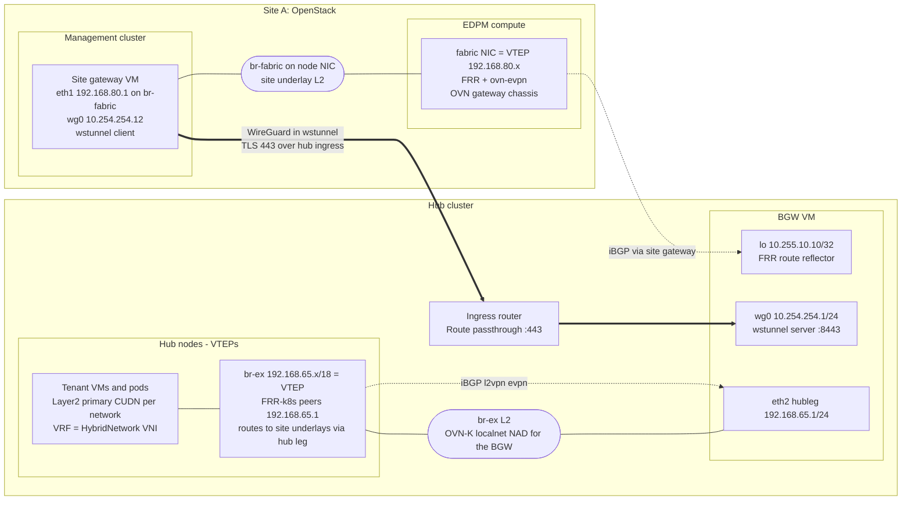

```text
 Hub cluster                                                        Site A (OpenStack)
 +---------------------------------------------------------+        +-------------------------------------------+
 |  hub node (x N)                 BGW VM                    |        |  Management cluster      EDPM compute     |
 |  br-ex 10.10.10.x  (node IP)    eth2 192.168.65.1/24      |        |  Site gateway VM         fabric NIC VTEP  |
 |        192.168.65.x/18 (VTEP) - (localnet on br-ex)       |  TLS   |  eth1 192.168.80.1 ----  192.168.80.x     |
 |  FRR-k8s -> 192.168.65.1       lo   10.255.10.10         |        |  wg0  10.254.254.12      FRR + ovn-evpn   |
 |  tenant VMs/pods on            wg0  10.254.254.1 <=======|=443===>|  (br-fabric on node NIC) OVN gw chassis   |
 |  Layer2 CUDN (one per VRF)     (route reflector)          |  wss   |  site underlay L2 192.168.80.0/24         |
 +---------------------------------------------------------+        +-------------------------------------------+
   control plane: hub nodes peer iBGP (l2vpn evpn) with the hub leg 192.168.65.1, site VTEPs with the loopback 10.255.10.10;
                  the BGW reflects with next hop unchanged
   data plane:    VXLAN VTEP <-> VTEP; the BGW routes eth2 <-> wg0, the site gateway routes wg0 <-> eth1
```

**Why hub-spoke (not full mesh)**

- Control-plane scale: O(N) BGP sessions to the BGW, not O(N²).
- Policy enforcement point: the BGW is the only reflector; it reflects only route targets allocated on the fabric, and per site only those placed there.
- Operational blast radius: the BGW is one VM per hub; spoke VTEPs keep forwarding for established routes while it restarts, and configuration changes are applied in place.

---

## 5. Tenant VRFs sharing the fabric

Each `HybridNetwork` is an IP-VRF with its own VNI *n* and RT `ASN:n`. On the hub it is a Layer2 primary ClusterUserDefinedNetwork with `transport: EVPN` (ipVRF *n*, plus the macVRF OVN-K needs for Layer2); on OpenStack sites a Neutron router created with `--evpn-vni n`. Several VRFs share the same BGW, underlay and tunnels.

**Type-5 route flow (control plane)**

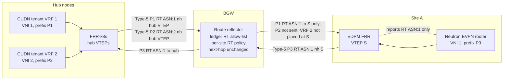

**Packet path for VRF 1 (data plane)**

```text
 VM or pod in VRF 1 (P1, hub)                                               VM in VRF 1 (P3, site A)
   | Layer2 CUDN, VRF 1                                                       ^ Neutron EVPN router
 [hub VTEP 192.168.65.x: VXLAN VNI 1, outer 192.168.65.x -> 192.168.80.x]    | OVN gateway chassis
   |  br-ex L2 (route 192.168.80.0/24 via 192.168.65.1)                     [VTEP S: decap VNI 1]
 BGW eth2 --route--> wg0 ==WireGuard==> wstunnel ==TLS 443 hub ingress==> site gateway wg0 --route--> eth1
                                                                              site underlay L2
 Inner MTU budget: 1300 (overlay) inside 1330 VXLAN payload over wg0 1380 (section 21.5)
```

Shared underlay, BGW and tunnels do not imply a shared VRF: a spoke installs only routes whose RT it imports, the BGW drops routes whose RT is not allocated on the fabric, and a site's peer group neither accepts nor receives RTs of networks not placed on that site.

---

## 6. Second tenant VRF on the same hub

Chad's `chad-app` lives on the same hub nodes as Acme's `acme-core`, with its own CUDN, VRF and VNI. It is placed only on the hub, so the RHOSO site never sees it.

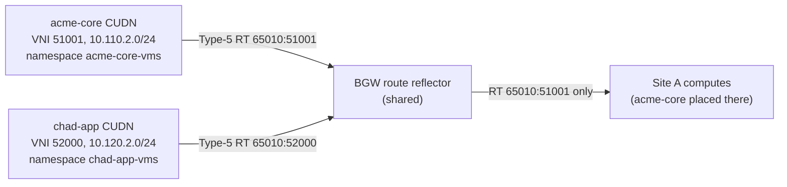

| Constraint | Enforcement |
|------------|-------------|
| VRF not placed at an OpenStack site | No CloudOSO placement for that network; the site's BGW peer group neither accepts nor reflects its RT, and the computes import only RTs of VRFs placed there |
| Same hub nodes, different tenants | One CUDN per HybridNetwork (separate OVN-K VRF, ipVRF/macVRF VNIs); placement-created namespaces join exactly one network |
| Same VNI on every placement of a network | `allocate` once on `HybridNetwork`; every placement reuses its status VNI/RT |
| Overlapping prefixes across tenants | Allowed: different VRFs. Within one network, placements must not overlap (§16.2) |

---

## 7. Object model & CRD contracts

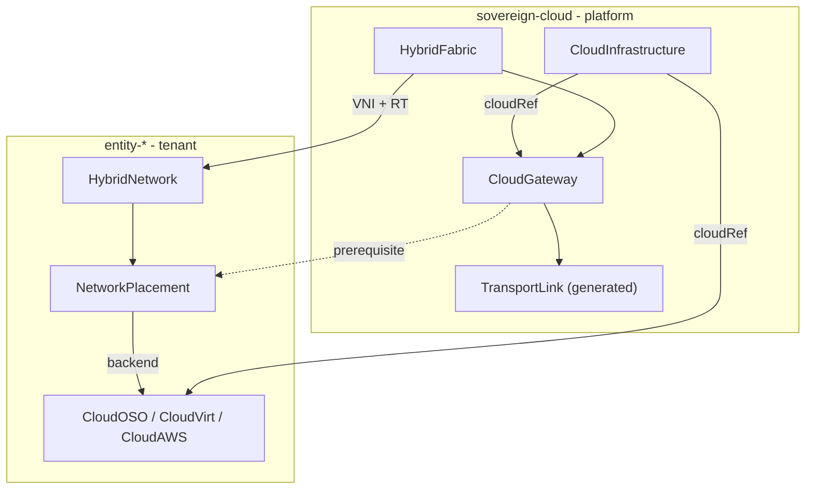

| Kind | NS | Owner | Spec (intent) | Status (observed) |
|------|----|-------|---------------|-------------------|
| `HybridFabric` | `sovereign-cloud` | Platform — **one per hub** | `domainAsn`, `entityRefs`, `vniPool`, `underlay{type,physicalNetworkName,nadName,cidr,hubVtepBlock,hubLegAddress,mtu}`, `borderGateway{name,loopback,wireguard,vmSize,image,vaultCredentialRef}`, `bgp.authentication`, `transportDefaults{mtu,defaultTunnelType}` | `ready`, `bgwEndpoint`, `bgwAddress`, `bgwPeerCount`, `allocatedVniCount`, `availableVniCount`, `peers[]`, `conditions[]` |
| `CloudInfrastructure` | `sovereign-cloud` | Platform — one per site/account | `type` (immutable), `displayName`, `credentialsRef{vaultPath\|secretRef}`, `entityRefs`, exactly one of `openstack{region,managementClusterKubeconfigRef,netConfigRef,dataplaneNodeSetRefs[],externalNetwork,baseDomain,projectDomain,designate,route53VaultPath}` / `openshift{clusterRef,bootImage,storageClass,hostedClusterCidrDefaults}` / `aws{accountId,region,baseDomain}` | `ready`, `capabilities{evpn,virtualization,frrK8s,dataplane,openstackApi}`, `site{endpoint,region,version,dataplaneNodeSets[]}` |
| `CloudGateway` | `sovereign-cloud` | Platform — one per site | `fabricRef`, `cloudRef{kind: CloudInfrastructure, name}`, `transport{type: none\|wireguard, vaultPeerConfigRef}`, `wireguard.address` (allocated when omitted), `siteUnderlay` (openstack), `macNatShim` (test only) | `ready`, `transportReady`, `peerState`, `vtep`, `importedRts[]`, `edpmNodeSets[]`, `conditions[]` |
| `TransportLink` | `sovereign-cloud` | Operator — one per CloudGateway | generated: `fabricRef`, `cloudGatewayRef`, `tunnelType` (mirrors the gateway) | `tunnelUp`, endpoints, `lastHandshakeAt` |
| `CloudOSO` / `CloudVirt` / `CloudAWS` | `entity-*` | Tenant | `cloudRef` + project settings (CloudOSO: `project`, `baseDomain`, DNS; CloudVirt: `baseDomain`, `storageClass`, `vmNamespaceQuota`; CloudAWS: `account`, `baseDomain`) | `ready`, `slug`, `domain` |
| `HybridNetwork` | `entity-*` | Tenant — one per VRF | `description`, `fabricRef`, optional `overlayMtu` (**no** VNI/RT) | `vni`, `canonicalRt`, `vrfName`, `overlayMtu`, `placements[]` |
| `NetworkPlacement` | `entity-*` | Tenant | `network`, `backend{kind: CloudOSO\|CloudVirt\|CloudAWS, name}`, `prefixes[]`, `vmNamespaces[]` (CloudVirt) | `ready`, `validated`, `realizedPrefixes[]`, `vmNamespaces[]`, `backendIds{}`, `vni`, `canonicalRt`, `cloudGatewayRef`, `conditions[]` |

`NetworkPlacement.spec.backend.kind` ∈ `CloudOSO` | `CloudVirt` | `CloudAWS`. `PlatformOpenshift` is not a backend (§15); `CloudAWS` is accepted by the API but has no EVPN realization yet (placements fail closed).

Shipped CRDs: `gitops/custom-operators/crds/crd-{hybridfabric,cloudinfrastructure,cloudgateway,transportlink,hybridnetwork,networkplacement,cloudoso,cloudvirt,cloudaws}.yaml`. Field reference: `docs/usage/crds/fabric.md`, `docs/usage/crds/cloudinfrastructure.md`.

**Validation tightening.** The CRDs ship permissive while live objects migrate: deprecated fields (CloudGateway `cloud`/`openstackCloudOSORef`/`domainAsn`, CloudOSO site fields, CloudVirt `hostedClusterCidrDefaults`, NetworkPlacement `state`, PlatformOpenshift `spec.fabric`) are still accepted, and the PlatformOpenshift backend is still in the enum. Required fields (`cloudRef`, `fabricRef`, `type`, …), immutables (`domainAsn`, `vniPool`, `borderGateway.loopback`, `underlay.cidr`, `HybridNetwork.spec.fabricRef`, `NetworkPlacement.spec.{network,backend}`, `CloudInfrastructure.spec.type`) and CEL rules are marked `TIGHTEN-LATER` and applied at cutover step 6 (§22).

---

## 8. Ansible realization layers (what must be done)

Operators stay thin: on reconcile they launch AAP JobTemplates (`<kind>-provision` / `<kind>-teardown`). **Ansible owns mutation** of the underlay, OVN, Neutron and numbering. Introduce layers **in order**; never skip prerequisites.

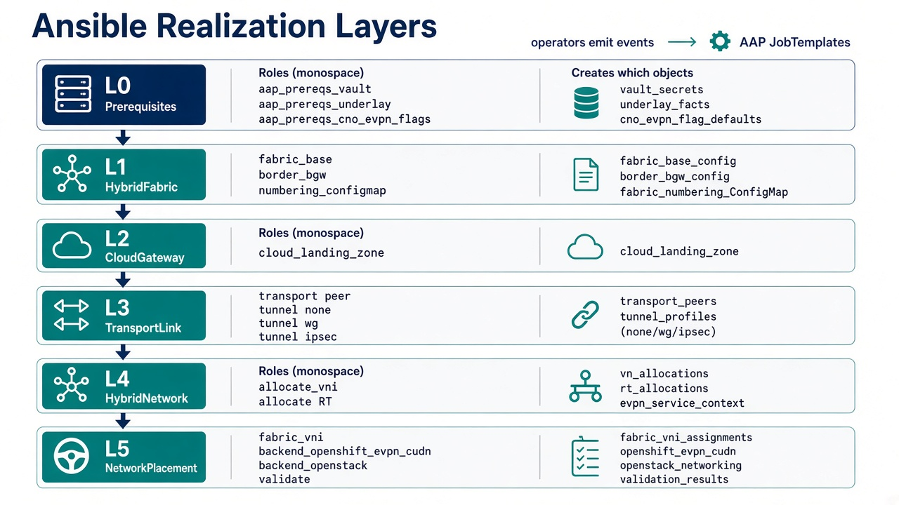

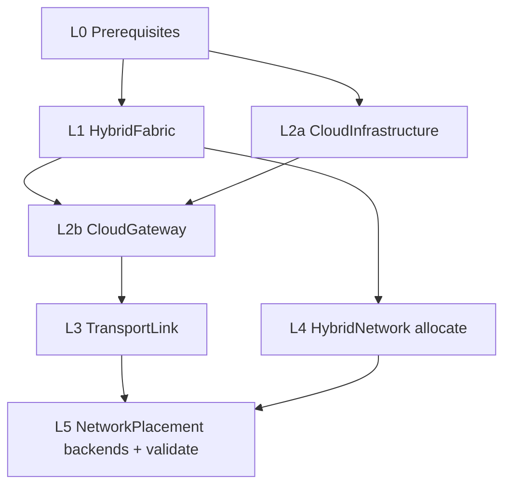

Section numbers are kept stable for references from code: the site layer (§8.2) now has two kinds, CloudInfrastructure (L2a) and CloudGateway (L2b).

### 8.0 Layer L0 — Prerequisites (manual / platform bootstrap; Ansible verifies)

| Ansible must | Detail |
|--------------|--------|
| Assert hub CNO EVPN settings | `additionalRoutingCapabilities.providers: [FRR]`, `defaultNetwork.ovnKubernetesConfig.routeAdvertisements: Enabled` (and `gatewayConfig.routingViaHost: true`). GitOps-owned cluster config: changing it rolls ovnkube on every hub node, which also runs AAP, Argo and the operators, so a job only checks it (`PendingPrereq`) |
| Assert FRR-k8s | `openshift-frr-k8s` pods on every hub node; CRDs `vteps.k8s.ovn.org`, `routeadvertisements.k8s.ovn.org`, `frrconfigurations.frrk8s.metallb.io` |
| Assert MTU | Path MTU ≥ VXLAN + tunnel overhead for the overlay MTU (§21.5) |
| Assert Vault | Paths exist for BGW creds, tunnel keys, site admin creds, management kubeconfigs — **read only**, never log secrets |
| Assert backends Ready | Tenant projects (`CloudOSO`, `CloudVirt`) and their `CloudInfrastructure` `.status.ready` |
| Record support caveat | Primary CUDN EVPN on virtualized hub nodes is a lab configuration (RH documents bare metal); record `EvpnLabOnly` where applicable |

**Security:** preflight uses least-privilege SA tokens from Vault; no cluster-admin in tenant namespaces.

---

### 8.1 Layer L1 — `HybridFabric` introduced

**Trigger:** `HybridFabric` create/update · **JT:** `hybridfabric-provision`

| Ansible must | Detail |
|--------------|--------|
| Validate pool | `vniPool.end >= start`; no overlap with other fabrics' pools; `vniPool.end` below the hub L2VNI offset (§16.4) |
| Create numbering store | ConfigMap `fabric-numbering-<name>` (VNI ledger; WireGuard address allocations in key `wgAddresses`) |
| Border gateway (BGW) VM | `deploy_border_gateway.yml` (§21.2). KubeVirt VM `<borderGateway.name>` (CentOS Stream 9 containerdisk) with `default` (masquerade), `underlay` (OVN-K layer2 NAD, legacy users) and, for `underlay.type: localnet`, **`hubleg`** on an OVN-K localnet NAD `spec.underlay.nadName` on `physicalNetworkName` (`physnet` = `br-ex`), no IPAM, fixed MAC (`bgw_hub_leg.yml`). Guest: loopback = `borderGateway.loopback`, eth2 = `hubLegAddress`, dnsmasq only on eth1 with the hub VTEP block excluded, wg0 with one peer per WireGuard CloudGateway, FRR iBGP route reflector (`l2vpn evpn` + `ipv4 unicast`, `attribute-unchanged next-hop`). Service `<bgw>-wss` + passthrough Route for wstunnel. WireGuard keys from Vault `borderGateway.vaultCredentialRef` (generated when absent), never Git |
| Apply config in place | Rendered config (Secret `<bgw>-config`: `wg0.conf`, `frr.conf`, dnsmasq, nftables) is pushed over SSH to the running guest and only changed services reload (`bgw_config_push.yml`); the key is Vault `<vaultCredentialRef>` `sshPrivateKey`. Without the key the role falls back to restarting the VMI (whole fabric flaps) or defers |
| Tenant RT policy | Ledger allow-list (§8.5.4) plus per-site peer groups: `HUB` (hub underlay minus site underlays, incl. the hub VTEP block), `SITE-<gateway>` per WireGuard gateway, `TUNNEL` (EVPN denied); each with route-maps in/out matching only the RTs of networks placed on that site (CloudVirt placements add their macVRF RT to `HUB`) (`files/bgw_rt_policy.py`) |
| BGP authentication | Optional `bgp.authentication.secretRef` (key `password`) on every peer group; set it on the EDPM and FRR-k8s side first |
| Legacy ledger migration | `ledger_migrate_legacy.yml` moves keys from retired `fabric-numbering-*` ConfigMaps; the allocator prefers a network's previous `status.vni` |
| Status | `ready`, `bgwEndpoint`, `bgwAddress`, `bgwPeerCount`, `availableVniCount`, `conditions[]` |
| Teardown | Only if `allocatedVniCount==0` and no CloudGateways reference the fabric; else block. Removes the BGW VM, Route, Service, Secrets and fabric-namespace NADs (`remove_border_gateway.yml`) |

**Idempotency:** re-run must not reallocate VNIs or reset the ledger.

**Vault layout** (KV mount `hybridsovereign/`; EDA generates WireGuard pairs when absent, never writes Git)

| Path | Keys | Read by |
|------|------|---------|
| `fabric/<fabric>/bgw` (lab: `fabric/platform-fabric/bgw`) | `wgPrivateKey`, `wgPublicKey`, `sshPublicKey`, `sshPrivateKey` (in-place config push) | hybridfabric_provision (BGW), cloudgateway_provision (public key for the site gateway) |
| `fabric/wireguard/<cloudgateway>` (lab: `fabric/wireguard/acme-oso1-gw`) | `wgPrivateKey`, `wgPublicKey`, optional `sshPublicKey` | cloudgateway_provision (site gateway VM), hybridfabric (BGW peer) |
| `CloudInfrastructure.spec.credentialsRef.vaultPath` | `clouds.yaml` (openstack) / AWS keys | cloudinfrastructure_provision, cloudoso_provision, networkplacement (Neutron) |
| `CloudInfrastructure.spec.openstack.managementClusterKubeconfigRef` (lab: `oso/oso1/mgmt-kubeconfig`) | `kubeconfig` | cloudinfrastructure_provision (read-only checks), cloudgateway_provision, networkplacement (HA chassis check) |
| `oso/projects/<cloudoso>/clouds-config` | `clouds.yaml` | networkplacement (Neutron, project scope) |

---

### 8.2 Layer L2 — site: `CloudInfrastructure`, then `CloudGateway`

#### 8.2.1 L2a — `CloudInfrastructure` introduced

**Trigger:** `CloudInfrastructure` · **JT:** `cloudinfrastructure-provision` · **Role:** `cloudinfrastructure_provision`

| Ansible must | Detail |
|--------------|--------|
| Validate shape | `spec.type` matches exactly one typed section (also enforced by CEL); `credentialsRef` resolves (Vault path or Secret in `sovereign-cloud`) |
| `openstack` | Authenticate with the admin `clouds.yaml`; read the management kubeconfig and confirm the NetConfig and every NodeSet in `dataplaneNodeSetRefs` exist. **No changes** to the site (the EDPM landing belongs to the CloudGateway) |
| `openshift` | Confirm OpenShift Virtualization and, for fabric use, the FRR provider / route advertisements / VTEP CRDs on `clusterRef` (`local` = the hub) |
| `aws` | Validate account credentials; no fabric capability (§15.0) |
| Status | `capabilities` (`evpn`, `virtualization`, `frrK8s`, `dataplane`, `openstackApi`), `site` (`endpoint`, `region`, `version`, `dataplaneNodeSets[]`) |
| Teardown | Refuse while tenant projects or a CloudGateway reference it |

Tenant projects (`cloudoso_provision`, `cloudvirt_provision`, `cloudaws_provision`) resolve `cloudRef` and use the site credentials only to create the project (Keystone project + application credential + per-project `clouds.yaml`; VM namespace quota; Route53 slug).

#### 8.2.2 L2b — `CloudGateway` introduced

**Trigger:** `CloudGateway` · **JT:** `cloudgateway-provision` · **Role:** `cloudgateway_provision`

| Ansible must | Detail |
|--------------|--------|
| Resolve fabric and site | Load `fabricRef` (Ready) and `cloudRef` (Ready CloudInfrastructure); the site type selects the path. Entity labels must match the fabric's `entityRefs` |
| `openstack` path | `openstack_site_gateway.yml` (site gateway VM on the management cluster, §21.4) then `openstack_edpm_evpn.yml` / `openstack_edpm_nodeset.yml`: NetConfig network `fabric`, then each NodeSet from the CloudInfrastructure's `dataplaneNodeSetRefs` **one at a time**, native OVN BGP-EVPN (FRR + `ovn-evpn`), **not** the deprecated `ovn-bgp-agent` (§10.3) |
| `openshift` path (hub) | `openshift_hub_evpn.yml`: check (never patch) the hub CNO prerequisites; ensure the hub underlay DaemonSet `<fabric>-hub-underlay` (node VTEP addresses, routes via the hub leg, optional MAC shim), VTEP CR `<fabric>-vtep` and FRRConfiguration `<fabric>-bgw` (§10.2, §21.3). Nothing tenant-specific; transport `none` |
| **`aws` — no EVPN fabric landing** | Rejected with `AwsUnsupported`; do not create fabric CloudGateways for AWS sites |
| WireGuard address | Allocated from the fabric tunnel net when `wireguard.address` is omitted |
| Status | `ready`, `transportReady`, `vtep`, `peerState`, `edpmNodeSets[]`, `conditions[]` |
| Teardown | openstack: remove the site gateway VM (EDPM fabric settings stay); openshift: refuse while CloudVirt placements remain on the fabric, then remove FRRConfiguration, VTEP CR and node legs (DaemonSet remove pass) |

**Security:** management kubeconfigs scoped to the networking APIs the gateway needs; audit job id on CR status.

---

### 8.3 Layer L3 — `TransportLink` introduced

**Trigger:** `TransportLink` · **JT:** `transportlink-provision` · **Role:** `transport`

TransportLink is operator-generated from the CloudGateway (one per gateway; the reference GitOps still declares `acme-oso1-link` until generation lands). It is the place where tunnel state is reported.

| Ansible must | Detail |
|--------------|--------|
| Bind fabric + gateway | Both Ready; same `fabricRef` |
| `tunnelType: none` | Hub gateway (hub nodes are on the hub underlay) or a site whose underlay is already routed to the hub: nothing to tunnel |
| `wireguard` | RHOSO site gateways. WireGuard between the BGW VM and the site gateway VM `fabric-gw-<site>`, carried inside **wstunnel over the hub ingress** (passthrough Route, TLS 443) because the lab exposes no UDP. The authoritative check is the EDPM FRR session to the BGW loopback. Keys: BGW `borderGateway.vaultCredentialRef`, gateway `transport.vaultPeerConfigRef` |
| Exchange endpoints | Write `borderEndpoint`, `cloudEndpoint`, `lastHandshakeAt` |
| Status | `tunnelUp`, `ready` |

**`wireguard` transport (site gateway to BGW)**

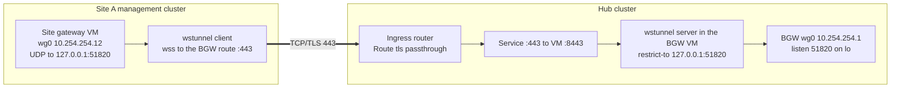

Encapsulation between the sites: tenant packet in VXLAN (VNI n) in WireGuard (UDP) in a WebSocket stream over TLS/TCP 443. Physical deployments with routed underlays use `none` instead.

**Teardown:** drain BGP (graceful), bring down tunnel, clear runtime state — **do not** delete Vault secrets.

---

### 8.4 Layer L4 — `HybridNetwork` introduced (allocate)

**Trigger:** `HybridNetwork` · **JT:** `hybridnetwork-provision` · **Role:** `allocate`

| Ansible must | Detail |
|--------------|--------|
| Resolve entity | From namespace `entity-*` → Entity name |
| Select fabric | `spec.fabricRef` when set and entity-visible (§19.6), else the entity's fabric; fail if missing/not Ready |
| Allocate VNI | Atomically from the fabric pool; persist `network → vni` in the ledger |
| Derive VRF + RT | `vrfName=vrf-<network>`, `canonicalRt=<fabricAsn>:<vni>`; `overlayMtu` from spec or the fabric |
| **Never** take VNI from tenant spec | Ignore/reject if somehow present |
| Re-render BGW policy | New RT added to the ledger allow-list (in-place push, §8.1) |
| Status | `vni`, `vrfName`, `canonicalRt`, `fabric`, `overlayMtu`, `placements[]` |
| Teardown | Release VNI only when zero placements remain |

---

### 8.5 Layer L5 — `NetworkPlacement` introduced (realize + validate)

**Trigger:** `NetworkPlacement` · **JT:** `networkplacement-provision` · **Roles:** `backend_cloudvirt_evpn` **or** `backend_rhoso_ovn_evpn`, `validate`

#### 8.5.1 Common preflight (every placement)

| Ansible must | Detail |
|--------------|--------|
| Load HybridNetwork | Must be allocated |
| Resolve backend | `CloudOSO`, `CloudVirt` or `CloudAWS` in the same entity namespace, Ready, and its CloudInfrastructure; any other kind fails with `BackendKindRemoved`; `CloudAWS` fails closed (no EVPN path) |
| Resolve CloudGateway | The gateway whose `cloudRef` is the backend's site, on the network's fabric; Ready → `prerequisiteReady=true` |
| Prefix validation | CIDR parse; no overlap with sibling placements of the same network (§16.2); CloudVirt: no overlap with the hub's cluster, service or node networks (§16.5) |
| Deletion | Deleting the placement withdraws the backend objects; the VNI stays until the last placement is gone |

#### 8.5.2 Backend: CloudVirt — hub VMs (`backend_cloudvirt_evpn`)

On the hub (the CloudVirt's CloudInfrastructure `clusterRef: local`), Ansible must create/update, in this order:

1. The `vmNamespaces` (default one, `<cloudvirt>-<network>`): created with `k8s.ovn.org/primary-user-defined-network`, `hybridsovereign.redhat/hybridnetwork=<network>`, entity / CloudVirt / placement owner labels (and the kubemacpool opt-out in the lab). Refuse a namespace that exists unless the same entity and CloudVirt own it; a namespace joins one network only. Apply the CloudVirt `vmNamespaceQuota`.
2. `ClusterUserDefinedNetwork <network>`: `topology: Layer2`, `layer2: {role: Primary, subnets: <prefixes>, mtu: <overlayMtu>, ipam: {lifecycle: Persistent}}`, `transport: EVPN`, `evpn: {vtep: <fabric>-vtep, ipVRF: {vni, routeTarget}, macVRF: {vni: 100000 + vni, routeTarget: <asn>:<L2VNI>}}`, selecting the placement's namespaces. Immutable fields changed → refuse (delete and recreate the placement).
3. `RouteAdvertisements advertise-<network>-evpn`: `advertisements: [PodNetwork]`, `targetVRF: auto`, `frrConfigurationSelector: {}`, `nodeSelector: {}`, selecting the CUDN by label.
4. Wait for the CUDN to report `TransportAccepted` / `NetworkCreated` and the RouteAdvertisements `Accepted`; record names in `backendIds`.

The hub VTEP CR and FRRConfiguration come from the openshift CloudGateway (§8.2.2), not from the placement. Teardown deletes the namespaces (their VMs and disks go with them), then the RouteAdvertisements, then the CUDN.

#### 8.5.3 Backend: CloudOSO — RHOSO 18.0 FR6 native OVN EVPN (`backend_rhoso_ovn_evpn`)

| Ansible must | Detail |
|--------------|--------|
| Assert FR6 EVPN | RHOSO ≥ 18.0.21; Neutron supports `router.create` with `evpn_vni`; reject labs still requiring `ovn-bgp-agent` for new placements |
| Neutron network/subnet | Prefixes from placement; network MTU = `overlayMtu` (1300) |
| EVPN router | `openstack router create --evpn-vni <HybridNetwork.status.vni>` (centralized OVN gateway, Type-5) |
| Advertise prefixes | `router add subnet --advertise-host` (or REST `advertise_host: true`) |
| HA chassis check | `evpn-hcg-<router>` non-empty on the management cluster; recreate the router once when empty |
| Status | Neutron network/subnet/router UUIDs, `vni`, `backendApplied` |

Credentials: per-project `clouds.yaml` from the CloudOSO; management kubeconfig from the CloudInfrastructure. Full procedure: **§10.3**.

#### 8.5.4 `fabric_vni` (hub side): RT allow-list and per-site policy

The BGW accepts EVPN routes only when their RT is `<fabric ASN>:<VNI>` for a VNI in this fabric's ledger (plus the derived macVRF RT of networks with a CloudVirt placement). With per-site policy on (default), each site's peer group has route-maps `<group>-EVPN-IN` / `<group>-EVPN-OUT` that match only the RTs of networks placed on that site, so a site can neither inject nor receive another site's tenants. Spokes still import only their VRFs' RTs, so tenant separation does not depend on the hub filter alone. `bgw_rt_filter: off` disables the filter (lab debugging only). The first render with per-site groups flaps each session once.

#### 8.5.5 `validate`

| Ansible must | Detail |
|--------------|--------|
| Positive probe | Hub: CUDN present and advertised; site: Type-5 for the placement prefix present on the BGW. End-to-end probe from a pod in a placement namespace to a VM at the other site (workshop Lab 6) |
| Negative probe | No route to other VRFs' prefixes |
| Status | `validated`, `lastValidatedAt`, `realizedPrefixes` |

#### 8.5.6 Placement state machine

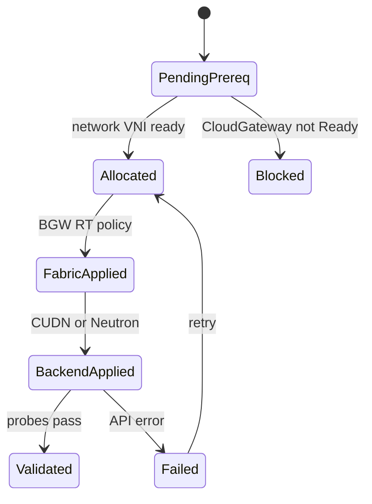

---

### 8.6 Layer interaction matrix

| Layer introduced | Ansible creates / mutates | Must already exist |
|------------------|---------------------------|--------------------|
| L1 HybridFabric | Numbering ledger, BGW VM (incl. hub leg) | L0 |
| L2a CloudInfrastructure | Nothing on the site (checks only); status capabilities | L0 + credentials in Vault/Secret |
| L2b CloudGateway | openstack: site gateway VM + EDPM landing; openshift: hub node VTEPs, VTEP CR, FRRConfiguration | L1 Ready + L2a Ready |
| L3 TransportLink | BGW peer ± tunnel state | L2b Ready |
| L4 HybridNetwork | VNI/RT allocation, BGW allow-list | L1 Ready |
| L5 NetworkPlacement | Namespaces + Layer2 CUDN + RouteAdvertisements **or** Neutron network + EVPN router; BGW per-site policy | L2b (and L3 for wireguard) Ready + L4 allocated |
| Teardown L5 | Withdraw from site | — |
| Teardown L4 | Free VNI | no placements |
| Teardown L3→L1 | Reverse order | no dependents |

### 8.7 JobTemplate catalog

| Kind | Provision | Teardown |
|------|-----------|----------|
| HybridFabric | `hybridfabric-provision` | `hybridfabric-teardown` |
| CloudInfrastructure | `cloudinfrastructure-provision` | `cloudinfrastructure-teardown` |
| CloudGateway | `cloudgateway-provision` | `cloudgateway-teardown` |
| TransportLink | `transportlink-provision` | `transportlink-teardown` |
| HybridNetwork | `hybridnetwork-provision` | `hybridnetwork-teardown` |
| NetworkPlacement | `networkplacement-provision` | `networkplacement-teardown` |

Playbooks live under `eda/rulebooks/` (roles in `eda/rulebooks/roles`, symlinked from `eda/hybridvpc/roles`); SCM update-on-launch from Git. The fabric JTs run in an execution environment with `python-openstackclient`.

---

## 9. Day-0 / Day-1 procedures

### 9.1 Day-0 — platform fabric engineer

1. Complete L0 (hub CNO via GitOps, Vault, MTU).
2. Create `HybridFabric/platform-fabric` (`underlay.type: localnet`, hub VTEP block, hub leg). Wait Ready (BGW VM with the hub leg).
3. Register `CloudInfrastructure` objects: `oso1` (openstack) and `hub-virt` (openshift). Wait Ready and check `status.capabilities`.
4. Create CloudGateways `hub-virt-gw` (`none`) and `acme-oso1-gw` (`wireguard`, `siteUnderlay`). Wait for hub node BGP Established and the EDPM rollout (one NodeSet at a time).
5. **Negative test:** a CloudGateway on an `aws` CloudInfrastructure fails (`AwsUnsupported`); tenant users cannot create platform objects.
6. Hand off to tenant network admins (entities in `entityRefs` of the fabric and of the CloudInfrastructures).

### 9.2 Day-1 — tenant network admin

1. Create cloud projects with `cloudRef` (CloudVirt on `hub-virt`, CloudOSO on `oso1`).
2. Create `HybridNetwork` (name + description).
3. Add `NetworkPlacement`s with prefixes; for CloudVirt, the VM namespaces to create.
4. Watch: allocated → backendApplied → validated.
5. Start VMs in the placement namespaces (hub) or on the Neutron network (site).
6. Decommission a site by deleting that placement only.

---

## 10. OpenShift 4.22 & RHOSO realization

### 10.1 CNO prerequisites (hub)

```yaml
# Network.operator.openshift.io cluster — excerpt (GitOps-owned on the hub)
spec:
  additionalRoutingCapabilities:
    providers: [FRR]
  defaultNetwork:
    ovnKubernetesConfig:
      routeAdvertisements: Enabled
      gatewayConfig:
        routingViaHost: true
```

Applying it rolls `ovnkube-node` on every hub node and starts `openshift-frr-k8s`. Because the hub also runs AAP, Argo and the operators, it is cluster configuration managed by GitOps in a quiet window, never patched by a fabric job (the openshift CloudGateway only checks it). **Support note:** RH documents BGP EVPN for primary CUDNs on bare metal; virtualized hub nodes are a lab configuration.

### 10.2 Hub CloudVirt spoke (objects on the hub)

The hub is the OpenShift-side spoke. Its nodes have no spare NIC and their node IPs are not unique on the fabric (another site reuses the same machine network), so the hub nodes' VTEPs are carved from the fabric underlay and carried on `br-ex`, the only L2 the nodes share. All of it is platform-managed: the hub leg and node legs come from `HybridFabric.spec.underlay` (`type: localnet`) and the openshift CloudGateway; each tenant network adds only a Layer2 CUDN, its RouteAdvertisements and its namespaces.

**Platform, once per fabric** (`hybridfabric_provision` `bgw_hub_leg.yml`, `cloudgateway_provision` `openshift_hub_evpn.yml`):

```yaml
# BGW hub leg: OVN-K localnet network on the node bridge for physnet (br-ex), no IPAM
apiVersion: k8s.cni.cncf.io/v1
kind: NetworkAttachmentDefinition
metadata:
  name: fabric-localnet                # spec.underlay.nadName
  namespace: sovereign-cloud
spec:
  config: '{"cniVersion":"0.3.1","name":"fabric-localnet","type":"ovn-k8s-cni-overlay","topology":"localnet","physicalNetworkName":"physnet","netAttachDefName":"sovereign-cloud/fabric-localnet"}'
# BGW VM: third interface "hubleg" (bridge binding, fixed MAC) on this NAD;
# guest eth2 = spec.underlay.hubLegAddress (192.168.65.1/24)
---
# Hub node legs: DaemonSet platform-fabric-hub-underlay (privileged, hostNetwork, every node)
#   - VTEP address 192.168.65.<node IP last octet> with the WHOLE underlay prefix (/18) on br-ex
#   - routes to every remote site underlay (e.g. 192.168.80.0/24) and the BGW tunnel net via 192.168.65.1
#   - optional MAC shim (lab only, netdev-family nft on the br-ex uplink; Appendix A)
---
apiVersion: k8s.ovn.org/v1
kind: VTEP
metadata:
  name: platform-fabric-vtep
spec:
  cidrs: ["192.168.64.0/18"]           # spec.underlay.cidr: also lets the OVN-K FRRConfiguration accept remote /32 VTEPs
  mode: Unmanaged                      # OVN-K discovers the node address inside cidrs
---
apiVersion: frrk8s.metallb.io/v1beta1
kind: FRRConfiguration
metadata:
  name: platform-fabric-bgw
  namespace: openshift-frr-k8s
  labels: {evpn: "true"}
spec:
  nodeSelector: {}
  bgp:
    routers:
    - asn: 65010
      neighbors:
      - address: 192.168.65.1          # BGW hub leg, on-link (not the loopback)
        asn: 65010
        toAdvertise: {allowed: {mode: all}}
        toReceive: {allowed: {mode: all}}
  raw:
    priority: 5
    rawConfig: |
      router bgp 65010
       neighbor 192.168.65.1 ebgp-multihop 32
       address-family l2vpn evpn
        neighbor 192.168.65.1 activate
       exit-address-family
```

Why the whole /18 on `br-ex`, and why the hub-leg address as peer: OVN-K's `br-ex` flows send host-originated traffic straight to the uplink except for subnets configured on `br-ex`, which go to the OVS `NORMAL` action; only then does a packet reach the BGW's localnet port when the BGW runs on the same node. With the /18 on-link, the BGW hub leg (192.168.65.1) is reachable from every node; the loopback would need a route that OVN-K does not hand to the local VM port.

**Per tenant network** (`networkplacement_provision` `backend_cloudvirt_evpn.yml`, Acme example):

```yaml
apiVersion: v1
kind: Namespace
metadata:
  name: acme-core-vms                  # NetworkPlacement.spec.vmNamespaces[]
  labels:
    k8s.ovn.org/primary-user-defined-network: ""   # only effective at creation
    hybridsovereign.redhat/hybridnetwork: acme-core
    hybridsovereign.redhat/entity: acme-corp
---
apiVersion: k8s.ovn.org/v1
kind: ClusterUserDefinedNetwork
metadata:
  name: acme-core
  labels:
    hybridsovereign.redhat/network: acme-core
    hybridsovereign.redhat/fabric: platform-fabric
spec:
  namespaceSelector:
    matchLabels: {hybridsovereign.redhat/hybridnetwork: acme-core}
  network:
    topology: Layer2
    layer2:
      role: Primary
      subnets: ["10.110.2.0/24"]
      mtu: 1300                        # HybridNetwork overlayMtu
      ipam: {lifecycle: Persistent}    # VM IPs survive restart and live migration
    transport: EVPN
    evpn:
      vtep: platform-fabric-vtep
      ipVRF:  {vni: 51001,  routeTarget: "65010:51001"}
      macVRF: {vni: 151001, routeTarget: "65010:151001"}   # required for Layer2 EVPN; L2VNI = 100000 + VNI
---
apiVersion: k8s.ovn.org/v1
kind: RouteAdvertisements
metadata:
  name: advertise-acme-core-evpn
spec:
  advertisements: ["PodNetwork"]
  targetVRF: auto
  frrConfigurationSelector: {}
  nodeSelector: {}
  networkSelectors:
    - networkSelectionType: ClusterUserDefinedNetworks
      clusterUserDefinedNetworkSelector:
        networkSelector:
          matchLabels: {hybridsovereign.redhat/network: acme-core}
```

The hub advertises the whole Layer2 subnet as one Type-5 route from the node VTEPs (no per-node host subnets as with Layer3). VMs attach with the `l2bridge` binding on the pod network, which in these namespaces is the tenant network.

### 10.3 RHOSO 18.0 FR6 — native OVN BGP-EVPN (OSO1)

**Target platform:** Red Hat OpenStack Services on OpenShift **18.0.21 (Feature Release 6)** and later.  
**Feature status:** Technology Preview — *Native BGP-EVPN for advanced multi-tenant routing* (RHOSSTRAT-583).  
**Design choice:** Prefer **OVN-native BGP-EVPN** over the legacy / deprecated `ovn-bgp-agent` path (deprecated since RHOSO 18.0.10 FR3; do not build new Sovereign automation on it).

#### 10.3.1 What FR6 native EVPN provides

| Capability | FR6 native OVN BGP-EVPN | Legacy `ovn-bgp-agent` (do not use for new work) |
|------------|-------------------------|--------------------------------------------------|
| Control plane | BGP EVPN via **FRR**, driven by **OVN dynamic-routing** options | Python agent watches NB DB → FRR / kernel VRF |
| Route types (TP) | **Type-5** (IP prefixes) only | Kernel/VRF exposure; Type-5 with manual gaps |
| Routing model (TP) | **Centralized** via **OVN Gateway** chassis | Per-node VRF + VXLAN devices |
| Tenant isolation | OVN logical isolation preserved; VNI per EVPN domain | Provider-network + VNI external_ids |
| Future (post-FR6) | Type-2 + distributed routing planned upstream | Deprecated / removed |

Native OVN installs Type-5-advertised prefixes into a Linux VRF/table; FRR advertises them as EVPN. Remote Type-5 learning is consumed via Netlink into OVN (no SB DB copy of remote EVPN state). Datapath stays in OVS/OVN (hardware-offload friendly vs pure kernel VRF hairpinning).

```mermaid
flowchart LR
  subgraph site["Site A: OpenStack"]
    direction TB
    VM["Tenant VM\nprefix P3"]
    NS["Neutron network + subnet\nMTU 1300"]
    RTR["Neutron router\n--evpn-vni n\nsubnet --advertise-host"]
    GWC["OVN gateway chassis\n(edpm_enable_chassis_gw)\nHA_Chassis_Group evpn-hcg-<router>"]
    EV["ovn-evpn agent extension\nbr-evpn, vxlan-evpn, VRF n"]
    FRR["EDPM FRR\nl2vpn evpn, source = fabric NIC"]
    SG["Site gateway VM\n(router to the tunnel)"]
    VM --> NS --> RTR --> GWC --> EV --> FRR
    FRR -. "iBGP to 10.255.10.10" .-> SG
  end
  subgraph hub["Hub"]
    RR["BGW route reflector"]
  end
  subgraph hc["Hub nodes"]
    CUDN["Layer2 CUDN IP-VRF\nVNI n, RT ASN:n"]
  end
  SG == "WireGuard in wstunnel" ==> RR
  RR <-. "EVPN Type-5 RT ASN:n" .-> CUDN
```

#### 10.3.2 Platform prerequisites (CloudGateway / day-0 on OSO1)

The openstack CloudGateway path (§8.2.2) must assert RHOSO ≥ **18.0.21** and enable native dynamic routing / EVPN (not `ovn-bgp-agent`):

| Area | Requirement |
|------|-------------|
| Control plane | ML2/OVN; Neutron **EVPN Service Plugin** (or FR6 equivalent packaging) enabled |
| Data plane / EDPM | FRR on gateway/network nodes; OVN **EVPN agent extension** (replaces BGP-agent EVPN expose) |
| VTEP | Global reachable VTEP IP per EVPN chassis (`ovn-evpn-local-ip` / Open_vSwitch external_ids) |
| BGP underlay | FRR peers the BGW loopback (`HybridFabric.spec.borderGateway.loopback`) with **address-family l2vpn evpn** activated |
| AS / VNI | Fabric ASN (iBGP to the BGW); VNIs allocated only from the fabric pool (never tenant-picked) |
| Verify | `openstack router create --help` shows `--evpn-vni`; OVN NB supports `dynamic-routing*` options |

**Explicit non-goals on OSO for FR6 TP**

- Type-2 MAC/IP EVPN (L2 stretch OCP↔RHOSO) — wait for later RHOSO; Acme design stays **L3 / Type-5 / IP-VRF**.  
- Distributed EVPN on every compute — TP is **centralized OVN Gateway** only.  
- Reintroducing `edpm_ovn_bgp_agent_*` EVPN knobs for new CloudOSO attachments.

#### 10.3.3 Placement realization (`backend_openstack` → rename conceptually `backend_rhoso_ovn_evpn`)

When `NetworkPlacement` targets `CloudOSO/oso1` for HybridNetwork `acme-core` with allocated `vni=51001`, `canonicalRt=65010:51001`, prefix `10.110.1.0/24`:

| Step | Ansible action |
|------|----------------|
| 1 | Resolve the per-project clouds.yaml (`CloudOSO`) and the management kubeconfig (`CloudInfrastructure`); assert FR6 EVPN APIs |
| 2 | Ensure project network + subnet for placement prefixes (or adopt existing) |
| 3 | Create (or adopt) Neutron **EVPN router**: `openstack router create --evpn-vni 51001 …` so VNI **equals** HybridNetwork status VNI |
| 4 | Attach subnet with host-route advertisement into the EVPN: `openstack router add subnet --advertise-host <router> <subnet>` (or REST `advertise_host: true`) |
| 5 | Confirm OVN logical router has dynamic-routing / VRF-id / VNI wiring (EVPN Service Plugin); gateway chassis scheduled |
| 6 | Confirm FRR on gateway chassis advertises Type-5 for the prefix toward the BGW; RT aligns with the fabric canonical RT (`65010:51001`) |
| 7 | Patch `NetworkPlacement.status` with network/subnet/router UUIDs, `vni`, `backendApplied`, `cloudGatewayRef` |
| 8 | Validate: probe from a pod in the hub placement namespace to the RHOSO VM (and negative cross-VRF) |

**CLI sketch (automation-owned; tenants never set VNI)**

```bash
# VNI MUST be HybridNetwork.status.vni from fabric IPAM / allocate role
openstack network create --mtu 1300 acme-core-oso1
openstack subnet create --network acme-core-oso1 --subnet-range 10.110.1.0/24 acme-core-oso1-subnet
openstack router create --evpn-vni 51001 acme-core-evpn-rtr
openstack router add subnet --advertise-host acme-core-evpn-rtr acme-core-oso1-subnet
openstack router show acme-core-evpn-rtr -c evpn-vni
```

#### 10.3.4 Alignment with OpenShift CUDN (same fabric VPN)

| Side | Object | VNI | RT | Prefix example |
|------|--------|-----|----|----------------|
| Hub (CloudVirt) | Layer2 CUDN `evpn.ipVRF` (+ macVRF 151001) | 51001 | `65010:51001` | 10.110.2.0/24 |
| OSO1 | Neutron router `--evpn-vni` + advertised subnet | 51001 | import/export policy → same canonical RT | 10.110.1.0/24 |
| CENTRAL | BGW route reflector | reflects Type-5 | fabric ASN 65010 | — |

Same VNI on both spokes is mandatory for one HybridNetwork VPN. Overlapping tenant CIDRs across **different** HybridNetworks remain OK (different VNIs).

#### 10.3.5 Transport semantics for RHOSO FR6

| `transport.type` | Use |
|--------------|-----|
| `none` | Site underlay already routed to the hub (physical deployments): EDPM FRR peers the BGW loopback directly. |
| `wireguard` | Remote site without a routed underlay to the hub. The CloudGateway lands a site gateway VM on the OpenStack management cluster (`br-fabric` on `siteUnderlay.interface` on every node, bridge NAD `openstack/fabric`, eth1 = `siteUnderlay.gatewayAddress`, WireGuard to the BGW carried over TLS 443 through the hub ingress), then the EDPM landing: NetConfig network `fabric` once, then each NodeSet in `CloudInfrastructure.spec.openstack.dataplaneNodeSetRefs` **one at a time in CR order** (patch, one deployment scoped to that NodeSet, wait for Ready before the next; details §21.4). The optional MAC-translation shim (`siteUnderlay.macNatShim`) is for test environments only (Appendix A). |

Placement order matters: the Neutron `--evpn-vni` router only gets gateway chassis in `evpn-hcg-<router id>` if it is created after the EDPM landing; `backend_rhoso_ovn_evpn.yml` checks the group on the management cluster and recreates the router once when empty. Neutron networks are created with MTU 1300 (fabric.md §21.5).

The site's CloudGateway (`cloudRef` → CloudInfrastructure type openstack) owns the site underlay, the site gateway and the EDPM landing; the CloudInfrastructure owns the credentials and the NodeSet list. FR6 native EVPN does **not** remove the need for these objects.

#### 10.3.6 Migration note (existing labs)

If a lab still runs `ovn-bgp-agent` EVPN expose (FR3-era):

1. Treat as **transitional only**.  
2. New `NetworkPlacement` automation targets FR6 native `--evpn-vni` routers.  
3. Document drain: withdraw agent-managed VRFs → recreate with EVPN routers → verify Type-5 on the BGW before deleting agent config.

### 10.4 Chad on the hub

| Network | VNI / RT | L2VNI | Hub prefix | Namespace |
|---------|----------|-------|------------|-----------|
| `chad-app` | 52000 / `65010:52000` | 152000 | 10.120.2.0/24 | `chad-app-vms` |

Same hub VTEPs and the same FRRConfiguration as Acme; a separate CUDN and VRF. No CloudOSO placement, so the RHOSO site's peer group neither accepts nor receives `65010:52000` (§6).

---

## 11. Sample manifests (platform fabric + Acme / Chad tenants)

> **History note.** Until 2026-10-07 this section showed one `HybridFabric` per Entity (`acme-fabric` AS 65010, `chad-fabric` AS 65020) and a per-spoke ASN scheme; until 2026-10-08 the OpenShift spokes were hosted clusters joined to the hub underlay. Both are retired: there is one platform fabric, everything is iBGP in its ASN to the border gateway, tenants are VRFs, and the OpenShift spoke is the hub's own CloudVirt. Re-originating Type-5 routes per spoke ASN would need the BGW to be a VXLAN re-originator, which FRR does not do for imported EVPN routes (§21.1). The authoritative manifests are `gitops/apps/platform-fabric/templates/*.yaml`; `samples/hybridvpc/acme-chad-fabric.yaml` and `acme-chad-networks.yaml` mirror them for a hub without that app, and `samples/cloudinfrastructure/*` show each infrastructure type.

### 11.1 Platform fabric, infrastructure and sites

```yaml
apiVersion: hybridsovereign.redhat/v1alpha1
kind: HybridFabric
metadata:
  name: platform-fabric
  namespace: sovereign-cloud
spec:
  enabled: true
  domainAsn: 65010
  entityRefs: [{ name: acme-corp }, { name: chad }]
  underlay:
    type: localnet
    physicalNetworkName: physnet
    nadName: fabric-localnet
    cidr: 192.168.64.0/18
    hubVtepBlock: 192.168.65.0/24
    hubLegAddress: 192.168.65.1/24
    mtu: 1400
  borderGateway:
    name: fabric-bgw
    loopback: 10.255.10.10
    vaultCredentialRef: fabric/platform-fabric/bgw
    wireguard: { address: 10.254.254.1/24, listenPort: 51820 }
  vniPool: { start: 51000, end: 52127 }
  transportDefaults: { mtu: 1442, defaultTunnelType: none }
---
apiVersion: hybridsovereign.redhat/v1alpha1
kind: CloudInfrastructure
metadata:
  name: oso1
  namespace: sovereign-cloud
spec:
  type: openstack
  credentialsRef: { vaultPath: oso/accounts/example-admin }
  entityRefs: [{ name: acme-corp }]
  openstack:
    managementClusterKubeconfigRef: oso/oso1/mgmt-kubeconfig
    netConfigRef: openstacknetconfig
    dataplaneNodeSetRefs: [openstack-compute01]
    externalNetwork: public
---
apiVersion: hybridsovereign.redhat/v1alpha1
kind: CloudInfrastructure
metadata:
  name: hub-virt
  namespace: sovereign-cloud
spec:
  type: openshift
  entityRefs: [{ name: acme-corp }, { name: chad }]
  openshift:
    clusterRef: local
    bootImage: docker://quay.io/containerdisks/centos-stream:9
    storageClass: ocs-external-storagecluster-ceph-rbd
---
apiVersion: hybridsovereign.redhat/v1alpha1
kind: CloudGateway
metadata:
  name: hub-virt-gw
  namespace: sovereign-cloud
spec:
  enabled: true
  fabricRef: platform-fabric
  cloudRef: { kind: CloudInfrastructure, name: hub-virt }
  transport: { type: none }
---
apiVersion: hybridsovereign.redhat/v1alpha1
kind: CloudGateway
metadata:
  name: acme-oso1-gw
  namespace: sovereign-cloud
spec:
  enabled: true
  fabricRef: platform-fabric
  cloudRef: { kind: CloudInfrastructure, name: oso1 }
  transport: { type: wireguard, vaultPeerConfigRef: fabric/wireguard/acme-oso1-gw }
  wireguard: { address: 10.254.254.12/32 }
  siteUnderlay:
    interface: enp7s0
    computeInterface: eth5
    cidr: 192.168.80.0/24
    gatewayAddress: 192.168.80.1
    mtu: 1442
  macNatShim: { enabled: true, interface: enp7s0 }   # lab only
```

### 11.2 Tenant cloud projects

```yaml
apiVersion: hybridsovereign.redhat/v1alpha1
kind: CloudVirt
metadata:
  name: local-virt
  namespace: entity-acme-corp          # and entity-chad
spec:
  cloudRef: { kind: CloudInfrastructure, name: hub-virt }
  baseDomain: cnv.local
  storageClass: ocs-external-storagecluster-ceph-rbd
---
apiVersion: hybridsovereign.redhat/v1alpha1
kind: CloudOSO
metadata:
  name: oso1
  namespace: entity-acme-corp
spec:
  cloudRef: { kind: CloudInfrastructure, name: oso1 }
  project: oso1
  baseDomain: lab.example.com
```

### 11.3 Acme tenant

```yaml
apiVersion: hybridsovereign.redhat/v1alpha1
kind: HybridNetwork
metadata:
  name: acme-core
  namespace: entity-acme-corp
spec:
  description: Acme core VRF (hub VMs and the OpenStack site)
  fabricRef: platform-fabric
---
apiVersion: hybridsovereign.redhat/v1alpha1
kind: NetworkPlacement
metadata:
  name: acme-core-hub
  namespace: entity-acme-corp
spec:
  network: acme-core
  backend: { kind: CloudVirt, name: local-virt }
  prefixes: ["10.110.2.0/24"]
  vmNamespaces: [acme-core-vms]
---
apiVersion: hybridsovereign.redhat/v1alpha1
kind: NetworkPlacement
metadata:
  name: acme-core-oso1
  namespace: entity-acme-corp
spec:
  network: acme-core
  backend: { kind: CloudOSO, name: oso1 }
  prefixes: ["10.110.1.0/24"]
```

### 11.4 Chad tenant

```yaml
apiVersion: hybridsovereign.redhat/v1alpha1
kind: HybridNetwork
metadata:
  name: chad-app
  namespace: entity-chad
spec:
  description: Chad app VRF (hub VMs)
  fabricRef: platform-fabric
---
apiVersion: hybridsovereign.redhat/v1alpha1
kind: NetworkPlacement
metadata:
  name: chad-app-hub
  namespace: entity-chad
spec:
  network: chad-app
  backend: { kind: CloudVirt, name: local-virt }
  prefixes: ["10.120.2.0/24"]
  vmNamespaces: [chad-app-vms]
```

---

## 12. UI — admin & tenant create forms

Persona map: platform fabric admin → admin plugin; tenant network admin → tenant plugin. **Tenants never edit VNI/RT.** The form images below predate the CloudInfrastructure split; the selector contracts are in §18.

### 12.1 Create Hybrid Fabric

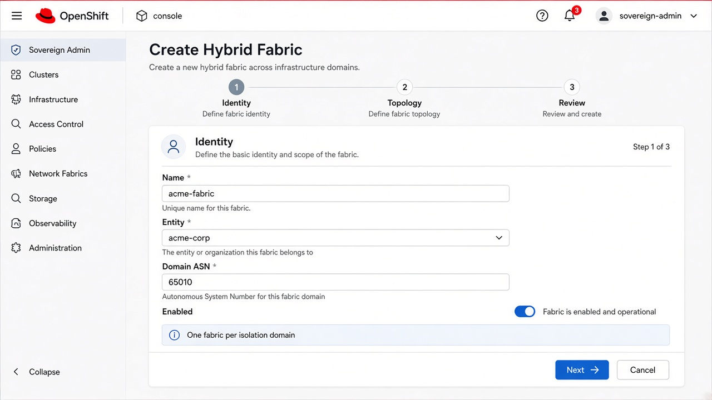

Identity (name, **EntityMultiSelect** for `entityRefs`, ASN), numbering (VNI pool), underlay (type, cidr, and for `localnet` the hub VTEP block and hub leg), border gateway (loopback, WireGuard, size, image), transport defaults (MTU, `none`/`wireguard`).

### 12.2 Register Cloud Infrastructure

`spec.type` first; the form then shows only that type's section (`openstack`: credentials, management kubeconfig ref, NetConfig, ordered NodeSets, defaults; `openshift`: cluster, boot image, storage class, CG-NAT defaults; `aws`: account, region, base domain). **EntityMultiSelect** for `entityRefs`. Detail page shows `status.capabilities` and `status.site`.

### 12.3 Register Cloud Gateway


**FabricSelect** → **CloudInfrastructureSelect** (Ready sites) → transport (`none` \| `wireguard`) → for openstack sites the site underlay. TransportLink is generated; the old create-link form is retired.

### 12.4 Place Hybrid Network

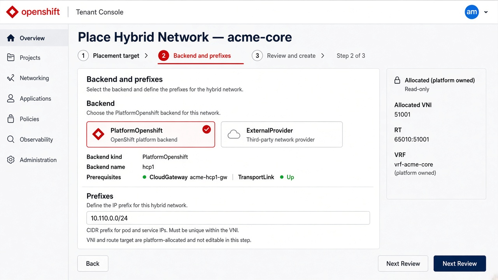

**BackendSelect** (the entity's CloudOSO / CloudVirt projects) + prefixes; for CloudVirt the VM namespaces to create; read-only VNI/RT card from the parent network status. Backends whose site has no Ready CloudGateway are disabled.

### 12.5 Reference dashboards (existing mocks)


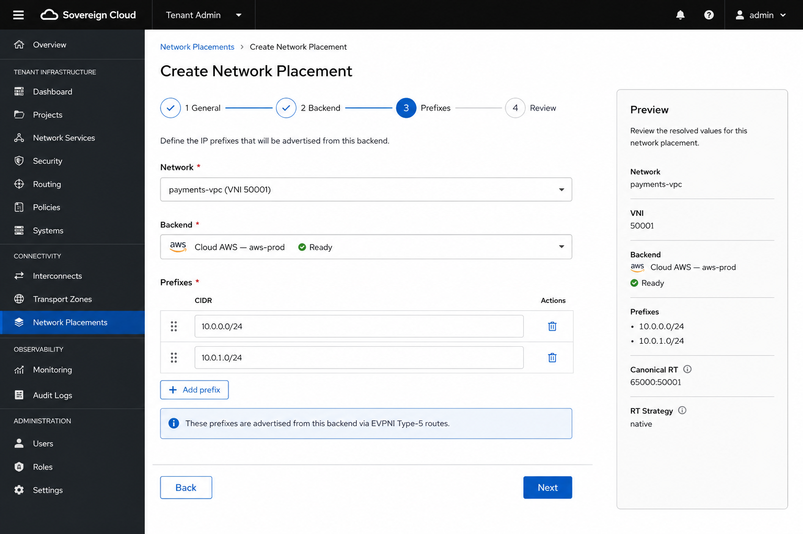


### 12.6 UI → CR → Ansible

| UI action | CR | Ansible layer |
|-----------|----|----|
| Create fabric | HybridFabric | L1 |
| Register site | CloudInfrastructure | L2a |
| Register gateway | CloudGateway (TransportLink generated) | L2b / L3 |
| Create cloud project | CloudOSO / CloudVirt / CloudAWS with `cloudRef` | project jobs |
| Create network | HybridNetwork | L4 |
| Add placement | NetworkPlacement | L5 |
| Remove site from a network | delete that NetworkPlacement | L5 teardown |

Plugin touchpoints: `AdminHybridFabricsPage`, `AdminCloudInfrastructuresPage` / `AdminCloudInfrastructureDetailPage`, `AdminCloudGatewaysPage`, `AdminCloudsPage` (infrastructure vs cloud projects), `TenantHybridNetworksPage`, `TenantNetworkPlacementsPage`, detail pages under `ui/packages/*-console-plugin`. **Standalone dashboards:** same forms/selectors in `ui/packages/admin-dashboard` and `ui/packages/tenant-dashboard` (§18).

---

## 13. Bill of materials & success criteria

### 13.1 Must have before first packet

| Area | Requirement |
|------|-------------|
| CENTRAL | Hub OCP **4.22+**; OpenShift Virtualization; CNO FRR provider + route advertisements (§10.1); Sovereign fabric operators; AAP JTs with an EE that has `python-openstackclient`; Vault |
| Hub underlay | A shared L2 for hub nodes and the BGW hub leg (`br-ex` via localnet) and a free block inside the fabric underlay for hub VTEPs |
| RHOSO | Site Ready on **18.0.21 FR6+** with **native OVN BGP-EVPN** (Type-5 / OVN gateway chassis); do not require `ovn-bgp-agent` |
| Infrastructure | `CloudInfrastructure` `oso1` and `hub-virt` Ready; tenant projects with `cloudRef` |
| Underlay | Hub ↔ site VTEP reachability (tunnel); MTU plan (§21.5) |
| Numbering | One fabric ASN + VNI pool below the L2VNI offset |

### 13.2 Success criteria

- [x] Hub VMs/pods on the `acme-core` Layer2 CUDN (10.110.2.0/24) ↔ RHOSO VM 10.110.1.63 ping, 1272-byte DF payload passes, 1400 refused with `mtu=1300` (2026-10-08, [`fabric-verify.md`](fabric-verify.md))
- [x] BGW shows Type-5 10.110.2.0/24 from hub VTEPs and 10.110.1.x/32 from compute01; all hub nodes Established to the hub leg
- [ ] Negative: `chad-app` (10.120.2.0/24) cannot reach `acme-core` (hub or site) and compute01 never receives RT `65010:52000`
- [ ] Hub objects realized end to end by the automation from GitOps (hand-built on 2026-10-08, codified in EDA)
- [x] Tenant UI has no VNI/RT editors; PlatformOpenshift create has no fabric step; BackendSelect offers only CloudOSO / CloudVirt
- [ ] Workshop [lab-06](../workshop/lab-09-hybrid-fabric.md) run end to end on a fresh hub

### 13.3 Observability

| Signal | Source |
|--------|--------|
| BGP / EVPN | BGW `vtysh -c 'show bgp l2vpn evpn'`; FRR-k8s pods on hub nodes; EDPM FRR |
| CUDN Ready | `ClusterUserDefinedNetwork` conditions `TransportAccepted`, `NetworkCreated`; RouteAdvertisements `Accepted`; VTEP CR |
| Hub node legs | Hub underlay DaemonSet readiness; `ip addr show br-ex` from `ovnkube-node` pods |
| RHOSO EVPN router | `openstack router show … -c evpn_vni`; `evpn-hcg-<router>` HA chassis group |
| Sovereign Ready | CR printer columns, `CloudInfrastructure.status.capabilities`, Network Health UI |
| Ansible | AAP job reference on CR status |

---

## 14. CRD deltas & non-goals

**Deltas (done on the restructure branch):** `CloudInfrastructure` kind; `cloudRef` on CloudGateway and tenant projects; `HybridFabric.spec.underlay.type: localnet` with hub VTEP block and hub leg; `bgp.authentication`; `NetworkPlacement.spec.vmNamespaces`; `HybridNetwork.spec.overlayMtu`; PlatformOpenshift `spec.fabric` deprecated; TransportLink operator-generated. Tightening (required, immutables, CEL, backend enum) at cutover step 6 (§22).

**Non-goals for this blueprint**

- Tenant clusters (PlatformOpenshift) as fabric members (§15)
- AWS EVPN path (§15.0)
- Tenants choosing VNIs
- Full-mesh spoke BGP
- Secrets or real cluster domains in Git samples
- RHOSO Type-2 / distributed EVPN (wait for post-FR6; tenant VRFs stay Type-5 IP-VRF across sites)
- New fabric automation on deprecated `ovn-bgp-agent`

**References**

- OpenShift 4.22 Advanced Networking — BGP EVPN for user-defined networks
- OVN-Kubernetes — MAC-VRF vs IP-VRF
- RHOSO **18.0.21 FR6** — Native BGP-EVPN (TP): OVN gateway centralized Type-5; Neutron `--evpn-vni` / advertise-host; OVN dynamic-routing + FRR (`l2vpn evpn`)
- In-repo CRDs `gitops/custom-operators/crds/`; samples `samples/cloudinfrastructure/`, `samples/hybridvpc/`; field docs `docs/usage/crds/fabric.md`, `docs/usage/crds/cloudinfrastructure.md`
- Prior UI notes `architecture/mocks/DESIGN_UI.md`
- Admin / entity tagging / tenant catalog: §19

---

## 15. PlatformOpenshift and the fabric

Decided 2026-10-07 (restructure decision 6): **a PlatformOpenshift cluster never attaches to the fabric**, whatever its type, and is not a `NetworkPlacement` backend. Earlier revisions of this section designed a fabric join for hosted and OpenStack clusters (join policies, gateways per cluster, NodePool underlay NICs); that design was built, verified and then removed. It is kept only in Git history.

### 15.0 Fabric scope by kind and type

| Object | Fabric attach? | Notes |
|--------|----------------|-------|
| `PlatformOpenshift` `type: hosted` / `openstack` / `aws` | **No** | Clusters install and run normally; `spec.fabric`, `spec.networking.allocateFromFabric` and `spec.networking.fabricRef` are deprecated and ignored |
| `CloudVirt` (on a CloudInfrastructure `type: openshift`) | **Yes** | Placement creates VM namespaces on a Layer2 CUDN on the hub (§8.5.2, §10.2) |
| `CloudOSO` (on a CloudInfrastructure `type: openstack`) | **Yes** | Neutron network + EVPN router on the RHOSO site (§8.5.3, §10.3) |
| `CloudAWS` (on a CloudInfrastructure `type: aws`) | **No EVPN path** | Accepted by the API; the CloudGateway is rejected (`AwsUnsupported`) and placements fail closed |

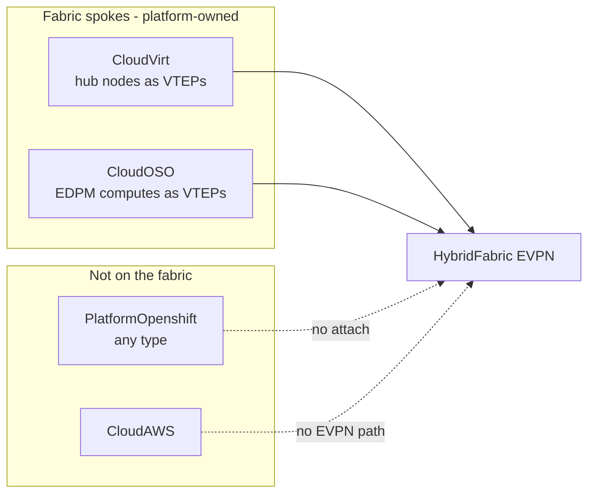

### 15.1 Why tenant clusters are not fabric members

A tenant with cluster-admin on a PlatformOpenshift controls the cluster network operator, OVN-Kubernetes and FRR-k8s. On a shared underlay that is enough to break isolation:

| Capability of a tenant cluster-admin | Effect on a shared fabric |
|--------------------------------------|---------------------------|
| Create a CUDN with any `ipVRF.vni` / `routeTarget` | Announce routes into another tenant's VRF; with the ledger allow-list alone the BGW cannot tell, because the forged RT is a valid ledger RT |
| Edit FRRConfiguration / raw FRR config | Announce or withdraw arbitrary EVPN routes, change next hops, import any RT |
| Send VXLAN with any VNI from a node on the underlay | Inject packets straight into another tenant's VRF on any VTEP; EVPN does not authenticate the data plane, and the BGW only routes outer packets |
| Change node addresses on the underlay | Impersonate another VTEP or the gateway |

The platform-owned spokes (hub nodes, EDPM computes) do not have this problem: tenants have no administrative access to them, and their CUDNs, FRR configuration and Neutron routers are rendered only by the platform.

### 15.2 Conditions for revisiting (PE/CE design)

Clusters could become fabric members again only as customer edges (CE) of a platform provider edge (PE), when **all** of these hold:

1. **One underlay segment per cluster**: a cluster's VTEPs share no L2 with other tenants' VTEPs or with the hub nodes, so it cannot spoof another VTEP or reach other VTEPs directly.
2. **Per-peer RT policy on the BGW**: the cluster's peer group accepts and receives only the RTs of that tenant's networks placed on that cluster (the per-site route-maps of §8.5.4 are the mechanism; the cluster would be its own site).
3. **BGW-enforced data plane**: a source-VTEP / VNI filter on VXLAN arriving from the cluster's segment (only that tenant's VNIs from that cluster's VTEPs), or VXLAN terminated at the BGW (or a platform PE) with a plain per-VRF hand-off to the cluster, so the cluster never emits VXLAN onto the shared fabric.
4. Optional BGP authentication per peer, so a cluster cannot impersonate another site's speaker.

Until then, tenant workloads reach a HybridNetwork through CloudVirt VMs or CloudOSO projects.

### 15.3 What stays on PlatformOpenshift

- `spec.networking` (explicit cluster/service CIDRs) and `status.networking` (allocation result and conflict check against the hub and other clusters, §16.1). Default pools come from the CloudInfrastructure `openshift.hostedClusterCidrDefaults` (CG-NAT).
- No CloudGateway, TransportLink, VTEP, FRRConfiguration, CUDN or underlay NIC is created for a cluster. `platformopenshift_provision` no longer has a fabric step; removal of earlier joins is part of the cutover (§22).

---

## 16. Address ownership

**Fabric-wide unique, and only these:** VNI / RT (numbering ledger) and the derived hub L2VNI, underlay segments (`HybridFabric.spec.underlay.cidr`, its `hubVtepBlock`, each `CloudGateway.spec.siteUnderlay`), and gateway addresses (BGW loopback, hub leg and underlay address, tunnel addresses, site gateway addresses).

**Per cluster:** pod and service CIDRs are never advertised into the fabric. Two constraints apply: (1) HyperShift on KubeVirt — a hosted cluster's pod/service CIDRs must not overlap the hub's; (2) OVN-K — a CUDN subnet must not overlap the cluster's own pod/service/node networks, which on the hub means CloudVirt prefixes (§16.5). **Assumption (CG-NAT):** greenfield deployments select hub and hosted-cluster pod networks and service ranges from CG-NAT 100.64.0.0/10 so tenants keep the full RFC1918 space for overlay prefixes. The reference hub predates the assumption (Appendix A).

**Per HybridNetwork:** overlay prefixes are unique within one HybridNetwork (VRF) only; different networks, of the same or different tenants, may use identical prefixes.

### 16.1 Cluster CIDRs (`eda/common/tasks/platformopenshift_fabric_ipam.yml`, `eda/common/files/fabric_cluster_ipam.py`)

Candidates, in order: recorded `status.networking` (kept as-is), explicit `spec.networking`, a new block from the default ranges (`CloudInfrastructure.spec.openshift.hostedClusterCidrDefaults`, deprecated `CloudVirt.spec.hostedClusterCidrDefaults`, else role vars `po_default_cluster_network_pool` 100.64.0.0/11 /14 and `po_default_service_network_pool` 100.96.0.0/11 /16).

| Check | Applies |
|-------|---------|
| No overlap with the hub's cluster/service CIDRs (`network.config.openshift.io/cluster`) | always |
| No overlap with other PlatformOpenshift pod/service CIDRs | role var `po_deny_peer_cidr_overlap` (default true) |
| No overlap between the cluster's own pod and service CIDRs | always |
| **No** check against overlay prefixes | — |

CIDRs outside the default ranges are kept and flagged `ipamCondition: LegacyClusterCidrs`. A conflict sets `conflictCheck: failed` and fails the job (unless `allowConflict`).

### 16.2 Overlay prefixes (`networkplacement_provision/tasks/main.yml`)

| Rule | Backend |
|------|---------|
| (a) No overlap with other `NetworkPlacement`s of the **same** `HybridNetwork` (`PrefixNetworkOverlap`) | all (CUDN and Neutron) |
| (b) No overlap with the hub's cluster, service or node networks (`PrefixClusterOverlap`) | CloudVirt (§16.5) |
| (c) **No** check against other HybridNetworks | — |

### 16.3 Underlay addresses

| Block | Owner | Reference value |
|-------|-------|-----------------|
| `spec.underlay.cidr` | HybridFabric | 192.168.64.0/18; every underlay address below comes from it |
| `spec.underlay.hubVtepBlock` | HybridFabric (hub nodes) | 192.168.65.0/24; node VTEP = block prefix + last octet of the node IP (so the block must be /24 or shorter and node last octets unique); excluded from the BGW's DHCP range |
| `spec.underlay.hubLegAddress` | BGW eth2 | 192.168.65.1/24 (default: first host of the block) |
| `siteUnderlay.cidr` per OpenStack CloudGateway | site | 192.168.80.0/24; must be more specific than, and inside, the underlay cidr (hub nodes route it via the hub leg) |
| BGW tunnel net | HybridFabric `borderGateway.wireguard.address` | 10.254.254.0/24; gateways get /32s (allocated when omitted, ConfigMap `fabric-numbering-<fabric>` key `wgAddresses`) |

### 16.4 VNI and L2VNI numbering

A HybridNetwork's VNI (L3VNI, ipVRF) comes from `vniPool`; RT `<domainAsn>:<vni>`. Hub Layer2 CUDNs also need a macVRF: L2VNI = 100000 + VNI, RT `<domainAsn>:<L2VNI>` (`eda/common/vars/fabric_evpn.yml`). It is deterministic and never stored. Consequences: `vniPool.end` must stay below the offset, and a 4-byte `domainAsn` (> 65535) cannot carry an L2VNI > 65535 in an RT, so hub Layer2 attachments need a 2-byte fabric ASN.

### 16.5 CloudVirt prefixes and the hub's own networks

A CloudVirt placement lands on the hub, so its prefixes must not overlap the hub's cluster network, service network or node network (10.232.0.0/14, 172.231.0.0/16, 10.10.10.0/24 on the reference hub); the placement fails with `PrefixClusterOverlap`. They also must not overlap the fabric underlay or tunnel net.

---

## 17. PlatformOpenshift install

Clusters install the same way whether or not a fabric exists; the fabric is never a prerequisite and never touched by `platformopenshift-provision`.

| Layer | When | Blocks PlatformOpenshift Ready? | Owner CR |
|-------|------|----------------------------------|----------|
| Cluster install (control plane, workers, kubeconfig, OIDC) | Always | Yes (this *is* Ready) | `PlatformOpenshift` |
| Unique cluster/service CIDRs | Always | Only on a hard conflict without `allowConflict` | `spec.networking` (§16.1) |
| Fabric | Never | — | — |

`spec.fabric.*` and `spec.networking.{allocateFromFabric,fabricRef}` on existing objects are ignored and dropped when validation is tightened. The UI has no fabric step on PlatformOpenshift create/edit. Acceptance:

- [ ] A hosted PlatformOpenshift reaches Ready on a hub with no HybridFabric.
- [ ] The install creates no CloudGateway, TransportLink, CUDN, FRRConfiguration, VTEP or NodePool `additionalNetworks`.
- [ ] A NetworkPlacement with `backend.kind: PlatformOpenshift` fails with `BackendKindRemoved` (rejected by the API after tightening).

---

## 18. UI dropdowns — entity tagging & site selection (console + standalone)

### 18.1 Goal

Entity tagging, site selection and placement must use **PatternFly dropdown / multi-select selectors**, not free-text name fields, in both:

| Surface | Package | Audience |
|---------|---------|----------|
| OpenShift Console dynamic plugin (admin) | `ui/packages/admin-console-plugin` | Platform fabric admin |
| OpenShift Console dynamic plugin (tenant) | `ui/packages/tenant-console-plugin` | Tenant network / platform admin |
| Standalone admin SPA | `ui/packages/admin-dashboard` | Same admin flows outside Console |
| Standalone tenant SPA | `ui/packages/tenant-dashboard` | Same tenant flows outside Console |

Shared controls live in `ui/packages/shared/src/components` so Console plugins and standalone apps render identical selectors.

**Hard rules**

- Options are loaded from live CRs (list API), never hard-coded names; display name + Ready badge; values written are resource **names**.
- Cross-entity options are filtered out on tenant surfaces (`entityRefs` on HybridFabric and CloudInfrastructure).
- Transports offered: `none` and `wireguard` only.
- No admin-credential fields on tenant forms; no VNI/RT editors anywhere on tenant surfaces.
- YAML escape hatch remains available; forms are the default path.

### 18.2 Selector inventory (required)

| Selector ID | Type | Writes | Used on |
|-------------|------|--------|---------|
| `EntityMultiSelect` | Multi-select + chips | `HybridFabric.spec.entityRefs[].name`, `CloudInfrastructure.spec.entityRefs[].name` | Admin create/edit HybridFabric, CloudInfrastructure |
| `FabricSelect` | Single-select | `CloudGateway.spec.fabricRef`, optional `HybridNetwork.spec.fabricRef` | Admin gateway; tenant network (filtered by `entityRefs`) |
| `CloudInfrastructureSelect` | Single-select (filter by `type`, `entityRefs`; text fallback on 403) | `CloudGateway.spec.cloudRef`, `CloudOSO/CloudVirt/CloudAWS.spec.cloudRef` | Admin gateway; tenant project create |
| `BackendSelect` | Single-select (kind + name) | `NetworkPlacement.spec.backend` | Tenant placement: **CloudOSO and CloudVirt** of the entity only (never PlatformOpenshift; CloudAWS hidden until it has an EVPN path) |
| `CloudOSOSelect` / `CloudVirtSelect` | Single-select | placement backends, PlatformOpenshift environments | Tenant placement, cluster create |
| `CloudGatewaySelect` | Single-select | read-only references (gateway detail, generated TransportLink) | Admin |

Removed with the cluster fabric join: `PlatformOpenshiftSelect`, `JoinPolicySelect`, `FabricMultiSelect`.

### 18.3 Admin — entity tagging (dropdown)

**Surfaces:** Console `AdminHybridFabricsPage` / `AdminCloudInfrastructuresPage` create/edit · standalone `admin-dashboard`.

```text
+------------------------------------------------------------------+
|  Entities that may use this fabric / site *                      |
|  [ EntityMultiSelect v ]                                         |
|    [x] acme-corp     Ready · NS entity-acme-corp                 |
|    [x] chad          Ready · NS entity-chad                      |
|    [ ] partner-a     Ready                                       |
|  Selected chips: [ acme-corp x ] [ chad x ]                      |
|  Helper: tenants share the fabric; isolation is per VRF (RT).    |
+------------------------------------------------------------------+
```

| Behavior | Detail |
|----------|--------|
| Data source | Entities with `status.ready=true` |
| Empty state | "No Ready Entities — create an Entity first" |
| Persist | `spec.entityRefs: [{name: "acme-corp"}, ...]` (empty on CloudInfrastructure = all entities) |
| Edit | Removing an entity is blocked while that entity still has networks on the fabric or projects on the site |

### 18.4 Admin — CloudInfrastructure and CloudGateway forms

```text
Register Cloud Infrastructure
  Type          [ openstack | openshift | aws v ]   # immutable after create; shows only that section
  Entities      [ EntityMultiSelect v ]
  Credentials   ( Vault path | Secret in sovereign-cloud )   # not for openshift clusterRef local

Register Cloud Gateway
  Fabric        [ FabricSelect v ]                  # Ready fabrics
  Site          [ CloudInfrastructureSelect v ]     # Ready sites; aws disabled (no EVPN landing)
  Transport     [ none | wireguard v ]
  Site underlay ( openstack only: interface, compute interface, cidr, gateway address, MTU )
```

### 18.5 Tenant — cloud projects

```text
Create Cloud OSO / Cloud Virt / Cloud AWS
  Site          [ CloudInfrastructureSelect v ]     # type-filtered, entity-filtered
  Project fields (project name, base domain, VM namespace quota, ...)
```

The tenant proxy (`tenant-dashboard` `server/k8s-proxy.js`) accepts `cloudRef` and does not require `vaultPath`.

### 18.6 Tenant — placement (dropdowns only)

```text
Place Hybrid Network
  Network (read-only)        acme-core · VNI 51001 · RT 65010:51001
  Backend                    [ BackendSelect v ]   # CloudOSO / CloudVirt of this entity, site gateway Ready
  Prefixes                   CIDR fields
  VM namespaces              (CloudVirt only) names to create, default <cloudvirt>-<network>
```

### 18.7 Acceptance tests (UI)

- [x] Admin tags Entities on HybridFabric and CloudInfrastructure only via EntityMultiSelect.
- [x] CloudInfrastructure form shows only the section of the selected type.
- [x] CloudGateway form offers CloudInfrastructureSelect and transports `none` / `wireguard` only.
- [x] Tenant project forms use CloudInfrastructureSelect and show no admin-credential fields.
- [x] BackendSelect lists only the entity's CloudOSO / CloudVirt; PlatformOpenshift create has no fabric step.
- [x] Identical selector behavior in Console plugins and standalone dashboards (shared package).

---

## 19. Creation, entity tagging & tenant visibility

### 19.1 Roles and namespaces (who owns what)

| Actor | Console | Can create | Can view |
|-------|---------|------------|----------|
| Platform fabric admin | Admin plugin (`sovereign-cloud`) | `HybridFabric`, `CloudInfrastructure`, `CloudGateway` (TransportLink generated) | All fabrics / sites / gateways |
| Tenant admin | Tenant plugin (`entity-*`) | Cloud projects (`cloudRef`), `HybridNetwork`, `NetworkPlacement` | Sites tagged for the entity (name, type, readiness); their own networks and placements |
| Tenant viewer | Tenant plugin | — | HybridNetwork detail (if `networkViewerRbac`) |

**Critical UX rule:** tenants never create or edit gateways or transport. They choose a **backend** (their CloudOSO / CloudVirt project). The platform resolves the CloudGateway from the project's `cloudRef` and the network's fabric.

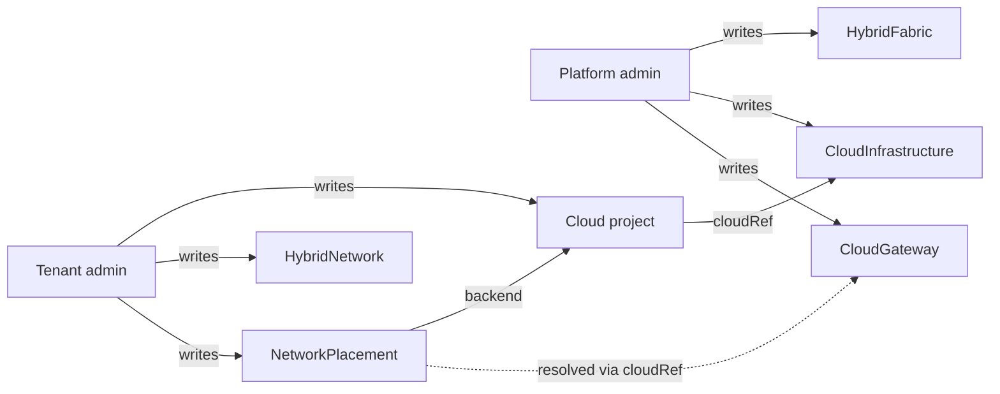

### 19.2 End-to-end creation sequence

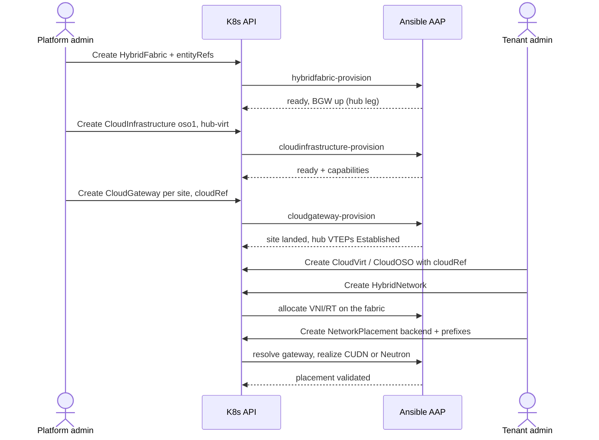

### 19.3 Tagging a fabric and a site to entities

`HybridFabric.spec.entityRefs[]` lists the entities that may allocate networks on the fabric; `CloudInfrastructure.spec.entityRefs[]` lists the entities that may create projects on the site (empty = all). Both are platform-owned. With one platform fabric, every tenant entity is normally on its `entityRefs`; isolation comes from VRFs, not from separate fabrics.

### 19.4 What tenants see and never see

| Visible (read-only) | Hidden or not editable | Why |
|---------------------|------------------------|-----|
| Site name, type, readiness, capabilities for tagged sites | Site credentials, management kubeconfig refs, NodeSet lists | Hub/site trust boundary |
| HybridNetwork VNI / RT / overlay MTU | VNI pool, RT editors | Numbering authority |
| Placement status (`cloudGatewayRef`, realized prefixes, VM namespaces) | BGW addresses, Vault refs, gateway specs | Platform day-0 only |
| — | Other entities' networks, projects and placements | Multi-tenant confidentiality |

### 19.5 Worked example — Acme vs Chad

1. Admin: `platform-fabric` with `entityRefs: [acme-corp, chad]`; `hub-virt` for both, `oso1` for acme-corp only; gateways `hub-virt-gw`, `acme-oso1-gw`.
2. Acme: CloudVirt `local-virt` and CloudOSO `oso1`; HybridNetwork `acme-core` → VNI 51001; placements on both.
3. Chad: CloudVirt `local-virt` only (cannot create a CloudOSO on `oso1`: not in its `entityRefs`); HybridNetwork `chad-app` → VNI 52000; hub placement only.
4. Result: same hub nodes, different VRFs; the RHOSO site receives only `65010:51001`.

### 19.6 CR / API deltas checklist (implementation)

| Item | State |
|------|-------|
| `HybridFabric.spec.entityRefs[]` | shipped |
| `HybridNetwork.spec.fabricRef` | shipped; when set it must be a fabric whose `entityRefs` contains the entity (honoured by `hybridnetwork_provision`) |
| `CloudInfrastructure` kind with `entityRefs` | shipped |
| `cloudRef` on CloudGateway and Cloud* projects | shipped; required after tightening |
| `NetworkPlacement.spec.vmNamespaces`, `status.cloudGatewayRef` | shipped; Ansible populates status |
| Backend enum without PlatformOpenshift | at tightening (§22 step 6) |
| Admission | Ansible enforces entityRefs on network and placement; CEL on CloudInfrastructure type/sections |

### 19.7 Failure & empty states (copy)

| State | Message |
|-------|---------|
| Fabric has no entity in `entityRefs` | "Bind at least one Entity before tenants can place networks." |
| No site tagged for the entity | "No cloud infrastructure is available to your entity yet — ask the platform admin." |
| Site gateway not Ready | "The site of this project is not attached to the fabric yet." |
| Backend kind not supported | "Networks can be placed on CloudOSO and CloudVirt projects only." |
| Namespace taken | "Namespace <name> exists and belongs to another project; choose another name." |

---

## 20. Live demo & test procedure

**Audience cue:** 20–30 minute technical segment. **Hosts:** platform engineer (control plane) + network engineer (packets).
This is both a rehearsal script and a repeatable test procedure; the workshop version is [lab-06](../workshop/lab-09-hybrid-fabric.md). Results of the last run are in [`fabric-verify.md`](fabric-verify.md). (The 2026-09-30 talk-show run on per-tenant fabrics and hosted-cluster spokes is retired; see Git history.)

### 20.1 Cold open (60 seconds)

> **Host A:** "Two tenants. One shared underlay. Zero shared VRFs."
> **Host B:** "And not one BGP speaker a tenant can log into."

| Network | Entity | VNI / RT | Hub prefix | Site prefix |
|---------|--------|----------|------------|-------------|
| `acme-core` | acme-corp | 51001 / `65010:51001` | 10.110.2.0/24 | 10.110.1.0/24 (RHOSO) |
| `chad-app` | chad | 52000 / `65010:52000` | 10.120.2.0/24 | — |

### 20.2 Act I — "The platform already did day-0"

```bash
oc get hybridfabric,cloudinfrastructure,cloudgateway -n sovereign-cloud
oc get cloudoso,cloudvirt,hybridnetwork,networkplacement -A
```

**Pass:** every object Ready; no tenant object carries a VNI, RT or site credential.

### 20.3 Act II — "Turn the CNO key" (hub EVPN prerequisites)

The hub network operator has the FRR provider and route advertisements (§10.1, GitOps-owned). The openshift CloudGateway then lands the hub: node VTEPs on `br-ex`, VTEP CR, FRRConfiguration to the BGW hub leg.

```bash
oc get network.operator cluster -o jsonpath='{.spec.additionalRoutingCapabilities}{" "}{.spec.defaultNetwork.ovnKubernetesConfig.routeAdvertisements}{"\n"}'
oc get vtep; oc get frrconfiguration -n openshift-frr-k8s
```

**Pass:** FRR + Enabled; VTEP accepted; every frr-k8s pod Established to 192.168.65.1.

### 20.4 Act III — Acme VMs on the hub

The placement created `acme-core-vms` (primary-UDN label at creation) and the Layer2 CUDN `acme-core`. Start a VM and a probe pod there; read the tenant address on `ovn-udn1` (not `status.podIP`).

**Pass:** CUDN `TransportAccepted=True`, `NetworkCreated=True`; RouteAdvertisements `Accepted`; VM has a 10.110.2.x address.

### 20.5 Act IV — Across the WAN

```bash
oc exec -n acme-core-vms probe -- ping -c 3 10.110.1.63
oc exec -n acme-core-vms probe -- ping -c 3 -M do -s 1272 10.110.1.63
oc exec -n acme-core-vms probe -- ping -c 1 -M do -s 1400 10.110.1.63   # refused: mtu=1300
```

On the BGW: `show bgp l2vpn evpn route type prefix` shows 10.110.2.0/24 from hub VTEPs and 10.110.1.x/32 from compute01, both RT `65010:51001`.

**Pass:** pings both ways; MTU behaves as budgeted (§21.5). **Last run:** pass (2026-10-08).

### 20.6 Act V — Isolation (negative probes)

```bash
oc exec -n chad-app-vms probe -- ping -c 3 -W 1 10.110.1.63        # expect 100% loss
oc exec -n chad-app-vms probe -- ping -c 3 -W 1 <acme 10.110.2.x>  # expect 100% loss
oc exec -n acme-core-vms probe -- ping -c 3 -W 1 <chad 10.120.2.x> # expect 100% loss
```

On the BGW: `show bgp l2vpn evpn neighbors 192.168.80.100 advertised-routes` contains no 10.120.2.0/24.

**Pass:** 100% loss both directions; the site never receives the chad RT. **Last run:** not yet run on the restructured fabric.

### 20.7 Act VI — RHOSO FR6 cameo

```bash
openstack router show acme-core-oso1-evpn-rtr -c id -c evpn_vni -c status   # evpn_vni == HybridNetwork.status.vni (51001)
openstack network show acme-core-oso1 -c mtu                                 # 1300
```

### 20.8 Scoreboard

| Scene | Probe | Result (2026-10-08) |
|-------|-------|---------------------|
| I | Fabric / infrastructure / gateway / placement Ready | hub objects hand-built, codified in EDA; GitOps run pending |
| II | CNO FRR + RA; hub VTEPs; 6/6 nodes Established | **PASS** |
| III | Layer2 CUDN on the hub, VM + pod | **PASS** |
| IV | Hub ↔ RHOSO ping, 1272 DF pass, 1400 refused | **PASS** |
| V | Chad ↛ Acme / Acme ↛ Chad | pending |
| VI | RHOSO `--evpn-vni` router | **PASS** |

### 20.9 Operator's cheat sheet

```bash
# Hub inventory
oc get hybridfabric,cloudinfrastructure,cloudgateway,transportlink -n sovereign-cloud
oc get cloudoso,cloudvirt,hybridnetwork,networkplacement -A
# Hub spoke
oc get vtep,clusteruserdefinednetwork,routeadvertisements
oc get frrconfiguration -n openshift-frr-k8s
oc get ds -n sovereign-cloud
# Node leg (use ovnkube-node pods, not oc debug node)
oc exec -n openshift-ovn-kubernetes <ovnkube-node pod> -c ovn-controller -- ip -4 addr show br-ex
# Tenant address + ping
oc exec -n <vm-namespace> <pod> -- ip -4 addr show ovn-udn1
oc exec -n <vm-namespace> <pod> -- ping -c 3 <peer-ip>
# RHOSO
openstack router show acme-core-oso1-evpn-rtr -c evpn_vni -c status
```

### 20.10 Closing line

> **Host B:** "Overlapping CIDRs are allowed. Shared routers are not."
> **Host A:** "Different VNIs, different RTs, and every speaker on the fabric belongs to the platform."

---

## 21. Reference implementation (verified)

The design is realized with ordinary platform features plus two gateway VMs. Nothing custom runs on EDPM computes, and on the hub nodes only a small platform DaemonSet that puts a VTEP address on `br-ex` (plus a lab-only MAC shim): OpenShift peers through OVN-Kubernetes EVPN + FRR-k8s, OpenStack through the EDPM `frr` and `neutron-ovn` (`ovn-evpn` extension) services. Verified end to end in a lab on 2026-10-08 (hub OCP 4.22, RHOSO 18.0.22 on OCP 4.20): BGP Established from all six hub nodes (to the BGW hub leg) and from an EDPM compute (to the BGW loopback), Type-5 routes reflected between them with the spokes' own VTEPs as next hop, and pod/VM-to-VM ping across the VRF including 1272-byte DF payloads ([`fabric-verify.md`](fabric-verify.md)). The lab-only pieces are listed in Appendix A.

### 21.1 Addressing (reference values)

| Role | Address | Notes |
|---|---|---|
| Fabric underlay | 192.168.64.0/18 | `HybridFabric.spec.underlay.cidr`; every underlay address below is inside it |
| Hub VTEP block | 192.168.65.0/24 | `spec.underlay.hubVtepBlock`; node VTEP = 192.168.65.<node IP last octet>, configured as /18 on `br-ex`; VTEP CR `cidrs: [192.168.64.0/18]` |
| BGW hub leg | 192.168.65.1/24 | `spec.underlay.hubLegAddress`; eth2 on the OVN-K localnet NAD (`physnet` → `br-ex`); BGP peer of the hub nodes |
| BGW underlay (legacy leg) | 192.168.64.1/18 | eth1 on the OVN-K layer2 NAD; DHCP for the former hosted-cluster workers, hub VTEP block excluded |
| BGW loopback | 10.255.10.10/32 | `borderGateway.loopback`; BGP peer of site VTEPs, router-id / cluster-id |
| Tunnel net | 10.254.254.0/24 | BGW .1, one /32 per site gateway |
| Site underlay L2 | 192.168.80.0/24 | NetConfig network `fabric`; `br-fabric` on the management-cluster nodes |
| Site gateway | 192.168.80.1/24 | `siteUnderlay.gatewayAddress` |
| EDPM compute fabric NIC (VTEP) | 192.168.80.100-150 | NodeSet `fabric` network fixed IPs |
| Tenant overlays | any RFC1918 | unique per HybridNetwork only (§16); CloudVirt prefixes avoid the hub's own networks (§16.5) |

Control plane: iBGP in the fabric ASN everywhere; the BGW is route reflector (`bgp listen range` per site peer group, `route-reflector-client`, `attribute-unchanged next-hop`). The BGW never re-originates EVPN routes (FRR does not re-export imported EVPN routes), so per-spoke ASNs are not used.

### 21.2 Hub border gateway VM (`hybridfabric_provision/tasks/deploy_border_gateway.yml`, `bgw_hub_leg.yml`)

Objects in the fabric namespace:

- NAD `fabric-underlay` (legacy leg): `ovn-k8s-cni-overlay`, `topology: layer2`, no subnets (MAC-only port security, so the VM can route transit traffic), `mtu: 1400`.
- NAD `spec.underlay.nadName` (hub leg, `underlay.type: localnet`): `ovn-k8s-cni-overlay`, `topology: localnet`, `physicalNetworkName: physnet`, no IPAM.
- Secret `<bgw>-cloudinit` (first boot) and Secret `<bgw>-config` (`wg0.conf`, `frr.conf`, dnsmasq, `fabric.nft`) attached as a disk; the guest syncs it at boot. Later changes are pushed over SSH to the running guest and only changed services reload (`bgw_config_push.yml`, key Vault `<vaultCredentialRef>` `sshPrivateKey`); without the key the role falls back to restarting the VMI.
- VirtualMachine `<bgw>`: CentOS Stream 9 container disk, 2 vCPU / 4 GiB, interfaces `default` (masquerade), `underlay` (bridge binding, fixed MAC) and `hubleg` (bridge binding, fixed MAC `02:fa:b0:00:65:01`).
- Service `<bgw>-wss` (443 -> 8443) and Route `<bgw>` with `tls.termination: passthrough`.

Guest:

- `lo` = loopback /32; `eth1` = legacy underlay address; `eth2` (NM profile `hubleg`) = hub leg address; profiles matched by interface name; no default route on the fabric legs. `wg0` = tunnel address, MTU 1380, listen 51820, one peer per site gateway (AllowedIPs = gateway tunnel /32 + that site's underlay CIDR).
- sysctl `ip_forward=1`, `rp_filter=2`. nftables input policy drop with exceptions for established, loopback, ICMP, SSH, TCP 8443 on eth0, TCP 179 + UDP 4789 from eth1/eth2/wg0, DHCP on eth1, UDP 51820 on lo; forward eth1 <-> wg0, eth2 <-> wg0 and eth2 <-> eth1.
- dnsmasq on eth1 only (never on the localnet leg: it would answer on the node network), hub VTEP block excluded, option 26 (MTU), option 121 routes.
- wstunnel server `--restrict-to 127.0.0.1:51820 wss://0.0.0.0:8443`.
- FRR bgpd (abbreviated; `files/bgw_rt_policy.py` computes the groups and RT lists):

```
bgp extcommunity-list standard FABRIC-RT permit rt <asn>:<vni>           ! one per ledger VNI
bgp extcommunity-list standard HUB-RT permit rt <asn>:<vni>              ! networks placed on the hub (+ macVRF RTs)
bgp extcommunity-list standard SITE-<gw>-RT permit rt <asn>:<vni>        ! networks placed on that site
route-map HUB-EVPN-IN permit 10
 match extcommunity HUB-RT
route-map HUB-EVPN-IN deny 100
route-map HUB-EVPN-OUT permit 10
 match extcommunity HUB-RT
route-map HUB-EVPN-OUT deny 100
!  same pair for every SITE-<gw>; TUNNEL has deny-only route-maps
router bgp <asn>
 bgp router-id <loopback>
 bgp cluster-id <loopback>
 no bgp ebgp-requires-policy
 no bgp default ipv4-unicast
 neighbor HUB peer-group
 neighbor HUB remote-as <asn>
 neighbor HUB ebgp-multihop 32
 bgp listen range <underlay minus site underlays> peer-group HUB      ! covers the hub VTEP block
 neighbor SITE-<gw> peer-group
 bgp listen range <site underlay> peer-group SITE-<gw>
 neighbor TUNNEL peer-group
 bgp listen range <tunnel net> peer-group TUNNEL
 address-family ipv4 unicast
  neighbor <group> activate
  neighbor <group> route-reflector-client
 address-family l2vpn evpn
  neighbor <group> activate
  neighbor <group> route-reflector-client
  neighbor <group> attribute-unchanged next-hop
  neighbor <group> soft-reconfiguration inbound
  neighbor <group> route-map <group>-EVPN-IN in
  neighbor <group> route-map <group>-EVPN-OUT out
```

### 21.3 Hub CloudVirt spoke

Platform part, once per fabric (`cloudgateway_provision/tasks/openshift_hub_evpn.yml`, CloudGateway with `cloudRef` → CloudInfrastructure `type: openshift`, transport `none`):

- **Prerequisite check** (never patched by the job): CNO FRR provider + `routeAdvertisements: Enabled` (§10.1); otherwise `PendingPrereq`.
- **DaemonSet `<fabric>-hub-underlay`** (`sovereign-cloud`; ServiceAccount with the privileged SCC; `hostNetwork`, `hostPID`, tolerates every taint; ubi9 image; script `files/hub-underlay.sh` from a ConfigMap). On every node, every 120 s: VTEP address `<hubVtepBlock prefix>.<node IP last octet>` with the **whole underlay prefix** length on `br-ex`; routes to each remote site underlay (`SITE_CIDRS`, more specific than the on-link /18) and to the BGW tunnel net via the hub leg; no loopback route (the hub peers the hub leg on-link). Optional MAC shim (lab, Appendix A). The applied set is recorded in `/run/fabric-hub-underlay.state` so a parameter change removes the previous address/routes; pod restarts leave node state in place; teardown switches the DaemonSet to `HUB_UNDERLAY_MODE=remove` before deleting it. The pod reports Ready after its first complete pass.
- **VTEP CR `<fabric>-vtep`**: `mode: Unmanaged`, `cidrs: [<underlay cidr>]`. OVN-K discovers each node's VTEP address inside the cidrs; the cidrs also make the OVN-K-generated FRRConfiguration accept remote /32 VTEPs (RHOSO computes).
- **FRRConfiguration `<fabric>-bgw`** (`openshift-frr-k8s`, `nodeSelector: {}`): one neighbor, the BGW hub-leg address, fabric ASN, `toAdvertise`/`toReceive` all; raw config adds `ebgp-multihop 32` and activates the neighbor in `l2vpn evpn` and `ipv4 unicast`.
- **BGW hub leg** (from `hybridfabric_provision`, §21.2).

Per tenant network (`networkplacement_provision/tasks/backend_cloudvirt_evpn.yml`): namespaces created with the primary-UDN label, Layer2 CUDN (`mtu` = overlay MTU, `ipam.lifecycle: Persistent`, ipVRF + macVRF, VTEP `<fabric>-vtep`), RouteAdvertisements `advertise-<network>-evpn` (`targetVRF: auto`, `frrConfigurationSelector: {}`, `nodeSelector: {}`), as in §10.2. VMs use the `l2bridge` binding on the pod network.

### 21.4 OpenStack site

Management cluster (namespace `openstack`, `cloudgateway_provision/tasks/openstack_site_gateway.yml`):

- NNCP `fabric-underlay-<node>` on every worker node: linux-bridge `br-fabric` with port `siteUnderlay.interface`, no IP, STP off, MTU `siteUnderlay.mtu`.
- NAD `openstack/fabric`: `type: bridge`, `bridge: br-fabric`, `ipam: {}`, annotation `k8s.v1.cni.cncf.io/resourceName: bridge.network.kubevirt.io/br-fabric`.
- Site gateway VM `fabric-gw-<site>`: CentOS Stream 9 DataSource, 1 vCPU, interfaces `default` (masquerade) + `fabric` (bridge on `openstack/fabric`). Guest: eth1 = site gateway address, MTU 1442; wg0 = site tunnel address /32, MTU 1380, peer = BGW public key, endpoint 127.0.0.1:51820, AllowedIPs = BGW tunnel /32, BGW loopback /32, fabric underlay (covers the hub VTEP block), keepalive 25; wstunnel client `-L 'udp://127.0.0.1:51820:127.0.0.1:51820?timeout_sec=0' wss://<bgw route>:443`; `ip_forward=1`, `rp_filter=2`; nftables forward eth1 <-> wg0 only.

EDPM landing (`openstack_edpm_evpn.yml` / `openstack_edpm_nodeset.yml`):

- NetConfig: network `fabric` (site CIDR, MTU, allocation range, **subnet `routes`** to the BGW loopback, fabric underlay and tunnel net via the site gateway). Routes must live in NetConfig: the dataplane operator overwrites `<net>_host_routes`. Patched once before any NodeSet.
- NodeSets from `CloudInfrastructure.spec.openstack.dataplaneNodeSetRefs`, **one at a time, in CR order**. Per NodeSet: `nodes[].networks += {name: fabric, subnetName: subnet1, fixedIP}` (fixed IPs unique across all NodeSets); per-node `edpm_neutron_ovn_evpn_local_ip`; ansibleVars `fabric_cidr`, `fabric_mtu`, the compute-interface block in `edpm_network_config_template` (`siteUnderlay.nodeSetInterfaces[<nodeset>]`, else `computeInterface`), `edpm_enable_chassis_gw: true` (required; without it the EVPN router's HA chassis group stays empty), `edpm_frr_bgp_asn`, `edpm_frr_bgp_ipv4_src_network: fabric`, `edpm_frr_bgp_peers: [<loopback>]`, `edpm_frr_bgp_uplinks: []`, `edpm_frr_bgp_uplinks_scope: internal`, `edpm_frr_bgp_l2vpn: true`, `edpm_frr_bgp_l2vpn_uplink_activate: true`, `edpm_frr_bgp_l2vpn_peers: []`, `edpm_frr_bgp_neighbor_ttl_security_hops: 0`, `edpm_frr_bgp_expose_only_host: true`, `edpm_frr_bgp_learning_routes: false`, `edpm_frr_bgp_ipv6: false`, `edpm_frr_bfd: false`, `edpm_neutron_ovn_agent_agent_extensions: ovn-evpn`, `edpm_neutron_ovn_evpn_vxlan_port: 4789`, `edpm_neutron_ovn_agent_ovn_evpn_bgp_as`, `edpm_neutron_ovn_agent_ovn_evpn_bgp_local_interface`, `edpm_nftables_user_rules` for UDP 4789 / TCP 179 from the fabric prefixes; services `frr` after `install-certs`, `neutron-ovn` after `ovn`.
- One OpenStackDataPlaneDeployment per NodeSet, `fabric-<gateway>-<nodeset>-<fingerprint>`, `servicesOverride: [install-certs, configure-network, frr, ovn, neutron-ovn]`, with `edpm_network_config_update: true` for that run only. The next NodeSet starts only after this one is Ready; NodeSets whose fingerprint annotation already matches are skipped; the rollout stops after `cgw_edpm_max_failures` failures (default 0) and reports the rest as NotAttempted in `CloudGateway.status.edpmNodeSets`.
- Operational rules: a NodeSet cannot be patched while one of its deployments is in progress; re-running `ovn` alone clears the `ovn-evpn-*` OVS external IDs, so `neutron-ovn` always follows `ovn`; the Neutron EVPN router must be created after the chassis is gateway-enabled (placement checks `evpn-hcg-<router>` and recreates the router once when empty); Neutron networks use MTU 1300.

### 21.5 MTU budget

| Segment | MTU |
|---|---|
| Hub node network `br-ex` / localnet hub leg (BGW eth2, node VTEPs) | 1500 (lab node network) |
| Hub pod network / legacy underlay NAD (BGW eth1) | 1400 |
| Site underlay (bridge, compute fabric NIC, site gateway eth1) | 1442 (lab physical limit, Appendix A) |
| Tunnel interface (both gateways) | 1380 |
| VXLAN payload end to end | 1330 |
| Hub CUDNs and Neutron tenant networks (`HybridNetwork.overlayMtu`) | 1300 |

The tunnel is the narrowest link: 1300 inner + 50 VXLAN = 1350 ≤ 1380. MSS clamping is not possible at the gateways (inner TCP is inside VXLAN); the overlay MTU set on every CUDN and Neutron network is the control. Verified: 1272-byte ICMP payload with DF (1300 on the wire) passes, 1400 is refused at the source with `mtu=1300`.

---

## 22. Cutover for an existing environment

Use when an environment runs the earlier model: tenant objects carrying site settings (CloudOSO/CloudVirt), hosted clusters joined to the fabric (PlatformOpenshift `spec.fabric`, NodePool underlay NICs), and no CloudInfrastructure. (The earlier cutover from per-tenant fabrics and hub route-reflector pods to the single `platform-fabric` was executed on 2026-10-07 and is in Git history.)

**Prerequisites:** the restructured CRDs, EDA roles and UI merged; the operator image with the `kind_reconcile` fixes (generation tracked in `status.aapJob`, in-run finalizer release) built, pinned by digest and rolled out, and every CR reconciled once **before** any spec change; Vault `fabric/<fabric>/bgw` carries `sshPrivateKey` so BGW config changes apply in place. The hub-side CloudVirt build can go first or in parallel; it does not depend on the new kinds.

**Keep:** HybridNetwork VNIs (ledger), Vault key pairs, the EDPM NetConfig/NodeSet fabric settings and the site gateway, the BGW VM (only its config and the hub leg change), PlatformOpenshift `status.networking`.

**Order:**

1. **Hold Argo.** Put the platform fabric Application on manual sync in the parent app's values (or patch the child and do not sync the parent); otherwise automated prune applies the reshaped templates in one go. Re-check the sync policy before every destructive step.
2. **Additive CRDs.** Apply the CloudInfrastructure CRD and its operator, and the reshaped CRDs in their permissive form (new fields optional, deprecated fields accepted).
3. **Register infrastructure** in `sovereign-cloud` and wait for Ready and `status.capabilities`: the OpenStack site (`type: openstack`, `managementClusterKubeconfigRef`, `netConfigRef`, `dataplaneNodeSetRefs` in rollout order) and the hub (`type: openshift`, `clusterRef: local`).
4. **Point objects at it.** Set `cloudRef` on each CloudGateway and tenant project (`samples/cloudoso/oso1-cloudref.yaml` for CloudOSO); remove the fields that moved (site fields on CloudOSO, `hostedClusterCidrDefaults` on CloudVirt). Each object re-reconciles on its own; check each reaches Ready on the new generation and watch for BGW / site gateway VMI restarts.
5. **Hosted clusters off the fabric.** For each joined cluster: delete its NetworkPlacements (teardown removes the spoke CUDN/RouteAdvertisements), its CloudGateway and TransportLink, then remove `spec.fabric` from the PlatformOpenshift (in GitOps if Argo owns it), the VTEP/FRRConfiguration on the cluster, the NodePool `additionalNetworks` (rolls the workers) and the underlay NAD copy in the HostedCluster namespace. Keep one cluster as the reference path until the hub CloudVirt spoke passes its ping test; move any BGW access path that went through a cluster worker to a hub pod first. Finally none may remain: `oc get networkplacement -A -o custom-columns=NAME:.metadata.name,KIND:.spec.backend.kind`.
6. **Tighten.** Apply the final CRDs (required `cloudRef`, backend enum without PlatformOpenshift, immutables and CEL; the `TIGHTEN-LATER` markers, `docs/usage/crds/README.md`) only once step 5 is clean. Fold TransportLink into CloudGateway status when the operator generates it.
7. **Release Argo.** Merge the GitOps changes (CloudInfrastructure objects, hub gateway, CloudVirt placements) and sync by wave (20 fabric, 25 infrastructure, 30/40 tenant projects, 50/55 gateways and links, 60/65 networks and placements), verifying at each wave; then re-enable automated sync.
8. **Clean up.** Delete Vault entries of retired tunnels and hand-built gateways; replace the admin management kubeconfig with a scoped ServiceAccount kubeconfig (namespace `openstack` RW on NetConfig/NodeSet/Deployment/VM/NAD/Secret + cluster RW on NNCP); delete leftover hand-made EDPM deployment records and hand-built hub probe objects.

**Verify:** every hub node and site VTEP Established, Type-5 routes present with spoke VTEPs as next hops, positive probe within a VRF across sites, negative probe across VRFs ([`fabric-verify.md`](fabric-verify.md) commands).

---

## 23. Open items

- **Operator image:** rebuild with the `kind_reconcile` generation and finalizer fixes, decide who owns the image repository, and pin a digest instead of `:latest`. Without it a spec change on a Ready CR does not relaunch its job.
- **Validation tightening:** apply the `TIGHTEN-LATER` blocks (required `cloudRef`, backend enum without PlatformOpenshift, immutables, CEL) after the cutover (§22 step 6), then regenerate the other CRD copies from `gitops/custom-operators/crds`.
- **In-place BGW apply needs `sshPrivateKey`** in Vault `fabric/<fabric>/bgw`. A BGW whose public key was seeded by hand needs its private key added once; until then every config change (new VNI, placement, site) restarts the BGW VMI and flaps the whole fabric.
- **MAC shims are lab-only.** The hub netdev-family shim and the RHOSO bridge-family shim exist because the lab hypervisor filters source MACs; physical deployments leave `macNatShim` off. The hub shim runs on the node NIC that also carries the API/ingress VIPs, so it matches strictly on the BGW MAC.
- **Hub node NIC assumption:** the reference hub's `br-ex` uplink is `enp2s0` (the GitOps comment and the hand-built shim name it). The DaemonSet discovers the uplink when `macNatShim.interface` is empty; heterogeneous node NICs, bonds or VLAN-tagged `br-ex` are untested. The node VTEP scheme (block prefix + node IP last octet) needs unique last octets and a block of /24 or shorter.
- **`br-ex` is owned by ovs-configuration:** the VTEP address and routes survive only because the DaemonSet re-applies them every 120 s; a reboot leaves a gap until the pod runs. An NMState- or VTEP-`Managed`-based alternative should be evaluated per OCP release.
- **Hub CNO settings in GitOps:** FRR provider and `routeAdvertisements: Enabled` were applied by hand on the reference hub; the GitOps manifest for them is still to be added.
- **TransportLink generation:** the operator should generate TransportLinks from CloudGateways (GitOps still declares the WireGuard site's link).
- **Isolation test** (`chad-app` vs `acme-core`, §20.6) not yet run on the restructured fabric; per-site RT policy first render flaps each session once; verify `match extcommunity` behaviour on reflected routes on the deployed FRR version.
- **BGP authentication** must be configured on the FRR-k8s and EDPM peers before `bgp.authentication` is set on the fabric.
- **EDPM per-VNI devices:** after an `ovn`/`neutron-ovn` re-run on a compute, the per-VNI devices are only rebuilt after removing the `ovn-evpn-4789` port and restarting the OVN agent; add a post-deploy step or fix upstream.
- **CloudInfrastructure status keys** (`site`, `capabilities`) to be aligned between the role and the CRD (both preserve unknown fields today); the CloudGateway/CloudInfrastructure JTs need the EE with `python-openstackclient`.
- **High availability:** a second BGW (second loopback, both reflectors; the hub nodes would peer both hub-leg addresses) and VRRP for the site gateway address.
- **Live migration of gateway VMs:** the localnet hub leg and per-node `br-fabric` allow it; untested. One BGW per fabric is the model.
- WireGuard handshake is only observed indirectly (guest-agent interface report + BGP state).
- Scoped management kubeconfig for the OpenStack site instead of the admin one (§22 step 8).

---

## Appendix A. Lab environment notes

Specific to the lab the reference implementation was built in (hub and OpenStack site in separate cloud-hosted lab environments). Physical deployments do not need these.

| Item | Why | Where |
|---|---|---|
| kubemacpool ignore label (`mutatevirtualmachines.kubemacpool.io=ignore`) on the fabric namespace and on placement VM namespaces | The hub's kubemacpool webhook was unavailable and blocked VM create/update; fabric NICs use explicit MACs, tenant VMs get OVN-assigned addresses | `hybridfabric_provision`, `networkplacement_provision` (`np_hub_kubemacpool_ignore`) |
| Hub MAC shim: netdev-family nft table on the `br-ex` uplink (`enp2s0`) | The hypervisor drops frames whose source MAC is not the node NIC's, so the BGW's frames on `br-ex` never reach other nodes. The table rewrites the BGW hub-leg MAC to the node MAC on egress and back on ingress for every destination the BGW routes. A `bridge`-family table is a no-op on OVS `br-ex` (observed 0/6 vs 6/6 cross-node pings) | hub underlay DaemonSet (`CloudGateway.spec.macNatShim` on the hub gateway) |
| Site MAC shim: DaemonSet `openstack/fabric-gw-macnat` (`siteUnderlay.macNatShim`) | Same filter on the RHOSO nodes; there the site gateway is on a Linux bridge (`br-fabric`), so a `bridge`-family table works | `cloudgateway_provision` |
| Hub VTEPs carved from the fabric underlay | The hub has no spare NIC (`enp1s0` is a per-node routed uplink, `enp2s0` is `br-ex`) and its node IPs (10.10.10.10-12, .30-.32) duplicate the RHOSO cluster's, so node IPs cannot be VTEPs | `spec.underlay.hubVtepBlock` |
| WireGuard carried by wstunnel over the hub ingress | Between the two lab environments only TCP 443/6443 on public VIPs is reachable (no UDP, no NodePorts, overlapping node networks) | `transportlink_provision`, both gateway VMs |
| Underlay MTU 1442 | Every lab segment passes 1442-byte frames and drops 1500 | `siteUnderlay.mtu`, §21.5 |
| Images from registry container disks | The hub's OS image DataSources are empty | `borderGateway.image`, `CloudInfrastructure.openshift.bootImage`, test VMs |
| `oc debug node` unreliable on the hub | Debug pods often time out; use the host-network `ovnkube-node` pods (container `ovn-controller` has `ip`, `ovs-vsctl`) | operations |
| No port-forward / `virtctl ssh` to tenant VMs | VMs on a primary UDN use the `l2bridge` binding; test from the console or a pod in the same namespace | operations, workshop Lab 6 |
| Site gateway VM memory request 256Mi with guest overhead overcommit | Lab management-cluster nodes are almost fully memory-committed | `cloudgateway_provision` vars |
| Legacy cluster CIDRs | Hub and older hosted clusters predate the CG-NAT assumption (hub 10.232.0.0/14 + 172.231.0.0/16; clusters 10.128-10.151/14, 172.30-172.33/16) and are flagged `LegacyClusterCidrs` | §16 |

Live lab state is captured in [`fabric-verify.md`](fabric-verify.md).
